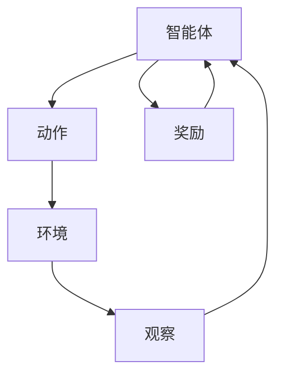

                 

# 强化学习在机器人运动规划中的应用研究

> 关键词：强化学习、机器人运动规划、深度学习、Q-learning、深度Q网络(DQN)、机器人控制

> 摘要：本文旨在探讨强化学习在机器人运动规划中的应用，通过分析强化学习的基本原理及其在机器人运动规划中的具体实现，结合实际案例，深入解析强化学习算法如何帮助机器人实现自主学习和优化运动路径。文章还讨论了强化学习在机器人运动规划中的挑战和未来的发展趋势，为相关领域的研究者和实践者提供参考。

## 1. 背景介绍

### 1.1 机器人运动规划的重要性

机器人运动规划是机器人学中的一个核心问题，它涉及到如何规划机器人的运动路径，以实现从起始状态到目标状态的最优路径。随着机器人技术的发展，机器人运动规划的应用范围越来越广泛，从工业自动化到服务机器人，再到医疗机器人，运动规划都是实现机器人高效、安全、智能操作的关键。

### 1.2 强化学习的基本概念

强化学习是一种机器学习方法，它通过智能体与环境的交互来学习最优策略。智能体通过执行动作来观察环境的反馈，并根据反馈调整其行为，以最大化累积奖励。强化学习的核心在于通过试错学习，使得智能体能够在复杂环境中自主学习最优策略。

### 1.3 强化学习在机器人运动规划中的应用

将强化学习应用于机器人运动规划，可以使得机器人在未知或动态变化的环境中自主学习最优运动路径。通过强化学习，机器人可以学习到如何在复杂环境中高效、安全地移动，从而提高其执行任务的能力。

## 2. 核心概念与联系

### 2.1 强化学习与机器人运动规划的联系



智能体通过执行动作与环境交互，观察环境反馈，并根据反馈调整其行为，以最大化累积奖励。在机器人运动规划中，智能体即为机器人，动作即为机器人的运动指令，环境即为机器人所处的物理环境，观察即为机器人对环境的感知，奖励即为机器人完成任务的程度。

### 2.2 核心概念原理

- **智能体**：在机器人运动规划中，智能体即为机器人，它通过执行动作与环境交互。
- **动作**：机器人执行的运动指令，如前进、后退、左转、右转等。
- **环境**：机器人所处的物理环境，包括障碍物、目标位置等。
- **观察**：机器人对环境的感知，如通过传感器获取的环境信息。
- **奖励**：机器人完成任务的程度，如到达目标位置、避开障碍物等。

## 3. 核心算法原理 & 具体操作步骤

### 3.1 Q-learning算法

Q-learning是一种基于值迭代的强化学习算法，它通过学习状态-动作价值函数Q(s,a)来指导智能体的行为。Q-learning的核心在于通过试错学习，使得智能体能够在复杂环境中自主学习最优策略。

#### 3.1.1 Q-learning算法原理

Q-learning算法通过学习状态-动作价值函数Q(s,a)来指导智能体的行为。状态-动作价值函数Q(s,a)表示智能体在状态s下执行动作a后，未来累积奖励的期望值。Q-learning算法通过迭代更新Q(s,a)来学习最优策略。

#### 3.1.2 Q-learning算法操作步骤

1. 初始化Q(s,a)为0。
2. 选择动作a，执行动作a，观察环境反馈。
3. 更新Q(s,a)：$Q(s,a) = Q(s,a) + \alpha [r + \gamma \max_{a'} Q(s',a') - Q(s,a)]$，其中$\alpha$为学习率，$\gamma$为折扣因子，$r$为即时奖励，$s'$为下一个状态。
4. 重复步骤2-3，直到智能体学习到最优策略。

### 3.2 深度Q网络(DQN)

深度Q网络(DQN)是一种基于Q-learning的强化学习算法，它通过深度神经网络来近似状态-动作价值函数Q(s,a)。DQN的核心在于通过深度神经网络来近似状态-动作价值函数Q(s,a)，从而使得智能体能够在复杂环境中自主学习最优策略。

#### 3.2.1 DQN算法原理

DQN算法通过深度神经网络来近似状态-动作价值函数Q(s,a)。深度神经网络通过学习状态-动作价值函数Q(s,a)来指导智能体的行为。DQN算法通过迭代更新深度神经网络来学习最优策略。

#### 3.2.2 DQN算法操作步骤

1. 初始化深度神经网络，输入为状态s，输出为状态-动作价值函数Q(s,a)。
2. 选择动作a，执行动作a，观察环境反馈。
3. 更新深度神经网络：$Q(s,a) = Q(s,a) + \alpha [r + \gamma \max_{a'} Q(s',a') - Q(s,a)]$，其中$\alpha$为学习率，$\gamma$为折扣因子，$r$为即时奖励，$s'$为下一个状态。
4. 重复步骤2-3，直到智能体学习到最优策略。

## 4. 数学模型和公式 & 详细讲解 & 举例说明

### 4.1 Q-learning算法数学模型

Q-learning算法的数学模型如下：

$$
Q(s,a) = Q(s,a) + \alpha [r + \gamma \max_{a'} Q(s',a') - Q(s,a)]
$$

其中，$Q(s,a)$为状态-动作价值函数，$\alpha$为学习率，$\gamma$为折扣因子，$r$为即时奖励，$s'$为下一个状态。

### 4.2 DQN算法数学模型

DQN算法的数学模型如下：

$$
Q(s,a) = Q(s,a) + \alpha [r + \gamma \max_{a'} Q(s',a') - Q(s,a)]
$$

其中，$Q(s,a)$为状态-动作价值函数，$\alpha$为学习率，$\gamma$为折扣因子，$r$为即时奖励，$s'$为下一个状态。

### 4.3 举例说明

假设机器人在一个二维平面上移动，目标是到达目标位置，同时避开障碍物。机器人通过传感器获取环境信息，包括障碍物的位置和目标位置。机器人通过执行动作，如前进、后退、左转、右转等，来移动。机器人通过Q-learning或DQN算法学习最优策略，以最大化累积奖励。

## 5. 项目实战：代码实际案例和详细解释说明

### 5.1 开发环境搭建

#### 5.1.1 硬件环境

- 机器人：如Arduino、Raspberry Pi等。
- 传感器：如超声波传感器、红外传感器等。
- 控制器：如电机驱动器等。

#### 5.1.2 软件环境

- 操作系统：如Linux、Windows等。
- 编程语言：如Python、C++等。
- 开发工具：如PyCharm、Visual Studio等。
- 深度学习框架：如TensorFlow、PyTorch等。

### 5.2 源代码详细实现和代码解读

#### 5.2.1 Q-learning算法实现

```python
import numpy as np

class QLearning:
    def __init__(self, actions, learning_rate=0.1, reward_decay=0.9, e_greedy=0.9):
        self.actions = actions
        self.lr = learning_rate
        self.gamma = reward_decay
        self.epsilon = e_greedy
        self.q_table = {}

    def choose_action(self, observation):
        self.check_state_exist(observation)
        if np.random.uniform() < self.epsilon:
            state_action = self.q_table[observation]
            action = self.actions[np.argmax(state_action)]
        else:
            action = np.random.choice(self.actions)
        return action

    def learn(self, s, a, r, s_):
        self.check_state_exist(s_)
        q_predict = self.q_table[s][a]
        if s_ != 'terminal':
            q_target = r + self.gamma * np.max(self.q_table[s_])
        else:
            q_target = r
        self.q_table[s][a] += self.lr * (q_target - q_predict)

    def check_state_exist(self, state):
        if state not in self.q_table:
            self.q_table[state] = np.zeros(len(self.actions))
```

#### 5.2.2 DQN算法实现

```python
import torch
import torch.nn as nn
import torch.optim as optim

class DQN(nn.Module):
    def __init__(self, n_states, n_actions, n_hidden=128):
        super(DQN, self).__init__()
        self.fc1 = nn.Linear(n_states, n_hidden)
        self.fc2 = nn.Linear(n_hidden, n_actions)

    def forward(self, x):
        x = torch.relu(self.fc1(x))
        x = self.fc2(x)
        return x

class DQNAlgorithm:
    def __init__(self, n_states, n_actions, learning_rate=0.01, reward_decay=0.9, e_greedy=0.9):
        self.n_states = n_states
        self.n_actions = n_actions
        self.lr = learning_rate
        self.gamma = reward_decay
        self.epsilon = e_greedy
        self.q_net = DQN(n_states, n_actions)
        self.target_net = DQN(n_states, n_actions)
        self.target_net.load_state_dict(self.q_net.state_dict())
        self.target_net.eval()
        self.optimizer = optim.Adam(self.q_net.parameters(), lr=self.lr)
        self.memory = []

    def choose_action(self, observation):
        if np.random.uniform() < self.epsilon:
            state = torch.tensor(observation, dtype=torch.float).unsqueeze(0)
            action_value = self.q_net(state)
            action = torch.argmax(action_value).item()
        else:
            action = np.random.choice(self.n_actions)
        return action

    def learn(self, s, a, r, s_):
        self.memory.append((s, a, r, s_))
        if len(self.memory) > 1000:
            self.memory.pop(0)
        if len(self.memory) > 100:
            self._sample_and_learn()

    def _sample_and_learn(self):
        sample = np.random.choice(len(self.memory), 100)
        batch_memory = [self.memory[i] for i in sample]
        states = torch.tensor([x[0] for x in batch_memory], dtype=torch.float)
        actions = torch.tensor([x[1] for x in batch_memory], dtype=torch.long)
        rewards = torch.tensor([x[2] for x in batch_memory], dtype=torch.float)
        next_states = torch.tensor([x[3] for x in batch_memory], dtype=torch.float)
        q_values = self.q_net(states).gather(1, actions.unsqueeze(1)).squeeze(1)
        next_q_values = self.target_net(next_states).max(1)[0]
        q_targets = rewards + self.gamma * next_q_values
        loss = nn.MSELoss()(q_values, q_targets)
        self.optimizer.zero_grad()
        loss.backward()
        self.optimizer.step()
        if len(self.memory) % 1000 == 0:
            self.target_net.load_state_dict(self.q_net.state_dict())
```

### 5.3 代码解读与分析

#### 5.3.1 Q-learning算法代码解读

Q-learning算法代码主要实现了Q-learning算法的核心步骤，包括选择动作、学习等。选择动作时，根据当前状态和Q表选择最优动作；学习时，根据即时奖励和下一个状态更新Q表。

#### 5.3.2 DQN算法代码解读

DQN算法代码主要实现了DQN算法的核心步骤，包括选择动作、学习等。选择动作时，根据当前状态和深度神经网络选择最优动作；学习时，根据即时奖励和下一个状态更新深度神经网络。

## 6. 实际应用场景

### 6.1 工业自动化

在工业自动化中，机器人运动规划是实现自动化生产的关键。通过强化学习，机器人可以学习到如何在复杂环境中高效、安全地移动，从而提高生产效率。

### 6.2 服务机器人

在服务机器人中，机器人运动规划是实现机器人自主服务的关键。通过强化学习，机器人可以学习到如何在复杂环境中高效、安全地移动，从而提高服务质量。

### 6.3 医疗机器人

在医疗机器人中，机器人运动规划是实现机器人辅助手术的关键。通过强化学习，机器人可以学习到如何在复杂环境中高效、安全地移动，从而提高手术成功率。

## 7. 工具和资源推荐

### 7.1 学习资源推荐

- 书籍：《强化学习》、《深度学习》等。
- 论文：《Playing Atari with Deep Reinforcement Learning》、《Human-level control through deep reinforcement learning》等。
- 博客：《强化学习入门》、《深度强化学习实战》等。
- 网站：《OpenAI Gym》、《TensorFlow》等。

### 7.2 开发工具框架推荐

- TensorFlow
- PyTorch
- OpenAI Gym

### 7.3 相关论文著作推荐

- 《Playing Atari with Deep Reinforcement Learning》
- 《Human-level control through deep reinforcement learning》

## 8. 总结：未来发展趋势与挑战

### 8.1 未来发展趋势

随着机器人技术的发展，强化学习在机器人运动规划中的应用将越来越广泛。未来，强化学习将与深度学习、机器视觉等技术结合，实现更加智能、高效的机器人运动规划。

### 8.2 挑战

强化学习在机器人运动规划中的应用还面临着一些挑战，如如何提高学习效率、如何处理复杂环境等。未来，需要进一步研究和探索，以克服这些挑战。

## 9. 附录：常见问题与解答

### 9.1 什么是强化学习？

强化学习是一种机器学习方法，它通过智能体与环境的交互来学习最优策略。

### 9.2 强化学习在机器人运动规划中的应用有哪些？

强化学习在机器人运动规划中的应用包括工业自动化、服务机器人、医疗机器人等。

### 9.3 强化学习在机器人运动规划中的挑战有哪些？

强化学习在机器人运动规划中的挑战包括如何提高学习效率、如何处理复杂环境等。

## 10. 扩展阅读 & 参考资料

- 《强化学习》
- 《深度学习》
- 《Playing Atari with Deep Reinforcement Learning》
- 《Human-level control through deep reinforcement learning》
- 《强化学习入门》
- 《深度强化学习实战》
- 《OpenAI Gym》
- 《TensorFlow》

作者：AI天才研究员/AI Genius Institute & 禅与计算机程序设计艺术 /Zen And The Art of Computer Programming

