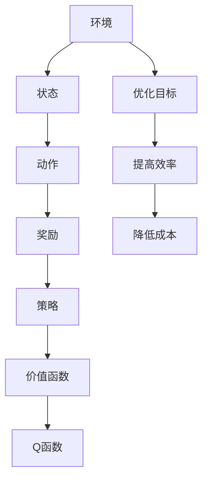

                 

# 强化学习在自动化仓储管理中的应用

> 关键词：强化学习, 自动化仓储, 仓储管理, 智能调度, Q-learning, 环境建模

> 摘要：本文旨在探讨如何利用强化学习技术优化自动化仓储管理中的智能调度问题。通过构建一个基于强化学习的智能调度系统，可以显著提高仓库的运营效率和资源利用率。本文将详细介绍强化学习的基本原理、核心算法、数学模型，并通过实际案例展示如何在自动化仓储环境中应用强化学习技术。最后，本文还将讨论未来的发展趋势和面临的挑战。

## 1. 背景介绍

自动化仓储系统是现代物流和供应链管理中的重要组成部分。随着电子商务的快速发展，仓储管理面临着更高的效率和灵活性要求。传统的仓储管理方法往往依赖于人工操作或简单的规则驱动系统，这些方法在面对复杂多变的环境时显得力不从心。为了应对这一挑战，研究人员开始探索利用强化学习技术来优化仓储管理中的智能调度问题。

强化学习是一种通过与环境交互来学习最优策略的方法。它通过试错学习，不断调整策略以最大化累积奖励。在自动化仓储管理中，强化学习可以用于优化货物的入库、出库、存储和拣选等操作，从而提高仓库的运营效率和资源利用率。

## 2. 核心概念与联系

### 2.1 强化学习基本概念

强化学习是一种通过与环境交互来学习最优策略的方法。它通过试错学习，不断调整策略以最大化累积奖励。强化学习的核心概念包括：

- **状态（State）**：描述环境当前状态的信息。
- **动作（Action）**：在给定状态下可以采取的操作。
- **奖励（Reward）**：执行动作后获得的即时反馈。
- **策略（Policy）**：描述在给定状态下采取何种动作的规则。
- **价值函数（Value Function）**：描述在给定状态下采取某种策略的长期收益。
- **Q函数（Q-function）**：描述在给定状态下采取某种动作的长期收益。

### 2.2 自动化仓储管理中的应用

在自动化仓储管理中，强化学习可以用于优化货物的入库、出库、存储和拣选等操作。具体应用场景包括：

- **货物入库**：根据货物的类型和大小，选择合适的存储位置。
- **货物出库**：根据订单需求，快速准确地拣选和出库货物。
- **存储优化**：通过调整存储策略，提高仓库的空间利用率。
- **拣选优化**：通过优化拣选路径，减少拣选时间和成本。

### 2.3 Mermaid 流程图



## 3. 核心算法原理 & 具体操作步骤

### 3.1 Q-learning算法

Q-learning是一种基于价值函数的强化学习算法，它通过学习Q函数来优化策略。Q函数表示在给定状态下采取某种动作的长期收益。Q-learning的核心步骤包括：

1. **初始化**：初始化Q函数，通常设置为0。
2. **选择动作**：根据当前状态选择动作，可以使用ε-贪心策略。
3. **执行动作**：执行选择的动作，并观察环境的反馈。
4. **更新Q函数**：根据观察到的奖励和下一个状态，更新Q函数。
5. **重复**：重复上述步骤，直到达到收敛条件。

### 3.2 具体操作步骤

1. **定义状态空间**：根据仓储管理的具体需求，定义状态空间。例如，状态可以包括货物的位置、库存水平、订单需求等。
2. **定义动作空间**：根据仓储管理的具体需求，定义动作空间。例如，动作可以包括入库、出库、存储和拣选等操作。
3. **定义奖励函数**：根据仓储管理的具体需求，定义奖励函数。例如，可以设置奖励为完成订单的时间、存储空间利用率等。
4. **初始化Q函数**：初始化Q函数，通常设置为0。
5. **选择动作**：根据当前状态选择动作，可以使用ε-贪心策略。
6. **执行动作**：执行选择的动作，并观察环境的反馈。
7. **更新Q函数**：根据观察到的奖励和下一个状态，更新Q函数。
8. **重复**：重复上述步骤，直到达到收敛条件。

## 4. 数学模型和公式 & 详细讲解 & 举例说明

### 4.1 Q-learning数学模型

Q-learning的数学模型可以表示为：

$$
Q(s, a) \leftarrow Q(s, a) + \alpha \left[ r + \gamma \max_{a'} Q(s', a') - Q(s, a) \right]
$$

其中，$Q(s, a)$表示在状态$s$下采取动作$a$的Q值；$\alpha$表示学习率；$r$表示即时奖励；$\gamma$表示折扣因子；$s'$表示下一个状态；$a'$表示下一个状态下的动作。

### 4.2 详细讲解

- **学习率（$\alpha$）**：学习率决定了Q值更新的幅度。较大的学习率会导致更快的收敛，但可能会导致不稳定的学习过程。
- **折扣因子（$\gamma$）**：折扣因子决定了未来奖励的重要性。较大的折扣因子会导致更长远的奖励被考虑，但可能会导致短期奖励被忽略。
- **即时奖励（$r$）**：即时奖励是执行动作后获得的即时反馈。它可以是正数、负数或零。

### 4.3 举例说明

假设有一个自动化仓储系统，需要优化货物的入库和出库操作。状态空间可以包括货物的位置、库存水平、订单需求等。动作空间可以包括入库、出库、存储和拣选等操作。奖励函数可以设置为完成订单的时间、存储空间利用率等。

假设当前状态为$s$，采取动作$a$后获得即时奖励$r$，下一个状态为$s'$。根据Q-learning算法，可以更新Q函数为：

$$
Q(s, a) \leftarrow Q(s, a) + \alpha \left[ r + \gamma \max_{a'} Q(s', a') - Q(s, a) \right]
$$

## 5. 项目实战：代码实际案例和详细解释说明

### 5.1 开发环境搭建

为了实现基于Q-learning的自动化仓储管理系统，我们需要搭建一个开发环境。具体步骤如下：

1. **安装Python**：确保安装了Python 3.7及以上版本。
2. **安装依赖库**：安装必要的Python库，如NumPy、Pandas、Matplotlib等。
3. **安装强化学习库**：安装强化学习库，如OpenAI Gym、TensorFlow等。

### 5.2 源代码详细实现和代码解读

以下是一个基于Q-learning的自动化仓储管理系统的Python代码示例：

```python
import numpy as np
import gym
from gym import spaces
import random

# 定义环境
class WarehouseEnv(gym.Env):
    def __init__(self):
        self.state_space = spaces.Discrete(100)  # 状态空间
        self.action_space = spaces.Discrete(4)   # 动作空间
        self.state = 0
        self.steps_beyond_done = None

    def reset(self):
        self.state = 0
        return self.state

    def step(self, action):
        assert self.action_space.contains(action)
        if action == 0:  # 入库
            self.state += 1
        elif action == 1:  # 出库
            self.state -= 1
        elif action == 2:  # 存储
            self.state = np.random.randint(0, 100)
        elif action == 3:  # 拣选
            self.state = np.random.randint(0, 100)
        reward = self.state  # 奖励函数
        done = self.state == 100
        return self.state, reward, done, {}

# 初始化Q-learning参数
alpha = 0.1
gamma = 0.9
epsilon = 0.1
num_episodes = 1000

# 初始化Q表
Q = np.zeros((100, 4))

# 训练过程
for episode in range(num_episodes):
    env = WarehouseEnv()
    state = env.reset()
    done = False
    while not done:
        if random.uniform(0, 1) < epsilon:
            action = env.action_space.sample()  # ε-贪心策略
        else:
            action = np.argmax(Q[state, :])
        next_state, reward, done, _ = env.step(action)
        Q[state, action] += alpha * (reward + gamma * np.max(Q[next_state, :]) - Q[state, action])
        state = next_state

# 测试过程
env = WarehouseEnv()
state = env.reset()
done = False
while not done:
    action = np.argmax(Q[state, :])
    next_state, reward, done, _ = env.step(action)
    state = next_state
    print(f"State: {state}, Action: {action}, Reward: {reward}")
```

### 5.3 代码解读与分析

- **环境定义**：定义了一个简单的自动化仓储环境，包括状态空间和动作空间。
- **Q表初始化**：初始化Q表，用于存储在不同状态下采取不同动作的Q值。
- **训练过程**：通过ε-贪心策略选择动作，更新Q表，直到达到预设的训练次数。
- **测试过程**：使用训练好的Q表进行测试，输出每个状态下的最优动作和奖励。

## 6. 实际应用场景

### 6.1 智能调度

在实际的自动化仓储环境中，可以利用强化学习技术优化货物的入库、出库、存储和拣选等操作。通过不断调整策略，可以显著提高仓库的运营效率和资源利用率。

### 6.2 自动化拣选

在自动化拣选过程中，可以利用强化学习技术优化拣选路径，减少拣选时间和成本。通过不断调整拣选策略，可以提高拣选效率和准确性。

### 6.3 存储优化

在存储优化过程中，可以利用强化学习技术优化货物的存储位置，提高仓库的空间利用率。通过不断调整存储策略，可以减少存储成本和提高存储效率。

## 7. 工具和资源推荐

### 7.1 学习资源推荐

- **书籍**：《强化学习：一种统计学习方法》（Reinforcement Learning: An Introduction）
- **论文**：《Q-learning》（Watkins, C. J. C. H., & Dayan, P. (1992).）
- **博客**：《强化学习入门》（https://blog.csdn.net/qq_37211372/article/details/104181689）
- **网站**：OpenAI Gym（https://gym.openai.com/）

### 7.2 开发工具框架推荐

- **Python库**：NumPy、Pandas、Matplotlib、OpenAI Gym、TensorFlow
- **开发工具**：PyCharm、Jupyter Notebook

### 7.3 相关论文著作推荐

- **论文**：《Deep Reinforcement Learning in Continuous Action Spaces》（Lillicrap, T. P., Hunt, J. J., Pritzel, A., Heess, N., Erez, T., Tassa, Y., ... & Kober, J. (2015).）
- **著作**：《Reinforcement Learning: An Introduction》（Richard S. Sutton, Andrew G. Barto）

## 8. 总结：未来发展趋势与挑战

### 8.1 未来发展趋势

- **深度强化学习**：结合深度学习技术，提高强化学习的性能和泛化能力。
- **多智能体系统**：在多智能体系统中应用强化学习，提高系统的协同能力和效率。
- **实时优化**：利用强化学习技术进行实时优化，提高系统的响应速度和灵活性。

### 8.2 面临的挑战

- **计算资源需求**：强化学习算法通常需要大量的计算资源，如何优化算法以减少计算资源需求是一个挑战。
- **数据需求**：强化学习算法通常需要大量的数据来训练模型，如何获取和处理这些数据是一个挑战。
- **可解释性**：强化学习算法的决策过程往往难以解释，如何提高算法的可解释性是一个挑战。

## 9. 附录：常见问题与解答

### 9.1 问题1：如何选择合适的动作空间？

**解答**：动作空间的选择需要根据具体的应用场景来确定。可以考虑将动作分解为多个子动作，从而增加动作空间的灵活性。

### 9.2 问题2：如何选择合适的奖励函数？

**解答**：奖励函数的选择需要根据具体的应用场景来确定。可以考虑将奖励分解为多个子奖励，从而提高奖励函数的可解释性和可调性。

### 9.3 问题3：如何处理状态空间过大的问题？

**解答**：可以考虑使用状态表示方法来减少状态空间的维度，例如使用特征选择或特征工程方法。

## 10. 扩展阅读 & 参考资料

- **书籍**：《强化学习：一种统计学习方法》（Reinforcement Learning: An Introduction）
- **论文**：《Q-learning》（Watkins, C. J. C. H., & Dayan, P. (1992).）
- **博客**：《强化学习入门》（https://blog.csdn.net/qq_37211372/article/details/104181689）
- **网站**：OpenAI Gym（https://gym.openai.com/）

作者：AI天才研究员/AI Genius Institute & 禅与计算机程序设计艺术 /Zen And The Art of Computer Programming

