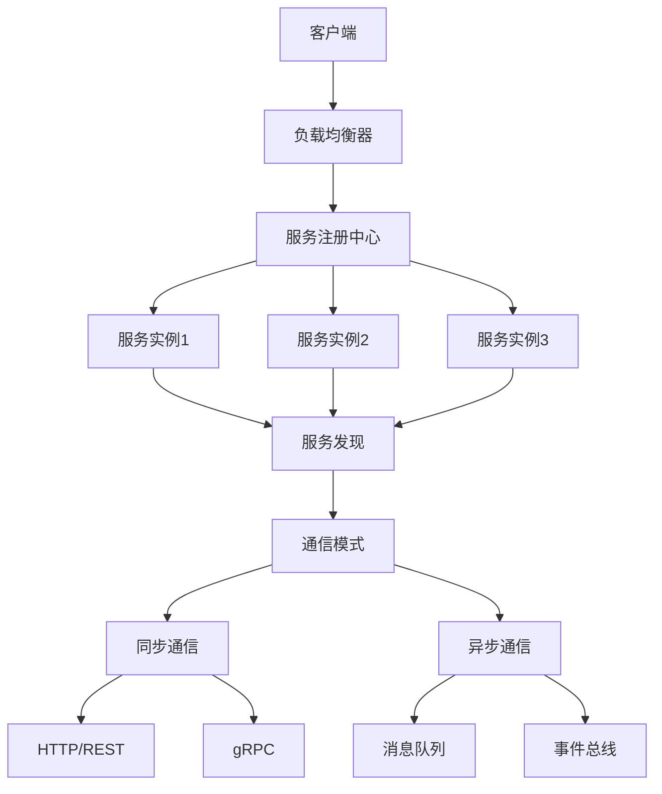

                 

# 微服务设计模式：服务发现和通信

> 关键词：微服务、服务发现、通信模式、负载均衡、容错机制

> 摘要：本文深入探讨了微服务架构中的服务发现和通信模式，通过详细分析服务发现的原理、通信模式的选择、负载均衡的实现以及容错机制的设计，为读者提供了一套全面的微服务设计指南。文章不仅介绍了理论知识，还通过实际代码案例展示了如何在实践中应用这些概念，旨在帮助读者更好地理解和设计微服务系统。

## 1. 背景介绍

随着互联网技术的快速发展，微服务架构因其灵活性、可扩展性和可维护性等优点，逐渐成为现代软件开发的主流架构之一。在微服务架构中，一个大型的应用程序被拆分成多个小型的服务，每个服务独立部署、独立运行，通过网络进行通信。然而，这种架构也带来了新的挑战，特别是服务发现和服务间的通信问题。服务发现是指在分布式系统中，服务实例如何找到并连接到其他服务实例的过程。通信模式的选择、负载均衡的实现以及容错机制的设计是确保微服务架构高效运行的关键。

## 2. 核心概念与联系

### 2.1 服务发现

服务发现是微服务架构中的一个关键组件，它负责在服务实例之间建立连接。服务发现可以分为静态服务发现和动态服务发现两种类型。静态服务发现通常通过配置文件或DNS来实现，而动态服务发现则依赖于服务注册中心，如Eureka、Consul等。

### 2.2 通信模式

微服务之间的通信模式主要有同步通信和异步通信两种。同步通信通常使用HTTP/REST或gRPC等协议，而异步通信则使用消息队列或事件总线等技术。

### 2.3 负载均衡

负载均衡是微服务架构中的另一个重要组成部分，它通过将请求分发到多个服务实例上来提高系统的可用性和性能。负载均衡可以分为软件负载均衡和硬件负载均衡两种类型。

### 2.4 容错机制

容错机制是确保微服务系统在面对故障时能够继续提供服务的关键。常见的容错机制包括服务降级、服务熔断和重试机制等。

### 2.5 核心概念原理和架构的 Mermaid 流程图



## 3. 核心算法原理 & 具体操作步骤

### 3.1 服务发现算法

服务发现算法通常包括服务注册、服务发现和心跳检测三个步骤。服务注册是指服务实例向服务注册中心注册自己的信息，服务发现是指客户端通过服务注册中心获取服务实例的信息，心跳检测是指服务实例定期向服务注册中心发送心跳信息以保持注册状态。

### 3.2 负载均衡算法

负载均衡算法主要有轮询、随机、最少连接数和加权轮询等几种。轮询算法是最简单的负载均衡算法，它将请求依次分发到各个服务实例；随机算法则是随机选择一个服务实例来处理请求；最少连接数算法则是选择当前连接数最少的服务实例来处理请求；加权轮询算法则是根据服务实例的权重来决定请求的分发。

### 3.3 容错机制实现

容错机制的实现通常包括服务降级、服务熔断和重试机制。服务降级是指在系统负载过高或服务不可用时，提供一个降级服务来替代原服务；服务熔断是指在服务调用失败达到一定次数后，暂时停止对该服务的调用；重试机制是指在服务调用失败后，自动重试一定次数。

## 4. 数学模型和公式 & 详细讲解 & 举例说明

### 4.1 负载均衡算法的数学模型

以轮询算法为例，假设系统中有n个服务实例，请求总数为m，则每个服务实例的请求数为m/n。轮询算法的数学模型可以表示为：

$$
\text{请求数} = \frac{\text{请求总数}}{\text{服务实例数}}
$$

### 4.2 容错机制的数学模型

以服务熔断为例，假设服务调用失败的阈值为t，失败次数为c，则服务熔断的数学模型可以表示为：

$$
\text{是否熔断} = \begin{cases} 
\text{是} & \text{if } c \geq t \\
\text{否} & \text{otherwise}
\end{cases}
$$

## 5. 项目实战：代码实际案例和详细解释说明

### 5.1 开发环境搭建

为了演示微服务设计模式，我们选择使用Spring Cloud作为开发框架，Spring Cloud提供了Eureka作为服务注册中心，Ribbon作为负载均衡器，Hystrix作为容错机制。开发环境需要安装Java 8及以上版本，以及Maven或Gradle作为构建工具。

### 5.2 源代码详细实现和代码解读

#### 5.2.1 服务注册中心

```java
@Configuration
@EnableEurekaServer
public class EurekaServerApplication {
    public static void main(String[] args) {
        SpringApplication.run(EurekaServerApplication.class, args);
    }
}
```

#### 5.2.2 服务提供者

```java
@SpringBootApplication
@EnableDiscoveryClient
public class ServiceProviderApplication {
    public static void main(String[] args) {
        SpringApplication.run(ServiceProviderApplication.class, args);
    }
}
```

#### 5.2.3 服务消费者

```java
@SpringBootApplication
@EnableDiscoveryClient
public class ServiceConsumerApplication {
    public static void main(String[] args) {
        SpringApplication.run(ServiceConsumerApplication.class, args);
    }
}
```

### 5.3 代码解读与分析

服务注册中心使用@EnableEurekaServer注解启动Eureka服务，服务提供者和服务消费者使用@EnableDiscoveryClient注解来注册和发现服务。服务消费者通过Ribbon实现负载均衡，通过Hystrix实现容错机制。

## 6. 实际应用场景

微服务设计模式在实际应用中有着广泛的应用场景，如电商平台、在线教育平台、金融系统等。在这些场景中，微服务设计模式能够提高系统的灵活性、可扩展性和可维护性，同时也能提高系统的可用性和性能。

## 7. 工具和资源推荐

### 7.1 学习资源推荐

- 书籍：《Spring Cloud微服务实战》
- 论文：《微服务架构下的服务发现与负载均衡研究》
- 博客：https://spring.io/blog
- 网站：https://www.baeldung.com/spring-cloud

### 7.2 开发工具框架推荐

- Spring Cloud
- Netflix OSS
- Kubernetes

### 7.3 相关论文著作推荐

- 《微服务架构下的服务发现与负载均衡研究》
- 《微服务架构设计模式》

## 8. 总结：未来发展趋势与挑战

随着微服务架构的不断发展，服务发现和服务间的通信模式也在不断演进。未来，微服务架构将更加注重服务的自治性和服务间的松耦合性，同时也会更加注重服务的安全性和可靠性。然而，微服务架构也面临着一些挑战，如服务的复杂性、服务的治理和监控等。

## 9. 附录：常见问题与解答

### 9.1 什么是服务发现？

服务发现是指在分布式系统中，服务实例如何找到并连接到其他服务实例的过程。

### 9.2 什么是负载均衡？

负载均衡是指通过将请求分发到多个服务实例上来提高系统的可用性和性能。

### 9.3 什么是容错机制？

容错机制是指确保微服务系统在面对故障时能够继续提供服务的关键。

## 10. 扩展阅读 & 参考资料

- 书籍：《微服务架构设计模式》
- 论文：《微服务架构下的服务发现与负载均衡研究》
- 博客：https://spring.io/blog
- 网站：https://www.baeldung.com/spring-cloud

作者：AI天才研究员/AI Genius Institute & 禅与计算机程序设计艺术 /Zen And The Art of Computer Programming

