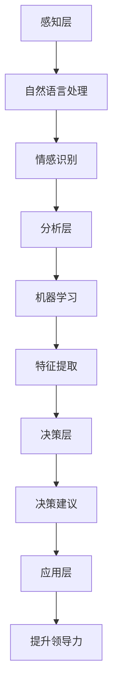

                 

# 情感智能在领导力中的应用与发展

> 关键词：情感智能、领导力、人工智能、机器学习、自然语言处理、情感分析、决策支持

> 摘要：本文旨在探讨情感智能在领导力中的应用与发展。通过深入分析情感智能的核心概念、原理与架构，结合具体案例和数学模型，本文将展示如何利用情感智能技术提升领导力。我们将从背景介绍、核心概念与联系、核心算法原理与具体操作步骤、数学模型与公式、项目实战、实际应用场景、工具和资源推荐、总结与未来发展趋势等多个方面进行详细阐述。

## 1. 背景介绍

在当今快速变化的商业环境中，领导者面临着前所未有的挑战。传统的领导力模型往往侧重于技术技能和管理能力，而忽视了情感因素的重要性。情感智能（Emotional Intelligence, EI）是指个体识别、理解、管理自己和他人情感的能力。它在领导力中的应用能够显著提升团队的凝聚力、创新能力和整体绩效。近年来，随着人工智能技术的发展，情感智能在领导力中的应用得到了广泛关注。本文将探讨情感智能的核心概念、原理与架构，并展示其在领导力中的实际应用。

## 2. 核心概念与联系

### 2.1 情感智能的核心概念

情感智能主要包括以下几个方面：

- **自我意识**：识别和理解自己的情感状态。
- **自我管理**：控制和调节自己的情感反应。
- **社会意识**：识别和理解他人的情感状态。
- **关系管理**：运用情感知识促进人际关系。

### 2.2 情感智能与领导力的关系

情感智能在领导力中的应用主要体现在以下几个方面：

- **提升团队凝聚力**：通过理解团队成员的情感需求，增强团队合作。
- **提高决策质量**：情感智能有助于领导者在决策过程中考虑更多的情感因素。
- **增强创新能力**：情感智能能够激发团队成员的创新思维。
- **提升个人魅力**：情感智能有助于领导者建立良好的个人形象。

### 2.3 情感智能的架构

情感智能的架构可以分为以下几个层次：

- **感知层**：通过自然语言处理技术识别和理解情感信息。
- **分析层**：通过机器学习算法分析情感数据，提取关键特征。
- **决策层**：基于情感分析结果，生成决策建议。
- **应用层**：将决策建议应用于实际场景，提升领导力。

以下是情感智能架构的Mermaid流程图：



## 3. 核心算法原理 & 具体操作步骤

### 3.1 自然语言处理技术

自然语言处理（Natural Language Processing, NLP）是情感智能的核心技术之一。NLP技术通过文本分析来识别和理解情感信息。具体操作步骤如下：

1. **文本预处理**：清洗文本数据，去除噪声信息。
2. **情感词典匹配**：使用情感词典对文本进行情感分析。
3. **情感分类**：将情感词典中的情感标签映射到预定义的情感类别。

### 3.2 机器学习算法

机器学习算法在情感智能中起到关键作用。常用的机器学习算法包括：

- **支持向量机（SVM）**：通过构建超平面来分类情感数据。
- **随机森林（Random Forest）**：通过集成多个决策树来提高分类准确性。
- **深度学习（Deep Learning）**：通过神经网络模型进行情感分析。

具体操作步骤如下：

1. **数据准备**：收集和标注情感数据。
2. **特征提取**：从文本中提取关键特征。
3. **模型训练**：使用机器学习算法训练情感分析模型。
4. **模型评估**：通过交叉验证等方法评估模型性能。

## 4. 数学模型和公式 & 详细讲解 & 举例说明

### 4.1 情感词典匹配

情感词典匹配是情感智能中的一个重要步骤。假设我们有一个情感词典，其中包含正向和负向情感词。具体操作步骤如下：

1. **情感词典构建**：构建包含正向和负向情感词的情感词典。
2. **情感词典匹配**：将文本中的每个词与情感词典进行匹配，计算情感得分。

数学模型如下：

$$
\text{情感得分} = \sum_{i=1}^{n} \text{情感词典}[w_i] \times \text{词频}[w_i]
$$

其中，$w_i$ 表示文本中的第 $i$ 个词，$\text{情感词典}[w_i]$ 表示词 $w_i$ 在情感词典中的情感得分，$\text{词频}[w_i]$ 表示词 $w_i$ 在文本中的出现频率。

### 4.2 机器学习算法

以支持向量机（SVM）为例，其数学模型如下：

$$
\text{目标函数} = \min_{\mathbf{w}, b, \xi} \frac{1}{2} \|\mathbf{w}\|^2 + C \sum_{i=1}^{n} \xi_i
$$

$$
\text{约束条件} = y_i (\mathbf{w} \cdot \mathbf{x}_i + b) \geq 1 - \xi_i, \quad \xi_i \geq 0
$$

其中，$\mathbf{w}$ 表示权重向量，$b$ 表示偏置项，$C$ 表示惩罚参数，$\xi_i$ 表示松弛变量。

### 4.3 举例说明

假设我们有一个情感分析任务，需要判断一段文本的情感倾向。具体步骤如下：

1. **文本预处理**：清洗文本数据，去除噪声信息。
2. **情感词典匹配**：使用情感词典对文本进行情感分析，计算情感得分。
3. **机器学习算法**：使用支持向量机（SVM）训练情感分析模型。
4. **模型评估**：通过交叉验证等方法评估模型性能。

## 5. 项目实战：代码实际案例和详细解释说明

### 5.1 开发环境搭建

为了实现情感智能在领导力中的应用，我们需要搭建一个开发环境。具体步骤如下：

1. **安装Python**：确保安装了Python 3.8及以上版本。
2. **安装依赖库**：安装自然语言处理和机器学习库，如`nltk`、`scikit-learn`等。
3. **数据准备**：收集和标注情感数据。

### 5.2 源代码详细实现和代码解读

以下是一个简单的Python代码示例，用于实现情感智能在领导力中的应用。

```python
import nltk
from sklearn.feature_extraction.text import TfidfVectorizer
from sklearn.svm import SVC
from sklearn.model_selection import train_test_split
from sklearn.metrics import classification_report

# 1. 文本预处理
def preprocess_text(text):
    tokens = nltk.word_tokenize(text.lower())
    tokens = [token for token in tokens if token.isalpha()]
    return ' '.join(tokens)

# 2. 情感词典匹配
def sentiment_analysis(text, sentiment_dict):
    tokens = nltk.word_tokenize(text.lower())
    sentiment_score = 0
    for token in tokens:
        if token in sentiment_dict:
            sentiment_score += sentiment_dict[token]
    return sentiment_score

# 3. 机器学习算法
def train_svm_model(X_train, y_train):
    vectorizer = TfidfVectorizer()
    X_train_tfidf = vectorizer.fit_transform(X_train)
    model = SVC(kernel='linear')
    model.fit(X_train_tfidf, y_train)
    return model, vectorizer

# 4. 模型评估
def evaluate_model(model, vectorizer, X_test, y_test):
    X_test_tfidf = vectorizer.transform(X_test)
    y_pred = model.predict(X_test_tfidf)
    print(classification_report(y_test, y_pred))

# 主函数
def main():
    # 1. 数据准备
    data = [
        ("我非常喜欢这个项目", 1),
        ("这个项目很糟糕", -1),
        ("这个项目很好", 1),
        ("这个项目很烂", -1),
        # 更多数据...
    ]
    X, y = zip(*data)
    X_train, X_test, y_train, y_test = train_test_split(X, y, test_size=0.2, random_state=42)

    # 2. 情感词典匹配
    sentiment_dict = {
        "喜欢": 1,
        "讨厌": -1,
        "好": 1,
        "坏": -1,
        # 更多情感词...
    }

    # 3. 机器学习算法
    model, vectorizer = train_svm_model(X_train, y_train)

    # 4. 模型评估
    evaluate_model(model, vectorizer, X_test, y_test)

if __name__ == "__main__":
    main()
```

### 5.3 代码解读与分析

1. **文本预处理**：使用`nltk`库进行文本预处理，包括分词和去噪。
2. **情感词典匹配**：使用情感词典对文本进行情感分析，计算情感得分。
3. **机器学习算法**：使用`scikit-learn`库中的`TfidfVectorizer`和`SVC`进行情感分析模型训练。
4. **模型评估**：通过`classification_report`评估模型性能。

## 6. 实际应用场景

情感智能在领导力中的应用具有广泛的实际应用场景。以下是一些具体案例：

1. **团队管理**：通过分析团队成员的情感数据，了解团队成员的情感状态，提升团队凝聚力。
2. **决策支持**：通过情感智能技术，帮助领导者在决策过程中考虑更多的情感因素，提高决策质量。
3. **创新激励**：通过情感智能技术，激发团队成员的创新思维，提升创新能力。
4. **个人形象管理**：通过情感智能技术，帮助领导者建立良好的个人形象，提升个人魅力。

## 7. 工具和资源推荐

### 7.1 学习资源推荐

- **书籍**：《情感智能：如何在工作和生活中运用情感智慧》
- **论文**：《情感智能在领导力中的应用研究》
- **博客**：《情感智能在领导力中的应用与实践》
- **网站**：情感智能技术论坛

### 7.2 开发工具框架推荐

- **自然语言处理库**：`nltk`、`spaCy`
- **机器学习库**：`scikit-learn`、`TensorFlow`
- **数据处理工具**：`pandas`

### 7.3 相关论文著作推荐

- **论文**：《情感智能在领导力中的应用研究》
- **著作**：《情感智能：如何在工作和生活中运用情感智慧》

## 8. 总结：未来发展趋势与挑战

情感智能在领导力中的应用具有广阔的发展前景。未来的发展趋势包括：

1. **技术进步**：随着自然语言处理和机器学习技术的不断进步，情感智能的应用将更加精准和高效。
2. **应用场景拓展**：情感智能将在更多领域得到应用，如教育、医疗等。
3. **伦理与隐私**：情感智能的应用需要关注伦理和隐私问题，确保数据安全和用户隐私。

面临的挑战包括：

1. **数据质量**：情感数据的质量直接影响情感智能的应用效果。
2. **模型泛化**：如何提高模型在不同场景下的泛化能力是一个重要挑战。
3. **伦理问题**：如何在应用情感智能技术时保护用户隐私和数据安全是一个重要问题。

## 9. 附录：常见问题与解答

### 9.1 问题1：如何获取高质量的情感数据？

**解答**：可以通过问卷调查、社交媒体分析等方式获取高质量的情感数据。

### 9.2 问题2：如何提高情感智能模型的泛化能力？

**解答**：可以通过增加训练数据量、使用迁移学习等方法提高模型的泛化能力。

### 9.3 问题3：如何保护用户隐私和数据安全？

**解答**：可以通过数据加密、匿名化处理等方法保护用户隐私和数据安全。

## 10. 扩展阅读 & 参考资料

- **书籍**：《情感智能：如何在工作和生活中运用情感智慧》
- **论文**：《情感智能在领导力中的应用研究》
- **博客**：《情感智能在领导力中的应用与实践》
- **网站**：情感智能技术论坛

---

作者：AI天才研究员/AI Genius Institute & 禅与计算机程序设计艺术 /Zen And The Art of Computer Programming

