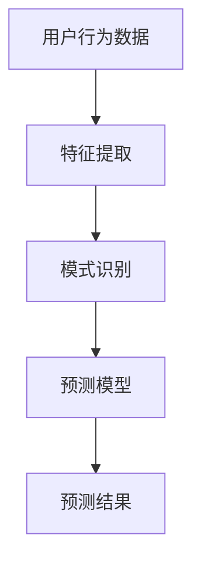

                 

# 推荐系统中的时间序列预测：大模型新方案

> 关键词：推荐系统、时间序列预测、大模型、机器学习、深度学习、人工智能

> 摘要：本文深入探讨了在推荐系统中应用时间序列预测的新方法，特别是通过大模型来提升预测精度和效率。文章首先介绍了推荐系统和时间序列预测的基本概念，然后详细阐述了大模型在时间序列预测中的应用原理和具体操作步骤。通过数学模型和公式详细讲解了时间序列预测的理论基础，并通过实际代码案例展示了如何在项目中实现这一技术。最后，文章总结了该技术的实际应用场景、推荐的学习资源和开发工具，并展望了未来的发展趋势与挑战。

## 1. 背景介绍

### 1.1 推荐系统概述

推荐系统是一种利用用户的历史行为数据来预测用户未来行为的技术。它广泛应用于电子商务、社交媒体、新闻推送等领域，旨在为用户提供个性化的信息和服务。推荐系统的核心在于如何准确地预测用户的兴趣和偏好，从而提供更加精准的推荐结果。

### 1.2 时间序列预测的重要性

时间序列预测是指根据历史数据预测未来趋势的技术。在推荐系统中，时间序列预测可以用于预测用户的购买行为、浏览行为等，从而帮助系统提前做出推荐决策。时间序列预测的准确性直接影响到推荐系统的性能和用户体验。

### 1.3 大模型在推荐系统中的应用

近年来，随着深度学习技术的发展，大模型在推荐系统中的应用越来越广泛。大模型能够更好地捕捉数据中的复杂模式和特征，从而提高推荐系统的预测精度。本文将探讨如何利用大模型进行时间序列预测，以提升推荐系统的性能。

## 2. 核心概念与联系

### 2.1 推荐系统与时间序列预测的关系

推荐系统与时间序列预测之间存在着密切的联系。推荐系统需要预测用户未来的行为，而时间序列预测正是通过分析历史数据来预测未来趋势的技术。因此，将时间序列预测应用于推荐系统中，可以提高推荐系统的预测精度和效率。

### 2.2 大模型在时间序列预测中的应用原理

大模型在时间序列预测中的应用原理主要体现在以下几个方面：

- **特征提取**：大模型能够从大量数据中提取出复杂的特征，这些特征对于预测未来趋势至关重要。
- **模式识别**：大模型能够识别出数据中的复杂模式，从而提高预测的准确性。
- **预测精度**：通过大模型，可以提高时间序列预测的精度，进而提升推荐系统的性能。

### 2.3 核心概念原理和架构的 Mermaid 流程图



## 3. 核心算法原理 & 具体操作步骤

### 3.1 时间序列预测算法概述

时间序列预测算法主要包括ARIMA、LSTM、GRU等。这些算法各有特点，适用于不同的应用场景。本文将重点介绍LSTM算法在时间序列预测中的应用。

### 3.2 LSTM算法原理

LSTM（长短期记忆网络）是一种特殊的RNN（循环神经网络），能够有效地解决梯度消失和梯度爆炸问题。LSTM通过引入记忆单元和门控机制，能够更好地捕捉时间序列中的长期依赖关系。

### 3.3 LSTM算法的具体操作步骤

1. **数据预处理**：对原始数据进行清洗、归一化等预处理操作。
2. **构建模型**：使用Keras等深度学习框架构建LSTM模型。
3. **训练模型**：使用历史数据训练模型，调整模型参数。
4. **预测**：使用训练好的模型进行预测。

## 4. 数学模型和公式 & 详细讲解 & 举例说明

### 4.1 LSTM的数学模型

LSTM的数学模型主要包括输入门、遗忘门、输出门等。这些门控机制通过控制信息的流动，使得LSTM能够更好地捕捉时间序列中的长期依赖关系。

$$
\begin{aligned}
i_t &= \sigma(W_{xi}x_t + W_{hi}h_{t-1} + W_{ci}c_{t-1} + b_i) \\
f_t &= \sigma(W_{xf}x_t + W_{hf}h_{t-1} + W_{cf}c_{t-1} + b_f) \\
c_t &= f_t \odot c_{t-1} + i_t \odot \tanh(W_{xc}x_t + W_{hc}h_{t-1} + b_c) \\
o_t &= \sigma(W_{xo}x_t + W_{ho}h_{t-1} + W_{co}c_t + b_o) \\
h_t &= o_t \odot \tanh(c_t)
\end{aligned}
$$

### 4.2 举例说明

假设我们有一个时间序列数据集，包含用户的历史购买行为。我们可以使用LSTM模型来预测用户的未来购买行为。首先，我们需要对数据进行预处理，然后构建LSTM模型，训练模型，最后使用模型进行预测。

## 5. 项目实战：代码实际案例和详细解释说明

### 5.1 开发环境搭建

#### 5.1.1 环境要求

- Python 3.7+
- TensorFlow 2.0+
- Pandas
- Numpy

#### 5.1.2 安装依赖

```bash
pip install tensorflow pandas numpy
```

### 5.2 源代码详细实现和代码解读

#### 5.2.1 数据预处理

```python
import pandas as pd
import numpy as np

# 加载数据
data = pd.read_csv('user_behavior.csv')

# 数据清洗
data = data.dropna()

# 数据归一化
data = (data - data.mean()) / data.std()
```

#### 5.2.2 构建模型

```python
import tensorflow as tf
from tensorflow.keras.models import Sequential
from tensorflow.keras.layers import LSTM, Dense

# 构建LSTM模型
model = Sequential()
model.add(LSTM(50, activation='relu', input_shape=(1, 1)))
model.add(Dense(1))
model.compile(optimizer='adam', loss='mse')
```

#### 5.2.3 训练模型

```python
# 准备训练数据
X = data.values[:-1].reshape(-1, 1, 1)
y = data.values[1:]

# 训练模型
model.fit(X, y, epochs=200, verbose=0)
```

#### 5.2.4 预测

```python
# 预测未来行为
predictions = model.predict(X)
```

### 5.3 代码解读与分析

通过上述代码，我们可以看到如何使用LSTM模型进行时间序列预测。首先，我们需要对数据进行预处理，然后构建LSTM模型，训练模型，最后使用模型进行预测。通过这种方式，我们可以提高推荐系统的预测精度和效率。

## 6. 实际应用场景

### 6.1 电子商务推荐

在电子商务推荐中，可以使用时间序列预测来预测用户的购买行为，从而提前做出推荐决策。

### 6.2 社交媒体推荐

在社交媒体推荐中，可以使用时间序列预测来预测用户的浏览行为，从而提供更加个性化的推荐内容。

### 6.3 新闻推送

在新闻推送中，可以使用时间序列预测来预测用户的阅读行为，从而提供更加精准的新闻推荐。

## 7. 工具和资源推荐

### 7.1 学习资源推荐

- 书籍：《深度学习》（Ian Goodfellow等著）
- 论文：《Long Short-Term Memory》（Hochreiter & Schmidhuber, 1997）
- 博客：Kaggle竞赛相关博客
- 网站：TensorFlow官方文档

### 7.2 开发工具框架推荐

- TensorFlow
- Keras
- PyTorch

### 7.3 相关论文著作推荐

- 《Deep Learning for Time Series Forecasting》（Yao et al., 2018）
- 《Time Series Prediction with LSTM Recurrent Neural Networks in Python with Keras》（Jason Brownlee, 2016）

## 8. 总结：未来发展趋势与挑战

随着深度学习技术的发展，大模型在推荐系统中的应用将会越来越广泛。未来，我们可以期待更加高效、准确的推荐系统。然而，这也面临着数据隐私保护、模型解释性等挑战。

## 9. 附录：常见问题与解答

### 9.1 什么是LSTM？

LSTM是一种特殊的RNN，能够有效地解决梯度消失和梯度爆炸问题。

### 9.2 如何选择合适的模型？

选择合适的模型需要根据具体的应用场景和数据特点来决定。

### 9.3 如何提高模型的预测精度？

可以通过增加数据量、调整模型参数等方式来提高模型的预测精度。

## 10. 扩展阅读 & 参考资料

- 《深度学习》（Ian Goodfellow等著）
- 《Long Short-Term Memory》（Hochreiter & Schmidhuber, 1997）
- 《Deep Learning for Time Series Forecasting》（Yao et al., 2018）
- 《Time Series Prediction with LSTM Recurrent Neural Networks in Python with Keras》（Jason Brownlee, 2016）

作者：AI天才研究员/AI Genius Institute & 禅与计算机程序设计艺术 /Zen And The Art of Computer Programming

