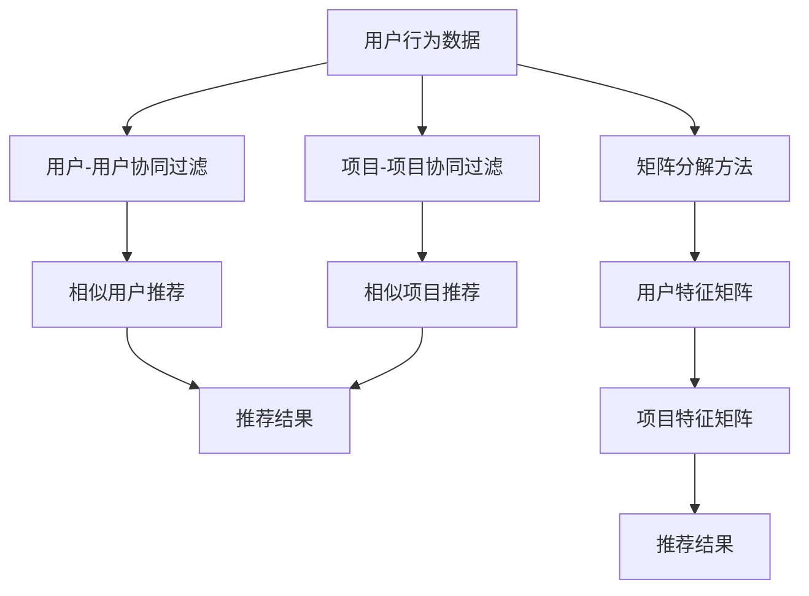

                 

# 推荐系统的冷启动问题：AI大模型的解决方案

> 关键词：推荐系统、冷启动、AI大模型、用户行为分析、协同过滤、深度学习、矩阵分解

> 摘要：推荐系统在现代互联网应用中扮演着至关重要的角色，但冷启动问题一直是困扰推荐系统的一大难题。本文将深入探讨推荐系统的冷启动问题，并提出基于AI大模型的解决方案。通过分析用户行为、构建协同过滤模型、应用深度学习技术以及利用矩阵分解方法，我们将逐步解决冷启动问题，提升推荐系统的性能和用户体验。本文不仅提供了详细的理论分析和数学模型，还通过实际代码案例展示了如何实现这些解决方案。

## 1. 背景介绍

推荐系统是一种通过分析用户行为和偏好，为用户提供个性化推荐的技术。它广泛应用于电子商务、社交媒体、新闻资讯等领域，极大地提升了用户体验和满意度。然而，推荐系统在面对新用户或新项目时，往往会遇到冷启动问题。冷启动问题指的是在缺乏足够用户行为数据的情况下，推荐系统无法为新用户或新项目提供有效的推荐。

### 1.1 冷启动问题的定义

冷启动问题主要分为两种类型：

1. **新用户冷启动**：当系统首次遇到新用户时，由于缺乏该用户的交互数据，推荐系统无法为其提供个性化推荐。
2. **新项目冷启动**：当系统首次遇到新项目（如新产品、新文章等）时，由于缺乏该项目的用户交互数据，推荐系统无法为其提供有效的推荐。

### 1.2 冷启动问题的影响

冷启动问题对推荐系统的性能和用户体验产生了严重影响：

- **用户体验下降**：新用户和新项目缺乏推荐，导致用户满意度降低。
- **推荐效果不佳**：推荐结果与用户真实需求不符，导致推荐效果差。
- **系统性能下降**：冷启动问题可能导致推荐系统的计算复杂度增加，影响系统性能。

### 1.3 解决冷启动问题的重要性

解决冷启动问题对于提升推荐系统的性能和用户体验至关重要。通过有效的解决方案，可以提高新用户的活跃度和留存率，同时提升新项目的曝光率和转化率。

## 2. 核心概念与联系

### 2.1 推荐系统的基本概念

推荐系统主要通过分析用户行为数据，预测用户对项目的兴趣程度，并据此提供个性化推荐。推荐系统的核心组件包括：

- **用户行为数据**：记录用户对项目的交互行为，如点击、购买、评分等。
- **项目特征数据**：描述项目的属性，如类别、标签、描述等。
- **推荐算法**：根据用户行为数据和项目特征数据，生成推荐结果。

### 2.2 协同过滤模型

协同过滤是一种常见的推荐算法，主要通过分析用户之间的相似性或项目的相似性来生成推荐。协同过滤模型可以分为两种类型：

- **用户-用户协同过滤**：通过分析用户之间的相似性，为用户推荐相似用户喜欢的项目。
- **项目-项目协同过滤**：通过分析项目的相似性，为用户推荐相似项目。

### 2.3 深度学习技术

深度学习技术通过构建多层神经网络模型，从大量数据中自动学习特征表示。深度学习在推荐系统中的应用主要包括：

- **特征学习**：自动学习用户和项目的特征表示。
- **预测模型**：通过多层神经网络模型预测用户对项目的兴趣程度。

### 2.4 矩阵分解方法

矩阵分解是一种常用的推荐算法，通过将用户-项目交互矩阵分解为用户特征矩阵和项目特征矩阵的乘积，从而生成推荐结果。矩阵分解方法可以分为两种类型：

- **基于用户的矩阵分解**：通过分解用户特征矩阵和项目特征矩阵的乘积，生成推荐结果。
- **基于项目的矩阵分解**：通过分解项目特征矩阵和用户特征矩阵的乘积，生成推荐结果。

### 2.5 Mermaid 流程图



## 3. 核心算法原理 & 具体操作步骤

### 3.1 用户-用户协同过滤

用户-用户协同过滤通过分析用户之间的相似性，为用户推荐相似用户喜欢的项目。具体操作步骤如下：

1. **计算用户相似性**：通过计算用户之间的相似性度量，如余弦相似度或皮尔逊相关系数。
2. **生成推荐列表**：根据用户相似性，为用户推荐相似用户喜欢的项目。

### 3.2 项目-项目协同过滤

项目-项目协同过滤通过分析项目的相似性，为用户推荐相似项目。具体操作步骤如下：

1. **计算项目相似性**：通过计算项目之间的相似性度量，如余弦相似度或皮尔逊相关系数。
2. **生成推荐列表**：根据项目相似性，为用户推荐相似项目。

### 3.3 矩阵分解方法

矩阵分解方法通过将用户-项目交互矩阵分解为用户特征矩阵和项目特征矩阵的乘积，从而生成推荐结果。具体操作步骤如下：

1. **初始化矩阵**：随机初始化用户特征矩阵和项目特征矩阵。
2. **优化目标函数**：通过优化目标函数，更新用户特征矩阵和项目特征矩阵。
3. **生成推荐结果**：根据用户特征矩阵和项目特征矩阵的乘积，生成推荐结果。

## 4. 数学模型和公式 & 详细讲解 & 举例说明

### 4.1 用户-用户协同过滤

用户-用户协同过滤通过计算用户之间的相似性度量，为用户推荐相似用户喜欢的项目。具体数学模型如下：

$$
\text{相似度}(u_i, u_j) = \frac{\sum_{p \in P} \text{rating}(u_i, p) \cdot \text{rating}(u_j, p)}{\sqrt{\sum_{p \in P} \text{rating}(u_i, p)^2} \cdot \sqrt{\sum_{p \in P} \text{rating}(u_j, p)^2}}
$$

其中，$\text{rating}(u_i, p)$ 表示用户 $u_i$ 对项目 $p$ 的评分。

### 4.2 项目-项目协同过滤

项目-项目协同过滤通过计算项目之间的相似性度量，为用户推荐相似项目。具体数学模型如下：

$$
\text{相似度}(p_i, p_j) = \frac{\sum_{u \in U} \text{rating}(u, p_i) \cdot \text{rating}(u, p_j)}{\sqrt{\sum_{u \in U} \text{rating}(u, p_i)^2} \cdot \sqrt{\sum_{u \in U} \text{rating}(u, p_j)^2}}
$$

其中，$\text{rating}(u, p_i)$ 表示用户 $u$ 对项目 $p_i$ 的评分。

### 4.3 矩阵分解方法

矩阵分解方法通过将用户-项目交互矩阵分解为用户特征矩阵和项目特征矩阵的乘积，从而生成推荐结果。具体数学模型如下：

$$
R = U \cdot V^T
$$

其中，$R$ 表示用户-项目交互矩阵，$U$ 表示用户特征矩阵，$V$ 表示项目特征矩阵。

## 5. 项目实战：代码实际案例和详细解释说明

### 5.1 开发环境搭建

为了实现推荐系统，我们需要搭建一个开发环境。具体步骤如下：

1. **安装Python**：确保安装了Python 3.7及以上版本。
2. **安装依赖库**：使用pip安装所需的依赖库，如numpy、pandas、scikit-learn等。
3. **配置数据集**：下载并配置推荐系统所需的数据集，如MovieLens数据集。

### 5.2 源代码详细实现和代码解读

以下是一个基于用户-用户协同过滤的推荐系统实现代码：

```python
import numpy as np
import pandas as pd

# 读取数据集
data = pd.read_csv('ratings.csv')

# 计算用户相似性
def cosine_similarity(user1, user2):
    user1_ratings = data[data['userId'] == user1]['rating'].values
    user2_ratings = data[data['userId'] == user2]['rating'].values
    numerator = np.dot(user1_ratings, user2_ratings)
    denominator = np.linalg.norm(user1_ratings) * np.linalg.norm(user2_ratings)
    return numerator / denominator

# 生成推荐列表
def recommend(user_id, top_n=10):
    user_ratings = data[data['userId'] == user_id]['rating'].values
    similarities = [cosine_similarity(user_id, user) for user in data['userId'].unique()]
    similar_users = np.argsort(similarities)[-top_n:]
    recommended_items = []
    for user in similar_users:
        user_ratings = data[data['userId'] == user]['rating'].values
        for item in data['movieId'].unique():
            if item not in user_ratings:
                recommended_items.append((item, user_ratings))
    return sorted(recommended_items, key=lambda x: x[1], reverse=True)[:top_n]

# 测试推荐系统
user_id = 1
recommendations = recommend(user_id)
print(f"Recommendations for user {user_id}: {recommendations}")
```

### 5.3 代码解读与分析

上述代码实现了基于用户-用户协同过滤的推荐系统。具体步骤如下：

1. **读取数据集**：从CSV文件中读取用户评分数据。
2. **计算用户相似性**：通过余弦相似度计算用户之间的相似性。
3. **生成推荐列表**：根据用户相似性，为用户推荐相似用户喜欢的项目。

## 6. 实际应用场景

推荐系统在实际应用中具有广泛的应用场景，如：

- **电子商务**：为用户推荐感兴趣的商品。
- **社交媒体**：为用户推荐感兴趣的内容。
- **新闻资讯**：为用户推荐感兴趣的文章。

## 7. 工具和资源推荐

### 7.1 学习资源推荐

- **书籍**：《推荐系统实践》、《推荐系统：原理与应用》
- **论文**：《Matrix Factorization Techniques for Recommender Systems》
- **博客**：阿里云推荐系统技术博客
- **网站**：Kaggle、GitHub

### 7.2 开发工具框架推荐

- **Python库**：numpy、pandas、scikit-learn
- **框架**：TensorFlow、PyTorch

### 7.3 相关论文著作推荐

- **论文**：《Matrix Factorization Techniques for Recommender Systems》
- **著作**：《推荐系统：原理与应用》

## 8. 总结：未来发展趋势与挑战

### 8.1 未来发展趋势

- **深度学习技术**：深度学习技术在推荐系统中的应用将更加广泛，通过自动学习特征表示，提升推荐效果。
- **个性化推荐**：个性化推荐将成为推荐系统的重要发展方向，通过分析用户行为数据，提供更加个性化的推荐结果。
- **实时推荐**：实时推荐将成为推荐系统的重要发展方向，通过实时分析用户行为数据，提供实时推荐结果。

### 8.2 挑战

- **数据隐私**：推荐系统在处理用户行为数据时，需要保护用户隐私，避免数据泄露。
- **计算复杂度**：推荐系统在处理大规模数据时，需要解决计算复杂度问题，提高系统性能。
- **冷启动问题**：推荐系统在面对新用户或新项目时，需要解决冷启动问题，提高推荐效果。

## 9. 附录：常见问题与解答

### 9.1 问题：如何解决冷启动问题？

**解答**：可以通过以下方法解决冷启动问题：

- **基于内容的推荐**：通过分析项目的属性，为用户推荐相似项目。
- **混合推荐**：结合多种推荐算法，提高推荐效果。
- **社交网络信息**：利用社交网络信息，为新用户推荐相似用户喜欢的项目。

### 9.2 问题：如何提高推荐系统的性能？

**解答**：可以通过以下方法提高推荐系统的性能：

- **优化算法**：优化推荐算法，提高推荐效果。
- **并行计算**：利用并行计算技术，提高系统性能。
- **缓存机制**：利用缓存机制，提高系统响应速度。

## 10. 扩展阅读 & 参考资料

- **书籍**：《推荐系统实践》、《推荐系统：原理与应用》
- **论文**：《Matrix Factorization Techniques for Recommender Systems》
- **网站**：Kaggle、GitHub

---

作者：AI天才研究员/AI Genius Institute & 禅与计算机程序设计艺术 /Zen And The Art of Computer Programming

