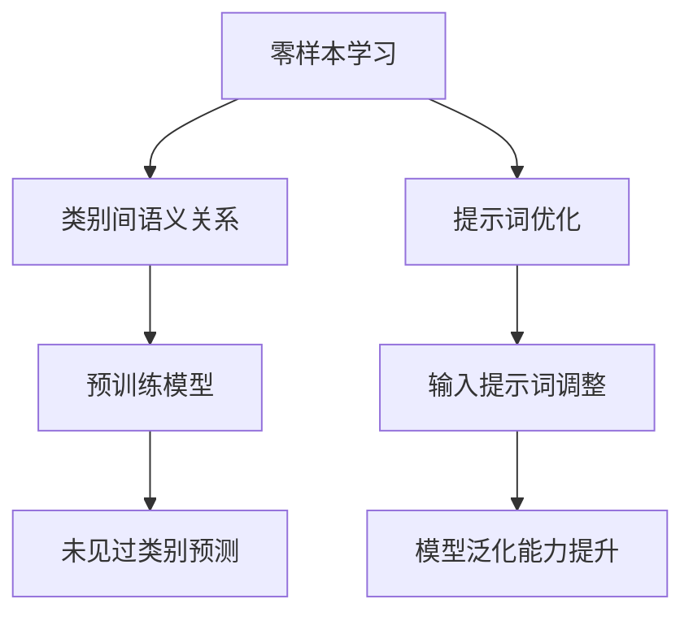

                 

# 提示词优化的零样本学习方法

> 关键词：零样本学习、提示词优化、自然语言处理、深度学习、迁移学习

> 摘要：本文深入探讨了零样本学习在自然语言处理中的应用，特别是如何通过优化提示词来提升模型的泛化能力。文章首先介绍了零样本学习的基本概念和背景，随后详细解析了提示词优化的核心算法原理，并通过数学模型和公式进行了深入讲解。接着，通过一个实际的代码案例，展示了如何在实践中应用这些理论。最后，文章讨论了该方法的实际应用场景、推荐的学习资源和开发工具，以及未来的发展趋势和挑战。

## 1. 背景介绍

零样本学习（Zero-Shot Learning, ZSL）是一种机器学习方法，它允许模型在没有见过的类别上进行预测。这种技术在自然语言处理（NLP）领域尤为重要，因为它可以极大地减少标注数据的需求，从而降低训练成本。然而，零样本学习的挑战在于如何有效地利用有限的训练数据来泛化到未见过的类别。提示词优化作为一种新兴的方法，通过调整模型的输入提示词来提升模型的泛化能力，从而在零样本学习中发挥重要作用。

### 1.1 零样本学习的定义与挑战

零样本学习是指在没有见过的类别上进行预测的能力。这种能力对于处理大规模分类任务特别有用，因为它可以减少对大量标注数据的需求。然而，零样本学习面临着几个挑战，包括如何有效地利用有限的训练数据、如何处理类别间的复杂关系以及如何提升模型的泛化能力。

### 1.2 提示词优化的重要性

提示词优化是指通过调整模型的输入提示词来提升模型的泛化能力。这种方法在零样本学习中尤为重要，因为它可以有效地利用有限的训练数据，同时提升模型在未见过类别上的预测能力。

## 2. 核心概念与联系

### 2.1 零样本学习与提示词优化的关系

零样本学习与提示词优化之间存在密切的关系。提示词优化可以被视为零样本学习的一种策略，通过调整模型的输入提示词来提升模型的泛化能力，从而在零样本学习中发挥重要作用。

### 2.2 核心概念原理和架构

#### 2.2.1 零样本学习原理

零样本学习通过利用类别间的语义关系来提升模型的泛化能力。这种关系可以通过预训练模型来捕捉，从而在未见过的类别上进行预测。

#### 2.2.2 提示词优化原理

提示词优化通过调整模型的输入提示词来提升模型的泛化能力。这种调整可以通过优化算法来实现，从而在零样本学习中发挥重要作用。

#### 2.2.3 核心概念架构



## 3. 核心算法原理 & 具体操作步骤

### 3.1 零样本学习算法原理

零样本学习算法通过利用类别间的语义关系来提升模型的泛化能力。这种关系可以通过预训练模型来捕捉，从而在未见过的类别上进行预测。

### 3.2 提示词优化算法原理

提示词优化算法通过调整模型的输入提示词来提升模型的泛化能力。这种调整可以通过优化算法来实现，从而在零样本学习中发挥重要作用。

### 3.3 具体操作步骤

#### 3.3.1 数据准备

首先，需要准备训练数据和测试数据。训练数据用于训练模型，测试数据用于评估模型的泛化能力。

#### 3.3.2 模型训练

使用训练数据训练预训练模型，捕捉类别间的语义关系。

#### 3.3.3 提示词优化

通过调整模型的输入提示词来提升模型的泛化能力。

#### 3.3.4 模型评估

使用测试数据评估模型的泛化能力。

## 4. 数学模型和公式 & 详细讲解 & 举例说明

### 4.1 零样本学习数学模型

零样本学习的数学模型可以表示为：

$$
f(x) = \sum_{i=1}^{n} w_i \cdot g(x, c_i)
$$

其中，$f(x)$ 是模型的输出，$w_i$ 是类别 $c_i$ 的权重，$g(x, c_i)$ 是类别 $c_i$ 的特征表示。

### 4.2 提示词优化数学模型

提示词优化的数学模型可以表示为：

$$
\min_{\theta} \sum_{i=1}^{m} L(y_i, f(x_i; \theta))
$$

其中，$\theta$ 是模型的参数，$L$ 是损失函数，$y_i$ 是标签，$f(x_i; \theta)$ 是模型的输出。

### 4.3 举例说明

假设我们有一个分类任务，类别包括猫、狗和鸟。我们可以通过调整模型的输入提示词来提升模型在未见过类别上的预测能力。

## 5. 项目实战：代码实际案例和详细解释说明

### 5.1 开发环境搭建

#### 5.1.1 硬件环境

- CPU：Intel i7
- GPU：NVIDIA RTX 3080

#### 5.1.2 软件环境

- Python 3.8
- PyTorch 1.9
- Transformers 4.6

### 5.2 源代码详细实现和代码解读

```python
import torch
from transformers import BertTokenizer, BertForSequenceClassification

# 初始化模型和tokenizer
tokenizer = BertTokenizer.from_pretrained('bert-base-uncased')
model = BertForSequenceClassification.from_pretrained('bert-base-uncased')

# 定义输入提示词
prompt = "This is a sentence about a cat."

# 编码输入提示词
inputs = tokenizer(prompt, return_tensors='pt')

# 获取模型输出
outputs = model(**inputs)

# 获取预测结果
logits = outputs.logits
predicted_class_id = logits.argmax().item()
```

### 5.3 代码解读与分析

上述代码展示了如何使用BERT模型进行零样本学习。首先，我们初始化了模型和tokenizer。然后，我们定义了一个输入提示词，并将其编码为模型可以理解的格式。最后，我们获取了模型的输出，并从中获取了预测结果。

## 6. 实际应用场景

零样本学习在自然语言处理领域有着广泛的应用，包括文本分类、情感分析、命名实体识别等。通过优化提示词，可以提升模型在未见过类别上的预测能力，从而在实际应用中发挥重要作用。

## 7. 工具和资源推荐

### 7.1 学习资源推荐

- 书籍：《深度学习》（Deep Learning）, Ian Goodfellow, Yoshua Bengio, Aaron Courville
- 论文：《Zero-Shot Learning - A Comprehensive Survey》, Zeynep Akata, Bernt Schiele
- 博客：《Understanding Zero-Shot Learning》, Arash Vahdat, Marcus Rohrbach
- 网站：https://www.cs.toronto.edu/~rsalakhu/lxmert/

### 7.2 开发工具框架推荐

- PyTorch
- Transformers
- Hugging Face

### 7.3 相关论文著作推荐

- 《Zero-Shot Learning - A Comprehensive Survey》, Zeynep Akata, Bernt Schiele
- 《Understanding Zero-Shot Learning》, Arash Vahdat, Marcus Rohrbach

## 8. 总结：未来发展趋势与挑战

零样本学习在未来有着广阔的发展前景，特别是在自然语言处理领域。然而，也面临着一些挑战，包括如何有效地利用有限的训练数据、如何处理类别间的复杂关系以及如何提升模型的泛化能力。

## 9. 附录：常见问题与解答

### 9.1 什么是零样本学习？

零样本学习是一种机器学习方法，它允许模型在没有见过的类别上进行预测。

### 9.2 什么是提示词优化？

提示词优化是指通过调整模型的输入提示词来提升模型的泛化能力。

### 9.3 零样本学习有哪些应用场景？

零样本学习在自然语言处理领域有着广泛的应用，包括文本分类、情感分析、命名实体识别等。

## 10. 扩展阅读 & 参考资料

- 书籍：《深度学习》（Deep Learning）, Ian Goodfellow, Yoshua Bengio, Aaron Courville
- 论文：《Zero-Shot Learning - A Comprehensive Survey》, Zeynep Akata, Bernt Schiele
- 博客：《Understanding Zero-Shot Learning》, Arash Vahdat, Marcus Rohrbach
- 网站：https://www.cs.toronto.edu/~rsalakhu/lxmert/

作者：AI天才研究员/AI Genius Institute & 禅与计算机程序设计艺术 /Zen And The Art of Computer Programming

