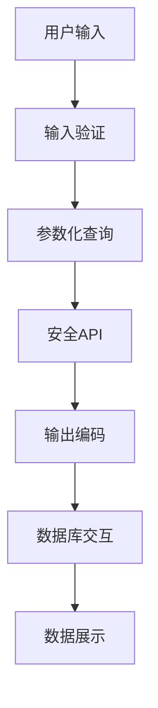

                 

# 提示词安全：防御注入攻击的策略与实践

> 关键词：提示词安全, 注入攻击, SQL注入, XSS攻击, 防御策略, 安全编码

> 摘要：本文旨在深入探讨提示词安全的重要性，特别是如何防御常见的注入攻击，如SQL注入和XSS攻击。通过分析注入攻击的原理、防御策略、数学模型、具体操作步骤以及实战案例，本文为开发者提供了一套全面的防御方案。此外，本文还推荐了一系列学习资源、开发工具和相关论文，帮助读者进一步提升安全意识和技术水平。

## 1. 背景介绍

在当今数字化时代，网络安全已成为企业和个人不可忽视的重要议题。提示词安全作为网络安全的重要组成部分，主要关注于防止恶意用户通过输入特定的提示词来操纵系统的行为。常见的注入攻击，如SQL注入和XSS攻击，是提示词安全领域中最为常见的威胁之一。这些攻击不仅能够导致数据泄露，还可能破坏系统稳定性，甚至控制整个服务器。因此，了解注入攻击的原理、防御策略以及如何在实际开发中应用这些策略，对于保障系统安全至关重要。

## 2. 核心概念与联系

### 2.1 SQL注入

SQL注入是一种常见的安全漏洞，攻击者通过在输入字段中插入恶意SQL代码，试图绕过应用程序的安全机制，直接与数据库交互。这种攻击可以导致数据泄露、数据篡改或数据库被完全控制。

### 2.2 XSS攻击

XSS（Cross-Site Scripting）攻击是指攻击者通过在网页中插入恶意脚本，使用户在浏览网页时执行这些脚本，从而达到攻击目的。XSS攻击可以分为存储型XSS、反射型XSS和DOM型XSS三种类型。

### 2.3 防御策略

防御策略主要包括输入验证、参数化查询、使用安全的API、输出编码等。通过这些策略，可以有效防止注入攻击的发生。

### 2.4 核心概念原理和架构的Mermaid流程图



## 3. 核心算法原理 & 具体操作步骤

### 3.1 SQL注入防御

#### 3.1.1 输入验证

输入验证是防御SQL注入的第一道防线。通过验证用户输入是否符合预期格式，可以有效防止恶意SQL代码的注入。

#### 3.1.2 参数化查询

参数化查询是防御SQL注入的关键技术。通过将SQL语句中的变量参数化，可以防止SQL语句被恶意篡改。

#### 3.1.3 使用安全的API

使用安全的API，如ORM框架，可以避免直接拼接SQL语句，从而减少SQL注入的风险。

### 3.2 XSS攻击防御

#### 3.2.1 输出编码

输出编码是防御XSS攻击的有效手段。通过将输出内容进行编码，可以防止恶意脚本的执行。

#### 3.2.2 使用安全的API

使用安全的API，如HTML转义函数，可以防止XSS攻击的发生。

#### 3.2.3 设置HTTP头部

设置HTTP头部，如Content-Security-Policy，可以限制网页中可以执行的脚本来源。

## 4. 数学模型和公式 & 详细讲解 & 举例说明

### 4.1 SQL注入的数学模型

SQL注入的数学模型可以表示为：

$$
\text{SQL注入} = \text{输入} \times \text{漏洞} \times \text{攻击者意图}
$$

其中，输入是指用户输入的数据，漏洞是指应用程序中存在的安全漏洞，攻击者意图是指攻击者希望通过注入攻击达到的目的。

### 4.2 XSS攻击的数学模型

XSS攻击的数学模型可以表示为：

$$
\text{XSS攻击} = \text{输入} \times \text{漏洞} \times \text{攻击者意图}
$$

其中，输入是指用户输入的数据，漏洞是指应用程序中存在的安全漏洞，攻击者意图是指攻击者希望通过XSS攻击达到的目的。

## 5. 项目实战：代码实际案例和详细解释说明

### 5.1 开发环境搭建

#### 5.1.1 安装开发工具

安装必要的开发工具，如IDE、数据库管理工具等。

#### 5.1.2 配置开发环境

配置开发环境，如数据库连接信息、服务器配置等。

### 5.2 源代码详细实现和代码解读

#### 5.2.1 SQL注入防御代码

```python
def safe_query(user_input):
    # 使用参数化查询
    query = "SELECT * FROM users WHERE username = %s"
    cursor.execute(query, (user_input,))
```

#### 5.2.2 XSS攻击防御代码

```python
def safe_output(user_input):
    # 使用HTML转义函数
    return escape(user_input)
```

### 5.3 代码解读与分析

通过上述代码，我们可以看到，使用参数化查询和HTML转义函数可以有效防御SQL注入和XSS攻击。

## 6. 实际应用场景

### 6.1 防御SQL注入的实际应用场景

在电子商务网站中，用户可以通过搜索框搜索商品。如果搜索框存在SQL注入漏洞，攻击者可以通过输入恶意SQL代码，获取数据库中的敏感信息。

### 6.2 防御XSS攻击的实际应用场景

在社交媒体网站中，用户可以通过评论功能发表评论。如果评论功能存在XSS漏洞，攻击者可以通过输入恶意脚本，控制其他用户的浏览器。

## 7. 工具和资源推荐

### 7.1 学习资源推荐

#### 7.1.1 书籍

- 《Web安全开发指南》
- 《SQL注入攻击与防御》

#### 7.1.2 论文

- "SQL Injection Attack and Defense"
- "XSS (Cross Site Scripting) Attack and Defense"

#### 7.1.3 博客

- https://www.owasp.org/index.php/Main_Page
- https://www.sans.org/blog/

#### 7.1.4 网站

- https://www.owasp.org/
- https://www.sans.org/

### 7.2 开发工具框架推荐

- Django
- Flask
- Spring Security

### 7.3 相关论文著作推荐

- "Web Application Security: A Beginner's Guide"
- "XSS Attacks: Cross Site Scripting Exploits and Defense"

## 8. 总结：未来发展趋势与挑战

随着技术的发展，提示词安全领域将面临更多的挑战。未来，我们需要更加重视安全编码，提高安全意识，加强安全测试，以应对不断变化的安全威胁。

## 9. 附录：常见问题与解答

### 9.1 什么是SQL注入？

SQL注入是一种常见的安全漏洞，攻击者通过在输入字段中插入恶意SQL代码，试图绕过应用程序的安全机制，直接与数据库交互。

### 9.2 什么是XSS攻击？

XSS（Cross-Site Scripting）攻击是指攻击者通过在网页中插入恶意脚本，使用户在浏览网页时执行这些脚本，从而达到攻击目的。

### 9.3 如何防御SQL注入？

防御SQL注入的方法包括输入验证、参数化查询、使用安全的API等。

### 9.4 如何防御XSS攻击？

防御XSS攻击的方法包括输出编码、使用安全的API、设置HTTP头部等。

## 10. 扩展阅读 & 参考资料

- "Web Application Security: A Beginner's Guide"
- "XSS Attacks: Cross Site Scripting Exploits and Defense"
- "SQL Injection Attack and Defense"
- "XSS (Cross Site Scripting) Attack and Defense"
- https://www.owasp.org/
- https://www.sans.org/

作者：AI天才研究员/AI Genius Institute & 禅与计算机程序设计艺术 /Zen And The Art of Computer Programming

