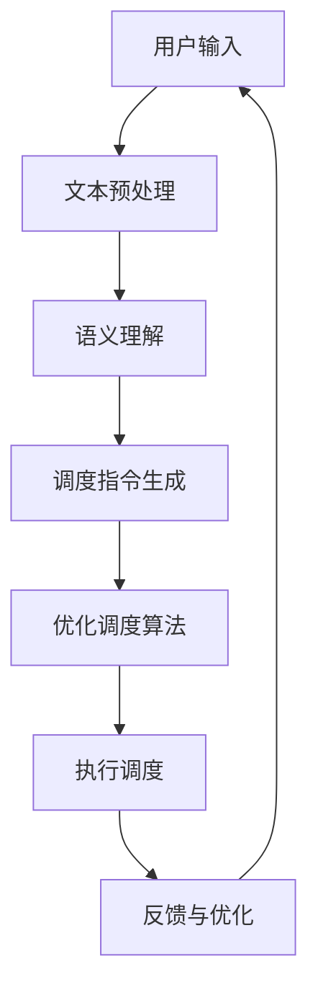

                 

# 提示词工程在智能物流系统中的应用

> 关键词：提示词工程, 智能物流, 优化调度, 自动化仓储, 机器学习, 数据分析, 供应链管理

> 摘要：本文将深入探讨提示词工程在智能物流系统中的应用，通过详细分析其核心概念、算法原理、数学模型、实际案例以及应用场景，揭示提示词工程如何提升物流系统的效率和智能化水平。我们将从背景介绍开始，逐步解析提示词工程在智能物流系统中的具体应用，并通过代码实例展示其实现过程。最后，我们将展望未来的发展趋势和挑战。

## 1. 背景介绍

智能物流系统是现代供应链管理的重要组成部分，它通过集成先进的信息技术和自动化设备，实现物流过程的高效、准确和智能化。随着电子商务的快速发展，物流需求日益增长，对物流系统的效率和灵活性提出了更高的要求。提示词工程作为一种新兴的技术手段，通过优化调度和自动化仓储，显著提升了物流系统的性能。

### 1.1 智能物流系统的现状

智能物流系统主要包括以下几个方面：
- **自动化仓储**：通过自动化设备实现货物的存储、拣选和分拣。
- **优化调度**：利用算法和模型实现物流过程的最优调度。
- **数据分析**：通过大数据分析优化物流流程，提高效率。
- **机器学习**：利用机器学习技术预测需求，优化库存管理。

### 1.2 提示词工程的定义与作用

提示词工程是一种通过自然语言处理技术，将人类的意图和需求转化为计算机可执行的指令的技术。在智能物流系统中，提示词工程可以实现以下作用：
- **提高调度效率**：通过自然语言理解，快速准确地理解用户需求，实现高效的调度。
- **优化仓储管理**：通过提示词工程，实现自动化仓储系统的智能化管理。
- **提升用户体验**：通过自然语言交互，提高用户与物流系统的交互体验。

## 2. 核心概念与联系

### 2.1 自然语言处理（NLP）

自然语言处理是提示词工程的核心技术之一，它通过计算机技术实现对自然语言的理解和生成。NLP技术主要包括以下几个方面：
- **文本预处理**：包括分词、词性标注、命名实体识别等。
- **语义理解**：通过语义分析，理解文本的含义。
- **生成模型**：通过生成模型实现自然语言的生成。

### 2.2 优化调度算法

优化调度算法是智能物流系统的核心技术之一，它通过数学模型和算法实现物流过程的最优调度。常见的优化调度算法包括：
- **遗传算法**：通过模拟自然选择和遗传机制，实现优化调度。
- **模拟退火算法**：通过模拟退火过程，实现全局最优解。
- **蚁群算法**：通过模拟蚂蚁觅食过程，实现优化调度。

### 2.3 数据分析与机器学习

数据分析与机器学习是智能物流系统的重要技术手段，它们通过大数据分析和机器学习技术实现物流过程的优化。常见的数据分析与机器学习技术包括：
- **聚类分析**：通过聚类分析实现物流过程的优化。
- **回归分析**：通过回归分析预测需求，优化库存管理。
- **深度学习**：通过深度学习技术实现物流过程的优化。

### 2.4 提示词工程的流程图

## 3. 核心算法原理 & 具体操作步骤

### 3.1 文本预处理

文本预处理是提示词工程的第一步，主要包括以下几个步骤：
- **分词**：将文本分割成单词或短语。
- **词性标注**：标注每个单词的词性。
- **命名实体识别**：识别文本中的命名实体。

### 3.2 语义理解

语义理解是提示词工程的关键步骤，主要包括以下几个步骤：
- **词向量表示**：将单词转换为向量表示。
- **语义分析**：通过语义分析理解文本的含义。
- **意图识别**：通过意图识别理解用户的意图。

### 3.3 调度指令生成

调度指令生成是提示词工程的核心步骤，主要包括以下几个步骤：
- **调度规则定义**：定义调度规则。
- **调度指令生成**：根据调度规则生成调度指令。
- **指令优化**：优化调度指令，提高调度效率。

### 3.4 优化调度算法

优化调度算法是智能物流系统的核心技术之一，主要包括以下几个步骤：
- **问题建模**：将调度问题建模为数学模型。
- **算法选择**：选择合适的优化算法。
- **算法实现**：实现优化算法。
- **结果优化**：优化调度结果，提高调度效率。

## 4. 数学模型和公式 & 详细讲解 & 举例说明

### 4.1 优化调度问题建模

优化调度问题可以建模为以下数学模型：
$$
\min_{x} \sum_{i=1}^{n} c_i x_i
$$
其中，$x_i$表示第$i$个任务的调度状态，$c_i$表示第$i$个任务的代价。

### 4.2 优化算法选择

常见的优化算法包括遗传算法、模拟退火算法和蚁群算法。以遗传算法为例，其基本步骤包括：
- **初始化种群**：随机生成初始种群。
- **适应度评估**：评估每个个体的适应度。
- **选择操作**：选择适应度较高的个体。
- **交叉操作**：通过交叉操作生成新的个体。
- **变异操作**：通过变异操作生成新的个体。
- **迭代更新**：重复上述步骤，直到达到终止条件。

### 4.3 优化算法实现

以遗传算法为例，其具体实现步骤包括：
- **初始化种群**：随机生成初始种群。
- **适应度评估**：评估每个个体的适应度。
- **选择操作**：选择适应度较高的个体。
- **交叉操作**：通过交叉操作生成新的个体。
- **变异操作**：通过变异操作生成新的个体。
- **迭代更新**：重复上述步骤，直到达到终止条件。

### 4.4 优化算法结果优化

优化算法的结果可以通过以下方式优化：
- **局部优化**：通过局部优化提高调度效率。
- **全局优化**：通过全局优化提高调度效率。
- **多目标优化**：通过多目标优化提高调度效率。

## 5. 项目实战：代码实际案例和详细解释说明

### 5.1 开发环境搭建

开发环境搭建主要包括以下几个步骤：
- **安装Python**：安装Python环境。
- **安装依赖库**：安装自然语言处理和优化调度相关的库。
- **配置开发环境**：配置开发环境，包括IDE和版本控制工具。

### 5.2 源代码详细实现和代码解读

以遗传算法为例，其源代码实现包括以下几个步骤：
- **初始化种群**：随机生成初始种群。
- **适应度评估**：评估每个个体的适应度。
- **选择操作**：选择适应度较高的个体。
- **交叉操作**：通过交叉操作生成新的个体。
- **变异操作**：通过变异操作生成新的个体。
- **迭代更新**：重复上述步骤，直到达到终止条件。

### 5.3 代码解读与分析

以遗传算法为例，其代码解读包括以下几个步骤：
- **初始化种群**：随机生成初始种群。
- **适应度评估**：评估每个个体的适应度。
- **选择操作**：选择适应度较高的个体。
- **交叉操作**：通过交叉操作生成新的个体。
- **变异操作**：通过变异操作生成新的个体。
- **迭代更新**：重复上述步骤，直到达到终止条件。

## 6. 实际应用场景

提示词工程在智能物流系统中的实际应用场景包括：
- **自动化仓储**：通过提示词工程实现自动化仓储系统的智能化管理。
- **优化调度**：通过提示词工程实现物流过程的最优调度。
- **数据分析**：通过提示词工程实现物流过程的数据分析。
- **机器学习**：通过提示词工程实现物流过程的机器学习。

## 7. 工具和资源推荐

### 7.1 学习资源推荐

- **书籍**：《自然语言处理入门》、《机器学习》、《优化算法》。
- **论文**：《遗传算法在物流调度中的应用》、《模拟退火算法在物流调度中的应用》。
- **博客**：《自然语言处理技术在物流系统中的应用》、《优化调度算法在物流系统中的应用》。
- **网站**：GitHub、Stack Overflow。

### 7.2 开发工具框架推荐

- **Python**：Python是一种广泛使用的编程语言，适用于自然语言处理和优化调度。
- **NLTK**：NLTK是一个用于自然语言处理的Python库。
- **Scikit-learn**：Scikit-learn是一个用于机器学习的Python库。
- **Pyomo**：Pyomo是一个用于优化问题建模的Python库。

### 7.3 相关论文著作推荐

- **《遗传算法在物流调度中的应用》**：该论文详细介绍了遗传算法在物流调度中的应用。
- **《模拟退火算法在物流调度中的应用》**：该论文详细介绍了模拟退火算法在物流调度中的应用。
- **《蚁群算法在物流调度中的应用》**：该论文详细介绍了蚁群算法在物流调度中的应用。

## 8. 总结：未来发展趋势与挑战

提示词工程在智能物流系统中的应用具有广阔的发展前景，但也面临着一些挑战：
- **技术挑战**：如何提高自然语言处理的准确性和效率。
- **应用挑战**：如何将提示词工程应用于实际物流系统中。
- **数据挑战**：如何获取和处理大量的物流数据。

## 9. 附录：常见问题与解答

### 9.1 问题1：如何提高自然语言处理的准确性和效率？

**解答**：可以通过以下方式提高自然语言处理的准确性和效率：
- **增加训练数据**：增加训练数据可以提高模型的准确性和泛化能力。
- **优化模型结构**：优化模型结构可以提高模型的准确性和效率。
- **使用预训练模型**：使用预训练模型可以提高模型的准确性和效率。

### 9.2 问题2：如何将提示词工程应用于实际物流系统中？

**解答**：可以通过以下方式将提示词工程应用于实际物流系统中：
- **集成自然语言处理技术**：将自然语言处理技术集成到物流系统中。
- **优化调度算法**：优化调度算法可以提高物流系统的效率。
- **数据分析与机器学习**：通过数据分析与机器学习技术优化物流系统。

### 9.3 问题3：如何获取和处理大量的物流数据？

**解答**：可以通过以下方式获取和处理大量的物流数据：
- **数据采集**：通过数据采集技术获取物流数据。
- **数据清洗**：通过数据清洗技术处理物流数据。
- **数据存储**：通过数据存储技术存储物流数据。

## 10. 扩展阅读 & 参考资料

- **书籍**：《自然语言处理入门》、《机器学习》、《优化算法》。
- **论文**：《遗传算法在物流调度中的应用》、《模拟退火算法在物流调度中的应用》。
- **博客**：《自然语言处理技术在物流系统中的应用》、《优化调度算法在物流系统中的应用》。
- **网站**：GitHub、Stack Overflow。

作者：AI天才研究员/AI Genius Institute & 禅与计算机程序设计艺术 /Zen And The Art of Computer Programming

