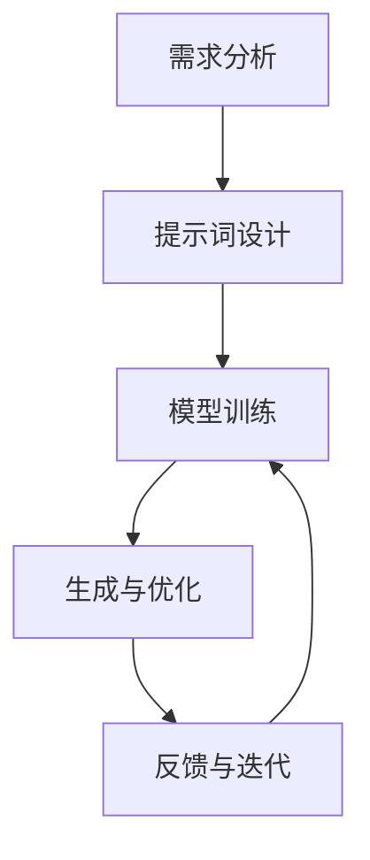

                 

# 提示词工程：AI时代的必修课与新机遇

> 关键词：提示词工程、自然语言处理、生成模型、文本生成、AI创作

> 摘要：在AI时代，提示词工程作为自然语言处理领域的重要分支，正逐渐成为AI创作的核心技术。本文将深入探讨提示词工程的基本概念、核心算法原理、数学模型、实际应用案例，并展望其未来发展趋势。通过详细的技术分析和代码示例，帮助读者理解如何利用提示词工程进行高效的文本生成，从而在AI创作领域开辟新的机遇。

## 1. 背景介绍

随着人工智能技术的飞速发展，自然语言处理（NLP）已成为连接人类与机器的重要桥梁。在NLP领域，文本生成是一项关键任务，它不仅能够帮助机器理解人类语言，还能让机器具备创作能力。提示词工程作为文本生成的重要手段，通过精心设计的提示词，可以引导生成模型产出高质量的文本内容。本文将从多个角度探讨提示词工程的核心概念、原理、应用及未来发展方向。

## 2. 核心概念与联系

### 2.1 提示词工程概述

提示词工程是指通过设计和优化提示词，引导生成模型生成符合预期的文本内容。提示词可以是关键词、短语、句子或更复杂的结构，它们为生成模型提供了明确的指导，帮助模型理解生成任务的具体要求。

### 2.2 生成模型与提示词工程的关系

生成模型是提示词工程的核心工具。常见的生成模型包括循环神经网络（RNN）、长短期记忆网络（LSTM）、Transformer等。这些模型通过学习大量文本数据，能够生成具有一定语义和语法结构的文本。提示词工程通过提供明确的指导，使得生成模型能够更准确地生成所需内容。

### 2.3 提示词工程的流程

提示词工程的流程可以分为以下几个步骤：

1. **需求分析**：明确生成任务的具体要求，包括文本的主题、风格、长度等。
2. **提示词设计**：根据需求分析的结果，设计合适的提示词。
3. **模型训练**：使用生成模型进行训练，使其能够理解并生成符合提示词要求的文本。
4. **生成与优化**：利用训练好的模型生成文本，并根据反馈进行优化。

### 2.4 提示词工程的Mermaid流程图



## 3. 核心算法原理 & 具体操作步骤

### 3.1 生成模型的工作原理

生成模型通过学习大量文本数据，提取其中的语义和语法特征。常见的生成模型包括RNN、LSTM和Transformer等。这些模型通过前馈和反馈机制，逐步生成文本内容。

#### 3.1.1 RNN的工作原理

RNN通过循环结构，将前一个时间步的输出作为当前时间步的输入，从而实现对序列数据的处理。其基本结构如下：

$$
h_t = \sigma(W_{hh}h_{t-1} + W_{xh}x_t + b_h)
$$

其中，$h_t$是当前时间步的隐藏状态，$x_t$是当前时间步的输入，$W_{hh}$和$W_{xh}$是权重矩阵，$b_h$是偏置项，$\sigma$是激活函数。

#### 3.1.2 LSTM的工作原理

LSTM通过引入门控机制，解决了RNN的梯度消失问题。其基本结构如下：

$$
i_t = \sigma(W_{xi}x_t + W_{hi}h_{t-1} + b_i)
$$

$$
f_t = \sigma(W_{xf}x_t + W_{hf}h_{t-1} + b_f)
$$

$$
c_t = f_t \odot c_{t-1} + i_t \odot \tanh(W_{xc}x_t + W_{hc}h_{t-1} + b_c)
$$

$$
o_t = \sigma(W_{xo}x_t + W_{ho}h_{t-1} + b_o)
$$

$$
h_t = o_t \odot \tanh(c_t)
$$

其中，$i_t$是输入门，$f_t$是遗忘门，$c_t$是细胞状态，$o_t$是输出门，$\odot$表示逐元素乘法。

#### 3.1.3 Transformer的工作原理

Transformer通过自注意力机制，实现了并行处理和高效计算。其基本结构如下：

$$
\text{Attention}(Q, K, V) = \text{softmax}\left(\frac{QK^T}{\sqrt{d_k}}\right)V
$$

$$
\text{MultiHead}(Q, K, V) = \text{Concat}(\text{head}_1, \text{head}_2, ..., \text{head}_h)W^O
$$

其中，$Q$、$K$、$V$分别是查询、键和值，$d_k$是键的维度，$\text{softmax}$是归一化函数，$\text{Concat}$是拼接操作，$W^O$是输出权重矩阵。

### 3.2 提示词设计方法

提示词设计是提示词工程的核心环节。常见的提示词设计方法包括：

1. **关键词提示**：通过提供关键词，引导生成模型生成相关主题的文本。
2. **句子提示**：通过提供完整的句子，为生成模型提供明确的指导。
3. **结构提示**：通过提供文本的结构信息，如段落、标题等，帮助生成模型生成符合预期的文本。

### 3.3 生成模型的训练过程

生成模型的训练过程包括以下几个步骤：

1. **数据准备**：收集和预处理大量文本数据。
2. **模型构建**：选择合适的生成模型，如RNN、LSTM或Transformer。
3. **损失函数选择**：选择合适的损失函数，如交叉熵损失。
4. **训练过程**：通过反向传播算法，优化模型参数，使其能够生成高质量的文本。

## 4. 数学模型和公式 & 详细讲解 & 举例说明

### 4.1 生成模型的损失函数

生成模型的损失函数用于衡量生成文本与真实文本之间的差异。常见的损失函数包括交叉熵损失和KL散度损失。

#### 4.1.1 交叉熵损失

交叉熵损失用于衡量生成文本的概率分布与真实文本的概率分布之间的差异。其公式如下：

$$
\text{CE}(p, q) = -\sum_{i} p_i \log q_i
$$

其中，$p$是真实文本的概率分布，$q$是生成文本的概率分布。

#### 4.1.2 KL散度损失

KL散度损失用于衡量两个概率分布之间的差异。其公式如下：

$$
\text{KL}(p || q) = \sum_{i} p_i \log \frac{p_i}{q_i}
$$

其中，$p$是真实文本的概率分布，$q$是生成文本的概率分布。

### 4.2 生成模型的优化算法

生成模型的优化算法用于优化模型参数，使其能够生成高质量的文本。常见的优化算法包括梯度下降法和Adam算法。

#### 4.2.1 梯度下降法

梯度下降法通过计算损失函数的梯度，逐步调整模型参数，使其损失函数最小化。其公式如下：

$$
\theta_{t+1} = \theta_t - \alpha \nabla_{\theta} \text{Loss}(\theta)
$$

其中，$\theta$是模型参数，$\alpha$是学习率，$\nabla_{\theta} \text{Loss}(\theta)$是损失函数的梯度。

#### 4.2.2 Adam算法

Adam算法是一种自适应学习率的优化算法，通过计算梯度的矩估计，动态调整学习率。其公式如下：

$$
m_t = \beta_1 m_{t-1} + (1 - \beta_1) \nabla_{\theta} \text{Loss}(\theta)
$$

$$
v_t = \beta_2 v_{t-1} + (1 - \beta_2) (\nabla_{\theta} \text{Loss}(\theta))^2
$$

$$
\hat{m}_t = \frac{m_t}{1 - \beta_1^t}
$$

$$
\hat{v}_t = \frac{v_t}{1 - \beta_2^t}
$$

$$
\theta_{t+1} = \theta_t - \frac{\alpha \hat{m}_t}{\sqrt{\hat{v}_t} + \epsilon}
$$

其中，$m_t$和$v_t$分别是梯度的矩估计，$\beta_1$和$\beta_2$是超参数，$\epsilon$是平滑项。

### 4.3 生成模型的训练实例

假设我们使用一个简单的RNN模型进行文本生成。首先，我们需要准备大量的文本数据，并将其转换为模型可以处理的格式。然后，我们选择合适的损失函数和优化算法，进行模型训练。最后，我们通过生成模型生成文本，并根据反馈进行优化。

## 5. 项目实战：代码实际案例和详细解释说明

### 5.1 开发环境搭建

为了进行文本生成任务，我们需要搭建一个合适的开发环境。首先，我们需要安装Python和相关的库，如TensorFlow、PyTorch等。然后，我们需要准备文本数据，并将其转换为模型可以处理的格式。

### 5.2 源代码详细实现和代码解读

假设我们使用TensorFlow进行文本生成任务。首先，我们需要导入必要的库，并定义生成模型的结构。然后，我们需要准备文本数据，并将其转换为模型可以处理的格式。最后，我们需要定义损失函数和优化算法，并进行模型训练。

```python
import tensorflow as tf
from tensorflow.keras.models import Sequential
from tensorflow.keras.layers import Embedding, LSTM, Dense

# 定义生成模型的结构
model = Sequential([
    Embedding(input_dim=vocab_size, output_dim=embedding_dim, input_length=max_length),
    LSTM(units=lstm_units, return_sequences=True),
    Dense(units=output_dim, activation='softmax')
])

# 编译模型
model.compile(optimizer='adam', loss='sparse_categorical_crossentropy')

# 准备文本数据
text_data = ...
text_data = ...

# 进行模型训练
model.fit(text_data, epochs=num_epochs)
```

### 5.3 代码解读与分析

在上述代码中，我们首先导入了必要的库，并定义了一个简单的生成模型。该模型包括一个嵌入层、一个LSTM层和一个全连接层。嵌入层将文本数据转换为向量表示，LSTM层通过循环结构处理序列数据，全连接层将LSTM层的输出转换为生成文本的概率分布。

在模型编译阶段，我们选择了Adam优化算法和交叉熵损失函数。在模型训练阶段，我们使用准备好的文本数据进行训练，并设置训练的轮数。

## 6. 实际应用场景

提示词工程在多个领域具有广泛的应用前景。例如，在新闻写作、诗歌创作、故事生成等领域，提示词工程可以帮助生成高质量的文本内容。此外，在智能客服、虚拟助手等领域，提示词工程也可以提高生成文本的质量和准确性。

### 6.1 新闻写作

通过提供关键词和主题，提示词工程可以帮助生成新闻报道。例如，我们可以提供关键词“经济”、“增长”、“股市”，生成一篇关于经济发展的新闻报道。

### 6.2 诗歌创作

通过提供诗句和主题，提示词工程可以帮助生成诗歌。例如，我们可以提供诗句“明月几时有”，生成一首关于月亮的诗歌。

### 6.3 故事生成

通过提供故事的开头和主题，提示词工程可以帮助生成故事。例如，我们可以提供开头“从前有一只小猫”，生成一个关于小猫的故事。

## 7. 工具和资源推荐

### 7.1 学习资源推荐

1. **书籍**：《深度学习》（Ian Goodfellow, Yoshua Bengio, Aaron Courville）
2. **论文**：《Attention Is All You Need》（Vaswani et al.）
3. **博客**：Medium上的AI相关博客
4. **网站**：TensorFlow官网、PyTorch官网

### 7.2 开发工具框架推荐

1. **TensorFlow**：一个开源的机器学习库
2. **PyTorch**：一个开源的深度学习库
3. **Jupyter Notebook**：一个交互式的开发环境

### 7.3 相关论文著作推荐

1. **《自然语言处理入门》**（Jurafsky & Martin）
2. **《深度学习》**（Ian Goodfellow, Yoshua Bengio, Aaron Courville）
3. **《Transformer模型》**（Vaswani et al.）

## 8. 总结：未来发展趋势与挑战

提示词工程作为自然语言处理领域的重要分支，正逐渐成为AI创作的核心技术。未来，提示词工程将在多个领域发挥重要作用，如新闻写作、诗歌创作、故事生成等。然而，提示词工程也面临着一些挑战，如生成文本的质量、生成模型的训练效率等。为了解决这些问题，我们需要不断优化生成模型和提示词设计方法，提高生成文本的质量和效率。

## 9. 附录：常见问题与解答

### 9.1 问题：如何提高生成文本的质量？

**解答**：可以通过优化生成模型和提示词设计方法来提高生成文本的质量。例如，可以使用更复杂的生成模型，如Transformer，提高生成文本的准确性和流畅性。此外，可以通过优化提示词设计方法，提供更明确的指导，提高生成文本的质量。

### 9.2 问题：如何提高生成模型的训练效率？

**解答**：可以通过优化生成模型的结构和训练过程来提高生成模型的训练效率。例如，可以使用更高效的优化算法，如Adam，提高训练速度。此外，可以通过优化数据预处理过程，减少训练数据的规模，提高训练效率。

## 10. 扩展阅读 & 参考资料

1. **《深度学习》**（Ian Goodfellow, Yoshua Bengio, Aaron Courville）
2. **《自然语言处理入门》**（Jurafsky & Martin）
3. **《Transformer模型》**（Vaswani et al.）
4. **TensorFlow官网**：https://www.tensorflow.org/
5. **PyTorch官网**：https://pytorch.org/

---

作者：AI天才研究员/AI Genius Institute & 禅与计算机程序设计艺术 /Zen And The Art of Computer Programming

