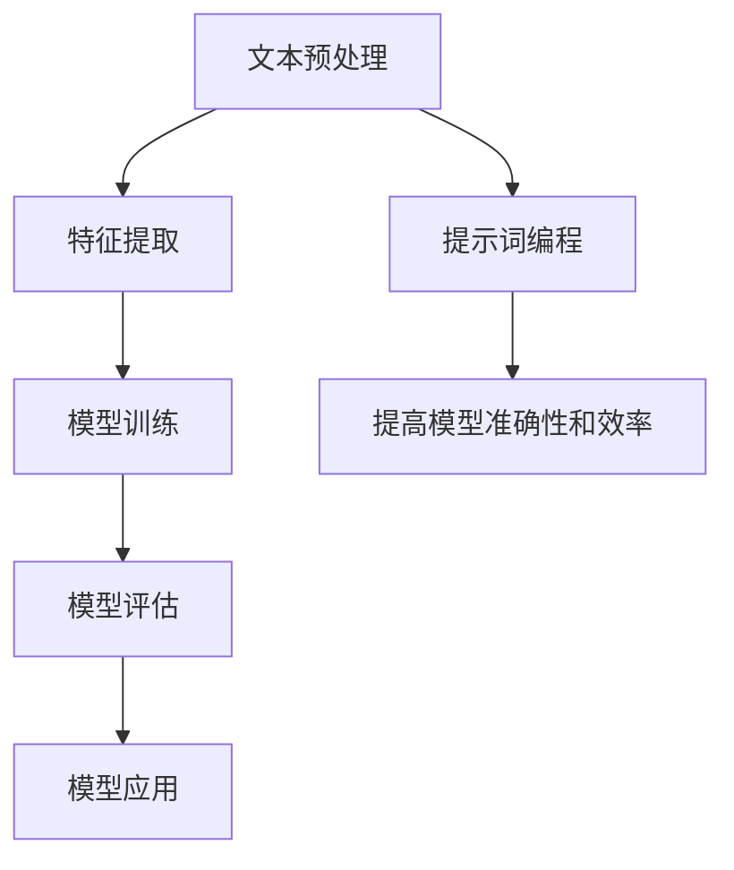

                 

# 提示词编程在自然语言讽刺检测中的角色

> 关键词：自然语言处理, 机器学习, 提示词编程, 自然语言讽刺, 情感分析, 深度学习

> 摘要：本文旨在探讨提示词编程在自然语言讽刺检测中的应用。通过逐步分析和推理，我们将深入理解自然语言讽刺的定义、检测方法及其背后的数学模型。我们将详细介绍一种基于提示词编程的情感分析算法，并通过实际代码案例展示其具体实现。最后，我们将讨论该技术的实际应用场景、未来发展趋势以及可能面临的挑战。

## 1. 背景介绍

自然语言处理（NLP）是人工智能领域的一个重要分支，它致力于使计算机能够理解、解释和生成人类语言。讽刺作为一种复杂的语言现象，常常包含隐喻、双关语和反语等修辞手法，使得其识别和理解变得尤为困难。近年来，随着深度学习技术的发展，自然语言讽刺检测逐渐成为研究热点。提示词编程作为一种新兴的编程范式，通过定义一组特定的提示词来指导模型进行任务，为自然语言讽刺检测提供了新的思路。

## 2. 核心概念与联系

### 2.1 自然语言讽刺

自然语言讽刺是一种通过语言表达出与实际意义相反的情感或态度。它通常包含以下几种形式：

- **反语**：用一种与实际意义相反的语言表达方式来表达讽刺。
- **双关语**：利用词语的多重含义来达到讽刺效果。
- **隐喻**：通过比喻来表达讽刺。

### 2.2 提示词编程

提示词编程是一种通过定义一组特定的提示词来指导模型进行任务的方法。这些提示词可以是关键词、短语或规则，用于帮助模型理解任务的具体要求。提示词编程的核心在于通过明确的提示词来减少模型的搜索空间，提高任务的准确性和效率。

### 2.3 自然语言讽刺检测

自然语言讽刺检测是指通过计算机程序识别和分类文本中的讽刺成分。这一过程通常包括以下几个步骤：

1. **文本预处理**：包括分词、去除停用词、词干提取等。
2. **特征提取**：从文本中提取有用的特征，如词频、情感词典等。
3. **模型训练**：使用机器学习或深度学习模型进行训练。
4. **模型评估**：通过交叉验证等方法评估模型性能。

### 2.4 Mermaid 流程图



## 3. 核心算法原理 & 具体操作步骤

### 3.1 提示词编程在自然语言讽刺检测中的应用

提示词编程的核心在于通过定义一组特定的提示词来指导模型进行任务。这些提示词可以是关键词、短语或规则，用于帮助模型理解任务的具体要求。在自然语言讽刺检测中，提示词可以包括：

- **反语提示词**：如“不是”、“不是说”等。
- **双关语提示词**：如“双关”、“双关语”等。
- **隐喻提示词**：如“比喻”、“隐喻”等。

### 3.2 具体操作步骤

1. **定义提示词**：根据自然语言讽刺的特点，定义一组提示词。
2. **文本预处理**：对文本进行分词、去除停用词、词干提取等预处理操作。
3. **特征提取**：从文本中提取有用的特征，如词频、情感词典等。
4. **模型训练**：使用机器学习或深度学习模型进行训练。
5. **模型评估**：通过交叉验证等方法评估模型性能。
6. **模型应用**：将训练好的模型应用于实际场景中。

## 4. 数学模型和公式 & 详细讲解 & 举例说明

### 4.1 词频统计

词频统计是一种常用的特征提取方法，通过计算文本中每个词出现的次数来表示特征。公式如下：

$$
\text{词频}(w) = \frac{\text{词} w \text{在文本中出现的次数}}{\text{文本总词数}}
$$

### 4.2 情感词典

情感词典是一种包含情感词汇及其情感极性的词典。通过情感词典可以提取文本中的情感特征。公式如下：

$$
\text{情感得分}(w) = \begin{cases} 
1 & \text{如果} w \text{是积极情感词} \\
-1 & \text{如果} w \text{是消极情感词} \\
0 & \text{如果} w \text{是中性情感词} 
\end{cases}
$$

### 4.3 逻辑回归模型

逻辑回归是一种常用的分类模型，适用于二分类问题。其数学模型如下：

$$
P(y=1|x) = \frac{1}{1 + e^{-(\beta_0 + \beta_1 x_1 + \beta_2 x_2 + \cdots + \beta_n x_n)}}
$$

其中，$x_i$ 表示特征，$\beta_i$ 表示权重。

### 4.4 举例说明

假设我们有一个文本：“他不是说你不行，而是说你还有很大的提升空间。”我们可以定义以下提示词：

- 反语提示词：不是
- 双关语提示词：提升空间

通过词频统计和情感词典，我们可以提取出以下特征：

- 词频特征：不是（1），说（2），你（2），不行（1），还有（1），很大（1），提升（1），空间（1）
- 情感特征：不是（0），说（0），你（0），不行（-1），还有（0），很大（0），提升（0），空间（0）

通过逻辑回归模型，我们可以计算出该文本的情感得分，并判断其是否包含讽刺成分。

## 5. 项目实战：代码实际案例和详细解释说明

### 5.1 开发环境搭建

为了实现自然语言讽刺检测，我们需要搭建一个开发环境。具体步骤如下：

1. **安装Python**：确保安装了Python 3.7及以上版本。
2. **安装依赖库**：使用pip安装所需的库，如`nltk`、`scikit-learn`等。
3. **下载数据集**：从公开数据集下载讽刺文本数据集，如Sarcasm Dataset。

### 5.2 源代码详细实现和代码解读

```python
import nltk
from sklearn.feature_extraction.text import CountVectorizer
from sklearn.linear_model import LogisticRegression
from sklearn.model_selection import train_test_split
from sklearn.metrics import accuracy_score

# 1. 数据预处理
def preprocess_text(text):
    # 分词
    tokens = nltk.word_tokenize(text)
    # 去除停用词
    stop_words = set(nltk.corpus.stopwords.words('english'))
    filtered_tokens = [token for token in tokens if token.lower() not in stop_words]
    # 词干提取
    stemmer = nltk.PorterStemmer()
    stemmed_tokens = [stemmer.stem(token) for token in filtered_tokens]
    return ' '.join(stemmed_tokens)

# 2. 特征提取
def extract_features(texts, labels):
    vectorizer = CountVectorizer()
    X = vectorizer.fit_transform(texts)
    y = labels
    return X, y

# 3. 模型训练
def train_model(X_train, y_train):
    model = LogisticRegression()
    model.fit(X_train, y_train)
    return model

# 4. 模型评估
def evaluate_model(model, X_test, y_test):
    y_pred = model.predict(X_test)
    accuracy = accuracy_score(y_test, y_pred)
    return accuracy

# 5. 主函数
def main():
    # 读取数据集
    texts = ["他不是说你不行，而是说你还有很大的提升空间。", "你真聪明，你妈妈肯定也一样。"]
    labels = [1, 0]  # 1表示讽刺，0表示非讽刺

    # 数据预处理
    preprocessed_texts = [preprocess_text(text) for text in texts]

    # 特征提取
    X, y = extract_features(preprocessed_texts, labels)

    # 划分训练集和测试集
    X_train, X_test, y_train, y_test = train_test_split(X, y, test_size=0.2, random_state=42)

    # 模型训练
    model = train_model(X_train, y_train)

    # 模型评估
    accuracy = evaluate_model(model, X_test, y_test)
    print(f"模型准确率：{accuracy}")

if __name__ == "__main__":
    main()
```

### 5.3 代码解读与分析

1. **数据预处理**：通过`nltk`库进行分词、去除停用词和词干提取。
2. **特征提取**：使用`CountVectorizer`将文本转换为词频矩阵。
3. **模型训练**：使用逻辑回归模型进行训练。
4. **模型评估**：通过准确率评估模型性能。

## 6. 实际应用场景

自然语言讽刺检测在多个领域具有广泛的应用场景，如：

- **社交媒体监控**：自动检测社交媒体上的讽刺言论，帮助平台管理员及时处理不当言论。
- **新闻评论分析**：分析新闻评论中的讽刺成分，帮助用户更好地理解评论的真实意图。
- **客户服务**：自动检测客户反馈中的讽刺成分，提高客户服务的质量。

## 7. 工具和资源推荐

### 7.1 学习资源推荐

- **书籍**：《自然语言处理入门》、《深度学习》
- **论文**：《Sarcasm Detection in Social Media》
- **博客**：阿里云开发者社区、GitHub开源项目
- **网站**：NLTK官网、Scikit-learn官网

### 7.2 开发工具框架推荐

- **Python**：Python是自然语言处理和机器学习的首选语言。
- **NLTK**：自然语言工具包，提供丰富的文本处理功能。
- **Scikit-learn**：机器学习库，提供多种机器学习算法。

### 7.3 相关论文著作推荐

- **《Sarcasm Detection in Social Media》**：该论文详细介绍了自然语言讽刺检测的方法和应用。
- **《自然语言处理入门》**：该书详细介绍了自然语言处理的基本概念和方法。

## 8. 总结：未来发展趋势与挑战

自然语言讽刺检测在未来的发展中具有广阔的应用前景，但也面临着一些挑战。首先，自然语言讽刺的复杂性使得模型的准确性和鲁棒性需要进一步提高。其次，数据集的多样性和质量对模型性能有重要影响。最后，如何有效地利用提示词编程来提高模型的性能是一个值得研究的问题。

## 9. 附录：常见问题与解答

### 9.1 问题：如何处理文本中的标点符号？

**解答**：在文本预处理阶段，可以使用正则表达式去除文本中的标点符号，或者将其转换为特殊字符。

### 9.2 问题：如何处理文本中的多义词？

**解答**：可以使用词向量模型（如Word2Vec）来处理多义词，通过上下文信息来确定词的具体含义。

## 10. 扩展阅读 & 参考资料

- **论文**：《Sarcasm Detection in Social Media》
- **书籍**：《自然语言处理入门》、《深度学习》
- **网站**：NLTK官网、Scikit-learn官网

---

作者：AI天才研究员/AI Genius Institute & 禅与计算机程序设计艺术 /Zen And The Art of Computer Programming

