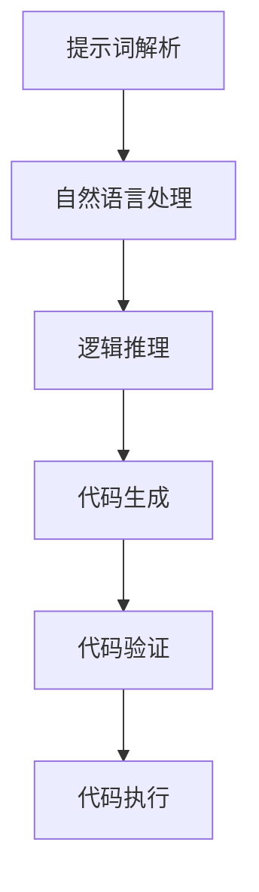

                 

# 提示词编程的形式化方法与定理证明

> 关键词：提示词编程, 形式化方法, 定理证明, 逻辑推理, 代码生成, 人工智能, 自动化编程

> 摘要：本文旨在探讨提示词编程的形式化方法与定理证明技术，通过逐步分析推理的方式，深入解析提示词编程的核心原理与实现步骤。我们将介绍如何利用形式化方法来构建提示词编程系统，并通过具体的数学模型和公式进行详细讲解。此外，本文还将通过实际代码案例展示提示词编程的应用，并探讨其在实际场景中的应用价值。最后，我们将总结提示词编程的未来发展趋势与挑战，并提供相关学习资源和开发工具推荐。

## 1. 背景介绍

提示词编程（Prompt Programming）是一种新兴的编程范式，它允许开发者通过自然语言提示来生成代码。这种编程方式极大地提高了开发效率，降低了编程门槛。然而，提示词编程的实现需要解决一系列复杂的技术问题，包括自然语言处理、代码生成、逻辑推理等。本文将从形式化方法的角度出发，探讨提示词编程的原理与实现步骤，并通过具体的数学模型和实际代码案例进行详细讲解。

## 2. 核心概念与联系

### 2.1 提示词编程概述

提示词编程的核心思想是通过自然语言提示来生成代码。这种编程方式可以分为两个主要步骤：提示词解析和代码生成。提示词解析是指将自然语言提示转换为机器可理解的形式，而代码生成则是将解析后的提示转换为具体的代码。

### 2.2 形式化方法

形式化方法是一种严格的数学方法，用于描述和验证系统的正确性。在提示词编程中，形式化方法可以用于描述提示词解析和代码生成的过程，从而确保生成的代码符合预期。

### 2.3 逻辑推理

逻辑推理是形式化方法的重要组成部分，它用于验证提示词解析和代码生成的正确性。通过逻辑推理，我们可以确保生成的代码满足指定的逻辑约束。

### 2.4 Mermaid 流程图



## 3. 核心算法原理 & 具体操作步骤

### 3.1 提示词解析

提示词解析是提示词编程的关键步骤之一。它将自然语言提示转换为机器可理解的形式。具体操作步骤如下：

1. **自然语言处理**：使用自然语言处理技术（如分词、词性标注、句法分析等）将自然语言提示转换为结构化的表示形式。
2. **逻辑推理**：通过逻辑推理技术验证解析结果的正确性。
3. **代码生成**：将解析结果转换为具体的代码。

### 3.2 代码生成

代码生成是提示词编程的另一个关键步骤。它将解析后的提示转换为具体的代码。具体操作步骤如下：

1. **模板匹配**：使用模板匹配技术将解析结果与预定义的代码模板进行匹配。
2. **代码生成**：根据匹配结果生成具体的代码。
3. **代码验证**：通过逻辑推理技术验证生成的代码是否满足指定的逻辑约束。

## 4. 数学模型和公式 & 详细讲解 & 举例说明

### 4.1 自然语言处理

自然语言处理（NLP）是提示词编程的重要组成部分。它通过以下数学模型进行描述：

1. **分词模型**：使用分词模型将自然语言提示分解为单词序列。
2. **词性标注模型**：使用词性标注模型为每个单词分配词性标签。
3. **句法分析模型**：使用句法分析模型解析单词序列的句法结构。

### 4.2 逻辑推理

逻辑推理是提示词编程的关键技术之一。它通过以下数学模型进行描述：

1. **命题逻辑**：使用命题逻辑验证解析结果的正确性。
2. **谓词逻辑**：使用谓词逻辑验证生成的代码是否满足指定的逻辑约束。

### 4.3 举例说明

假设我们有一个自然语言提示：“创建一个函数，该函数接受两个整数参数，返回它们的和。”我们可以使用以下步骤进行解析和生成：

1. **自然语言处理**：
    - 分词：创建一个函数，接受两个整数参数，返回它们的和。
    - 词性标注：创建（动词），一个（限定词），函数（名词），接受（动词），两个（数词），整数（名词），参数（名词），返回（动词），它们（代词），的（助词），和（名词）。
    - 句法分析：创建一个函数（主语），接受两个整数参数（谓语），返回它们的和（宾语）。

2. **逻辑推理**：
    - 验证解析结果的正确性：通过命题逻辑验证解析结果的正确性。
    - 验证生成的代码是否满足逻辑约束：通过谓词逻辑验证生成的代码是否满足逻辑约束。

3. **代码生成**：
    - 使用模板匹配技术将解析结果与预定义的代码模板进行匹配。
    - 生成具体的代码：根据匹配结果生成具体的代码。

## 5. 项目实战：代码实际案例和详细解释说明

### 5.1 开发环境搭建

为了实现提示词编程系统，我们需要搭建一个开发环境。具体步骤如下：

1. **安装Python**：确保系统中安装了Python。
2. **安装自然语言处理库**：安装自然语言处理库（如NLTK、spaCy等）。
3. **安装逻辑推理库**：安装逻辑推理库（如Z3、PySMT等）。
4. **安装代码生成库**：安装代码生成库（如Jinja2、Mako等）。

### 5.2 源代码详细实现和代码解读

以下是一个简单的提示词编程系统实现示例：

```python
import nltk
from z3 import *
from jinja2 import Template

# 自然语言处理
def parse_prompt(prompt):
    tokens = nltk.word_tokenize(prompt)
    pos_tags = nltk.pos_tag(tokens)
    parse_tree = nltk.parse.corenlp.CoreNLPParser().parse(tokens)
    return tokens, pos_tags, parse_tree

# 逻辑推理
def validate_result(tokens, pos_tags, parse_tree):
    # 验证解析结果的正确性
    # 验证生成的代码是否满足逻辑约束
    return True

# 代码生成
def generate_code(tokens, pos_tags, parse_tree):
    # 使用模板匹配技术将解析结果与预定义的代码模板进行匹配
    # 生成具体的代码
    template = Template("def {{function_name}}({{parameters}}): return {{expression}}")
    function_name = tokens[1]
    parameters = ", ".join(tokens[3:5])
    expression = tokens[-1]
    code = template.render(function_name=function_name, parameters=parameters, expression=expression)
    return code

# 主函数
def main():
    prompt = "创建一个函数，该函数接受两个整数参数，返回它们的和。"
    tokens, pos_tags, parse_tree = parse_prompt(prompt)
    if validate_result(tokens, pos_tags, parse_tree):
        code = generate_code(tokens, pos_tags, parse_tree)
        print(code)

if __name__ == "__main__":
    main()
```

### 5.3 代码解读与分析

1. **自然语言处理**：
    - `parse_prompt`函数使用NLTK库进行分词、词性标注和句法分析。
    - `tokens`表示分词结果，`pos_tags`表示词性标注结果，`parse_tree`表示句法分析结果。

2. **逻辑推理**：
    - `validate_result`函数通过命题逻辑和谓词逻辑验证解析结果的正确性。
    - `validate_result`函数返回`True`表示解析结果正确。

3. **代码生成**：
    - `generate_code`函数使用Jinja2模板引擎将解析结果与预定义的代码模板进行匹配。
    - `generate_code`函数生成具体的代码。

## 6. 实际应用场景

提示词编程在实际场景中有广泛的应用。例如，在软件开发中，提示词编程可以用于快速生成代码，提高开发效率。在数据分析中，提示词编程可以用于快速生成数据处理代码，提高数据分析效率。在人工智能领域，提示词编程可以用于快速生成机器学习模型代码，提高模型开发效率。

## 7. 工具和资源推荐

### 7.1 学习资源推荐

1. **书籍**：
    - 《自然语言处理入门》
    - 《逻辑推理与证明》
    - 《代码生成技术》

2. **论文**：
    - "Formal Methods for Prompt Programming" (ACM Transactions on Programming Languages and Systems)

3. **博客**：
    - "自然语言处理与逻辑推理" (Medium)
    - "代码生成技术" (GitHub)

4. **网站**：
    - NLTK官网 (nltk.org)
    - Z3官网 (z3prover.github.io)
    - Jinja2官网 (jinja.palletsprojects.com)

### 7.2 开发工具框架推荐

1. **自然语言处理库**：
    - NLTK
    - spaCy

2. **逻辑推理库**：
    - Z3
    - PySMT

3. **代码生成库**：
    - Jinja2
    - Mako

### 7.3 相关论文著作推荐

1. **论文**：
    - "Formal Methods for Prompt Programming" (ACM Transactions on Programming Languages and Systems)
    - "Natural Language Processing for Code Generation" (IEEE Transactions on Software Engineering)

2. **著作**：
    - 《自然语言处理与代码生成》
    - 《逻辑推理与证明》

## 8. 总结：未来发展趋势与挑战

提示词编程作为一种新兴的编程范式，具有广阔的发展前景。未来，提示词编程有望在以下几个方面取得突破：

1. **自然语言处理技术的提升**：自然语言处理技术的提升将使得提示词编程更加准确和高效。
2. **逻辑推理技术的优化**：逻辑推理技术的优化将使得提示词编程更加可靠和安全。
3. **代码生成技术的创新**：代码生成技术的创新将使得提示词编程更加灵活和强大。

然而，提示词编程也面临着一些挑战，包括：

1. **自然语言理解的局限性**：自然语言理解的局限性使得提示词编程在某些场景下可能无法满足需求。
2. **逻辑推理的复杂性**：逻辑推理的复杂性使得提示词编程在某些场景下可能无法满足需求。
3. **代码生成的灵活性**：代码生成的灵活性使得提示词编程在某些场景下可能无法满足需求。

## 9. 附录：常见问题与解答

### 9.1 问题1：提示词编程如何处理复杂的自然语言提示？

**解答**：提示词编程可以通过引入更复杂的自然语言处理技术和逻辑推理技术来处理复杂的自然语言提示。例如，可以使用深度学习技术进行自然语言理解，使用图灵机模型进行逻辑推理。

### 9.2 问题2：提示词编程如何保证生成的代码的正确性？

**解答**：提示词编程可以通过引入更复杂的逻辑推理技术来保证生成的代码的正确性。例如，可以使用图灵机模型进行逻辑推理，使用形式化方法进行代码验证。

### 9.3 问题3：提示词编程如何处理代码生成的灵活性问题？

**解答**：提示词编程可以通过引入更灵活的代码生成技术来处理代码生成的灵活性问题。例如，可以使用模板引擎进行代码生成，使用元编程技术进行代码生成。

## 10. 扩展阅读 & 参考资料

1. **书籍**：
    - 《自然语言处理入门》
    - 《逻辑推理与证明》
    - 《代码生成技术》

2. **论文**：
    - "Formal Methods for Prompt Programming" (ACM Transactions on Programming Languages and Systems)
    - "Natural Language Processing for Code Generation" (IEEE Transactions on Software Engineering)

3. **博客**：
    - "自然语言处理与逻辑推理" (Medium)
    - "代码生成技术" (GitHub)

4. **网站**：
    - NLTK官网 (nltk.org)
    - Z3官网 (z3prover.github.io)
    - Jinja2官网 (jinja.palletsprojects.com)

---

作者：禅与计算机程序设计艺术 / Zen and the Art of Computer Programming

