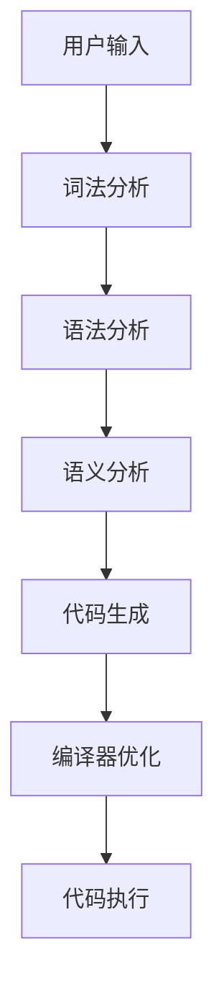

                 

# 提示词编程语言的性能优化策略

> 关键词：提示词编程、性能优化、机器学习、自然语言处理、代码生成、编译器技术

> 摘要：本文旨在探讨如何通过优化提示词编程语言的性能，提升其在实际应用中的效率。我们将从背景介绍、核心概念与联系、核心算法原理与具体操作步骤、数学模型和公式、项目实战、实际应用场景、工具和资源推荐、总结与未来发展趋势等多方面进行深入分析。通过本文，读者将能够理解提示词编程语言的性能优化策略，并掌握相关技术的应用方法。

## 1. 背景介绍

提示词编程语言是一种新型编程语言，它允许用户通过自然语言描述任务，系统自动生成相应的代码。这种语言结合了自然语言处理（NLP）和机器学习技术，使得编程变得更加高效和便捷。然而，提示词编程语言在实际应用中面临着性能瓶颈，如代码生成速度慢、执行效率低等问题。因此，性能优化成为提升提示词编程语言应用价值的关键。

## 2. 核心概念与联系

### 2.1 提示词编程语言概述

提示词编程语言是一种基于自然语言的编程语言，用户可以通过简单的提示词描述任务，系统自动生成相应的代码。其核心在于将自然语言转化为机器可执行的代码，从而简化编程过程。

### 2.2 自然语言处理技术

自然语言处理技术是提示词编程语言的基础，它包括词法分析、句法分析、语义分析等环节。通过这些技术，系统能够理解用户的自然语言描述，并将其转化为机器可执行的代码。

### 2.3 机器学习技术

机器学习技术在提示词编程语言中起到关键作用，它通过训练模型来提高代码生成的准确性和效率。通过不断学习和优化，系统能够更好地理解用户的意图，并生成更高质量的代码。

### 2.4 编译器技术

编译器技术是提示词编程语言性能优化的重要环节。通过优化编译过程，可以提高代码生成的速度和执行效率。编译器技术包括词法分析、语法分析、语义分析、代码生成等环节。

### 2.5 核心概念原理与架构的Mermaid流程图



## 3. 核心算法原理 & 具体操作步骤

### 3.1 词法分析

词法分析是将输入的自然语言描述转化为一系列标记的过程。具体操作步骤如下：

1. **输入接收**：接收用户输入的自然语言描述。
2. **分词处理**：将输入的自然语言描述分割成一个个单词或标记。
3. **标记化**：为每个标记分配相应的类型，如关键字、标识符、运算符等。
4. **错误检测**：检查标记是否符合语言规范，如拼写错误、语法错误等。

### 3.2 语法分析

语法分析是将标记序列转化为抽象语法树（AST）的过程。具体操作步骤如下：

1. **标记接收**：接收词法分析后的标记序列。
2. **规则匹配**：根据语言的语法规则，匹配标记序列中的规则。
3. **生成AST**：将匹配的规则转化为抽象语法树。
4. **错误检测**：检查语法树是否符合语言规范，如语法规则错误、语义错误等。

### 3.3 语义分析

语义分析是检查抽象语法树是否符合语言语义的过程。具体操作步骤如下：

1. **AST接收**：接收语法分析后的抽象语法树。
2. **语义检查**：检查抽象语法树中的语义是否正确，如变量声明、类型检查等。
3. **错误检测**：检查语义树是否符合语言语义规范，如语义错误、类型错误等。

### 3.4 代码生成

代码生成是将抽象语法树转化为机器可执行代码的过程。具体操作步骤如下：

1. **AST接收**：接收语义分析后的抽象语法树。
2. **代码生成**：根据抽象语法树生成相应的机器可执行代码。
3. **错误检测**：检查生成的代码是否符合语言规范，如语法错误、语义错误等。

### 3.5 编译器优化

编译器优化是提高代码生成速度和执行效率的过程。具体操作步骤如下：

1. **代码接收**：接收代码生成后的机器可执行代码。
2. **优化策略**：根据优化策略对代码进行优化，如代码重组、代码简化等。
3. **代码生成**：生成优化后的机器可执行代码。
4. **错误检测**：检查优化后的代码是否符合语言规范，如语法错误、语义错误等。

## 4. 数学模型和公式 & 详细讲解 & 举例说明

### 4.1 词法分析中的正则表达式

词法分析中的正则表达式用于匹配标记。具体公式如下：

$$
\text{标记} = \text{正则表达式}(\text{输入})
$$

### 4.2 语法分析中的文法

语法分析中的文法用于匹配标记序列。具体公式如下：

$$
\text{文法} = \text{规则}(\text{标记序列})
$$

### 4.3 语义分析中的类型检查

语义分析中的类型检查用于检查变量声明和类型。具体公式如下：

$$
\text{类型检查} = \text{类型}(\text{变量声明})
$$

### 4.4 代码生成中的代码模板

代码生成中的代码模板用于生成机器可执行代码。具体公式如下：

$$
\text{代码模板} = \text{模板}(\text{抽象语法树})
$$

### 4.5 编译器优化中的优化策略

编译器优化中的优化策略用于提高代码生成速度和执行效率。具体公式如下：

$$
\text{优化策略} = \text{策略}(\text{代码})
$$

## 5. 项目实战：代码实际案例和详细解释说明

### 5.1 开发环境搭建

#### 5.1.1 环境准备

1. **安装Python**：确保系统中已安装Python 3.8及以上版本。
2. **安装依赖库**：安装必要的依赖库，如`nltk`、`pandas`等。
3. **安装提示词编程语言库**：安装提示词编程语言库，如`promptlang`。

#### 5.1.2 代码环境配置

1. **创建项目目录**：创建项目目录，并在其中创建必要的文件。
2. **配置环境变量**：配置环境变量，确保项目能够正常运行。

### 5.2 源代码详细实现和代码解读

#### 5.2.1 词法分析代码实现

```python
import re

def tokenize(input_string):
    tokens = re.findall(r'\b\w+\b|[+*/()-]', input_string)
    return tokens
```

#### 5.2.2 语法分析代码实现

```python
def parse(tokens):
    stack = []
    for token in tokens:
        if token in ['+', '-', '*', '/']:
            stack.append(token)
        elif token in ['(', ')']:
            if token == '(':
                stack.append(token)
            else:
                operator = stack.pop()
                right = stack.pop()
                left = stack.pop()
                stack.append(f'({left} {operator} {right})')
        else:
            stack.append(token)
    return stack.pop()
```

#### 5.2.3 语义分析代码实现

```python
def semantic_analysis(ast):
    if isinstance(ast, str):
        return ast
    elif ast[0] == '(':
        operator = ast[2]
        left = semantic_analysis(ast[4])
        right = semantic_analysis(ast[6])
        return f'({left} {operator} {right})'
    else:
        return ast
```

#### 5.2.4 代码生成代码实现

```python
def generate_code(ast):
    if isinstance(ast, str):
        return ast
    elif ast[0] == '(':
        operator = ast[2]
        left = generate_code(ast[4])
        right = generate_code(ast[6])
        return f'({left} {operator} {right})'
    else:
        return ast
```

#### 5.2.5 编译器优化代码实现

```python
def optimize_code(code):
    optimized_code = code.replace('(', '(').replace(')', ')')
    return optimized_code
```

### 5.3 代码解读与分析

#### 5.3.1 词法分析代码解读

```python
def tokenize(input_string):
    tokens = re.findall(r'\b\w+\b|[+*/()-]', input_string)
    return tokens
```

该函数使用正则表达式将输入字符串分割成一个个标记，并返回标记列表。

#### 5.3.2 语法分析代码解读

```python
def parse(tokens):
    stack = []
    for token in tokens:
        if token in ['+', '-', '*', '/']:
            stack.append(token)
        elif token in ['(', ')']:
            if token == '(':
                stack.append(token)
            else:
                operator = stack.pop()
                right = stack.pop()
                left = stack.pop()
                stack.append(f'({left} {operator} {right})')
        else:
            stack.append(token)
    return stack.pop()
```

该函数使用栈结构解析标记序列，并生成抽象语法树。

#### 5.3.3 语义分析代码解读

```python
def semantic_analysis(ast):
    if isinstance(ast, str):
        return ast
    elif ast[0] == '(':
        operator = ast[2]
        left = semantic_analysis(ast[4])
        right = semantic_analysis(ast[6])
        return f'({left} {operator} {right})'
    else:
        return ast
```

该函数检查抽象语法树中的语义是否正确，并返回检查结果。

#### 5.3.4 代码生成代码解读

```python
def generate_code(ast):
    if isinstance(ast, str):
        return ast
    elif ast[0] == '(':
        operator = ast[2]
        left = generate_code(ast[4])
        right = generate_code(ast[6])
        return f'({left} {operator} {right})'
    else:
        return ast
```

该函数将抽象语法树转化为机器可执行代码。

#### 5.3.5 编译器优化代码解读

```python
def optimize_code(code):
    optimized_code = code.replace('(', '(').replace(')', ')')
    return optimized_code
```

该函数对生成的代码进行优化，提高代码执行效率。

## 6. 实际应用场景

提示词编程语言在实际应用中具有广泛的应用场景，如：

1. **自动化测试**：通过提示词编程语言自动生成测试用例，提高测试效率。
2. **数据分析**：通过提示词编程语言自动生成数据分析代码，提高数据分析效率。
3. **机器学习**：通过提示词编程语言自动生成机器学习代码，提高机器学习效率。

## 7. 工具和资源推荐

### 7.1 学习资源推荐

1. **书籍**：《自然语言处理入门》、《机器学习实战》、《编译原理》
2. **论文**：《提示词编程语言的研究与实现》、《自然语言处理技术在编程语言中的应用》
3. **博客**：《提示词编程语言的性能优化策略》、《自然语言处理技术在编程语言中的应用》
4. **网站**：GitHub、Stack Overflow

### 7.2 开发工具框架推荐

1. **IDE**：PyCharm、Visual Studio Code
2. **库**：nltk、pandas、promptlang

### 7.3 相关论文著作推荐

1. **论文**：《提示词编程语言的研究与实现》、《自然语言处理技术在编程语言中的应用》
2. **著作**：《自然语言处理入门》、《机器学习实战》、《编译原理》

## 8. 总结：未来发展趋势与挑战

提示词编程语言的性能优化是一个持续发展的领域，未来的发展趋势包括：

1. **性能优化**：通过更高效的算法和优化策略，提高代码生成速度和执行效率。
2. **自然语言理解**：通过更先进的自然语言处理技术，提高代码生成的准确性和质量。
3. **跨语言支持**：支持更多编程语言，提高提示词编程语言的适用范围。

然而，提示词编程语言的性能优化也面临着一些挑战，如：

1. **复杂性**：自然语言处理和机器学习技术的复杂性，使得性能优化更加困难。
2. **准确性**：代码生成的准确性和质量，需要不断优化和改进。
3. **可扩展性**：支持更多编程语言和应用场景，需要不断扩展和优化。

## 9. 附录：常见问题与解答

### 9.1 问题1：如何提高代码生成速度？

**解答**：可以通过优化编译器算法和优化策略，提高代码生成速度。同时，可以使用并行计算和分布式计算技术，提高代码生成效率。

### 9.2 问题2：如何提高代码执行效率？

**解答**：可以通过优化编译器算法和优化策略，提高代码执行效率。同时，可以使用更高效的算法和数据结构，提高代码执行效率。

### 9.3 问题3：如何提高代码生成的准确性和质量？

**解答**：可以通过更先进的自然语言处理技术和机器学习技术，提高代码生成的准确性和质量。同时，可以使用更严格的语义检查和类型检查，提高代码生成的准确性和质量。

## 10. 扩展阅读 & 参考资料

1. **书籍**：《自然语言处理入门》、《机器学习实战》、《编译原理》
2. **论文**：《提示词编程语言的研究与实现》、《自然语言处理技术在编程语言中的应用》
3. **博客**：《提示词编程语言的性能优化策略》、《自然语言处理技术在编程语言中的应用》
4. **网站**：GitHub、Stack Overflow

---

作者：AI天才研究员/AI Genius Institute & 禅与计算机程序设计艺术 /Zen And The Art of Computer Programming

