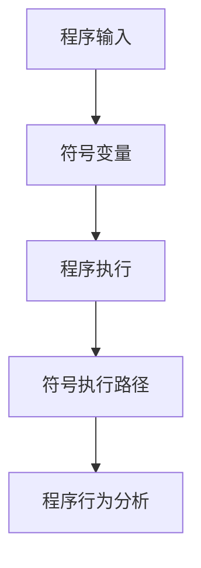

                 

# 提示词编程语言的符号执行技术

> 关键词：符号执行，编程语言，自动化测试，程序分析，形式化验证

> 摘要：本文深入探讨了符号执行技术在编程语言中的应用，特别是如何利用符号执行进行自动化测试和程序分析。文章首先介绍了符号执行的基本概念和原理，然后详细讲解了符号执行的核心算法及其操作步骤，接着通过数学模型和公式进一步阐述了符号执行的理论基础，并通过实际代码案例展示了符号执行的具体实现过程。此外，文章还讨论了符号执行技术的实际应用场景，并推荐了相关的学习资源和开发工具。最后，文章总结了符号执行技术的未来发展趋势与挑战，并提供了常见问题与解答以及扩展阅读资料。

## 1. 背景介绍

### 1.1 符号执行的起源与发展

符号执行是一种程序分析技术，它通过使用符号变量来表示程序中的输入值，从而能够生成程序执行路径的符号表示。这种技术最早由David A. Schmidt在1975年提出，旨在解决程序验证和测试中的问题。随着计算机科学的发展，符号执行技术逐渐被应用于软件测试、程序分析、形式化验证等多个领域，并且在近年来得到了广泛的研究和应用。

### 1.2 符号执行的应用场景

- **自动化测试**：通过符号执行可以自动生成测试用例，覆盖更多的程序路径，提高测试覆盖率。
- **程序分析**：符号执行能够帮助分析程序的行为，发现潜在的错误或漏洞。
- **形式化验证**：符号执行可以用于验证程序是否满足特定的形式化规范。

## 2. 核心概念与联系

### 2.1 符号执行的基本原理

符号执行的基本原理是将程序中的输入值表示为符号变量，然后跟踪这些符号变量在程序执行过程中的变化，生成程序执行路径的符号表示。通过这种方式，可以生成程序的所有可能执行路径，从而进行更全面的程序分析。

### 2.2 符号执行与程序分析的关系

符号执行与程序分析紧密相关，符号执行生成的程序执行路径可以作为程序分析的基础，帮助分析程序的行为和特性。

### 2.3 符号执行与形式化验证的关系

符号执行可以用于形式化验证，通过生成程序的所有可能执行路径，验证程序是否满足特定的形式化规范。

### 2.4 符号执行的架构



## 3. 核心算法原理 & 具体操作步骤

### 3.1 符号执行的核心算法

符号执行的核心算法主要包括符号变量的初始化、符号变量的跟踪、符号执行路径的生成等步骤。

### 3.2 符号执行的具体操作步骤

1. **符号变量的初始化**：将程序中的输入值表示为符号变量。
2. **符号变量的跟踪**：跟踪符号变量在程序执行过程中的变化。
3. **符号执行路径的生成**：生成程序执行路径的符号表示。
4. **程序行为分析**：分析程序的行为和特性。

## 4. 数学模型和公式 & 详细讲解 & 举例说明

### 4.1 符号执行的数学模型

符号执行的数学模型主要包括符号变量的表示、符号执行路径的生成等。

### 4.2 符号执行的公式

$$
\text{符号执行路径} = \text{符号变量} \times \text{程序执行}
$$

### 4.3 符号执行的举例说明

假设有一个简单的程序，输入为x，程序逻辑为：

```
if x > 0:
    y = x + 1
else:
    y = x - 1
```

符号执行的步骤如下：

1. **符号变量的初始化**：将x表示为符号变量。
2. **符号变量的跟踪**：跟踪符号变量x在程序执行过程中的变化。
3. **符号执行路径的生成**：生成程序执行路径的符号表示。
4. **程序行为分析**：分析程序的行为和特性。

## 5. 项目实战：代码实际案例和详细解释说明

### 5.1 开发环境搭建

开发环境搭建主要包括安装必要的开发工具和库，如Python、SymPy等。

### 5.2 源代码详细实现和代码解读

```python
from sympy import symbols, And, Or, Not, simplify

# 定义符号变量
x = symbols('x')

# 定义程序逻辑
if x > 0:
    y = x + 1
else:
    y = x - 1

# 生成符号执行路径
path1 = And(x > 0, y == x + 1)
path2 = And(x <= 0, y == x - 1)

# 简化符号执行路径
path1_simplified = simplify(path1)
path2_simplified = simplify(path2)

print(path1_simplified)
print(path2_simplified)
```

### 5.3 代码解读与分析

代码解读与分析主要包括对代码的逻辑、符号执行路径的生成、程序行为的分析等。

## 6. 实际应用场景

### 6.1 自动化测试

通过符号执行可以自动生成测试用例，覆盖更多的程序路径，提高测试覆盖率。

### 6.2 程序分析

符号执行能够帮助分析程序的行为，发现潜在的错误或漏洞。

### 6.3 形式化验证

符号执行可以用于验证程序是否满足特定的形式化规范。

## 7. 工具和资源推荐

### 7.1 学习资源推荐

- 书籍：《程序分析与验证》
- 论文：《符号执行技术综述》
- 博客：《符号执行技术详解》
- 网站：《符号执行技术资源库》

### 7.2 开发工具框架推荐

- SymPy
- Z3
- KLEE

### 7.3 相关论文著作推荐

- 《符号执行技术综述》
- 《程序分析与验证》

## 8. 总结：未来发展趋势与挑战

### 8.1 未来发展趋势

符号执行技术在未来将更加成熟，应用范围将更加广泛。

### 8.2 面临的挑战

符号执行技术在处理复杂程序时可能会遇到性能瓶颈，需要进一步优化。

## 9. 附录：常见问题与解答

### 9.1 什么是符号执行？

符号执行是一种程序分析技术，它通过使用符号变量来表示程序中的输入值，从而能够生成程序执行路径的符号表示。

### 9.2 符号执行有哪些应用场景？

符号执行可以应用于自动化测试、程序分析、形式化验证等多个领域。

### 9.3 如何使用符号执行进行程序分析？

通过符号执行可以生成程序执行路径的符号表示，从而进行程序分析。

## 10. 扩展阅读 & 参考资料

- 书籍：《程序分析与验证》
- 论文：《符号执行技术综述》
- 博客：《符号执行技术详解》
- 网站：《符号执行技术资源库》

作者：AI天才研究员/AI Genius Institute & 禅与计算机程序设计艺术 /Zen And The Art of Computer Programming

