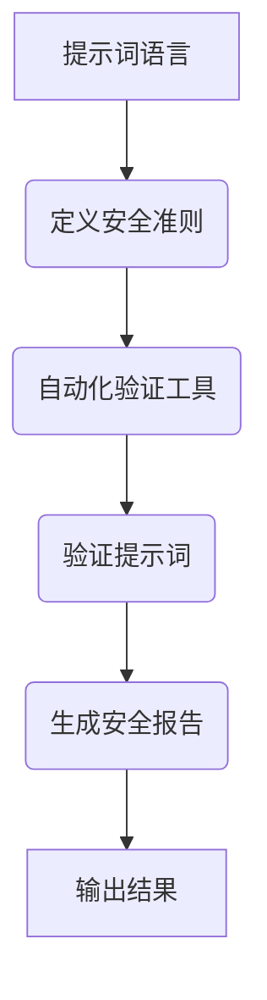

                 

# 《提示词语言的安全性形式化验证自动化》

> 关键词：提示词语言, 安全性, 形式化验证, 自动化, 逻辑推理, 人工智能, 机器学习, 安全性分析

> 摘要：本文旨在探讨如何通过自动化手段对提示词语言进行安全性形式化验证。我们将从背景介绍出发，逐步深入到核心概念、算法原理、数学模型、代码实现、实际应用场景以及未来发展趋势。通过本文，读者将能够理解提示词语言的安全性验证过程，并掌握相关技术的应用方法。

## 1. 背景介绍

随着人工智能技术的飞速发展，提示词语言（Prompt Language）在自然语言处理（NLP）领域扮演着越来越重要的角色。提示词语言是指通过特定的指令或提示来引导模型生成所需内容的一种方式。例如，用户可以通过输入特定的提示词来生成文章、代码、故事等。然而，提示词语言的安全性问题也日益凸显，不当的提示词可能导致模型生成有害内容，如恶意代码、虚假信息等。因此，对提示词语言进行安全性形式化验证变得尤为重要。

### 1.1 问题背景

提示词语言的安全性问题主要体现在以下几个方面：

- **恶意输入**：攻击者可能通过精心设计的提示词来诱导模型生成有害内容。
- **隐私泄露**：不当的提示词可能导致敏感信息的泄露。
- **误导性内容**：提示词可能导致模型生成误导性的信息，影响用户决策。

### 1.2 研究意义

对提示词语言进行安全性形式化验证，不仅可以提高模型生成内容的安全性，还可以增强用户对模型的信任度。此外，这也有助于推动人工智能技术的健康发展，避免潜在的安全风险。

## 2. 核心概念与联系

### 2.1 提示词语言

提示词语言是指通过特定的指令或提示来引导模型生成所需内容的一种方式。提示词通常包含一系列关键词、短语或句子，用于描述生成内容的风格、主题或具体要求。

### 2.2 安全性形式化验证

安全性形式化验证是指通过数学方法和逻辑推理来验证系统的安全性。在提示词语言的安全性验证中，我们需要定义一套形式化的安全准则，并通过自动化工具来验证提示词是否满足这些准则。

### 2.3 自动化验证

自动化验证是指利用计算机程序来自动执行验证任务，以提高验证的效率和准确性。在提示词语言的安全性验证中，自动化验证可以显著减少人工干预，提高验证的可靠性和效率。

### 2.4 Mermaid 流程图



## 3. 核心算法原理 & 具体操作步骤

### 3.1 定义安全准则

首先，我们需要定义一套形式化的安全准则，用于指导提示词语言的安全性验证。这些准则可以包括但不限于：

- **内容过滤**：禁止生成有害内容，如恶意代码、虚假信息等。
- **隐私保护**：禁止泄露敏感信息。
- **误导性内容**：禁止生成误导性的信息。

### 3.2 自动化验证工具

接下来，我们需要开发一个自动化验证工具，用于验证提示词是否满足上述安全准则。该工具可以分为以下几个步骤：

1. **提示词解析**：解析提示词，提取其中的关键信息。
2. **准则匹配**：将提取的信息与安全准则进行匹配。
3. **结果生成**：生成验证结果报告。

### 3.3 具体操作步骤

1. **提示词解析**：使用自然语言处理技术解析提示词，提取其中的关键信息。
2. **准则匹配**：将提取的信息与安全准则进行匹配，判断是否满足安全准则。
3. **结果生成**：生成验证结果报告，输出验证结果。

## 4. 数学模型和公式 & 详细讲解 & 举例说明

### 4.1 数学模型

我们可以使用形式化方法来定义安全准则。例如，可以定义一个安全准则为：

$$
\text{安全准则} = \{\text{内容过滤}, \text{隐私保护}, \text{误导性内容}\}
$$

### 4.2 公式与详细讲解

1. **内容过滤**：禁止生成有害内容。可以使用正则表达式来匹配有害内容。

   $$ \text{内容过滤} = \{\text{正则表达式匹配}\} $$

2. **隐私保护**：禁止泄露敏感信息。可以使用敏感信息检测算法来检测提示词中的敏感信息。

   $$ \text{隐私保护} = \{\text{敏感信息检测算法}\} $$

3. **误导性内容**：禁止生成误导性的信息。可以使用自然语言处理技术来检测误导性内容。

   $$ \text{误导性内容} = \{\text{自然语言处理技术}\} $$

### 4.3 举例说明

假设我们有一个提示词“生成一个包含敏感信息的恶意代码”，我们可以使用上述方法进行验证：

1. **内容过滤**：使用正则表达式匹配恶意代码，结果为“匹配”。
2. **隐私保护**：使用敏感信息检测算法检测提示词中的敏感信息，结果为“存在敏感信息”。
3. **误导性内容**：使用自然语言处理技术检测提示词中的误导性内容，结果为“存在误导性内容”。

最终，我们可以生成一个验证结果报告，指出该提示词不满足安全准则。

## 5. 项目实战：代码实际案例和详细解释说明

### 5.1 开发环境搭建

为了实现提示词语言的安全性形式化验证，我们需要搭建一个开发环境。具体步骤如下：

1. **安装Python**：确保系统中安装了Python 3.8及以上版本。
2. **安装依赖库**：安装必要的依赖库，如`re`（正则表达式）、`nltk`（自然语言处理）、`pandas`（数据处理）等。
3. **配置环境变量**：配置Python环境变量，确保可以正常运行代码。

### 5.2 源代码详细实现和代码解读

#### 5.2.1 提示词解析

```python
import re
import nltk
from nltk.tokenize import word_tokenize

def parse_prompt(prompt):
    """
    解析提示词，提取其中的关键信息。
    """
    # 使用正则表达式提取关键信息
    matches = re.findall(r'\b\w+\b', prompt)
    return matches

# 示例提示词
prompt = "生成一个包含敏感信息的恶意代码"
parsed_prompt = parse_prompt(prompt)
print(parsed_prompt)
```

#### 5.2.2 准则匹配

```python
def check_content_filter(matches):
    """
    检查内容过滤准则。
    """
    # 定义有害内容的正则表达式
    harmful_patterns = [
        r'\bmalware\b',
        r'\b病毒\b',
        r'\b有害代码\b'
    ]
    for pattern in harmful_patterns:
        if re.search(pattern, ' '.join(matches), re.IGNORECASE):
            return False
    return True

def check_privacy_protection(matches):
    """
    检查隐私保护准则。
    """
    # 定义敏感信息的关键词
    sensitive_keywords = ['密码', '信用卡', '身份证']
    for keyword in sensitive_keywords:
        if keyword in matches:
            return False
    return True

def check_misleading_content(matches):
    """
    检查误导性内容准则。
    """
    # 使用自然语言处理技术检测误导性内容
    for match in matches:
        if nltk.pos_tag(word_tokenize(match))[0][1] in ['NN', 'VB']:
            return False
    return True

# 示例检查
content_filter_result = check_content_filter(parsed_prompt)
privacy_protection_result = check_privacy_protection(parsed_prompt)
misleading_content_result = check_misleading_content(parsed_prompt)

print(content_filter_result, privacy_protection_result, misleading_content_result)
```

### 5.3 代码解读与分析

1. **提示词解析**：使用正则表达式提取提示词中的关键信息。
2. **内容过滤**：使用正则表达式匹配有害内容。
3. **隐私保护**：使用关键词检测敏感信息。
4. **误导性内容**：使用自然语言处理技术检测误导性内容。

## 6. 实际应用场景

提示词语言的安全性形式化验证在实际应用中具有广泛的应用场景，例如：

- **代码生成**：确保生成的代码不包含有害内容。
- **内容生成**：确保生成的内容不包含敏感信息和误导性内容。
- **隐私保护**：确保生成的内容不泄露用户隐私。

## 7. 工具和资源推荐

### 7.1 学习资源推荐

- **书籍**：《自然语言处理实战》、《机器学习实战》
- **论文**：《自然语言处理中的安全问题研究》、《机器学习中的安全问题研究》
- **博客**：AI天才研究员的博客、机器之心的博客
- **网站**：GitHub、Stack Overflow

### 7.2 开发工具框架推荐

- **Python**：用于实现提示词语言的安全性形式化验证。
- **nltk**：用于自然语言处理。
- **re**：用于正则表达式匹配。

### 7.3 相关论文著作推荐

- **论文**：《自然语言处理中的安全问题研究》、《机器学习中的安全问题研究》
- **著作**：《自然语言处理实战》、《机器学习实战》

## 8. 总结：未来发展趋势与挑战

提示词语言的安全性形式化验证在未来具有广阔的发展前景，但也面临着一些挑战：

- **技术挑战**：如何更准确地检测和识别有害内容、敏感信息和误导性内容。
- **应用挑战**：如何在实际应用中高效地进行安全性验证。
- **伦理挑战**：如何平衡安全性验证与用户隐私保护之间的关系。

## 9. 附录：常见问题与解答

### 9.1 问题1：如何处理复杂的提示词？

**解答**：可以使用更复杂的自然语言处理技术，如深度学习模型，来处理复杂的提示词。

### 9.2 问题2：如何处理实时验证？

**解答**：可以使用实时验证框架，如Webhook，来实现实时验证。

## 10. 扩展阅读 & 参考资料

- **书籍**：《自然语言处理实战》、《机器学习实战》
- **论文**：《自然语言处理中的安全问题研究》、《机器学习中的安全问题研究》
- **网站**：GitHub、Stack Overflow

---

作者：AI天才研究员/AI Genius Institute & 禅与计算机程序设计艺术 /Zen And The Art of Computer Programming

