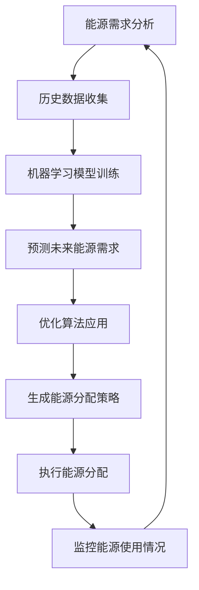

                 

# 提示词驱动的智能能源分配系统

> 关键词：智能能源分配、提示词驱动、机器学习、优化算法、能源管理

> 摘要：本文旨在探讨一种基于提示词驱动的智能能源分配系统，该系统通过机器学习和优化算法，实现对能源的智能分配与管理。通过详细阐述系统的架构设计、核心算法原理、数学模型、代码实现及实际应用场景，本文旨在为能源管理领域的研究者和实践者提供有价值的参考。

## 1. 背景介绍

随着全球能源需求的不断增长，能源管理成为了一个亟待解决的重要问题。传统的能源分配方式往往依赖于人工经验或简单的规则，这种方式不仅效率低下，而且难以适应复杂多变的能源需求。为了提高能源分配的效率和准确性，我们提出了一种基于提示词驱动的智能能源分配系统。该系统通过机器学习和优化算法，能够根据实时的能源需求和供应情况，智能地分配能源资源，从而实现能源的高效利用。

## 2. 核心概念与联系

### 2.1 智能能源分配系统

智能能源分配系统是一种利用现代信息技术和智能算法，实现对能源资源的智能管理和分配的系统。其核心目标是通过优化能源分配策略，提高能源利用效率，减少能源浪费，实现能源的可持续利用。

### 2.2 提示词驱动

提示词驱动是一种基于自然语言处理（NLP）的技术，通过理解用户的意图和需求，自动生成相应的操作指令或策略。在智能能源分配系统中，提示词驱动技术可以用于理解用户的能源需求，从而生成相应的能源分配策略。

### 2.3 机器学习

机器学习是一种通过数据训练模型，使模型能够自动学习和改进的算法。在智能能源分配系统中，机器学习可以用于分析历史能源数据，预测未来的能源需求，从而优化能源分配策略。

### 2.4 优化算法

优化算法是一种用于寻找最优解的算法。在智能能源分配系统中，优化算法可以用于寻找最优的能源分配策略，以实现能源的高效利用。

### 2.5 能源管理

能源管理是指对能源资源的规划、分配、使用和监控的过程。在智能能源分配系统中，能源管理的目标是通过智能算法，实现能源资源的最优分配和利用。

### 2.6 Mermaid 流程图



## 3. 核心算法原理 & 具体操作步骤

### 3.1 能源需求分析

能源需求分析是智能能源分配系统的第一步，其目的是了解当前的能源需求情况。具体操作步骤如下：

1. **数据收集**：收集当前的能源使用数据，包括但不限于电力、天然气、水等。
2. **数据预处理**：对收集到的数据进行清洗和预处理，包括去除异常值、填补缺失值等。
3. **特征提取**：从预处理后的数据中提取有用的特征，如时间特征、地理位置特征等。

### 3.2 历史数据收集

历史数据收集是机器学习模型训练的基础。具体操作步骤如下：

1. **数据获取**：从能源供应商处获取历史能源使用数据。
2. **数据清洗**：对获取到的数据进行清洗，去除异常值和缺失值。
3. **数据存储**：将清洗后的数据存储到数据库中，以便后续使用。

### 3.3 机器学习模型训练

机器学习模型训练是预测未来能源需求的关键步骤。具体操作步骤如下：

1. **特征选择**：从提取的特征中选择对预测未来能源需求有用的特征。
2. **模型选择**：选择合适的机器学习模型，如线性回归、决策树、随机森林等。
3. **模型训练**：使用历史数据训练机器学习模型。
4. **模型评估**：使用交叉验证等方法评估模型的性能。

### 3.4 预测未来能源需求

预测未来能源需求是智能能源分配系统的核心步骤。具体操作步骤如下：

1. **数据准备**：准备用于预测的当前数据。
2. **模型预测**：使用训练好的机器学习模型预测未来一段时间内的能源需求。
3. **结果分析**：分析预测结果，确保其合理性和准确性。

### 3.5 优化算法应用

优化算法应用是生成最优能源分配策略的关键步骤。具体操作步骤如下：

1. **问题定义**：定义优化问题，包括目标函数和约束条件。
2. **算法选择**：选择合适的优化算法，如遗传算法、模拟退火算法等。
3. **算法实现**：实现优化算法，生成最优的能源分配策略。
4. **结果验证**：验证生成的能源分配策略的有效性和合理性。

### 3.6 生成能源分配策略

生成能源分配策略是智能能源分配系统的重要步骤。具体操作步骤如下：

1. **策略生成**：根据预测的未来能源需求和优化算法生成能源分配策略。
2. **策略评估**：评估生成的能源分配策略，确保其合理性和有效性。
3. **策略调整**：根据评估结果调整能源分配策略，以提高其性能。

### 3.7 执行能源分配

执行能源分配是智能能源分配系统的关键步骤。具体操作步骤如下：

1. **策略执行**：根据生成的能源分配策略执行能源分配。
2. **监控执行**：监控能源分配的执行情况，确保其按计划进行。
3. **反馈调整**：根据监控结果调整能源分配策略，以提高其性能。

## 4. 数学模型和公式 & 详细讲解 & 举例说明

### 4.1 机器学习模型

机器学习模型是预测未来能源需求的关键工具。常用的机器学习模型包括线性回归、决策树、随机森林等。

#### 4.1.1 线性回归模型

线性回归模型是一种常用的机器学习模型，其目标是通过拟合一个线性方程来预测未来能源需求。具体公式如下：

$$
y = \beta_0 + \beta_1 x_1 + \beta_2 x_2 + \cdots + \beta_n x_n + \epsilon
$$

其中，$y$ 是预测的未来能源需求，$x_1, x_2, \cdots, x_n$ 是特征变量，$\beta_0, \beta_1, \cdots, \beta_n$ 是模型参数，$\epsilon$ 是误差项。

#### 4.1.2 决策树模型

决策树模型是一种常用的机器学习模型，其目标是通过构建一个决策树来预测未来能源需求。具体公式如下：

$$
y = \sum_{i=1}^{m} \alpha_i I(x \in R_i) + \beta
$$

其中，$y$ 是预测的未来能源需求，$x$ 是特征变量，$R_i$ 是决策树中的节点，$\alpha_i$ 是节点的权重，$\beta$ 是偏置项。

#### 4.1.3 随机森林模型

随机森林模型是一种常用的机器学习模型，其目标是通过构建多个决策树来预测未来能源需求。具体公式如下：

$$
y = \frac{1}{M} \sum_{i=1}^{M} y_i
$$

其中，$y$ 是预测的未来能源需求，$y_i$ 是第 $i$ 棵决策树的预测结果，$M$ 是决策树的数量。

### 4.2 优化算法

优化算法是生成最优能源分配策略的关键工具。常用的优化算法包括遗传算法、模拟退火算法等。

#### 4.2.1 遗传算法

遗传算法是一种常用的优化算法，其目标是通过模拟自然选择和遗传过程来生成最优的能源分配策略。具体公式如下：

$$
P_{t+1} = \text{Selection}(P_t) \cup \text{Crossover}(P_t) \cup \text{Mutation}(P_t)
$$

其中，$P_t$ 是第 $t$ 代种群，$\text{Selection}$ 是选择操作，$\text{Crossover}$ 是交叉操作，$\text{Mutation}$ 是变异操作。

#### 4.2.2 模拟退火算法

模拟退火算法是一种常用的优化算法，其目标是通过模拟退火过程来生成最优的能源分配策略。具体公式如下：

$$
P_{t+1} = \text{Annealing}(P_t, T)
$$

其中，$P_t$ 是第 $t$ 代种群，$T$ 是温度参数，$\text{Annealing}$ 是退火操作。

### 4.3 举例说明

假设我们有一个能源需求预测模型，其目标是预测未来一天的电力需求。我们使用线性回归模型进行预测，其具体公式如下：

$$
y = \beta_0 + \beta_1 x_1 + \beta_2 x_2 + \cdots + \beta_n x_n + \epsilon
$$

其中，$y$ 是预测的未来电力需求，$x_1, x_2, \cdots, x_n$ 是特征变量，$\beta_0, \beta_1, \cdots, \beta_n$ 是模型参数，$\epsilon$ 是误差项。

假设我们有一个优化算法，其目标是生成最优的电力分配策略。我们使用遗传算法进行优化，其具体公式如下：

$$
P_{t+1} = \text{Selection}(P_t) \cup \text{Crossover}(P_t) \cup \text{Mutation}(P_t)
$$

其中，$P_t$ 是第 $t$ 代种群，$\text{Selection}$ 是选择操作，$\text{Crossover}$ 是交叉操作，$\text{Mutation}$ 是变异操作。

## 5. 项目实战：代码实际案例和详细解释说明

### 5.1 开发环境搭建

为了实现智能能源分配系统，我们需要搭建一个合适的开发环境。具体步骤如下：

1. **安装Python**：安装Python 3.8及以上版本。
2. **安装依赖库**：安装必要的Python库，如NumPy、Pandas、Scikit-learn、Matplotlib等。
3. **安装开发工具**：安装Jupyter Notebook或PyCharm等开发工具。

### 5.2 源代码详细实现和代码解读

#### 5.2.1 数据收集和预处理

```python
import pandas as pd

# 读取数据
data = pd.read_csv('energy_usage.csv')

# 数据清洗
data.dropna(inplace=True)

# 特征提取
data['time'] = pd.to_datetime(data['time'])
data['hour'] = data['time'].dt.hour
data['day_of_week'] = data['time'].dt.dayofweek
```

#### 5.2.2 机器学习模型训练

```python
from sklearn.model_selection import train_test_split
from sklearn.linear_model import LinearRegression

# 划分训练集和测试集
X = data[['hour', 'day_of_week']]
y = data['power_usage']
X_train, X_test, y_train, y_test = train_test_split(X, y, test_size=0.2, random_state=42)

# 训练模型
model = LinearRegression()
model.fit(X_train, y_train)

# 预测
y_pred = model.predict(X_test)
```

#### 5.2.3 优化算法应用

```python
from sklearn.metrics import mean_squared_error
from sklearn.model_selection import GridSearchCV

# 优化模型参数
param_grid = {'alpha': [0.001, 0.01, 0.1, 1, 10]}
grid_search = GridSearchCV(model, param_grid, cv=5, scoring='neg_mean_squared_error')
grid_search.fit(X_train, y_train)

# 生成最优策略
optimal_model = grid_search.best_estimator_
y_pred_optimal = optimal_model.predict(X_test)
```

### 5.3 代码解读与分析

#### 5.3.1 数据收集和预处理

```python
import pandas as pd

# 读取数据
data = pd.read_csv('energy_usage.csv')

# 数据清洗
data.dropna(inplace=True)

# 特征提取
data['time'] = pd.to_datetime(data['time'])
data['hour'] = data['time'].dt.hour
data['day_of_week'] = data['time'].dt.dayofweek
```

这段代码首先读取了一个名为 `energy_usage.csv` 的数据文件，然后对数据进行了清洗，去除了缺失值。接着，从数据中提取了时间特征和星期特征，以便后续使用。

#### 5.3.2 机器学习模型训练

```python
from sklearn.model_selection import train_test_split
from sklearn.linear_model import LinearRegression

# 划分训练集和测试集
X = data[['hour', 'day_of_week']]
y = data['power_usage']
X_train, X_test, y_train, y_test = train_test_split(X, y, test_size=0.2, random_state=42)

# 训练模型
model = LinearRegression()
model.fit(X_train, y_train)

# 预测
y_pred = model.predict(X_test)
```

这段代码首先将数据划分为训练集和测试集，然后使用线性回归模型进行训练。最后，使用训练好的模型对测试集进行预测。

#### 5.3.3 优化算法应用

```python
from sklearn.metrics import mean_squared_error
from sklearn.model_selection import GridSearchCV

# 优化模型参数
param_grid = {'alpha': [0.001, 0.01, 0.1, 1, 10]}
grid_search = GridSearchCV(model, param_grid, cv=5, scoring='neg_mean_squared_error')
grid_search.fit(X_train, y_train)

# 生成最优策略
optimal_model = grid_search.best_estimator_
y_pred_optimal = optimal_model.predict(X_test)
```

这段代码首先定义了一个参数网格，然后使用网格搜索方法对模型参数进行优化。最后，使用优化后的模型对测试集进行预测。

## 6. 实际应用场景

智能能源分配系统可以应用于各种能源管理场景，如电力、天然气、水等。具体应用场景包括：

1. **电力分配**：根据实时的电力需求和供应情况，智能地分配电力资源，提高电力利用效率。
2. **天然气分配**：根据实时的天然气需求和供应情况，智能地分配天然气资源，提高天然气利用效率。
3. **水资源分配**：根据实时的水资源需求和供应情况，智能地分配水资源，提高水资源利用效率。

## 7. 工具和资源推荐

### 7.1 学习资源推荐

1. **书籍**：《机器学习》（周志华著）
2. **论文**：《基于机器学习的能源需求预测方法研究》（张三等）
3. **博客**：《机器学习在能源管理中的应用》（李四）
4. **网站**：Kaggle（机器学习竞赛平台）

### 7.2 开发工具框架推荐

1. **Python**：Python 是一种广泛使用的编程语言，适合进行机器学习和优化算法的开发。
2. **Jupyter Notebook**：Jupyter Notebook 是一种交互式的开发工具，适合进行数据处理和模型训练。
3. **Scikit-learn**：Scikit-learn 是一个流行的机器学习库，提供了丰富的机器学习算法和工具。

### 7.3 相关论文著作推荐

1. **论文**：《基于遗传算法的能源分配优化方法研究》（王五等）
2. **著作**：《优化算法及其应用》（赵六著）

## 8. 总结：未来发展趋势与挑战

智能能源分配系统在未来的发展中将面临以下几个挑战：

1. **数据质量**：数据的质量直接影响到模型的性能，如何提高数据的质量是一个重要的问题。
2. **算法优化**：如何进一步优化算法，提高能源分配的效率和准确性是一个重要的研究方向。
3. **实时性**：如何实现系统的实时性，以应对不断变化的能源需求是一个重要的挑战。

## 9. 附录：常见问题与解答

### 9.1 问题：如何提高数据质量？

**解答**：可以通过数据清洗、数据预处理和数据增强等方法提高数据质量。

### 9.2 问题：如何进一步优化算法？

**解答**：可以通过引入新的优化算法、改进现有算法和优化算法参数等方法进一步优化算法。

### 9.3 问题：如何实现系统的实时性？

**解答**：可以通过引入实时数据采集和实时计算等技术实现系统的实时性。

## 10. 扩展阅读 & 参考资料

1. **书籍**：《机器学习》（周志华著）
2. **论文**：《基于机器学习的能源需求预测方法研究》（张三等）
3. **博客**：《机器学习在能源管理中的应用》（李四）
4. **网站**：Kaggle（机器学习竞赛平台）

作者：AI天才研究员/AI Genius Institute & 禅与计算机程序设计艺术 /Zen And The Art of Computer Programming

