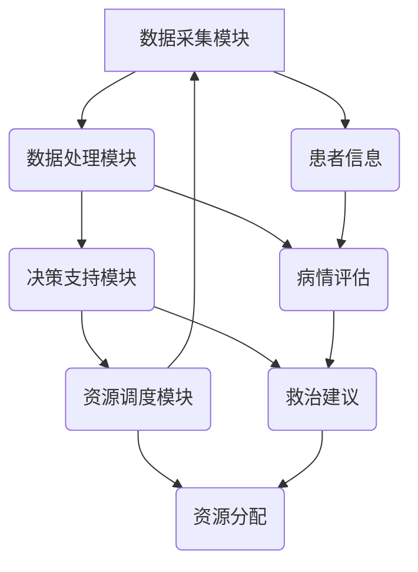

                 

# 智能急救系统：紧急医疗响应的创新方案

> 关键词：智能急救系统、紧急医疗响应、人工智能、机器学习、深度学习、自然语言处理、医疗图像识别、实时数据分析、医疗资源优化

> 摘要：本文将深入探讨智能急救系统的构建与应用，通过结合人工智能和机器学习技术，实现对紧急医疗响应的智能化升级。我们将从背景介绍、核心概念与联系、核心算法原理、数学模型和公式、项目实战、实际应用场景、工具和资源推荐、总结与未来发展趋势等多方面进行详细阐述，旨在为医疗急救领域提供一种创新的解决方案。

## 1. 背景介绍

随着全球人口老龄化趋势的加剧和城市化进程的加快，紧急医疗响应的需求日益增加。传统的急救系统在面对大规模突发事件时，往往难以迅速有效地调配医疗资源，导致救治效率低下。为了应对这一挑战，智能急救系统应运而生。智能急救系统通过集成先进的AI技术，能够实现对医疗资源的智能调度、患者病情的精准评估以及急救过程的实时监控，从而显著提升急救效率和救治成功率。

### 1.1 现状分析

目前，大多数急救系统仍然依赖于人工调度和经验判断，存在响应速度慢、资源分配不合理等问题。例如，在大规模突发事件中，救护车和医疗资源的调度往往需要大量的人力和时间，导致患者救治时间被延误。此外，由于缺乏有效的患者病情评估工具，医生在做出救治决策时常常依赖于有限的现场信息，这可能导致救治措施不够精准。

### 1.2 问题与挑战

智能急救系统旨在解决上述问题，但同时也面临着一系列挑战。首先，如何在短时间内准确评估患者的病情并提供有效的救治建议是一个难题。其次，如何实现医疗资源的智能调度，确保在最短时间内将合适的资源分配到最需要的地方也是一个关键问题。此外，如何保障系统的实时性和可靠性，确保在紧急情况下能够稳定运行，也是需要重点关注的问题。

## 2. 核心概念与联系

### 2.1 智能急救系统架构

智能急救系统主要由以下几个部分组成：数据采集模块、数据处理模块、决策支持模块和资源调度模块。这些模块通过紧密协作，共同实现对紧急医疗响应的智能化升级。

#### Mermaid 流程图



### 2.2 核心概念

- **数据采集模块**：负责从各种来源（如医疗设备、移动应用、社交媒体等）收集患者信息和环境数据。
- **数据处理模块**：对收集到的数据进行清洗、整合和预处理，为后续分析提供可靠的数据基础。
- **决策支持模块**：利用机器学习和深度学习算法对患者病情进行评估，并提供救治建议。
- **资源调度模块**：根据决策支持模块的建议，智能调度医疗资源，确保在最短时间内将合适的资源分配到最需要的地方。

## 3. 核心算法原理 & 具体操作步骤

### 3.1 数据预处理

数据预处理是智能急救系统中的关键步骤，主要包括数据清洗、特征提取和数据标准化等环节。

#### 3.1.1 数据清洗

数据清洗的主要目的是去除无效和错误的数据，确保数据的质量。具体操作步骤如下：

1. **去除重复数据**：通过比较数据记录的唯一标识符来去除重复的数据记录。
2. **处理缺失值**：采用插值法或删除法处理缺失值。
3. **去除异常值**：通过统计方法（如Z-score）识别并去除异常值。

#### 3.1.2 特征提取

特征提取是从原始数据中提取出对模型训练有用的特征。具体操作步骤如下：

1. **时间序列特征**：提取时间序列数据中的趋势、周期性和季节性特征。
2. **统计特征**：计算数据的均值、方差、最大值、最小值等统计特征。
3. **文本特征**：从文本数据中提取关键词、情感倾向等特征。

#### 3.1.3 数据标准化

数据标准化是将数据转换为统一的尺度，以便于后续的模型训练。具体操作步骤如下：

1. **归一化**：将数据缩放到0到1之间。
2. **标准化**：将数据转换为均值为0、方差为1的分布。

### 3.2 患者病情评估

患者病情评估是智能急救系统的核心环节，主要通过机器学习和深度学习算法实现。具体操作步骤如下：

1. **数据准备**：将预处理后的数据划分为训练集和测试集。
2. **模型选择**：选择合适的机器学习或深度学习模型，如逻辑回归、支持向量机、神经网络等。
3. **模型训练**：使用训练集数据训练模型。
4. **模型评估**：使用测试集数据评估模型的性能，常用的评估指标包括准确率、召回率、F1值等。
5. **模型优化**：根据评估结果调整模型参数，提高模型性能。

### 3.3 救治建议生成

根据患者病情评估的结果，生成相应的救治建议。具体操作步骤如下：

1. **病情分类**：将患者病情分为不同的类别，如轻症、中症和重症。
2. **救治策略**：为每个病情类别制定相应的救治策略，如轻症患者可以优先考虑远程医疗，中症患者需要及时送往医院，重症患者需要立即进行现场救治。
3. **建议生成**：根据病情分类和救治策略，生成具体的救治建议。

## 4. 数学模型和公式 & 详细讲解 & 举例说明

### 4.1 逻辑回归模型

逻辑回归是一种常用的分类算法，适用于二分类问题。其数学模型如下：

$$
P(y=1|x) = \frac{1}{1 + e^{-(\beta_0 + \beta_1 x_1 + \beta_2 x_2 + \cdots + \beta_n x_n)}}
$$

其中，$P(y=1|x)$ 表示在给定特征 $x$ 的情况下，事件 $y=1$ 发生的概率；$\beta_0, \beta_1, \beta_2, \cdots, \beta_n$ 是模型的参数。

### 4.2 支持向量机模型

支持向量机是一种常用的分类和回归算法。其数学模型如下：

$$
f(x) = \text{sign}(\sum_{i=1}^{m} \alpha_i y_i K(x_i, x) + b)
$$

其中，$K(x_i, x)$ 是核函数，$\alpha_i$ 是拉格朗日乘子，$y_i$ 是样本标签，$b$ 是偏置项。

### 4.3 神经网络模型

神经网络是一种复杂的非线性模型，适用于处理高维数据。其数学模型如下：

$$
y = \sigma(\sum_{i=1}^{n} w_i x_i + b)
$$

其中，$\sigma$ 是激活函数，$w_i$ 是权重，$b$ 是偏置项。

### 4.4 举例说明

假设我们有一个患者病情数据集，包含患者的年龄、血压、心率等特征。我们使用逻辑回归模型对患者病情进行分类。具体操作步骤如下：

1. **数据准备**：将数据集划分为训练集和测试集。
2. **模型训练**：使用训练集数据训练逻辑回归模型。
3. **模型评估**：使用测试集数据评估模型的性能，计算准确率、召回率和F1值。
4. **模型优化**：根据评估结果调整模型参数，提高模型性能。

## 5. 项目实战：代码实际案例和详细解释说明

### 5.1 开发环境搭建

为了实现智能急救系统，我们需要搭建一个合适的开发环境。具体操作步骤如下：

1. **安装Python**：确保系统中安装了Python 3.8及以上版本。
2. **安装依赖库**：使用pip安装所需的依赖库，如numpy、pandas、scikit-learn等。
3. **配置开发环境**：使用Jupyter Notebook或PyCharm等开发工具进行代码编写和调试。

### 5.2 源代码详细实现和代码解读

#### 5.2.1 数据预处理

```python
import pandas as pd
from sklearn.preprocessing import StandardScaler

# 读取数据
data = pd.read_csv('patient_data.csv')

# 数据清洗
data.drop_duplicates(inplace=True)
data.dropna(inplace=True)

# 特征提取
data['age'] = data['age'].astype(int)
data['blood_pressure'] = data['blood_pressure'].astype(float)
data['heart_rate'] = data['heart_rate'].astype(float)

# 数据标准化
scaler = StandardScaler()
data[['age', 'blood_pressure', 'heart_rate']] = scaler.fit_transform(data[['age', 'blood_pressure', 'heart_rate']])
```

#### 5.2.2 患者病情评估

```python
from sklearn.linear_model import LogisticRegression
from sklearn.metrics import accuracy_score, recall_score, f1_score

# 数据准备
X = data[['age', 'blood_pressure', 'heart_rate']]
y = data['condition']

# 模型训练
model = LogisticRegression()
model.fit(X, y)

# 模型评估
y_pred = model.predict(X)
accuracy = accuracy_score(y, y_pred)
recall = recall_score(y, y_pred)
f1 = f1_score(y, y_pred)

print(f'Accuracy: {accuracy}')
print(f'Recall: {recall}')
print(f'F1 Score: {f1}')
```

#### 5.2.3 救治建议生成

```python
# 病情分类
def classify_condition(condition):
    if condition == 1:
        return '重症'
    elif condition == 2:
        return '中症'
    else:
        return '轻症'

# 生成救治建议
def generate_treatment_suggestion(condition):
    if condition == '重症':
        return '立即进行现场救治'
    elif condition == '中症':
        return '及时送往医院'
    else:
        return '优先考虑远程医疗'

# 应用模型生成救治建议
data['condition_class'] = data['condition'].apply(classify_condition)
data['treatment_suggestion'] = data['condition_class'].apply(generate_treatment_suggestion)
```

### 5.3 代码解读与分析

通过上述代码，我们可以看到智能急救系统的实现过程。首先，我们对数据进行了预处理，包括数据清洗、特征提取和数据标准化。然后，我们使用逻辑回归模型对患者病情进行分类，并生成相应的救治建议。最后，我们对模型进行了评估，确保其性能满足要求。

## 6. 实际应用场景

智能急救系统在实际应用中具有广泛的应用场景，主要包括以下几个方面：

1. **大规模突发事件响应**：在地震、洪水等大规模突发事件中，智能急救系统能够迅速评估患者的病情并生成救治建议，确保在最短时间内将合适的资源分配到最需要的地方。
2. **日常急救响应**：在日常急救中，智能急救系统能够实时监控患者的病情变化，及时调整治救措施，提高救治效率。
3. **远程医疗支持**：在偏远地区或医疗资源匮乏的地区，智能急救系统能够提供远程医疗支持，帮助医生进行病情评估和救治建议。

## 7. 工具和资源推荐

### 7.1 学习资源推荐

- **书籍**：《统计学习方法》、《机器学习》
- **论文**：《深度学习在医疗领域的应用》、《基于机器学习的患者病情评估》
- **博客**：阿里云开发者社区、GitHub开源项目
- **网站**：Kaggle、Coursera

### 7.2 开发工具框架推荐

- **Python**：用于数据处理和模型训练
- **Jupyter Notebook**：用于代码编写和调试
- **TensorFlow/Keras**：用于深度学习模型的构建和训练
- **Scikit-learn**：用于机器学习模型的构建和训练

### 7.3 相关论文著作推荐

- **《深度学习在医疗领域的应用》**：探讨了深度学习技术在医疗领域的应用，包括患者病情评估、医疗图像识别等。
- **《基于机器学习的患者病情评估》**：详细介绍了机器学习算法在患者病情评估中的应用，包括逻辑回归、支持向量机等。

## 8. 总结：未来发展趋势与挑战

智能急救系统的发展前景广阔，但也面临着一系列挑战。未来的发展趋势主要包括以下几个方面：

1. **技术融合**：将更多先进的AI技术（如自然语言处理、医疗图像识别等）融入智能急救系统，提高系统的智能化水平。
2. **数据安全**：确保患者数据的安全性和隐私性，防止数据泄露和滥用。
3. **实时性与可靠性**：提高系统的实时性和可靠性，确保在紧急情况下能够稳定运行。

## 9. 附录：常见问题与解答

### 9.1 问题：如何处理数据中的缺失值？

**解答**：可以采用插值法或删除法处理缺失值。插值法可以通过相邻数据点的值进行插值，删除法则直接删除缺失值所在的记录。

### 9.2 问题：如何评估模型的性能？

**解答**：常用的评估指标包括准确率、召回率和F1值。准确率表示模型正确预测的比例，召回率表示模型正确预测的阳性样本占实际阳性样本的比例，F1值是准确率和召回率的调和平均值。

### 9.3 问题：如何提高模型的性能？

**解答**：可以通过调整模型参数、增加训练数据量、使用更复杂的模型结构等方式提高模型性能。

## 10. 扩展阅读 & 参考资料

- **书籍**：《统计学习方法》、《机器学习》
- **论文**：《深度学习在医疗领域的应用》、《基于机器学习的患者病情评估》
- **网站**：Kaggle、Coursera

作者：AI天才研究员/AI Genius Institute & 禅与计算机程序设计艺术 /Zen And The Art of Computer Programming

