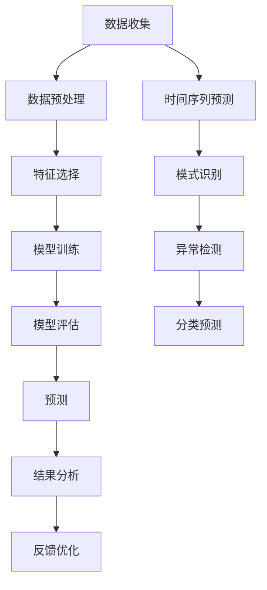

                 

# 机器学习在气象预报中的应用与挑战

> 关键词：机器学习、气象预报、深度学习、时间序列预测、数据预处理、模型评估

> 摘要：本文旨在探讨机器学习在气象预报中的应用及其面临的挑战。通过深入分析机器学习的核心概念、算法原理、数学模型、实际案例以及未来发展趋势，本文将为读者提供一个全面的技术视角，帮助理解如何利用机器学习技术提高气象预报的准确性和效率。

## 1. 背景介绍

气象预报是预测未来一段时间内天气变化的过程。传统的气象预报主要依赖于物理模型和统计方法，这些方法在一定程度上能够提供准确的预测结果，但随着数据量的增加和计算能力的提升，机器学习技术逐渐成为气象预报领域的重要工具。机器学习通过学习历史数据中的模式和规律，能够提供更为精确和实时的预测结果。

## 2. 核心概念与联系

### 2.1 机器学习基础

机器学习是一种人工智能技术，通过算法和统计模型来解析数据，从中学习并做出预测或决策。机器学习的核心在于数据驱动，即通过大量数据训练模型，使其能够自动识别数据中的模式和规律。

### 2.2 气象预报中的数据

气象预报需要处理大量的气象数据，包括温度、湿度、风速、气压等。这些数据通常以时间序列的形式存在，反映了天气随时间的变化情况。数据预处理是机器学习模型训练前的重要步骤，包括数据清洗、特征选择和数据标准化等。

### 2.3 机器学习在气象预报中的应用

机器学习在气象预报中的应用主要包括以下几个方面：

- **时间序列预测**：利用历史气象数据预测未来一段时间内的天气变化。
- **模式识别**：通过学习历史数据中的模式，识别天气变化的规律。
- **异常检测**：检测异常天气事件，如极端天气现象。
- **分类预测**：根据气象数据预测天气类型，如晴天、雨天等。

### 2.4 Mermaid 流程图



## 3. 核心算法原理 & 具体操作步骤

### 3.1 时间序列预测

时间序列预测是机器学习在气象预报中最常用的方法之一。常见的时间序列预测算法包括ARIMA、LSTM等。

#### 3.1.1 ARIMA算法

ARIMA（自回归积分滑动平均模型）是一种常用的时间序列预测方法。其基本原理是通过自回归（AR）、差分（I）和滑动平均（MA）三个部分来建模时间序列数据。

- **自回归（AR）**：利用过去的时间序列值来预测未来值。
- **差分（I）**：通过差分操作使时间序列数据平稳。
- **滑动平均（MA）**：利用过去的时间序列误差来预测未来值。

#### 3.1.2 LSTM算法

LSTM（长短期记忆网络）是一种特殊的循环神经网络（RNN），能够处理长期依赖问题。LSTM通过门控机制来控制信息的流动，从而更好地捕捉时间序列中的长期依赖关系。

### 3.2 模式识别

模式识别是通过学习历史数据中的模式来预测未来天气变化。常见的模式识别方法包括决策树、随机森林和神经网络。

#### 3.2.1 决策树

决策树是一种基于树形结构的分类和回归方法。通过递归地划分数据集，决策树能够有效地识别数据中的模式和规律。

#### 3.2.2 随机森林

随机森林是一种集成学习方法，通过构建多个决策树并取平均结果来提高预测的准确性和稳定性。

#### 3.2.3 神经网络

神经网络是一种模拟人脑神经元结构的计算模型。通过多层神经元的连接和激活函数，神经网络能够学习和识别复杂的模式。

### 3.3 异常检测

异常检测是通过学习正常天气模式来识别异常天气事件。常见的异常检测方法包括基于统计的方法和基于机器学习的方法。

#### 3.3.1 基于统计的方法

基于统计的方法通过计算数据的统计特征（如均值、方差等）来识别异常值。常见的统计方法包括Z-score方法和IQR方法。

#### 3.3.2 基于机器学习的方法

基于机器学习的方法通过训练模型来识别异常值。常见的机器学习方法包括孤立森林和局部异常因子（LOF）。

### 3.4 分类预测

分类预测是通过学习历史数据中的模式来预测天气类型。常见的分类预测方法包括逻辑回归、支持向量机（SVM）和神经网络。

#### 3.4.1 逻辑回归

逻辑回归是一种常用的分类方法，通过线性模型来预测二分类问题。

#### 3.4.2 支持向量机（SVM）

支持向量机是一种基于最大间隔原则的分类方法，能够处理高维数据和非线性问题。

#### 3.4.3 神经网络

神经网络是一种强大的分类方法，能够处理复杂的分类问题。通过多层神经元的连接和激活函数，神经网络能够学习和识别复杂的模式。

## 4. 数学模型和公式 & 详细讲解 & 举例说明

### 4.1 ARIMA模型

ARIMA模型的基本形式为：

$$
\phi(B)(1-B)^d y_t = \theta(B) \epsilon_t
$$

其中，$\phi(B)$ 和 $\theta(B)$ 分别是自回归和滑动平均的多项式，$B$ 是滞后算子，$d$ 是差分阶数，$\epsilon_t$ 是白噪声序列。

### 4.2 LSTM模型

LSTM模型的基本形式为：

$$
\begin{aligned}
i_t &= \sigma(W_{xi} x_t + W_{hi} h_{t-1} + b_i) \\
f_t &= \sigma(W_{xf} x_t + W_{hf} h_{t-1} + b_f) \\
\tilde{c}_t &= \tanh(W_{xc} x_t + W_{hc} h_{t-1} + b_c) \\
c_t &= f_t \odot c_{t-1} + i_t \odot \tilde{c}_t \\
o_t &= \sigma(W_{xo} x_t + W_{ho} h_{t-1} + b_o) \\
h_t &= o_t \odot \tanh(c_t)
\end{aligned}
$$

其中，$i_t$ 是输入门，$f_t$ 是遗忘门，$\tilde{c}_t$ 是候选细胞状态，$c_t$ 是细胞状态，$o_t$ 是输出门，$\sigma$ 是Sigmoid函数，$\tanh$ 是双曲正切函数，$\odot$ 是逐元素乘法。

### 4.3 决策树模型

决策树模型的基本形式为：

$$
\text{if } x \leq \theta \text{ then } y = 1 \text{ else } y = 0
$$

其中，$\theta$ 是阈值，$x$ 是特征值，$y$ 是预测值。

### 4.4 随机森林模型

随机森林模型的基本形式为：

$$
\text{Random Forest} = \frac{1}{T} \sum_{t=1}^{T} \text{Tree}_t(x)
$$

其中，$T$ 是树的数量，$\text{Tree}_t(x)$ 是第$t$棵树的预测结果。

### 4.5 逻辑回归模型

逻辑回归模型的基本形式为：

$$
P(y=1|x) = \frac{1}{1 + e^{-(W^T x + b)}}
$$

其中，$W$ 是权重向量，$b$ 是偏置项，$x$ 是特征向量，$y$ 是预测值。

### 4.6 支持向量机（SVM）模型

支持向量机模型的基本形式为：

$$
\text{minimize} \quad \frac{1}{2} \|W\|^2 + C \sum_{i=1}^{n} \xi_i
$$

$$
\text{subject to} \quad y_i (W^T x_i + b) \geq 1 - \xi_i, \quad \xi_i \geq 0
$$

其中，$W$ 是权重向量，$b$ 是偏置项，$C$ 是惩罚参数，$\xi_i$ 是松弛变量。

## 5. 项目实战：代码实际案例和详细解释说明

### 5.1 开发环境搭建

为了进行机器学习项目，我们需要搭建一个合适的开发环境。这里以Python为例，推荐使用Anaconda作为开发环境。

#### 5.1.1 安装Python和Anaconda

首先，从Anaconda官网下载并安装Anaconda。安装完成后，打开Anaconda Prompt，创建一个新的Python环境：

```bash
conda create --name ml_env python=3.8
conda activate ml_env
```

#### 5.1.2 安装必要的库

安装必要的机器学习库，如NumPy、Pandas、Scikit-learn等：

```bash
conda install numpy pandas scikit-learn
```

### 5.2 源代码详细实现和代码解读

以下是一个简单的ARIMA模型实现示例：

```python
import pandas as pd
from statsmodels.tsa.arima.model import ARIMA
import matplotlib.pyplot as plt

# 读取数据
data = pd.read_csv('weather_data.csv', index_col='date', parse_dates=True)

# 拟合ARIMA模型
model = ARIMA(data['temperature'], order=(5,1,0))
model_fit = model.fit()

# 预测未来10天的温度
forecast = model_fit.forecast(steps=10)

# 绘制预测结果
plt.plot(data['temperature'], label='Actual')
plt.plot(forecast, label='Forecast')
plt.legend()
plt.show()
```

### 5.3 代码解读与分析

- **数据读取**：使用Pandas读取CSV文件中的气象数据。
- **模型拟合**：使用ARIMA模型拟合数据，参数`order=(5,1,0)`表示自回归阶数为5，差分阶数为1，滑动平均阶数为0。
- **预测**：使用拟合好的模型进行未来10天的温度预测。
- **绘图**：使用Matplotlib绘制实际温度和预测温度的对比图。

## 6. 实际应用场景

机器学习在气象预报中的应用非常广泛，包括但不限于以下几个方面：

- **短期天气预报**：通过实时数据预测未来几小时到几天的天气变化。
- **长期天气预报**：通过历史数据预测未来几个月到几年的天气趋势。
- **极端天气预警**：通过异常检测技术提前预警极端天气事件。
- **气候模拟**：通过机器学习模型模拟气候变化对天气的影响。

## 7. 工具和资源推荐

### 7.1 学习资源推荐

- **书籍**：《统计学习方法》、《机器学习》
- **论文**：《时间序列分析》、《深度学习在气象预报中的应用》
- **博客**：机器之心、InfoQ
- **网站**：Kaggle、GitHub

### 7.2 开发工具框架推荐

- **Python库**：NumPy、Pandas、Scikit-learn、TensorFlow、Keras
- **开发环境**：Anaconda、Jupyter Notebook

### 7.3 相关论文著作推荐

- **论文**：《基于LSTM的气象预报模型》、《深度学习在气象预报中的应用综述》
- **著作**：《深度学习》、《统计学习方法》

## 8. 总结：未来发展趋势与挑战

机器学习在气象预报中的应用前景广阔，但也面临着一些挑战：

- **数据质量**：气象数据的质量直接影响模型的预测效果。
- **计算资源**：复杂的机器学习模型需要大量的计算资源。
- **模型解释性**：黑盒模型难以解释其预测结果。
- **实时性**：实时数据处理和预测需要高效的算法和硬件支持。

未来的发展趋势包括：

- **多模态数据融合**：结合多种数据源提高预测准确性。
- **自适应学习**：根据实时数据动态调整模型参数。
- **解释性模型**：开发可解释的机器学习模型。

## 9. 附录：常见问题与解答

### 9.1 问题1：如何处理缺失数据？

**解答**：可以使用插值方法（如线性插值、多项式插值）或删除缺失数据行来处理缺失数据。

### 9.2 问题2：如何选择合适的模型？

**解答**：可以通过交叉验证和网格搜索来选择合适的模型和参数。

### 9.3 问题3：如何提高模型的解释性？

**解答**：可以使用LIME（局部可解释模型）等方法来提高模型的解释性。

## 10. 扩展阅读 & 参考资料

- **书籍**：《统计学习方法》、《机器学习》
- **论文**：《时间序列分析》、《深度学习在气象预报中的应用》
- **网站**：Kaggle、GitHub

---

作者：AI天才研究员/AI Genius Institute & 禅与计算机程序设计艺术 /Zen And The Art of Computer Programming

