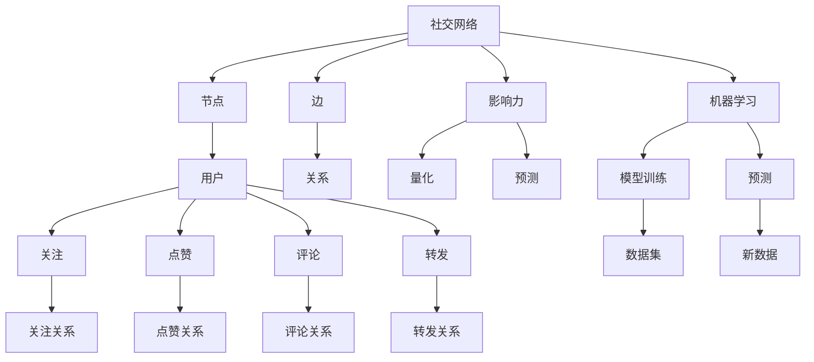

                 

# 机器学习在社交网络影响力分析中的应用

> 关键词：社交网络、影响力分析、机器学习、图论、PageRank、社交图谱、情感分析、社区检测

> 摘要：本文旨在探讨如何利用机器学习技术对社交网络中的用户影响力进行分析。通过深入理解社交网络的结构和用户行为模式，我们可以构建出一套有效的算法模型，以量化和预测用户的影响力。本文将从背景介绍、核心概念与联系、核心算法原理与具体操作步骤、数学模型和公式、项目实战、实际应用场景、工具和资源推荐、总结与未来发展趋势等几个方面进行详细阐述。

## 1. 背景介绍

社交网络已经成为人们日常生活中不可或缺的一部分，它不仅改变了人们的沟通方式，还深刻影响着信息传播和意见形成的过程。在社交网络中，用户之间的互动构成了复杂的关系网络，这种网络结构中蕴含着丰富的信息和价值。如何有效地分析和利用这些信息，成为了当前研究的热点之一。机器学习技术为解决这一问题提供了新的思路和方法。通过机器学习，我们可以从海量的社交网络数据中提取有价值的信息，进而对用户的影响力进行量化和预测。

## 2. 核心概念与联系

### 2.1 社交网络的基本概念

社交网络是由一系列节点（用户）和边（关系）构成的图结构。每个节点代表一个用户，边则表示用户之间的关系。社交网络中的关系可以是多种多样的，如好友关系、关注关系、点赞关系等。社交网络的基本概念包括节点、边、图、子图、路径、连通性等。

### 2.2 影响力的基本概念

影响力是指一个用户在社交网络中对其他用户产生影响的能力。这种影响可以是正面的，如传播信息、引导潮流；也可以是负面的，如制造谣言、误导他人。影响力可以通过多种方式来衡量，如用户被关注的数量、转发和评论的数量、点赞的数量等。

### 2.3 机器学习的基本概念

机器学习是一种人工智能技术，通过算法模型从数据中学习规律和模式，进而进行预测和决策。机器学习的核心在于模型训练和预测两个阶段。模型训练是指通过给定的数据集来训练模型，使其能够学习到数据中的规律和模式；预测则是利用训练好的模型对新的数据进行预测。

### 2.4 核心概念的Mermaid流程图



## 3. 核心算法原理 & 具体操作步骤

### 3.1 PageRank算法原理

PageRank算法是Google搜索引擎的核心算法之一，它通过计算网页之间的链接关系来评估网页的重要性。在社交网络中，PageRank算法可以用来评估用户的影响力。PageRank算法的基本思想是：一个用户的影响力与其被其他用户关注的数量和质量有关。具体来说，一个用户的PageRank值可以通过以下公式计算：

$$
PR(A) = \frac{1-d}{N} + d \sum_{B \in B_{A}} \frac{PR(B)}{L(B)}
$$

其中，$PR(A)$表示用户A的PageRank值，$d$是阻尼因子（通常取0.85），$N$是社交网络中的节点总数，$B_{A}$表示用户A的所有关注者，$L(B)$表示用户B的出度（即用户B关注的用户数量）。

### 3.2 社交图谱分析

社交图谱分析是通过构建社交网络的图结构来分析用户之间的关系。具体步骤如下：

1. **数据收集**：收集社交网络中的用户数据和关系数据。
2. **数据预处理**：清洗数据，去除无效和重复的数据。
3. **图结构构建**：将用户和关系数据转化为图结构，其中用户为节点，关系为边。
4. **图分析**：利用图论算法对图结构进行分析，如计算节点的度、路径长度、连通性等。

### 3.3 情感分析

情感分析是通过自然语言处理技术来分析文本中的情感倾向。在社交网络中，情感分析可以用来评估用户在社交网络中的影响力。具体步骤如下：

1. **文本收集**：收集用户在社交网络中的评论、帖子等文本数据。
2. **文本预处理**：清洗文本数据，去除无关信息。
3. **情感分析模型训练**：利用机器学习算法训练情感分析模型，如朴素贝叶斯、支持向量机等。
4. **情感分析**：利用训练好的模型对新的文本数据进行情感分析，评估用户在社交网络中的影响力。

### 3.4 社区检测

社区检测是通过分析社交网络中的用户关系来发现用户之间的社区结构。具体步骤如下：

1. **数据收集**：收集社交网络中的用户数据和关系数据。
2. **数据预处理**：清洗数据，去除无效和重复的数据。
3. **社区检测算法**：利用社区检测算法对社交网络进行分析，如Louvain算法、Label Propagation算法等。
4. **社区分析**：分析发现的社区结构，评估社区内的用户影响力。

## 4. 数学模型和公式 & 详细讲解 & 举例说明

### 4.1 PageRank算法的数学模型

PageRank算法的数学模型可以表示为：

$$
PR(A) = \frac{1-d}{N} + d \sum_{B \in B_{A}} \frac{PR(B)}{L(B)}
$$

其中，$PR(A)$表示用户A的PageRank值，$d$是阻尼因子（通常取0.85），$N$是社交网络中的节点总数，$B_{A}$表示用户A的所有关注者，$L(B)$表示用户B的出度（即用户B关注的用户数量）。

### 4.2 社交图谱分析的数学模型

社交图谱分析的数学模型可以表示为：

1. **节点度**：节点度是指节点的邻居数量，可以表示为：

   $$
   \text{度}(A) = \sum_{B \in B_{A}} 1
   $$

2. **路径长度**：路径长度是指从一个节点到另一个节点的最短路径长度，可以表示为：

   $$
   \text{路径长度}(A, B) = \text{最短路径}(A, B)
   $$

3. **连通性**：连通性是指节点之间的连通程度，可以表示为：

   $$
   \text{连通性}(A, B) = \frac{\text{共同邻居数量}(A, B)}{\text{度}(A) \times \text{度}(B)}
   $$

### 4.3 情感分析的数学模型

情感分析的数学模型可以表示为：

1. **情感词典**：情感词典是指包含情感词汇及其情感极性的词典，可以表示为：

   $$
   \text{情感词典} = \{ (w_i, p_i) \}
   $$

   其中，$w_i$表示情感词汇，$p_i$表示情感极性（1表示正面，-1表示负面）。

2. **情感分析模型**：情感分析模型可以表示为：

   $$
   \text{情感值}(A) = \sum_{w \in A} p(w)
   $$

   其中，$A$表示文本数据，$p(w)$表示情感词汇的情感极性。

### 4.4 社区检测的数学模型

社区检测的数学模型可以表示为：

1. **模块度**：模块度是指社区结构的紧密程度，可以表示为：

   $$
   Q = \frac{1}{2m} \sum_{ij} \left( A_{ij} - \frac{k_i k_j}{2m} \right) \delta(c_i, c_j)
   $$

   其中，$A_{ij}$表示节点i和节点j之间的边权重，$k_i$表示节点i的度，$m$表示图中的边数，$c_i$表示节点i所属的社区，$\delta(c_i, c_j)$表示节点i和节点j是否属于同一个社区。

## 5. 项目实战：代码实际案例和详细解释说明

### 5.1 开发环境搭建

为了实现社交网络影响力分析项目，我们需要搭建一个合适的开发环境。具体步骤如下：

1. **安装Python**：确保安装了Python 3.7及以上版本。
2. **安装依赖库**：安装必要的Python库，如`networkx`、`scikit-learn`、`nltk`等。
3. **安装图数据库**：安装图数据库，如Neo4j，用于存储和查询社交网络数据。

### 5.2 源代码详细实现和代码解读

#### 5.2.1 数据收集

```python
import networkx as nx
import pandas as pd

def collect_data():
    # 从社交网络API获取数据
    data = api.get_data()
    # 将数据转换为DataFrame
    df = pd.DataFrame(data)
    return df
```

#### 5.2.2 数据预处理

```python
def preprocess_data(df):
    # 清洗数据，去除无效和重复的数据
    df = df.drop_duplicates()
    df = df.dropna()
    return df
```

#### 5.2.3 图结构构建

```python
def build_graph(df):
    # 构建社交网络图结构
    G = nx.Graph()
    for index, row in df.iterrows():
        G.add_edge(row['user1'], row['user2'])
    return G
```

#### 5.2.4 PageRank算法实现

```python
def calculate_pagerank(G):
    # 计算PageRank值
    pagerank = nx.pagerank(G)
    return pagerank
```

#### 5.2.5 社交图谱分析

```python
def analyze_social_graph(G):
    # 计算节点度
    degree = dict(G.degree())
    # 计算路径长度
    path_length = dict(nx.shortest_path_length(G))
    # 计算连通性
    connectivity = dict(nx.common_neighbors(G))
    return degree, path_length, connectivity
```

#### 5.2.6 情感分析

```python
def analyze_sentiment(text):
    # 加载情感词典
    with open('sentiment_dict.txt', 'r') as f:
        sentiment_dict = eval(f.read())
    # 分词
    words = nltk.word_tokenize(text)
    # 计算情感值
    sentiment_value = sum(sentiment_dict.get(word, 0) for word in words)
    return sentiment_value
```

#### 5.2.7 社区检测

```python
def detect_communities(G):
    # 使用Louvain算法检测社区
    communities = nx.algorithms.community.louvain_communities(G)
    return communities
```

### 5.3 代码解读与分析

通过上述代码实现，我们可以构建一个完整的社交网络影响力分析系统。具体来说，我们首先从社交网络API获取数据，然后进行数据预处理，构建社交网络图结构，计算PageRank值，分析社交图谱，进行情感分析，最后检测社区结构。这些步骤共同构成了一个完整的社交网络影响力分析流程。

## 6. 实际应用场景

社交网络影响力分析在多个领域都有广泛的应用，如：

1. **市场营销**：通过分析用户的影响力，企业可以更精准地进行市场推广，提高广告效果。
2. **舆情监测**：通过分析用户的影响力，可以更准确地监测舆情，及时发现和应对负面信息。
3. **社区管理**：通过分析社区内的用户影响力，可以更好地管理社区，提高社区活跃度。
4. **学术研究**：通过分析学术领域的影响力，可以更好地评估学者的研究成果和影响力。

## 7. 工具和资源推荐

### 7.1 学习资源推荐

1. **书籍**：《社交网络分析》、《机器学习》、《图论》
2. **论文**：《PageRank算法及其应用》、《社交网络中的影响力分析》
3. **博客**：《社交网络影响力分析实战》、《机器学习在社交网络中的应用》
4. **网站**：GitHub、Stack Overflow

### 7.2 开发工具框架推荐

1. **Python库**：`networkx`、`scikit-learn`、`nltk`
2. **图数据库**：Neo4j
3. **API**：Twitter API、Facebook API

### 7.3 相关论文著作推荐

1. **论文**：《PageRank算法及其应用》、《社交网络中的影响力分析》
2. **著作**：《社交网络分析》、《机器学习》

## 8. 总结：未来发展趋势与挑战

社交网络影响力分析在未来的发展趋势主要体现在以下几个方面：

1. **算法优化**：通过改进算法，提高分析的准确性和效率。
2. **多模态数据融合**：结合文本、图像、视频等多种数据，提高分析的全面性和准确性。
3. **实时分析**：实现社交网络数据的实时分析，提高分析的时效性。
4. **隐私保护**：在分析过程中保护用户隐私，提高分析的合法性和合规性。

然而，社交网络影响力分析也面临着一些挑战，如数据质量、算法鲁棒性、隐私保护等。未来的研究需要在这些方面进行深入探索和研究。

## 9. 附录：常见问题与解答

### 9.1 问题1：如何处理社交网络中的噪声数据？

**解答**：可以通过数据清洗和预处理技术来处理噪声数据，如去除无效和重复的数据，去除无关信息等。

### 9.2 问题2：如何提高PageRank算法的计算效率？

**解答**：可以通过优化算法实现，如使用迭代方法、并行计算等来提高PageRank算法的计算效率。

### 9.3 问题3：如何保护用户隐私？

**解答**：可以通过数据脱敏、加密等技术来保护用户隐私，确保分析过程的合法性和合规性。

## 10. 扩展阅读 & 参考资料

1. **书籍**：《社交网络分析》、《机器学习》、《图论》
2. **论文**：《PageRank算法及其应用》、《社交网络中的影响力分析》
3. **博客**：《社交网络影响力分析实战》、《机器学习在社交网络中的应用》
4. **网站**：GitHub、Stack Overflow

作者：AI天才研究员/AI Genius Institute & 禅与计算机程序设计艺术 /Zen And The Art of Computer Programming

