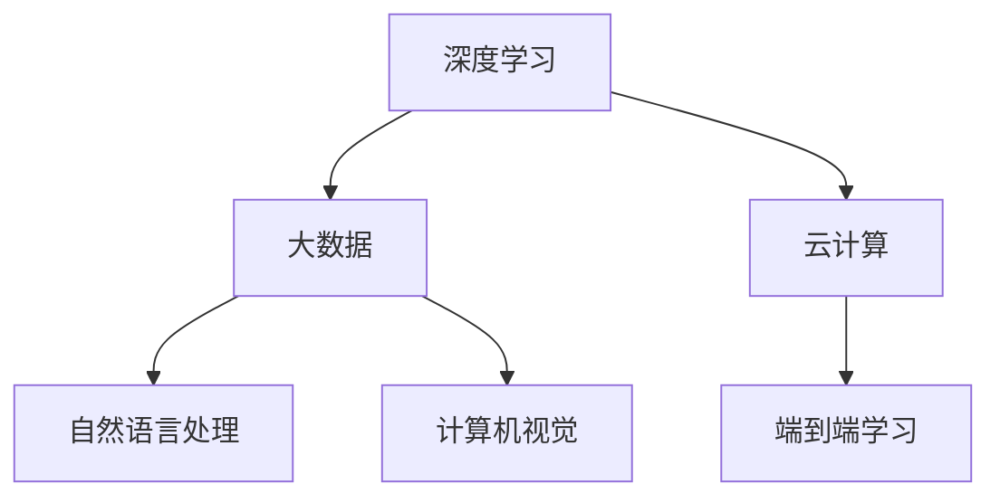

                 

# 李开复：AI 2.0 时代的文化价值

> 关键词：AI 2.0, 文化价值, 人工智能, 伦理, 社会影响, 未来趋势

> 摘要：本文旨在探讨AI 2.0时代文化价值的演变，从技术、伦理、社会影响等多个维度进行深入剖析。通过逐步分析AI 2.0的核心概念、算法原理、实际应用案例，以及未来的发展趋势和挑战，本文旨在为读者提供一个全面而深刻的视角，理解AI 2.0如何塑造我们的文化和社会。

## 1. 背景介绍

### 1.1 AI 1.0 时代的回顾
AI 1.0时代始于20世纪50年代，以符号主义和专家系统为代表，主要关注逻辑推理和知识表示。这一阶段的AI系统在特定任务上取得了显著成就，但受限于计算能力和数据量，其应用范围有限。

### 1.2 AI 2.0 时代的到来
进入21世纪，随着大数据、云计算和深度学习技术的迅猛发展，AI 2.0时代应运而生。这一阶段的AI系统能够处理大规模数据，实现端到端的学习，展现出前所未有的智能水平。AI 2.0不仅在技术上取得了突破，更在文化和社会层面产生了深远影响。

## 2. 核心概念与联系

### 2.1 AI 2.0 的核心概念
- **深度学习**：通过多层神经网络实现复杂模式识别。
- **大数据**：海量数据的处理和分析。
- **云计算**：提供强大的计算资源和存储能力。
- **自然语言处理**：使机器能够理解、生成和翻译自然语言。
- **计算机视觉**：赋予机器识别和理解图像的能力。

### 2.2 核心概念的Mermaid流程图


## 3. 核心算法原理 & 具体操作步骤

### 3.1 深度学习算法原理
深度学习的核心在于多层神经网络，通过反向传播算法优化权重，实现对复杂模式的识别和分类。

### 3.2 具体操作步骤
1. **数据预处理**：清洗、归一化、特征提取。
2. **模型构建**：选择合适的神经网络架构。
3. **训练模型**：使用反向传播算法优化权重。
4. **模型评估**：通过验证集评估模型性能。
5. **模型优化**：调整超参数，提高模型效果。

## 4. 数学模型和公式 & 详细讲解 & 举例说明

### 4.1 深度学习中的数学模型
- **损失函数**：衡量预测值与真实值之间的差异。
- **梯度下降**：优化权重的算法。

### 4.2 公式与详细讲解
$$
\text{损失函数} = \frac{1}{N} \sum_{i=1}^{N} (y_i - \hat{y}_i)^2
$$
其中，$y_i$是真实值，$\hat{y}_i$是预测值，$N$是样本数量。

### 4.3 举例说明
假设我们有一个简单的线性回归问题，目标是预测房价。我们可以通过以下步骤进行训练：
1. **数据预处理**：清洗数据，归一化特征。
2. **模型构建**：选择线性回归模型。
3. **训练模型**：使用梯度下降算法优化权重。
4. **模型评估**：通过验证集评估模型性能。
5. **模型优化**：调整学习率，提高模型效果。

## 5. 项目实战：代码实际案例和详细解释说明

### 5.1 开发环境搭建
- **Python**：安装Anaconda，配置环境。
- **深度学习框架**：安装TensorFlow或PyTorch。

### 5.2 源代码详细实现和代码解读
```python
import numpy as np
import tensorflow as tf

# 数据预处理
def preprocess_data(data):
    # 清洗数据
    # 归一化特征
    return normalized_data

# 模型构建
def build_model(input_shape):
    model = tf.keras.Sequential([
        tf.keras.layers.Dense(64, activation='relu', input_shape=input_shape),
        tf.keras.layers.Dense(64, activation='relu'),
        tf.keras.layers.Dense(1)
    ])
    return model

# 训练模型
def train_model(model, X_train, y_train, epochs=10):
    model.compile(optimizer='adam', loss='mean_squared_error')
    model.fit(X_train, y_train, epochs=epochs)

# 模型评估
def evaluate_model(model, X_test, y_test):
    loss = model.evaluate(X_test, y_test)
    return loss

# 主函数
def main():
    # 加载数据
    data = np.load('data.npy')
    X_train, y_train, X_test, y_test = preprocess_data(data)
    
    # 构建模型
    model = build_model(input_shape=(X_train.shape[1],))
    
    # 训练模型
    train_model(model, X_train, y_train)
    
    # 评估模型
    loss = evaluate_model(model, X_test, y_test)
    print(f'Loss: {loss}')

if __name__ == '__main__':
    main()
```

### 5.3 代码解读与分析
- **数据预处理**：清洗和归一化数据。
- **模型构建**：构建一个简单的多层神经网络。
- **训练模型**：使用Adam优化器和均方误差损失函数进行训练。
- **模型评估**：评估模型在测试集上的性能。

## 6. 实际应用场景

### 6.1 自然语言处理
- **情感分析**：通过分析文本情感，帮助企业了解用户反馈。
- **机器翻译**：实现跨语言交流，促进全球信息共享。

### 6.2 计算机视觉
- **图像识别**：应用于安防监控、医疗影像分析等领域。
- **自动驾驶**：通过识别道路标志和行人，提高驾驶安全性。

## 7. 工具和资源推荐

### 7.1 学习资源推荐
- **书籍**：《深度学习》（Ian Goodfellow, Yoshua Bengio, Aaron Courville）
- **论文**：《Attention Is All You Need》（Vaswani et al.）
- **博客**：Medium上的AI相关博客
- **网站**：Kaggle、GitHub

### 7.2 开发工具框架推荐
- **深度学习框架**：TensorFlow、PyTorch
- **数据处理工具**：Pandas、NumPy
- **可视化工具**：Matplotlib、Seaborn

### 7.3 相关论文著作推荐
- **论文**：《Generative Adversarial Networks》（Goodfellow et al.）
- **著作**：《AI Superpowers》（Kai-Fu Lee）

## 8. 总结：未来发展趋势与挑战

### 8.1 未来发展趋势
- **技术融合**：AI与其他技术（如物联网、区块链）的融合。
- **个性化服务**：提供更加个性化的用户体验。
- **伦理规范**：建立更加完善的伦理规范和法律框架。

### 8.2 挑战
- **数据隐私**：保护用户数据隐私，防止滥用。
- **算法偏见**：减少算法偏见，确保公平性。
- **就业影响**：应对AI对就业市场的冲击。

## 9. 附录：常见问题与解答

### 9.1 问题1：如何处理大规模数据？
- **答案**：使用分布式计算框架（如Spark）和高效的存储解决方案（如Hadoop）。

### 9.2 问题2：如何避免算法偏见？
- **答案**：确保训练数据的多样性和代表性，进行公平性评估。

## 10. 扩展阅读 & 参考资料

- **书籍**：《AI Superpowers》（Kai-Fu Lee）
- **论文**：《Attention Is All You Need》（Vaswani et al.）
- **网站**：Kaggle、GitHub

---

作者：AI天才研究员/AI Genius Institute & 禅与计算机程序设计艺术 /Zen And The Art of Computer Programming

