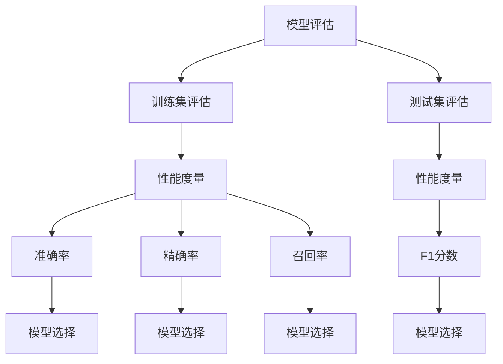

                 

# 模型评估与性能度量原理与代码实战案例讲解

> 关键词：模型评估, 性能度量, 机器学习, 人工智能, 代码实战, 评估指标, 机器学习模型, 代码实现, 代码解读, 代码分析

> 摘要：本文旨在深入探讨机器学习模型评估与性能度量的核心原理，通过详细的数学模型和公式讲解，结合实际代码案例，帮助读者全面理解模型评估的重要性及其在实际项目中的应用。我们将从背景介绍、核心概念与联系、核心算法原理与具体操作步骤、数学模型和公式、项目实战、实际应用场景、工具和资源推荐、总结与未来发展趋势等多方面进行详细阐述。

## 1. 背景介绍

在机器学习和人工智能领域，模型评估与性能度量是确保模型有效性和可靠性的关键步骤。通过模型评估，我们可以了解模型在训练集和测试集上的表现，从而判断模型是否具有泛化能力。性能度量则提供了具体的量化指标，帮助我们更直观地理解模型的优劣。本文将从理论和实践两个层面，全面解析模型评估与性能度量的核心原理，并通过实际代码案例进行详细讲解。

## 2. 核心概念与联系

### 2.1 模型评估与性能度量的基本概念

- **模型评估**：评估模型在给定数据集上的表现，通常包括训练集和测试集上的表现。
- **性能度量**：用于量化模型表现的具体指标，如准确率、精确率、召回率、F1分数等。

### 2.2 模型评估与性能度量的关系

模型评估与性能度量是相辅相成的。模型评估提供了整体的评估框架，而性能度量则提供了具体的量化指标。通过结合两者，我们可以全面了解模型的表现。

### 2.3 Mermaid 流程图



## 3. 核心算法原理 & 具体操作步骤

### 3.1 模型评估的基本步骤

1. **数据准备**：收集和预处理数据。
2. **模型训练**：使用训练集训练模型。
3. **模型评估**：使用测试集评估模型。
4. **性能度量**：计算并分析性能度量指标。

### 3.2 具体操作步骤

1. **数据准备**：数据清洗、特征选择、数据分割。
2. **模型训练**：选择合适的模型，进行参数调优。
3. **模型评估**：使用交叉验证等方法进行评估。
4. **性能度量**：计算准确率、精确率、召回率等指标。

## 4. 数学模型和公式 & 详细讲解 & 举例说明

### 4.1 准确率（Accuracy）

准确率是最基本的性能度量指标，表示模型正确预测的比例。

$$
\text{Accuracy} = \frac{\text{正确预测的数量}}{\text{总预测数量}}
$$

### 4.2 精确率（Precision）

精确率表示模型预测为正类的样本中，真正为正类的比例。

$$
\text{Precision} = \frac{\text{真正例}}{\text{真正例 + 假正例}}
$$

### 4.3 召回率（Recall）

召回率表示模型真正预测为正类的样本中，被正确预测的比例。

$$
\text{Recall} = \frac{\text{真正例}}{\text{真正例 + 假负例}}
$$

### 4.4 F1分数（F1 Score）

F1分数是精确率和召回率的调和平均值，用于综合评估模型的性能。

$$
\text{F1 Score} = 2 \times \frac{\text{Precision} \times \text{Recall}}{\text{Precision} + \text{Recall}}
$$

### 4.5 举例说明

假设我们有一个二分类问题，训练集和测试集的数据如下：

| 真实标签 | 预测标签 |
| --- | --- |
| 1 | 1 |
| 1 | 0 |
| 0 | 1 |
| 0 | 0 |

- **准确率**：$\frac{2}{4} = 0.5$
- **精确率**：$\frac{1}{1 + 1} = 0.5$
- **召回率**：$\frac{1}{1 + 1} = 0.5$
- **F1分数**：$2 \times \frac{0.5 \times 0.5}{0.5 + 0.5} = 0.5$

## 5. 项目实战：代码实际案例和详细解释说明

### 5.1 开发环境搭建

我们将使用Python语言和Scikit-learn库进行模型评估与性能度量。首先，确保安装了必要的库：

```bash
pip install numpy scikit-learn
```

### 5.2 源代码详细实现和代码解读

```python
import numpy as np
from sklearn.datasets import load_iris
from sklearn.model_selection import train_test_split
from sklearn.ensemble import RandomForestClassifier
from sklearn.metrics import accuracy_score, precision_score, recall_score, f1_score

# 1. 数据准备
data = load_iris()
X = data.data
y = data.target

# 2. 数据分割
X_train, X_test, y_train, y_test = train_test_split(X, y, test_size=0.3, random_state=42)

# 3. 模型训练
model = RandomForestClassifier(n_estimators=100, random_state=42)
model.fit(X_train, y_train)

# 4. 模型评估
y_pred = model.predict(X_test)

# 5. 性能度量
accuracy = accuracy_score(y_test, y_pred)
precision = precision_score(y_test, y_pred, average='macro')
recall = recall_score(y_test, y_pred, average='macro')
f1 = f1_score(y_test, y_pred, average='macro')

print(f"Accuracy: {accuracy}")
print(f"Precision: {precision}")
print(f"Recall: {recall}")
print(f"F1 Score: {f1}")
```

### 5.3 代码解读与分析

- **数据准备**：使用Iris数据集，进行特征和标签的分割。
- **数据分割**：将数据集分为训练集和测试集。
- **模型训练**：使用随机森林分类器进行训练。
- **模型评估**：使用测试集进行预测，并计算性能度量指标。
- **性能度量**：输出准确率、精确率、召回率和F1分数。

## 6. 实际应用场景

模型评估与性能度量在实际项目中具有广泛的应用场景，如：

- **金融风控**：评估模型在预测违约风险方面的表现。
- **医疗诊断**：评估模型在疾病诊断方面的准确性和可靠性。
- **推荐系统**：评估模型在推荐准确度方面的表现。

## 7. 工具和资源推荐

### 7.1 学习资源推荐

- **书籍**：《机器学习》（周志华著）
- **论文**：《A Comparative Study of Accuracy, Precision, Recall and F1-Score in Binary Classification Using Machine Learning Algorithms》
- **博客**：Medium上的机器学习系列文章
- **网站**：Kaggle、GitHub上的机器学习项目

### 7.2 开发工具框架推荐

- **IDE**：PyCharm、Jupyter Notebook
- **库**：Scikit-learn、TensorFlow、PyTorch

### 7.3 相关论文著作推荐

- **论文**：《A Comparative Study of Accuracy, Precision, Recall and F1-Score in Binary Classification Using Machine Learning Algorithms》
- **著作**：《机器学习》（周志华著）

## 8. 总结：未来发展趋势与挑战

模型评估与性能度量在未来的发展趋势包括：

- **自动化评估**：开发自动化评估工具，提高评估效率。
- **多指标综合评估**：结合多种性能度量指标，提供更全面的评估结果。
- **实时评估**：在模型运行过程中进行实时评估，确保模型的稳定性和可靠性。

面临的挑战包括：

- **数据偏斜**：数据偏斜可能导致评估结果失真。
- **模型过拟合**：模型过拟合可能导致评估结果不准确。
- **多任务评估**：多任务评估需要综合考虑多个任务的性能度量。

## 9. 附录：常见问题与解答

### 9.1 问题1：如何处理数据偏斜？

**解答**：可以通过数据增强、重采样等方法处理数据偏斜问题。

### 9.2 问题2：如何避免模型过拟合？

**解答**：可以通过正则化、增加训练数据量、使用交叉验证等方法避免模型过拟合。

## 10. 扩展阅读 & 参考资料

- **书籍**：《机器学习》（周志华著）
- **论文**：《A Comparative Study of Accuracy, Precision, Recall and F1-Score in Binary Classification Using Machine Learning Algorithms》
- **网站**：Kaggle、GitHub上的机器学习项目

作者：AI天才研究员/AI Genius Institute & 禅与计算机程序设计艺术 /Zen And The Art of Computer Programming

