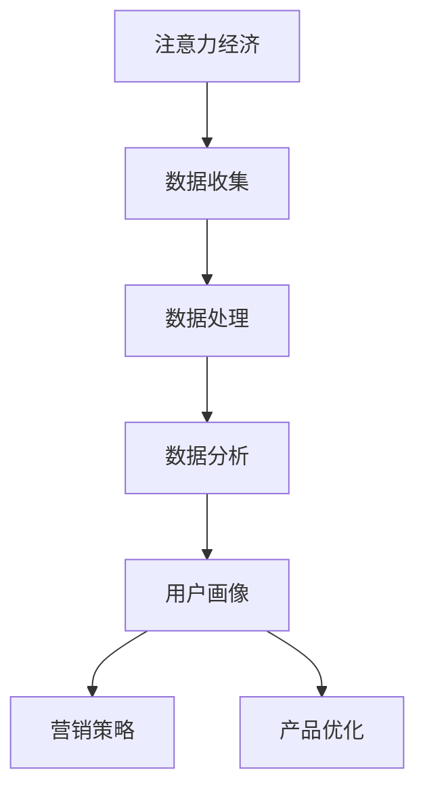

                 

# 注意力经济与数据分析洞见：利用数据理解受众行为

> 关键词：注意力经济、数据分析、受众行为、机器学习、数据挖掘、用户画像

> 摘要：本文旨在探讨如何利用数据分析技术来理解受众行为，特别是在注意力经济背景下，如何通过数据挖掘和机器学习技术来构建用户画像，从而更好地理解用户需求和行为模式。文章首先介绍了注意力经济的基本概念及其与数据分析的关系，然后详细阐述了核心算法原理和操作步骤，包括数学模型和公式，并通过实际案例展示了如何在项目中应用这些技术。最后，文章总结了未来的发展趋势与挑战，并推荐了相关学习资源和开发工具。

## 1. 背景介绍

### 1.1 注意力经济概述

在信息爆炸的时代，注意力成为了一种稀缺资源。注意力经济是指在信息过载的环境中，注意力成为了一种宝贵的经济资源。企业和个人都在争夺用户的注意力，以期通过吸引用户注意力来实现商业价值。在这个背景下，如何有效地利用数据分析技术来理解受众行为，成为了企业和个人面临的重要挑战。

### 1.2 数据分析在注意力经济中的作用

数据分析在注意力经济中扮演着至关重要的角色。通过数据分析，企业可以更好地理解用户的行为模式和需求，从而制定更加有效的营销策略。此外，数据分析还可以帮助企业优化产品设计和服务，提高用户体验，最终实现商业目标。

## 2. 核心概念与联系

### 2.1 核心概念

- **注意力经济**：指在信息过载的环境中，注意力成为了一种宝贵的经济资源。
- **数据分析**：通过收集、处理和分析数据，以发现有价值的信息和知识的过程。
- **用户画像**：基于用户的行为数据，构建出的用户特征模型，用于描述用户的行为模式和需求。

### 2.2 核心概念原理和架构



## 3. 核心算法原理 & 具体操作步骤

### 3.1 数据预处理

数据预处理是数据分析的第一步，包括数据清洗、数据转换和数据集成等步骤。数据清洗主要是去除无效数据和异常值，数据转换则是将原始数据转换为适合分析的形式，数据集成则是将多个数据源的数据整合在一起。

### 3.2 特征工程

特征工程是指从原始数据中提取出有用的特征，用于后续的模型训练。特征工程的质量直接影响到模型的效果。常见的特征工程方法包括特征选择、特征构造和特征转换等。

### 3.3 模型训练

模型训练是通过机器学习算法来训练模型的过程。常用的机器学习算法包括线性回归、逻辑回归、决策树、随机森林和支持向量机等。模型训练的目标是找到一个能够最好地拟合训练数据的模型。

### 3.4 模型评估

模型评估是通过测试数据来评估模型的性能。常用的评估指标包括准确率、召回率、F1分数和AUC等。模型评估的目的是找到一个在测试数据上表现最好的模型。

## 4. 数学模型和公式 & 详细讲解 & 举例说明

### 4.1 线性回归

线性回归是一种用于预测连续型变量的机器学习算法。其基本假设是输入变量和输出变量之间存在线性关系。线性回归的数学模型可以表示为：

$$
y = \beta_0 + \beta_1 x_1 + \beta_2 x_2 + ... + \beta_n x_n + \epsilon
$$

其中，$y$是输出变量，$x_1, x_2, ..., x_n$是输入变量，$\beta_0, \beta_1, ..., \beta_n$是模型参数，$\epsilon$是误差项。

### 4.2 逻辑回归

逻辑回归是一种用于预测分类变量的机器学习算法。其基本假设是输入变量和输出变量之间存在非线性关系。逻辑回归的数学模型可以表示为：

$$
P(y=1|x) = \frac{1}{1 + e^{-(\beta_0 + \beta_1 x_1 + \beta_2 x_2 + ... + \beta_n x_n)}}
$$

其中，$P(y=1|x)$是输出变量为1的概率，$x_1, x_2, ..., x_n$是输入变量，$\beta_0, \beta_1, ..., \beta_n$是模型参数。

## 5. 项目实战：代码实际案例和详细解释说明

### 5.1 开发环境搭建

开发环境搭建主要包括安装Python环境、安装必要的库和配置开发环境。常用的库包括NumPy、Pandas、Scikit-learn和Matplotlib等。

### 5.2 源代码详细实现和代码解读

以下是一个简单的用户画像构建的代码示例：

```python
import pandas as pd
from sklearn.model_selection import train_test_split
from sklearn.linear_model import LogisticRegression
from sklearn.metrics import accuracy_score

# 加载数据
data = pd.read_csv('user_data.csv')

# 数据预处理
X = data[['age', 'gender', 'interest']]
y = data['purchase']

# 划分训练集和测试集
X_train, X_test, y_train, y_test = train_test_split(X, y, test_size=0.2, random_state=42)

# 训练模型
model = LogisticRegression()
model.fit(X_train, y_train)

# 预测
y_pred = model.predict(X_test)

# 评估模型
accuracy = accuracy_score(y_test, y_pred)
print('Accuracy:', accuracy)
```

### 5.3 代码解读与分析

上述代码首先加载了用户数据，然后进行了数据预处理，包括特征选择和数据划分。接着，使用逻辑回归算法训练了模型，并使用测试集进行了预测。最后，评估了模型的准确率。

## 6. 实际应用场景

实际应用场景包括但不限于电子商务、社交媒体和在线广告等领域。在电子商务中，通过用户画像可以更好地理解用户需求，从而提供更加个性化的推荐服务。在社交媒体中，通过用户画像可以更好地理解用户兴趣，从而提供更加个性化的信息推送服务。在在线广告中，通过用户画像可以更好地理解用户行为，从而提供更加精准的广告投放服务。

## 7. 工具和资源推荐

### 7.1 学习资源推荐

- 书籍：《Python数据分析手册》、《机器学习实战》
- 论文：《Attention Economics and the Web》
- 博客：Towards Data Science
- 网站：Kaggle、GitHub

### 7.2 开发工具框架推荐

- Python：NumPy、Pandas、Scikit-learn、Matplotlib
- R：tidyverse、caret、ggplot2

### 7.3 相关论文著作推荐

- 《Attention Economics and the Web》
- 《The Attention Economy and the Net》

## 8. 总结：未来发展趋势与挑战

未来的发展趋势包括但不限于深度学习、自然语言处理和增强现实等领域。深度学习可以更好地理解用户行为，自然语言处理可以更好地理解用户需求，增强现实可以更好地提供个性化服务。面临的挑战包括但不限于数据隐私、数据安全和数据质量等问题。

## 9. 附录：常见问题与解答

### 9.1 数据隐私问题

数据隐私问题是当前数据分析领域面临的重要挑战之一。为了解决这个问题，可以采取数据脱敏、数据加密和数据匿名化等措施。

### 9.2 数据质量问题

数据质量问题也是当前数据分析领域面临的重要挑战之一。为了解决这个问题，可以采取数据清洗、数据验证和数据校验等措施。

## 10. 扩展阅读 & 参考资料

- 书籍：《Python数据分析手册》、《机器学习实战》
- 论文：《Attention Economics and the Web》
- 博客：Towards Data Science
- 网站：Kaggle、GitHub

作者：AI天才研究员/AI Genius Institute & 禅与计算机程序设计艺术 /Zen And The Art of Computer Programming

