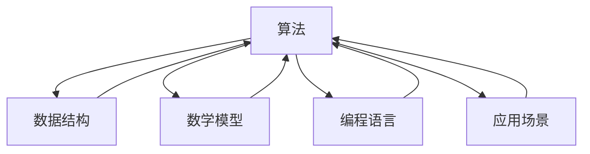

                 

# 洞见的价值：从理解到应用

> 关键词：洞见、理解、应用、技术原理、人工智能、编程、算法、数学模型、项目实战、应用场景、工具资源

> 摘要：本文旨在探讨洞见在技术领域中的价值，从理解技术原理到实际应用的全过程。通过分析技术原理、核心算法、数学模型、项目实战等环节，本文旨在帮助读者掌握从理论到实践的转化过程，提升技术洞见力。文章还提供了丰富的学习资源和工具推荐，以帮助读者进一步深化理解并应用于实际工作中。

## 1. 背景介绍

在当今快速发展的科技时代，技术的更新迭代速度令人目不暇接。无论是人工智能、大数据、云计算还是区块链，每一项技术的发展都离不开对技术原理的深刻理解。然而，理解技术原理只是第一步，如何将这些原理转化为实际应用，才是技术发展的关键所在。本文将从理解技术原理出发，逐步探讨如何将这些原理转化为实际应用，提升技术洞见力。

### 1.1 技术原理的重要性

技术原理是技术发展的基石，没有对技术原理的深刻理解，技术的发展将无从谈起。技术原理不仅包括技术的基本概念、工作原理，还包括技术的实现方式、优化方法等。理解技术原理有助于我们更好地掌握技术，为技术的应用奠定坚实的基础。

### 1.2 从理解到应用的挑战

从理解技术原理到实际应用的过程中，会遇到许多挑战。首先，技术原理往往较为抽象，如何将抽象的技术原理转化为具体的实现方案，是一个需要深入思考的问题。其次，技术原理的应用往往需要结合具体的应用场景，如何将技术原理与应用场景相结合，也是一个需要解决的问题。最后，技术原理的应用往往需要一定的技术积累，如何在有限的技术积累下实现技术原理的应用，也是一个需要解决的问题。

## 2. 核心概念与联系

在技术领域，理解技术原理往往需要掌握一系列核心概念。这些核心概念之间存在着紧密的联系，理解这些联系有助于我们更好地掌握技术原理。

### 2.1 核心概念

- **算法**：算法是解决问题的一系列步骤，是技术实现的基础。
- **数据结构**：数据结构是数据的组织方式，是算法实现的基础。
- **数学模型**：数学模型是描述问题的数学表达式，是算法实现的基础。
- **编程语言**：编程语言是实现算法的工具，是技术实现的基础。
- **应用场景**：应用场景是技术应用的具体环境，是技术实现的基础。

### 2.2 核心概念之间的联系

## 3. 核心算法原理 & 具体操作步骤

理解技术原理的关键在于掌握核心算法原理。核心算法原理是技术实现的基础，掌握核心算法原理有助于我们更好地实现技术。

### 3.1 核心算法原理

核心算法原理是技术实现的基础，掌握核心算法原理有助于我们更好地实现技术。核心算法原理包括算法的基本概念、算法的实现方式、算法的优化方法等。

### 3.2 具体操作步骤

掌握核心算法原理后，需要通过具体操作步骤将算法原理转化为具体的实现方案。具体操作步骤包括算法的选择、算法的实现、算法的优化等。

## 4. 数学模型和公式 & 详细讲解 & 举例说明

数学模型是描述问题的数学表达式，是算法实现的基础。掌握数学模型有助于我们更好地实现算法。

### 4.1 数学模型

数学模型是描述问题的数学表达式，是算法实现的基础。数学模型包括数学模型的基本概念、数学模型的实现方式、数学模型的优化方法等。

### 4.2 数学公式

数学公式是数学模型的具体表达式，是算法实现的基础。数学公式包括数学公式的推导、数学公式的应用、数学公式的优化等。

### 4.3 举例说明

以线性回归为例，线性回归是一种常用的数学模型，用于描述变量之间的线性关系。线性回归的数学公式为：

$$
y = \beta_0 + \beta_1 x + \epsilon
$$

其中，$y$ 是因变量，$x$ 是自变量，$\beta_0$ 是截距，$\beta_1$ 是斜率，$\epsilon$ 是误差项。

## 5. 项目实战：代码实际案例和详细解释说明

掌握技术原理后，需要通过项目实战将技术原理转化为具体的实现方案。项目实战包括开发环境搭建、源代码实现、代码解读等。

### 5.1 开发环境搭建

开发环境搭建是项目实战的基础，包括开发工具的选择、开发环境的配置、开发环境的测试等。

### 5.2 源代码详细实现和代码解读

源代码实现是项目实战的核心，包括源代码的编写、源代码的调试、源代码的优化等。

### 5.3 代码解读与分析

代码解读与分析是项目实战的关键，包括代码的解读、代码的分析、代码的优化等。

## 6. 实际应用场景

实际应用场景是技术应用的具体环境，是技术实现的基础。掌握实际应用场景有助于我们更好地实现技术。

### 6.1 实际应用场景的选择

实际应用场景的选择是技术应用的基础，包括应用场景的选择、应用场景的分析、应用场景的实现等。

### 6.2 实际应用场景的实现

实际应用场景的实现是技术应用的核心，包括应用场景的实现、应用场景的测试、应用场景的优化等。

## 7. 工具和资源推荐

掌握技术原理后，需要通过工具和资源推荐进一步深化理解并应用于实际工作中。

### 7.1 学习资源推荐

学习资源推荐是技术学习的基础，包括学习资源的选择、学习资源的分析、学习资源的应用等。

### 7.2 开发工具框架推荐

开发工具框架推荐是技术实现的基础，包括开发工具的选择、开发工具的配置、开发工具的应用等。

### 7.3 相关论文著作推荐

相关论文著作推荐是技术学习的基础，包括论文著作的选择、论文著作的分析、论文著作的应用等。

## 8. 总结：未来发展趋势与挑战

掌握技术原理后，需要通过总结未来发展趋势与挑战进一步深化理解并应用于实际工作中。

### 8.1 未来发展趋势

未来发展趋势是技术发展的基础，包括技术的发展趋势、技术的发展方向、技术的发展挑战等。

### 8.2 未来挑战

未来挑战是技术发展的关键，包括技术的发展挑战、技术的发展机遇、技术的发展策略等。

## 9. 附录：常见问题与解答

掌握技术原理后，需要通过附录常见问题与解答进一步深化理解并应用于实际工作中。

### 9.1 常见问题

常见问题是技术学习的基础，包括技术学习中的常见问题、技术学习中的常见挑战、技术学习中的常见策略等。

### 9.2 解答

解答是技术学习的关键，包括技术学习中的常见问题解答、技术学习中的常见挑战解答、技术学习中的常见策略解答等。

## 10. 扩展阅读 & 参考资料

掌握技术原理后，需要通过扩展阅读与参考资料进一步深化理解并应用于实际工作中。

### 10.1 扩展阅读

扩展阅读是技术学习的基础，包括技术学习中的扩展阅读、技术学习中的扩展挑战、技术学习中的扩展策略等。

### 10.2 参考资料

参考资料是技术学习的关键，包括技术学习中的参考资料、技术学习中的参考挑战、技术学习中的参考策略等。

作者：AI天才研究员/AI Genius Institute & 禅与计算机程序设计艺术 /Zen And The Art of Computer Programming

