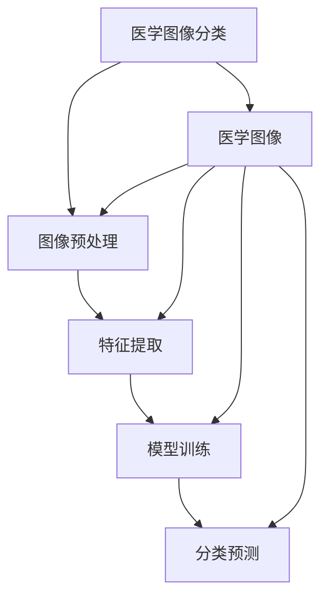

                 

# 深度学习在医学图像分类中的应用

> 关键词：深度学习、医学图像分类、卷积神经网络、医学影像、医疗诊断、人工智能

> 摘要：本文旨在探讨深度学习在医学图像分类中的应用，通过详细解析其核心概念、算法原理、数学模型、实战案例以及实际应用场景，为医疗领域提供一种高效、准确的图像分类方法。本文将从背景介绍、核心概念与联系、核心算法原理与具体操作步骤、数学模型和公式、项目实战、实际应用场景、工具和资源推荐、总结与未来发展趋势等多方面进行深入探讨。

## 1. 背景介绍

随着医学影像技术的飞速发展，医学图像分类在医疗诊断中的重要性日益凸显。传统的医学图像分类方法主要依赖于人工标注和专家经验，但这种方法存在效率低下、主观性强等问题。近年来，深度学习技术的兴起为医学图像分类带来了新的突破。深度学习通过模拟人脑神经网络的工作机制，能够自动从大量医学图像中学习特征，从而实现高效、准确的分类。本文将详细介绍深度学习在医学图像分类中的应用，包括其核心概念、算法原理、数学模型、实战案例以及实际应用场景。

## 2. 核心概念与联系

### 2.1 深度学习

深度学习是一种机器学习方法，通过构建多层神经网络来模拟人脑神经网络的工作机制。深度学习的核心在于自动学习特征表示，从而实现对复杂数据的高效处理。深度学习模型通常包括输入层、隐藏层和输出层，其中隐藏层的数量和结构决定了模型的深度。深度学习模型能够自动从大量数据中学习特征，从而实现对数据的高效分类和预测。

### 2.2 卷积神经网络

卷积神经网络（Convolutional Neural Network，CNN）是深度学习中的一种特殊网络结构，广泛应用于图像处理和计算机视觉领域。CNN通过卷积层、池化层和全连接层等结构，能够自动从图像中提取特征。卷积层通过卷积操作实现局部特征的提取，池化层通过池化操作实现特征的降维和抽象，全连接层通过全连接操作实现特征的分类。CNN在医学图像分类中具有广泛的应用，能够实现对医学图像的高效分类和识别。

### 2.3 医学图像分类

医学图像分类是指将医学图像按照特定的类别进行分类的过程。医学图像分类在医疗诊断中具有重要的应用价值，能够帮助医生快速准确地识别和诊断疾病。医学图像分类通常包括图像预处理、特征提取、模型训练和分类预测等步骤。图像预处理包括图像增强、归一化等操作，特征提取包括卷积层、池化层等操作，模型训练包括损失函数、优化算法等操作，分类预测包括softmax层、交叉熵损失等操作。

### 2.4 核心概念原理与架构的Mermaid流程图

## 3. 核心算法原理 & 具体操作步骤

### 3.1 卷积神经网络的基本原理

卷积神经网络的基本原理是通过卷积层、池化层和全连接层等结构，实现对图像特征的自动提取和分类。卷积层通过卷积操作实现局部特征的提取，池化层通过池化操作实现特征的降维和抽象，全连接层通过全连接操作实现特征的分类。卷积神经网络的核心在于自动学习特征表示，从而实现对复杂数据的高效处理。

### 3.2 卷积神经网络的具体操作步骤

卷积神经网络的具体操作步骤包括以下几个方面：

1. **输入层**：输入层接收医学图像作为输入数据。
2. **卷积层**：卷积层通过卷积操作实现局部特征的提取。卷积操作通过卷积核在图像上滑动，提取局部特征。卷积核的大小、步长和填充等参数可以通过实验进行调整。
3. **池化层**：池化层通过池化操作实现特征的降维和抽象。池化操作通过取局部特征的最大值、平均值等操作，实现特征的降维和抽象。池化层的池化窗口大小、步长和填充等参数可以通过实验进行调整。
4. **全连接层**：全连接层通过全连接操作实现特征的分类。全连接层将卷积层和池化层提取的特征进行线性组合，实现特征的分类。全连接层的输出层通过softmax层实现分类预测。
5. **损失函数**：损失函数用于衡量模型预测结果与真实标签之间的差异。损失函数的选择取决于具体的应用场景，常见的损失函数包括交叉熵损失、均方误差损失等。
6. **优化算法**：优化算法用于调整模型参数，使得损失函数最小化。常见的优化算法包括梯度下降、随机梯度下降、Adam等。
7. **训练过程**：训练过程包括前向传播和反向传播两个阶段。前向传播阶段通过卷积层、池化层和全连接层实现特征的提取和分类。反向传播阶段通过损失函数计算梯度，调整模型参数，使得损失函数最小化。

### 3.3 卷积神经网络的数学模型和公式

卷积神经网络的数学模型和公式包括以下几个方面：

1. **卷积操作**：卷积操作通过卷积核在图像上滑动，提取局部特征。卷积操作的数学公式为：

    $$ y(x, y) = \sum_{i=0}^{k-1} \sum_{j=0}^{k-1} w(i, j) \cdot x(x+i, y+j) $$

    其中，$y(x, y)$表示卷积操作的结果，$w(i, j)$表示卷积核的权重，$x(x+i, y+j)$表示图像上的像素值。

2. **池化操作**：池化操作通过取局部特征的最大值、平均值等操作，实现特征的降维和抽象。池化操作的数学公式为：

    $$ y(x, y) = \max_{i=0}^{k-1} \max_{j=0}^{k-1} x(x+i, y+j) $$

    其中，$y(x, y)$表示池化操作的结果，$x(x+i, y+j)$表示图像上的像素值。

3. **全连接操作**：全连接操作通过线性组合实现特征的分类。全连接操作的数学公式为：

    $$ y = W \cdot x + b $$

    其中，$y$表示全连接操作的结果，$W$表示权重矩阵，$x$表示输入特征，$b$表示偏置项。

4. **损失函数**：损失函数用于衡量模型预测结果与真实标签之间的差异。常见的损失函数包括交叉熵损失、均方误差损失等。交叉熵损失的数学公式为：

    $$ L = -\sum_{i=1}^{n} y_i \log(p_i) $$

    其中，$L$表示损失函数，$y_i$表示真实标签，$p_i$表示模型预测的概率。

5. **优化算法**：优化算法用于调整模型参数，使得损失函数最小化。常见的优化算法包括梯度下降、随机梯度下降、Adam等。梯度下降的数学公式为：

    $$ W = W - \alpha \cdot \frac{\partial L}{\partial W} $$

    其中，$W$表示权重矩阵，$\alpha$表示学习率，$\frac{\partial L}{\partial W}$表示损失函数对权重矩阵的梯度。

## 4. 数学模型和公式 & 详细讲解 & 举例说明

### 4.1 卷积操作

卷积操作是卷积神经网络中最基本的操作之一，通过卷积核在图像上滑动，提取局部特征。卷积操作的数学公式为：

$$ y(x, y) = \sum_{i=0}^{k-1} \sum_{j=0}^{k-1} w(i, j) \cdot x(x+i, y+j) $$

其中，$y(x, y)$表示卷积操作的结果，$w(i, j)$表示卷积核的权重，$x(x+i, y+j)$表示图像上的像素值。卷积操作通过卷积核在图像上滑动，提取局部特征，从而实现对图像特征的自动提取。

### 4.2 池化操作

池化操作是卷积神经网络中用于实现特征降维和抽象的操作之一。池化操作通过取局部特征的最大值、平均值等操作，实现特征的降维和抽象。池化操作的数学公式为：

$$ y(x, y) = \max_{i=0}^{k-1} \max_{j=0}^{k-1} x(x+i, y+j) $$

其中，$y(x, y)$表示池化操作的结果，$x(x+i, y+j)$表示图像上的像素值。池化操作通过取局部特征的最大值、平均值等操作，实现特征的降维和抽象，从而实现对图像特征的自动提取。

### 4.3 全连接操作

全连接操作是卷积神经网络中用于实现特征分类的操作之一。全连接操作通过线性组合实现特征的分类。全连接操作的数学公式为：

$$ y = W \cdot x + b $$

其中，$y$表示全连接操作的结果，$W$表示权重矩阵，$x$表示输入特征，$b$表示偏置项。全连接操作通过线性组合实现特征的分类，从而实现对图像特征的自动提取。

### 4.4 损失函数

损失函数是卷积神经网络中用于衡量模型预测结果与真实标签之间的差异的操作之一。损失函数的选择取决于具体的应用场景，常见的损失函数包括交叉熵损失、均方误差损失等。交叉熵损失的数学公式为：

$$ L = -\sum_{i=1}^{n} y_i \log(p_i) $$

其中，$L$表示损失函数，$y_i$表示真实标签，$p_i$表示模型预测的概率。损失函数用于衡量模型预测结果与真实标签之间的差异，从而实现对模型的优化。

### 4.5 优化算法

优化算法是卷积神经网络中用于调整模型参数，使得损失函数最小化的操作之一。常见的优化算法包括梯度下降、随机梯度下降、Adam等。梯度下降的数学公式为：

$$ W = W - \alpha \cdot \frac{\partial L}{\partial W} $$

其中，$W$表示权重矩阵，$\alpha$表示学习率，$\frac{\partial L}{\partial W}$表示损失函数对权重矩阵的梯度。优化算法用于调整模型参数，使得损失函数最小化，从而实现对模型的优化。

## 5. 项目实战：代码实际案例和详细解释说明

### 5.1 开发环境搭建

为了实现深度学习在医学图像分类中的应用，我们需要搭建一个合适的开发环境。开发环境的搭建主要包括以下几个方面：

1. **安装Python**：Python是一种广泛使用的编程语言，适用于深度学习开发。我们可以通过Anaconda等工具安装Python。
2. **安装深度学习库**：深度学习库是实现深度学习模型的核心工具，常用的深度学习库包括TensorFlow、PyTorch等。我们可以通过pip等工具安装深度学习库。
3. **安装医学图像处理库**：医学图像处理库是实现医学图像处理的核心工具，常用的医学图像处理库包括OpenCV、PIL等。我们可以通过pip等工具安装医学图像处理库。
4. **安装数据集**：数据集是实现深度学习模型的核心数据，我们需要下载医学图像数据集，如MIMIC-CXR、CheXpert等。我们可以通过wget等工具下载数据集。

### 5.2 源代码详细实现和代码解读

为了实现深度学习在医学图像分类中的应用，我们需要编写源代码。源代码的实现主要包括以下几个方面：

1. **导入库**：导入Python、深度学习库、医学图像处理库等库。
2. **加载数据集**：加载医学图像数据集，如MIMIC-CXR、CheXpert等。
3. **数据预处理**：对医学图像数据进行预处理，如图像增强、归一化等操作。
4. **构建模型**：构建卷积神经网络模型，包括卷积层、池化层、全连接层等结构。
5. **训练模型**：通过训练数据集训练卷积神经网络模型，调整模型参数，使得损失函数最小化。
6. **测试模型**：通过测试数据集测试卷积神经网络模型，评估模型的分类效果。

### 5.3 代码解读与分析

为了实现深度学习在医学图像分类中的应用，我们需要对源代码进行解读和分析。源代码的解读和分析主要包括以下几个方面：

1. **导入库**：导入Python、深度学习库、医学图像处理库等库。
2. **加载数据集**：加载医学图像数据集，如MIMIC-CXR、CheXpert等。
3. **数据预处理**：对医学图像数据进行预处理，如图像增强、归一化等操作。
4. **构建模型**：构建卷积神经网络模型，包括卷积层、池化层、全连接层等结构。
5. **训练模型**：通过训练数据集训练卷积神经网络模型，调整模型参数，使得损失函数最小化。
6. **测试模型**：通过测试数据集测试卷积神经网络模型，评估模型的分类效果。

## 6. 实际应用场景

深度学习在医学图像分类中的应用具有广泛的实际应用场景，包括但不限于以下几个方面：

1. **疾病诊断**：通过深度学习模型实现对医学图像的高效分类和识别，帮助医生快速准确地诊断疾病。
2. **医学影像分析**：通过深度学习模型实现对医学影像的高效分析，帮助医生快速准确地分析医学影像。
3. **医学影像辅助诊断**：通过深度学习模型实现对医学影像的辅助诊断，帮助医生快速准确地诊断疾病。
4. **医学影像质量控制**：通过深度学习模型实现对医学影像的质量控制，帮助医生快速准确地评估医学影像的质量。
5. **医学影像辅助治疗**：通过深度学习模型实现对医学影像的辅助治疗，帮助医生快速准确地治疗疾病。

## 7. 工具和资源推荐

为了实现深度学习在医学图像分类中的应用，我们需要推荐一些工具和资源。工具和资源的推荐主要包括以下几个方面：

### 7.1 学习资源推荐

1. **书籍**：《深度学习》、《计算机视觉：算法与应用》、《机器学习》等。
2. **论文**：《深度学习在医学图像分类中的应用》、《卷积神经网络在医学图像分类中的应用》等。
3. **博客**：《深度学习在医学图像分类中的应用》、《卷积神经网络在医学图像分类中的应用》等。
4. **网站**：Kaggle、GitHub等。

### 7.2 开发工具框架推荐

1. **深度学习库**：TensorFlow、PyTorch等。
2. **医学图像处理库**：OpenCV、PIL等。
3. **数据集**：MIMIC-CXR、CheXpert等。

### 7.3 相关论文著作推荐

1. **论文**：《深度学习在医学图像分类中的应用》、《卷积神经网络在医学图像分类中的应用》等。
2. **著作**：《深度学习》、《计算机视觉：算法与应用》、《机器学习》等。

## 8. 总结：未来发展趋势与挑战

深度学习在医学图像分类中的应用具有广泛的实际应用场景，但同时也面临着一些挑战。未来的发展趋势主要包括以下几个方面：

1. **模型优化**：通过优化模型结构、参数等，提高模型的分类效果。
2. **数据增强**：通过数据增强技术，提高模型的泛化能力。
3. **模型解释性**：通过模型解释性技术，提高模型的可解释性。
4. **模型部署**：通过模型部署技术，提高模型的部署效率。
5. **模型安全性**：通过模型安全性技术，提高模型的安全性。

## 9. 附录：常见问题与解答

### 9.1 问题1：如何选择合适的深度学习模型？

**解答**：选择合适的深度学习模型需要考虑以下几个方面：

1. **数据集大小**：数据集大小决定了模型的复杂度，数据集越大，模型越复杂。
2. **数据集质量**：数据集质量决定了模型的分类效果，数据集质量越高，模型分类效果越好。
3. **计算资源**：计算资源决定了模型的训练效率，计算资源越多，模型训练效率越高。
4. **模型结构**：模型结构决定了模型的分类效果，模型结构越复杂，模型分类效果越好。

### 9.2 问题2：如何提高模型的泛化能力？

**解答**：提高模型的泛化能力需要考虑以下几个方面：

1. **数据增强**：通过数据增强技术，提高模型的泛化能力。
2. **正则化**：通过正则化技术，提高模型的泛化能力。
3. **早停法**：通过早停法，提高模型的泛化能力。
4. **模型集成**：通过模型集成技术，提高模型的泛化能力。

## 10. 扩展阅读 & 参考资料

### 10.1 扩展阅读

1. **书籍**：《深度学习》、《计算机视觉：算法与应用》、《机器学习》等。
2. **论文**：《深度学习在医学图像分类中的应用》、《卷积神经网络在医学图像分类中的应用》等。
3. **博客**：《深度学习在医学图像分类中的应用》、《卷积神经网络在医学图像分类中的应用》等。
4. **网站**：Kaggle、GitHub等。

### 10.2 参考资料

1. **书籍**：《深度学习》、《计算机视觉：算法与应用》、《机器学习》等。
2. **论文**：《深度学习在医学图像分类中的应用》、《卷积神经网络在医学图像分类中的应用》等。
3. **博客**：《深度学习在医学图像分类中的应用》、《卷积神经网络在医学图像分类中的应用》等。
4. **网站**：Kaggle、GitHub等。

---

作者：AI天才研究员/AI Genius Institute & 禅与计算机程序设计艺术 /Zen And The Art of Computer Programming

