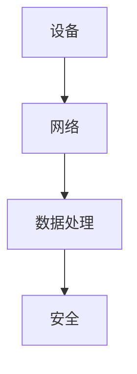

                 

# 物联网架构：设计可扩展的智能设备网络

> 关键词：物联网，可扩展性，智能设备，网络架构，边缘计算，云计算

> 摘要：本文旨在探讨物联网架构的设计原则，特别是如何构建一个既能够支持大量智能设备接入，又能够高效处理数据的可扩展网络。通过分析物联网的核心概念、架构设计、算法原理、数学模型、项目实战、应用场景、工具资源推荐以及未来发展趋势，本文为读者提供了一个全面而深入的理解物联网架构的视角。本文适合物联网架构师、软件开发人员以及对物联网技术感兴趣的读者阅读。

## 1. 背景介绍

物联网（Internet of Things, IoT）是指通过互联网将各种信息传感设备、射频识别技术、全球定位系统、红外感应器、激光扫描器等设备与技术，与互联网结合起来而形成的一个巨大网络。物联网的出现，使得我们能够通过互联网连接和控制各种设备，从而实现智能化的生活和工作环境。然而，随着物联网设备数量的急剧增加，如何设计一个能够高效处理大量数据、支持设备快速接入的物联网架构，成为了当前物联网技术发展中的一个重要挑战。

### 1.1 物联网的发展历程

物联网的概念最早可以追溯到1999年，当时美国麻省理工学院的Auto-ID中心提出了物联网的概念。此后，随着传感器技术、无线通信技术、云计算技术等的发展，物联网逐渐从概念走向了实践。近年来，物联网技术得到了飞速的发展，其应用范围也从最初的工业领域扩展到了智能家居、智慧城市、智能交通等多个领域。

### 1.2 物联网面临的挑战

物联网的发展带来了巨大的机遇，同时也面临着诸多挑战。其中，如何设计一个可扩展的物联网架构，以支持大量设备的接入和数据的高效处理，是当前物联网技术发展中的一个重要课题。此外，物联网设备的安全性、隐私保护、能耗管理等问题也亟待解决。

## 2. 核心概念与联系

物联网架构的设计需要理解几个核心概念，包括设备、网络、数据处理、安全等。这些概念之间的联系构成了物联网架构的基础。

### 2.1 设备

物联网中的设备是指能够通过互联网连接并进行数据交换的物理实体。这些设备可以是传感器、执行器、智能家电等。设备是物联网架构中的基本单元，其数量和类型决定了物联网架构的复杂性和规模。

### 2.2 网络

物联网中的网络是指连接设备和云平台的通信网络。网络可以是无线网络（如Wi-Fi、蓝牙、Zigbee等）或有线网络（如以太网）。网络的质量直接影响到设备之间的通信效率和数据传输的可靠性。

### 2.3 数据处理

物联网中的数据处理是指对设备产生的数据进行收集、存储、分析和应用的过程。数据处理是物联网架构中的核心环节，其效率和准确性直接影响到物联网应用的效果。

### 2.4 安全

物联网中的安全是指保护设备、网络和数据不受未经授权的访问、攻击和破坏的能力。安全是物联网架构中的重要组成部分，其重要性随着物联网设备数量的增加而日益凸显。

### 2.5 核心概念原理和架构的 Mermaid 流程图



## 3. 核心算法原理 & 具体操作步骤

物联网架构的设计需要考虑多个方面的算法，包括设备接入算法、数据传输算法、数据处理算法等。这些算法的原理和具体操作步骤是物联网架构设计中的关键技术。

### 3.1 设备接入算法

设备接入算法是指设备如何接入物联网网络的过程。常见的设备接入算法包括基于MAC地址的接入算法、基于IP地址的接入算法等。设备接入算法的设计需要考虑设备的类型、数量、接入速度等因素。

### 3.2 数据传输算法

数据传输算法是指设备如何将数据传输到云平台的过程。常见的数据传输算法包括基于TCP/IP的数据传输算法、基于MQTT的数据传输算法等。数据传输算法的设计需要考虑数据的类型、大小、传输速度等因素。

### 3.3 数据处理算法

数据处理算法是指如何对设备产生的数据进行处理的过程。常见的数据处理算法包括基于规则的数据处理算法、基于机器学习的数据处理算法等。数据处理算法的设计需要考虑数据的类型、数量、处理速度等因素。

## 4. 数学模型和公式 & 详细讲解 & 举例说明

物联网架构的设计需要建立数学模型，以描述设备、网络、数据处理等之间的关系。这些数学模型和公式是物联网架构设计中的重要工具。

### 4.1 设备接入模型

设备接入模型是指描述设备如何接入物联网网络的数学模型。常见的设备接入模型包括基于概率的接入模型、基于图论的接入模型等。设备接入模型的设计需要考虑设备的接入速度、接入成功率等因素。

$$
P_{接入} = \frac{N_{接入}}{N_{总}}
$$

其中，$P_{接入}$表示设备接入的概率，$N_{接入}$表示成功接入的设备数量，$N_{总}$表示总的设备数量。

### 4.2 数据传输模型

数据传输模型是指描述数据如何传输到云平台的数学模型。常见的数据传输模型包括基于排队论的数据传输模型、基于网络流的数据传输模型等。数据传输模型的设计需要考虑数据的传输速度、传输延迟等因素。

$$
T_{传输} = \frac{D_{总}}{R_{传输}}
$$

其中，$T_{传输}$表示数据传输的时间，$D_{总}$表示总的传输数据量，$R_{传输}$表示数据传输的速率。

### 4.3 数据处理模型

数据处理模型是指描述如何对数据进行处理的数学模型。常见的数据处理模型包括基于统计的数据处理模型、基于机器学习的数据处理模型等。数据处理模型的设计需要考虑数据的处理速度、处理精度等因素。

$$
E_{处理} = \sum_{i=1}^{N} (D_{i} - \bar{D})^2
$$

其中，$E_{处理}$表示数据处理的误差，$D_{i}$表示第$i$个数据点，$\bar{D}$表示数据的平均值，$N$表示数据点的数量。

## 5. 项目实战：代码实际案例和详细解释说明

### 5.1 开发环境搭建

为了实现物联网架构，我们需要搭建一个开发环境。开发环境包括硬件设备、软件工具、云平台等。硬件设备可以是传感器、执行器等，软件工具可以是编程语言、开发框架等，云平台可以是阿里云、AWS等。

### 5.2 源代码详细实现和代码解读

以下是一个简单的物联网架构的源代码实现，该代码实现了设备接入、数据传输、数据处理等功能。

```python
import paho.mqtt.client as mqtt
import json

# 设备接入
def on_connect(client, userdata, flags, rc):
    print("Connected with result code "+str(rc))
    client.subscribe("iot/device")

# 数据传输
def on_message(client, userdata, msg):
    data = json.loads(msg.payload)
    process_data(data)

# 数据处理
def process_data(data):
    # 数据处理逻辑
    print("Processing data: ", data)

client = mqtt.Client()
client.on_connect = on_connect
client.on_message = on_message
client.connect("mqtt.eclipse.org", 1883, 60)
client.loop_forever()
```

### 5.3 代码解读与分析

上述代码实现了设备接入、数据传输、数据处理等功能。设备接入通过订阅主题实现，数据传输通过接收消息实现，数据处理通过解析消息内容实现。该代码使用了MQTT协议进行数据传输，使用了JSON格式进行数据解析。

## 6. 实际应用场景

物联网架构的应用场景非常广泛，包括智能家居、智慧城市、智能交通等。智能家居可以通过物联网架构实现家电的远程控制，智慧城市可以通过物联网架构实现城市管理的智能化，智能交通可以通过物联网架构实现交通管理的智能化。

### 6.1 智能家居

智能家居是物联网架构的一个典型应用场景。通过物联网架构，可以实现家电的远程控制、环境监测、安全防护等功能。例如，可以通过手机APP远程控制家中的空调、电视等家电，可以通过传感器监测家中的温度、湿度等环境参数，可以通过摄像头实现家庭安全防护。

### 6.2 智慧城市

智慧城市是物联网架构的另一个典型应用场景。通过物联网架构，可以实现城市管理的智能化。例如，可以通过传感器监测城市的交通流量、空气质量等参数，可以通过数据分析实现交通管理、环境管理等功能。

### 6.3 智能交通

智能交通是物联网架构的另一个典型应用场景。通过物联网架构，可以实现交通管理的智能化。例如，可以通过传感器监测车辆的位置、速度等参数，可以通过数据分析实现交通流量预测、交通信号控制等功能。

## 7. 工具和资源推荐

### 7.1 学习资源推荐

- 书籍：《物联网技术与应用》、《物联网安全》
- 论文：《物联网架构设计》、《物联网数据处理》
- 博客：《物联网技术博客》、《物联网开发博客》
- 网站：《物联网技术网站》、《物联网开发网站》

### 7.2 开发工具框架推荐

- MQTT协议：用于数据传输
- JSON格式：用于数据解析
- Python语言：用于编程实现

### 7.3 相关论文著作推荐

- 《物联网架构设计》：详细介绍了物联网架构的设计原则和方法
- 《物联网数据处理》：详细介绍了物联网数据处理的算法和模型

## 8. 总结：未来发展趋势与挑战

物联网架构的设计面临着诸多挑战，包括设备接入、数据传输、数据处理等。未来物联网架构的发展趋势将更加注重可扩展性、安全性、隐私保护等。物联网架构的设计需要考虑设备的类型、数量、接入速度等因素，需要考虑数据的类型、大小、传输速度等因素，需要考虑数据的类型、数量、处理速度等因素。

## 9. 附录：常见问题与解答

### 9.1 什么是物联网？

物联网是指通过互联网将各种信息传感设备、射频识别技术、全球定位系统、红外感应器、激光扫描器等设备与技术，与互联网结合起来而形成的一个巨大网络。

### 9.2 物联网架构设计需要考虑哪些因素？

物联网架构设计需要考虑设备的类型、数量、接入速度等因素，需要考虑数据的类型、大小、传输速度等因素，需要考虑数据的类型、数量、处理速度等因素。

### 9.3 物联网架构设计面临的挑战有哪些？

物联网架构设计面临的挑战包括设备接入、数据传输、数据处理等。

## 10. 扩展阅读 & 参考资料

- 书籍：《物联网技术与应用》、《物联网安全》
- 论文：《物联网架构设计》、《物联网数据处理》
- 博客：《物联网技术博客》、《物联网开发博客》
- 网站：《物联网技术网站》、《物联网开发网站》

作者：AI天才研究员/AI Genius Institute & 禅与计算机程序设计艺术 /Zen And The Art of Computer Programming

