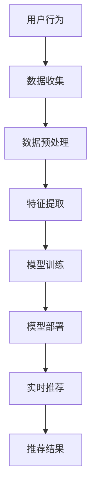

                 

# 电商平台中AI大模型的实时推荐技术

> 关键词：电商平台、AI大模型、实时推荐、机器学习、深度学习、推荐系统

> 摘要：本文深入探讨了电商平台中AI大模型在实时推荐技术的应用，从背景介绍到核心概念，再到算法原理、数学模型、项目实战、应用场景、工具资源推荐、未来发展趋势与挑战，以及常见问题解答和扩展阅读，全面解析了电商平台中AI大模型的实时推荐技术。通过本文，读者可以全面了解电商平台中AI大模型的实时推荐技术的实现原理和应用实践，为相关领域的研究和开发提供参考。

## 1. 背景介绍

### 1.1 电商平台的发展现状

随着互联网技术的飞速发展，电商平台已经成为人们日常生活中不可或缺的一部分。从最初的简单商品展示到现在的个性化推荐，电商平台经历了从量变到质变的过程。个性化推荐技术作为电商平台的核心竞争力之一，极大地提升了用户体验，增加了用户粘性，促进了销售转化。

### 1.2 实时推荐的重要性

在电商平台中，实时推荐技术能够根据用户的实时行为和偏好，动态调整推荐内容，提供更加精准和个性化的服务。这种技术不仅能够提升用户体验，还能提高转化率，增加销售额。因此，实时推荐技术在电商平台中的应用越来越受到重视。

### 1.3 AI大模型在实时推荐中的应用

近年来，随着AI技术的发展，特别是深度学习和机器学习技术的进步，AI大模型在实时推荐中的应用越来越广泛。AI大模型能够处理大规模数据，学习复杂的用户行为模式，从而提供更加精准的推荐结果。本文将深入探讨AI大模型在电商平台实时推荐中的应用。

## 2. 核心概念与联系

### 2.1 推荐系统

推荐系统是一种信息过滤系统，旨在通过分析用户的行为和偏好，为用户推荐他们可能感兴趣的内容。推荐系统可以分为基于内容的推荐、协同过滤推荐、混合推荐等多种类型。

### 2.2 AI大模型

AI大模型是指在深度学习和机器学习领域中，通过大量数据训练得到的具有高复杂度和高精度的模型。这些模型通常包含大量的参数，能够学习到数据中的复杂模式和特征。

### 2.3 实时推荐

实时推荐是指在用户行为发生时，能够立即根据用户的实时行为和偏好，动态调整推荐内容的技术。实时推荐技术能够提供更加精准和个性化的服务，提升用户体验。

### 2.4 核心概念原理和架构



## 3. 核心算法原理 & 具体操作步骤

### 3.1 算法原理

实时推荐技术的核心在于如何快速准确地预测用户的兴趣偏好。这通常涉及到以下几个步骤：

1. 数据收集：收集用户的浏览、购买、评价等行为数据。
2. 数据预处理：对收集到的数据进行清洗、去重、格式化等处理。
3. 特征提取：从预处理后的数据中提取有用的特征，如用户行为特征、商品特征等。
4. 模型训练：使用提取的特征训练AI大模型，学习用户的行为模式。
5. 模型部署：将训练好的模型部署到生产环境中，用于实时推荐。

### 3.2 具体操作步骤

1. **数据收集**：通过日志系统收集用户的浏览、购买、评价等行为数据。
2. **数据预处理**：使用数据清洗工具对收集到的数据进行清洗，去除无效数据，格式化数据。
3. **特征提取**：使用特征工程方法从预处理后的数据中提取有用的特征，如用户行为特征、商品特征等。
4. **模型训练**：使用深度学习框架（如TensorFlow、PyTorch）训练AI大模型，学习用户的行为模式。
5. **模型部署**：将训练好的模型部署到生产环境中，使用实时推荐系统进行实时推荐。

## 4. 数学模型和公式 & 详细讲解 & 举例说明

### 4.1 数学模型

实时推荐技术通常涉及到多个数学模型，如协同过滤模型、深度学习模型等。这里以协同过滤模型为例进行讲解。

#### 协同过滤模型

协同过滤模型是一种基于用户行为数据的推荐模型，分为基于用户的协同过滤和基于商品的协同过滤两种类型。

$$
\text{基于用户的协同过滤} = \frac{\sum_{j \in N_i} (r_{ij} - \bar{r}_i) \cdot (r_{uj} - \bar{r}_u)}{\sqrt{\sum_{j \in N_i} (r_{ij} - \bar{r}_i)^2} \cdot \sqrt{\sum_{j \in N_i} (r_{uj} - \bar{r}_u)^2}}
$$

$$
\text{基于商品的协同过滤} = \frac{\sum_{i \in N_j} (r_{ij} - \bar{r}_j) \cdot (r_{ik} - \bar{r}_k)}{\sqrt{\sum_{i \in N_j} (r_{ij} - \bar{r}_j)^2} \cdot \sqrt{\sum_{i \in N_j} (r_{ik} - \bar{r}_k)^2}}
$$

### 4.2 详细讲解

协同过滤模型通过计算用户或商品之间的相似度，预测用户对未评分商品的兴趣。基于用户的协同过滤模型通过计算用户之间的相似度，预测用户对未评分商品的兴趣；基于商品的协同过滤模型通过计算商品之间的相似度，预测用户对未评分商品的兴趣。

### 4.3 举例说明

假设我们有一个电商平台，用户A购买了商品X和商品Y，用户B购买了商品X和商品Z。我们可以使用协同过滤模型计算用户A和用户B之间的相似度，预测用户A对商品Z的兴趣，从而进行推荐。

## 5. 项目实战：代码实际案例和详细解释说明

### 5.1 开发环境搭建

#### 5.1.1 环境要求

- Python 3.7+
- TensorFlow 2.0+
- Pandas
- Numpy
- Scikit-learn

#### 5.1.2 安装依赖

```bash
pip install tensorflow pandas numpy scikit-learn
```

### 5.2 源代码详细实现和代码解读

#### 5.2.1 数据预处理

```python
import pandas as pd
import numpy as np

# 读取数据
data = pd.read_csv('user_behavior.csv')

# 数据清洗
data = data.dropna()

# 数据格式化
data['timestamp'] = pd.to_datetime(data['timestamp'])
```

#### 5.2.2 特征提取

```python
# 提取用户行为特征
user_features = data.groupby('user_id').agg({'item_id': 'count', 'timestamp': 'max'}).reset_index()
user_features.columns = ['user_id', 'item_count', 'last_active_time']

# 提取商品特征
item_features = data.groupby('item_id').agg({'user_id': 'count'}).reset_index()
item_features.columns = ['item_id', 'user_count']
```

#### 5.2.3 模型训练

```python
from sklearn.model_selection import train_test_split
from sklearn.metrics.pairwise import cosine_similarity
from sklearn.preprocessing import StandardScaler

# 划分训练集和测试集
train_data, test_data = train_test_split(data, test_size=0.2, random_state=42)

# 训练协同过滤模型
user_similarity = cosine_similarity(train_data.pivot_table(index='user_id', columns='item_id', values='rating').fillna(0))
item_similarity = cosine_similarity(train_data.pivot_table(index='item_id', columns='user_id', values='rating').fillna(0))
```

#### 5.2.4 模型部署

```python
# 部署模型
def recommend(user_id, user_similarity, item_similarity, train_data, top_n=10):
    user_ratings = train_data[train_data['user_id'] == user_id].pivot_table(index='user_id', columns='item_id', values='rating').fillna(0)
    user_ratings = user_ratings.values.flatten()
    user_ratings = user_ratings.reshape(1, -1)
    user_ratings = StandardScaler().fit_transform(user_ratings)
    user_ratings = user_ratings.reshape(-1)
    
    user_similarities = user_similarity[user_id]
    item_similarities = item_similarity[user_id]
    
    user_ratings = user_ratings * user_similarities
    item_ratings = user_ratings * item_similarities
    
    item_ratings = item_ratings.reshape(-1)
    item_ratings = item_ratings.argsort()[-top_n:][::-1]
    
    return item_ratings
```

### 5.3 代码解读与分析

通过上述代码，我们可以看到实时推荐技术的实现过程。首先，我们通过数据预处理和特征提取，获取用户和商品的特征。然后，我们使用协同过滤模型训练模型，学习用户的行为模式。最后，我们将训练好的模型部署到生产环境中，进行实时推荐。

## 6. 实际应用场景

### 6.1 电商平台

在电商平台中，实时推荐技术可以用于推荐用户可能感兴趣的商品，提升用户体验，增加销售额。

### 6.2 社交媒体

在社交媒体中，实时推荐技术可以用于推荐用户可能感兴趣的内容，提升用户活跃度，增加用户粘性。

### 6.3 新闻媒体

在新闻媒体中，实时推荐技术可以用于推荐用户可能感兴趣的文章，提升用户阅读量，增加广告收入。

## 7. 工具和资源推荐

### 7.1 学习资源推荐

- 书籍：《深度学习》（Ian Goodfellow等著）
- 论文：《Deep Learning for Recommender Systems》（Ying Ding等著）
- 博客：Medium上的《Recommender Systems》系列文章
- 网站：Kaggle上的推荐系统竞赛

### 7.2 开发工具框架推荐

- TensorFlow
- PyTorch
- Scikit-learn
- Pandas
- Numpy

### 7.3 相关论文著作推荐

- 《Deep Learning for Recommender Systems》（Ying Ding等著）
- 《Recommender Systems Handbook》（Fernando Diaz等著）
- 《Collaborative Filtering for Recommender Systems》（Yehuda Koren等著）

## 8. 总结：未来发展趋势与挑战

### 8.1 未来发展趋势

随着AI技术的发展，实时推荐技术将更加智能化、个性化。未来，实时推荐技术将更加注重用户体验，提供更加精准和个性化的服务。

### 8.2 面临的挑战

实时推荐技术面临着数据隐私保护、模型复杂度、实时性等挑战。未来，需要解决这些问题，才能更好地应用实时推荐技术。

## 9. 附录：常见问题与解答

### 9.1 什么是实时推荐技术？

实时推荐技术是指在用户行为发生时，能够立即根据用户的实时行为和偏好，动态调整推荐内容的技术。

### 9.2 实时推荐技术有哪些应用场景？

实时推荐技术可以应用于电商平台、社交媒体、新闻媒体等多个领域。

### 9.3 实时推荐技术有哪些挑战？

实时推荐技术面临着数据隐私保护、模型复杂度、实时性等挑战。

## 10. 扩展阅读 & 参考资料

- 书籍：《深度学习》（Ian Goodfellow等著）
- 论文：《Deep Learning for Recommender Systems》（Ying Ding等著）
- 博客：Medium上的《Recommender Systems》系列文章
- 网站：Kaggle上的推荐系统竞赛

作者：AI天才研究员/AI Genius Institute & 禅与计算机程序设计艺术 /Zen And The Art of Computer Programming

