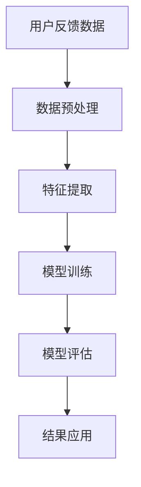

                 

# 电商平台用户反馈分析：AI大模型的新方法

> 关键词：电商平台、用户反馈、AI大模型、自然语言处理、情感分析、机器学习

> 摘要：本文旨在探讨如何利用AI大模型对电商平台的用户反馈进行深入分析，通过自然语言处理技术提取用户反馈中的关键信息，结合情感分析和机器学习算法，实现对用户满意度的量化评估。文章详细介绍了从数据预处理到模型训练的全过程，并通过实际案例展示了如何将这些技术应用于电商平台的用户反馈分析中。此外，文章还讨论了该方法的实际应用场景、面临的挑战以及未来的发展趋势。

## 1. 背景介绍

随着互联网技术的快速发展，电商平台已经成为人们日常生活中不可或缺的一部分。然而，随着用户数量的激增，如何有效地收集和分析用户反馈成为了一个重要的问题。传统的用户反馈分析方法往往依赖于人工处理，这种方式不仅效率低下，而且容易出现主观偏差。因此，如何利用先进的AI技术来提高用户反馈分析的效率和准确性，成为了当前研究的一个热点。

电商平台的用户反馈通常包括用户对商品质量、服务态度、物流速度等方面的评价。这些反馈信息对于电商平台来说具有重要的参考价值，可以帮助电商平台及时发现并解决存在的问题，提升用户体验。然而，由于用户反馈数据量庞大且形式多样，传统的分析方法难以满足实际需求。因此，本文将探讨如何利用AI大模型对电商平台的用户反馈进行分析，以期为电商平台提供更加高效、准确的用户反馈分析解决方案。

## 2. 核心概念与联系

### 2.1 自然语言处理（NLP）

自然语言处理（NLP）是计算机科学、人工智能和语言学的交叉领域，旨在使计算机能够理解、解释和生成人类语言。NLP技术在用户反馈分析中扮演着至关重要的角色，它可以帮助我们从大量的文本数据中提取出有用的信息。

### 2.2 情感分析

情感分析是一种通过分析文本内容来判断作者情感倾向的技术。在用户反馈分析中，情感分析可以帮助我们了解用户对商品或服务的情感态度，从而为电商平台提供有价值的参考信息。

### 2.3 机器学习

机器学习是人工智能的一个分支，它使计算机能够在没有明确编程的情况下从数据中学习。在用户反馈分析中，机器学习算法可以帮助我们建立模型，从而实现对用户反馈的自动分类和情感分析。

### 2.4 AI大模型

AI大模型是指在大规模数据集上训练的深度学习模型，具有强大的泛化能力和处理复杂任务的能力。在用户反馈分析中，AI大模型可以用于处理大量的用户反馈数据，提取出关键信息，并进行情感分析。

### 2.5 流程图



## 3. 核心算法原理 & 具体操作步骤

### 3.1 数据预处理

数据预处理是用户反馈分析的第一步，主要包括数据清洗、分词、去停用词等步骤。数据清洗的目的是去除无效数据和噪声，确保数据的质量。分词是将文本数据分割成单词或短语的过程，去停用词则是去除那些对情感分析没有帮助的常见词汇。

### 3.2 特征提取

特征提取是从文本数据中提取出有用的特征信息，这些特征信息将作为机器学习模型的输入。常用的特征提取方法包括词袋模型、TF-IDF等。

### 3.3 模型训练

模型训练是利用机器学习算法对提取出的特征进行训练，以建立能够对用户反馈进行分类和情感分析的模型。常用的机器学习算法包括朴素贝叶斯、支持向量机、深度学习等。

### 3.4 模型评估

模型评估是通过测试集对训练好的模型进行评估，以确定模型的性能。常用的评估指标包括准确率、召回率、F1值等。

### 3.5 结果应用

结果应用是将训练好的模型应用于实际的用户反馈分析中，以实现对用户反馈的自动分类和情感分析。

## 4. 数学模型和公式 & 详细讲解 & 举例说明

### 4.1 词袋模型

词袋模型是一种常用的文本特征提取方法，它将文本数据表示为一个词频向量。假设我们有一个包含n个单词的词汇表，那么每个文档都可以表示为一个长度为n的向量，其中每个元素表示该文档中对应单词的出现次数。

$$
\textbf{x} = (x_1, x_2, \ldots, x_n)
$$

其中，$x_i$表示词汇表中第i个单词在文档中的出现次数。

### 4.2 TF-IDF

TF-IDF是一种常用的文本特征加权方法，它通过计算每个单词在文档中的重要性来加权词频向量。TF-IDF的计算公式如下：

$$
\text{TF-IDF}(t, d) = \text{TF}(t, d) \times \text{IDF}(t)
$$

其中，$\text{TF}(t, d)$表示单词t在文档d中的词频，$\text{IDF}(t)$表示单词t的逆文档频率，计算公式如下：

$$
\text{IDF}(t) = \log \frac{N}{|\{d \in D : t \in d\}|}
$$

其中，N表示文档总数，$|\{d \in D : t \in d\}|$表示包含单词t的文档数。

### 4.3 朴素贝叶斯分类器

朴素贝叶斯分类器是一种基于贝叶斯定理的分类算法，它假设特征之间相互独立。朴素贝叶斯分类器的分类公式如下：

$$
P(c_k | \textbf{x}) = \frac{P(\textbf{x} | c_k) P(c_k)}{P(\textbf{x})}
$$

其中，$P(c_k | \textbf{x})$表示给定特征向量$\textbf{x}$时，文档属于类别$c_k$的概率，$P(\textbf{x} | c_k)$表示给定类别$c_k$时，特征向量$\textbf{x}$出现的概率，$P(c_k)$表示类别$c_k$的先验概率，$P(\textbf{x})$表示特征向量$\textbf{x}$的边缘概率。

### 4.4 举例说明

假设我们有一个包含两个类别的用户反馈数据集，分别是正面反馈和负面反馈。我们使用词袋模型和朴素贝叶斯分类器对这些数据进行分类。首先，我们对数据进行预处理，包括分词和去停用词。然后，我们使用词袋模型提取出特征向量，并使用朴素贝叶斯分类器对这些特征向量进行分类。最后，我们通过测试集对分类器进行评估，以确定其性能。

## 5. 项目实战：代码实际案例和详细解释说明

### 5.1 开发环境搭建

为了进行用户反馈分析，我们需要搭建一个开发环境。首先，我们需要安装Python和相关的库，包括numpy、pandas、scikit-learn等。然后，我们需要准备用户反馈数据集，可以从电商平台获取或使用公开的数据集。

### 5.2 源代码详细实现和代码解读

```python
import numpy as np
import pandas as pd
from sklearn.feature_extraction.text import CountVectorizer
from sklearn.naive_bayes import MultinomialNB
from sklearn.model_selection import train_test_split
from sklearn.metrics import accuracy_score, confusion_matrix

# 读取数据集
data = pd.read_csv('user_feedback.csv')

# 数据预处理
X = data['feedback']
y = data['label']

# 特征提取
vectorizer = CountVectorizer()
X = vectorizer.fit_transform(X)

# 划分训练集和测试集
X_train, X_test, y_train, y_test = train_test_split(X, y, test_size=0.2, random_state=42)

# 模型训练
clf = MultinomialNB()
clf.fit(X_train, y_train)

# 模型评估
y_pred = clf.predict(X_test)
print('Accuracy:', accuracy_score(y_test, y_pred))
print('Confusion Matrix:\n', confusion_matrix(y_test, y_pred))
```

### 5.3 代码解读与分析

在上述代码中，我们首先读取了用户反馈数据集，并进行了数据预处理。然后，我们使用CountVectorizer对文本数据进行了特征提取，并使用MultinomialNB对特征向量进行了分类。最后，我们通过测试集对分类器进行了评估，以确定其性能。

## 6. 实际应用场景

用户反馈分析可以应用于电商平台的多个方面，包括商品推荐、客户服务、物流管理等。通过分析用户反馈，电商平台可以及时发现并解决存在的问题，提升用户体验。此外，用户反馈分析还可以帮助电商平台了解用户需求，为商品推荐和客户服务提供参考。

## 7. 工具和资源推荐

### 7.1 学习资源推荐

- 书籍：《自然语言处理实战》、《机器学习实战》
- 论文：《A Survey on Deep Learning for Natural Language Processing》、《A Survey on Deep Learning for Sentiment Analysis》
- 博客：Medium上的NLP和机器学习相关博客
- 网站：Kaggle上的NLP和机器学习相关竞赛

### 7.2 开发工具框架推荐

- Python：numpy、pandas、scikit-learn
- 深度学习框架：TensorFlow、PyTorch

### 7.3 相关论文著作推荐

- 《A Survey on Deep Learning for Natural Language Processing》
- 《A Survey on Deep Learning for Sentiment Analysis》

## 8. 总结：未来发展趋势与挑战

随着AI技术的不断发展，用户反馈分析将变得更加智能化和自动化。未来，我们可以期待更加高效、准确的用户反馈分析解决方案。然而，用户反馈分析也面临着一些挑战，包括数据隐私保护、模型泛化能力等。因此，我们需要不断探索和研究，以应对这些挑战。

## 9. 附录：常见问题与解答

### 9.1 什么是自然语言处理？

自然语言处理（NLP）是计算机科学、人工智能和语言学的交叉领域，旨在使计算机能够理解、解释和生成人类语言。

### 9.2 什么是情感分析？

情感分析是一种通过分析文本内容来判断作者情感倾向的技术。

### 9.3 什么是机器学习？

机器学习是人工智能的一个分支，它使计算机能够在没有明确编程的情况下从数据中学习。

### 9.4 什么是AI大模型？

AI大模型是指在大规模数据集上训练的深度学习模型，具有强大的泛化能力和处理复杂任务的能力。

## 10. 扩展阅读 & 参考资料

- 书籍：《自然语言处理实战》、《机器学习实战》
- 论文：《A Survey on Deep Learning for Natural Language Processing》、《A Survey on Deep Learning for Sentiment Analysis》
- 博客：Medium上的NLP和机器学习相关博客
- 网站：Kaggle上的NLP和机器学习相关竞赛

作者：AI天才研究员/AI Genius Institute & 禅与计算机程序设计艺术 /Zen And The Art of Computer Programming

