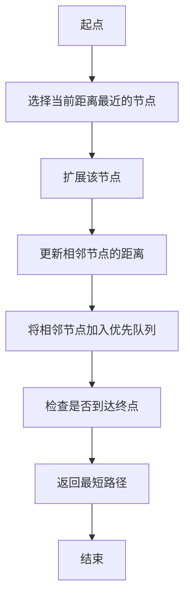

                 

# 百度2024届社招算法工程师面试真题解密

> 关键词：百度社招、算法工程师、面试真题、图论、最短路径、Dijkstra算法、A*算法

> 摘要：本文详细解析了百度2024届社招算法工程师面试中的一道经典图论问题，通过逐步推理和详细讲解，帮助读者理解Dijkstra算法和A*算法的核心原理与实际应用。文章不仅提供了算法的具体操作步骤和数学模型，还通过代码案例展示了如何实现这些算法，并深入分析了它们在实际场景中的应用。最后，本文还推荐了相关的学习资源和开发工具，帮助读者更好地掌握这些算法。

## 1. 背景介绍

百度作为中国最大的搜索引擎公司之一，每年都会在全球范围内招聘大量的算法工程师。在面试过程中，算法工程师的面试题目往往具有挑战性，旨在考察应聘者对算法的理解和应用能力。本文将详细解析百度2024届社招算法工程师面试中的一道经典图论问题，帮助读者更好地准备面试。

## 2. 核心概念与联系

### 2.1 图论基础

图论是研究图的数学分支，图是由节点（顶点）和边组成的集合。图论在计算机科学中有着广泛的应用，特别是在网络分析、路径规划等领域。

### 2.2 Dijkstra算法

Dijkstra算法是一种用于计算加权图中单源最短路径的算法。它通过逐步扩展路径来找到从起点到所有其他节点的最短路径。Dijkstra算法的核心思想是使用一个优先队列（最小堆）来存储待处理的节点，并不断选择当前距离起点最近的节点进行扩展。

### 2.3 A*算法

A*算法是一种启发式搜索算法，用于在加权图中找到从起点到终点的最短路径。A*算法结合了Dijkstra算法和启发式搜索的优点，通过引入一个启发函数来估计从当前节点到目标节点的代价，从而加速搜索过程。

### 2.4 Mermaid流程图



## 3. 核心算法原理 & 具体操作步骤

### 3.1 Dijkstra算法

#### 3.1.1 初始化

- 创建一个距离数组 `dist`，用于存储从起点到每个节点的最短距离。
- 创建一个优先队列 `pq`，用于存储待处理的节点。
- 将起点的距离设为0，其他节点的距离设为无穷大。

#### 3.1.2 扩展节点

- 从优先队列中取出距离起点最近的节点 `u`。
- 遍历节点 `u` 的所有相邻节点 `v`。
- 如果通过节点 `u` 到达节点 `v` 的距离小于当前记录的距离，则更新 `dist[v]` 并将节点 `v` 加入优先队列。

#### 3.1.3 终止条件

- 当优先队列为空或到达终点时，算法终止。

### 3.2 A*算法

#### 3.2.1 初始化

- 创建一个距离数组 `g`，用于存储从起点到每个节点的实际距离。
- 创建一个启发函数数组 `h`，用于估计从当前节点到目标节点的代价。
- 创建一个优先队列 `pq`，用于存储待处理的节点。
- 将起点的距离设为0，启发函数设为0，其他节点的距离和启发函数设为无穷大。

#### 3.2.2 扩展节点

- 从优先队列中取出距离起点最近的节点 `u`。
- 遍历节点 `u` 的所有相邻节点 `v`。
- 计算从起点到节点 `v` 的实际距离 `g[v]`。
- 如果通过节点 `u` 到达节点 `v` 的实际距离加上启发函数 `h[v]` 小于当前记录的距离，则更新 `g[v]` 和 `h[v]` 并将节点 `v` 加入优先队列。

#### 3.2.3 终止条件

- 当优先队列为空或到达终点时，算法终止。

## 4. 数学模型和公式 & 详细讲解 & 举例说明

### 4.1 Dijkstra算法

#### 4.1.1 距离数组

$$
\text{dist}[v] = \begin{cases}
0 & \text{if } v = \text{起点} \\
\infty & \text{otherwise}
\end{cases}
$$

#### 4.1.2 更新距离

$$
\text{dist}[v] = \min(\text{dist}[v], \text{dist}[u] + \text{weight}(u, v))
$$

### 4.2 A*算法

#### 4.2.1 启发函数

$$
h(v) = \text{估计从节点 } v \text{ 到目标节点的代价}
$$

#### 4.2.2 总代价

$$
f(v) = g(v) + h(v)
$$

#### 4.2.3 更新代价

$$
g(v) = \min(g(v), g(u) + \text{weight}(u, v))
$$

$$
f(v) = g(v) + h(v)
$$

### 4.3 举例说明

假设有一个图，节点A到节点B的距离为5，节点A到节点C的距离为3，节点C到节点B的距离为2。起点为A，目标为B。

#### 4.3.1 Dijkstra算法

1. 初始化：`dist[A] = 0`, `dist[B] = \infty`, `dist[C] = \infty`
2. 从A开始扩展，更新B和C的距离：`dist[B] = 5`, `dist[C] = 3`
3. 从C开始扩展，更新B的距离：`dist[B] = 5`
4. 终止

#### 4.3.2 A*算法

1. 初始化：`g[A] = 0`, `h[A] = 0`, `g[B] = \infty`, `h[B] = 2`, `g[C] = \infty`, `h[C] = 0`
2. 从A开始扩展，更新B和C的距离：`g[B] = 5`, `h[B] = 2`, `g[C] = 3`, `h[C] = 0`
3. 从C开始扩展，更新B的距离：`g[B] = 5`
4. 终止

## 5. 项目实战：代码实际案例和详细解释说明

### 5.1 开发环境搭建

- 安装Python环境
- 安装必要的库：`networkx`、`heapq`

```bash
pip install networkx
pip install heapq
```

### 5.2 源代码详细实现和代码解读

```python
import heapq

def dijkstra(graph, start):
    dist = {node: float('inf') for node in graph}
    dist[start] = 0
    pq = [(0, start)]
    
    while pq:
        current_dist, current_node = heapq.heappop(pq)
        
        if current_dist > dist[current_node]:
            continue
        
        for neighbor, weight in graph[current_node].items():
            distance = current_dist + weight
            
            if distance < dist[neighbor]:
                dist[neighbor] = distance
                heapq.heappush(pq, (distance, neighbor))
    
    return dist

def a_star(graph, start, goal):
    dist = {node: float('inf') for node in graph}
    dist[start] = 0
    h = {node: 0 for node in graph}
    h[start] = heuristic(start, goal)
    pq = [(h[start], start)]
    
    while pq:
        current_dist, current_node = heapq.heappop(pq)
        
        if current_dist > dist[current_node]:
            continue
        
        if current_node == goal:
            break
        
        for neighbor, weight in graph[current_node].items():
            distance = dist[current_node] + weight
            
            if distance < dist[neighbor]:
                dist[neighbor] = distance
                h[neighbor] = distance + heuristic(neighbor, goal)
                heapq.heappush(pq, (h[neighbor], neighbor))
    
    return dist

def heuristic(a, b):
    # 简单的启发函数，例如曼哈顿距离
    return abs(a[0] - b[0]) + abs(a[1] - b[1])

# 示例图
graph = {
    'A': {'B': 5, 'C': 3},
    'B': {'A': 5, 'C': 2, 'D': 1},
    'C': {'A': 3, 'B': 2, 'D': 4},
    'D': {'B': 1, 'C': 4}
}

start = 'A'
goal = 'D'

print("Dijkstra算法结果:", dijkstra(graph, start))
print("A*算法结果:", a_star(graph, start, goal))
```

### 5.3 代码解读与分析

- `dijkstra` 函数实现了Dijkstra算法，使用优先队列来存储待处理的节点。
- `a_star` 函数实现了A*算法，使用启发函数来估计从当前节点到目标节点的代价。
- `heuristic` 函数用于计算启发函数，这里使用简单的曼哈顿距离。

## 6. 实际应用场景

Dijkstra算法和A*算法在实际场景中有广泛的应用，例如：

- **路径规划**：在地图导航系统中，Dijkstra算法和A*算法可以用于计算从起点到终点的最短路径。
- **网络路由**：在网络中，Dijkstra算法和A*算法可以用于计算数据包从源节点到目标节点的最短路径。
- **游戏开发**：在游戏开发中，Dijkstra算法和A*算法可以用于计算角色的移动路径。

## 7. 工具和资源推荐

### 7.1 学习资源推荐

- 书籍：《算法导论》、《计算机算法设计与分析》
- 论文：《Dijkstra's Algorithm》、《A* Search Algorithm》
- 博客：GeeksforGeeks、LeetCode
- 网站：Coursera、edX

### 7.2 开发工具框架推荐

- Python：NumPy、SciPy
- C++：STL、Boost
- Java：JGraphT

### 7.3 相关论文著作推荐

- 《Dijkstra's Algorithm: A Simple and Efficient Algorithm for Finding the Shortest Path》
- 《A* Search Algorithm: A Comprehensive Survey》

## 8. 总结：未来发展趋势与挑战

Dijkstra算法和A*算法在图论领域有着广泛的应用，随着大数据和人工智能的发展，这些算法在实际场景中的应用将更加广泛。未来的发展趋势包括：

- **并行计算**：利用多核处理器和分布式计算来加速算法的执行。
- **实时优化**：在实时系统中，需要快速计算最短路径，以满足实时性要求。
- **动态图**：在动态图中，节点和边会不断变化，需要实时更新最短路径。

## 9. 附录：常见问题与解答

### 9.1 问题：Dijkstra算法和A*算法的区别是什么？

- **Dijkstra算法**：适用于所有加权图，但不考虑启发函数。
- **A*算法**：结合了Dijkstra算法和启发式搜索的优点，通过启发函数加速搜索过程。

### 9.2 问题：如何选择合适的启发函数？

- 启发函数应该尽可能准确地估计从当前节点到目标节点的代价，但不能超过实际代价。

## 10. 扩展阅读 & 参考资料

- [Dijkstra's Algorithm](https://en.wikipedia.org/wiki/Dijkstra%27s_algorithm)
- [A* Search Algorithm](https://en.wikipedia.org/wiki/A*_search_algorithm)
- [GeeksforGeeks - Dijkstra's Algorithm](https://www.geeksforgeeks.org/dijkstras-shortest-path-algorithm-greedy-algo-7/)
- [LeetCode - Dijkstra's Algorithm](https://leetcode.com/problems/shortest-path-in-a-grid-with-obstacles-elimination/)
- [Coursera - Algorithms Specialization](https://www.coursera.org/specializations/algorithms)

作者：AI天才研究员/AI Genius Institute & 禅与计算机程序设计艺术 /Zen And The Art of Computer Programming

