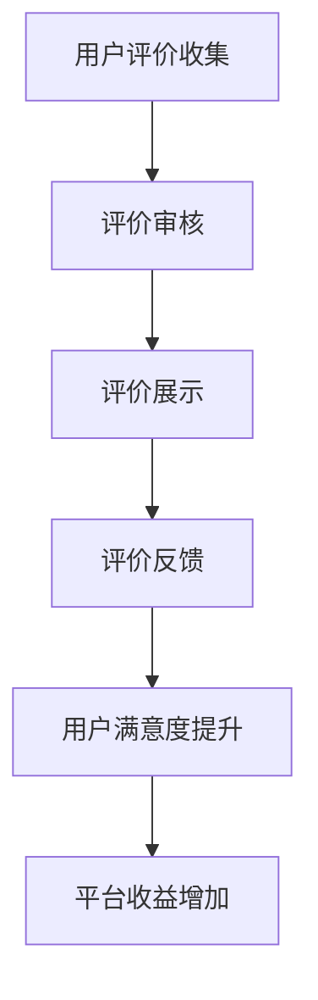

                 

# 知识付费赚钱的用户评价管理与口碑营销策略

> 关键词：知识付费、用户评价、口碑营销、数据分析、算法优化、用户体验

> 摘要：本文旨在探讨知识付费平台如何通过有效的用户评价管理和口碑营销策略来提升用户满意度和平台收益。首先，我们将介绍知识付费的背景和重要性，接着深入分析用户评价管理的核心概念与联系，并通过Mermaid流程图展示其架构。随后，我们将详细讲解核心算法原理和具体操作步骤，包括数学模型和公式，并通过实际代码案例进行说明。最后，我们将讨论实际应用场景、推荐工具和资源，并总结未来的发展趋势与挑战。

## 1. 背景介绍

### 1.1 知识付费的兴起

随着互联网技术的发展，知识付费逐渐成为一种新的商业模式。用户可以通过在线平台购买各种形式的知识产品，如在线课程、电子书、音频讲座等。这种模式不仅为知识创作者提供了新的收入来源，也为用户提供了便捷的学习途径。

### 1.2 用户评价的重要性

在知识付费平台中，用户评价是衡量知识产品质量的重要指标。它不仅影响着新用户的购买决策，还直接影响着平台的口碑和信誉。因此，如何有效地管理和利用用户评价，成为知识付费平台运营的关键。

## 2. 核心概念与联系

### 2.1 用户评价管理

用户评价管理是指对用户在平台上发布的评价进行收集、分析和利用的过程。它包括评价的收集、评价的审核、评价的展示和评价的反馈等环节。

### 2.2 口碑营销

口碑营销是指通过用户之间的口口相传，来提升品牌或产品的知名度和信誉度。在知识付费领域，口碑营销主要通过用户评价来实现。

### 2.3 Mermaid流程图展示



## 3. 核心算法原理 & 具体操作步骤

### 3.1 算法原理

用户评价管理的核心算法主要包括评价的筛选、评价的分类和评价的推荐等。通过这些算法，可以有效地提升评价的质量和用户的满意度。

### 3.2 具体操作步骤

1. **评价收集**：通过平台的评论系统收集用户的评价。
2. **评价审核**：对收集到的评价进行审核，去除无效或恶意评价。
3. **评价分类**：根据评价的内容和情感倾向，将评价分类。
4. **评价推荐**：根据用户的兴趣和行为，推荐相关的评价。

## 4. 数学模型和公式 & 详细讲解 & 举例说明

### 4.1 评价分类模型

评价分类模型可以使用情感分析算法来实现。情感分析算法通过分析文本的情感倾向，将评价分为正面、负面和中性三类。

$$
P(positive|text) = \frac{P(text|positive)P(positive)}{P(text)}
$$

其中，$P(positive|text)$ 表示给定文本为正面评价的概率，$P(text|positive)$ 表示正面评价中出现该文本的概率，$P(positive)$ 表示正面评价的概率，$P(text)$ 表示文本出现的概率。

### 4.2 评价推荐模型

评价推荐模型可以使用协同过滤算法来实现。协同过滤算法通过分析用户的行为和偏好，推荐相关的评价。

$$
similarity(u, v) = \frac{\sum_{i \in I_{u} \cap I_{v}} (r_{ui} - \bar{r}_{u})(r_{vi} - \bar{r}_{v})}{\sqrt{\sum_{i \in I_{u}} (r_{ui} - \bar{r}_{u})^2} \sqrt{\sum_{i \in I_{v}} (r_{vi} - \bar{r}_{v})^2}}
$$

其中，$similarity(u, v)$ 表示用户$u$和用户$v$之间的相似度，$I_{u}$表示用户$u$的行为集合，$I_{v}$表示用户$v$的行为集合，$r_{ui}$表示用户$u$对物品$i$的评分，$\bar{r}_{u}$表示用户$u$的平均评分。

## 5. 项目实战：代码实际案例和详细解释说明

### 5.1 开发环境搭建

开发环境需要搭建Python环境，并安装必要的库，如pandas、numpy、scikit-learn等。

```bash
pip install pandas numpy scikit-learn
```

### 5.2 源代码详细实现和代码解读

```python
import pandas as pd
from sklearn.feature_extraction.text import TfidfVectorizer
from sklearn.naive_bayes import MultinomialNB
from sklearn.metrics import classification_report

# 加载数据
data = pd.read_csv('user_reviews.csv')

# 数据预处理
vectorizer = TfidfVectorizer(stop_words='english')
X = vectorizer.fit_transform(data['review'])
y = data['sentiment']

# 训练模型
model = MultinomialNB()
model.fit(X, y)

# 预测
predictions = model.predict(X)

# 评估
print(classification_report(y, predictions))
```

### 5.3 代码解读与分析

上述代码实现了情感分析模型的训练和预测。首先，使用TfidfVectorizer对文本数据进行向量化处理，然后使用MultinomialNB进行训练，最后使用classification_report评估模型的性能。

## 6. 实际应用场景

### 6.1 在线教育平台

在线教育平台可以通过用户评价管理来提升课程的质量和用户的满意度。例如，通过分析用户的评价，可以发现课程中的不足之处，并及时进行改进。

### 6.2 电子书平台

电子书平台可以通过用户评价管理来提升电子书的质量和用户的满意度。例如，通过分析用户的评价，可以发现电子书中的错误，并及时进行修正。

## 7. 工具和资源推荐

### 7.1 学习资源推荐

- 书籍：《情感分析：理论与实践》
- 论文：《基于深度学习的情感分析研究》
- 博客：《情感分析入门》
- 网站：Kaggle

### 7.2 开发工具框架推荐

- Python：pandas、numpy、scikit-learn
- Java：Apache Mahout

### 7.3 相关论文著作推荐

- 《基于深度学习的情感分析研究》
- 《情感分析：理论与实践》

## 8. 总结：未来发展趋势与挑战

未来，知识付费平台将更加注重用户体验和口碑营销。通过不断优化用户评价管理和口碑营销策略，可以有效提升用户满意度和平台收益。然而，这也面临着数据安全和隐私保护等挑战。

## 9. 附录：常见问题与解答

### 9.1 什么是情感分析？

情感分析是指通过分析文本的情感倾向，来判断文本的情感色彩。它广泛应用于社交媒体分析、舆情监控等领域。

### 9.2 如何保护用户隐私？

可以通过匿名化处理和加密技术来保护用户隐私。例如，可以对用户的个人信息进行匿名化处理，只保留必要的信息。

## 10. 扩展阅读 & 参考资料

- 书籍：《情感分析：理论与实践》
- 论文：《基于深度学习的情感分析研究》
- 博客：《情感分析入门》
- 网站：Kaggle

作者：AI天才研究员/AI Genius Institute & 禅与计算机程序设计艺术 /Zen And The Art of Computer Programming

