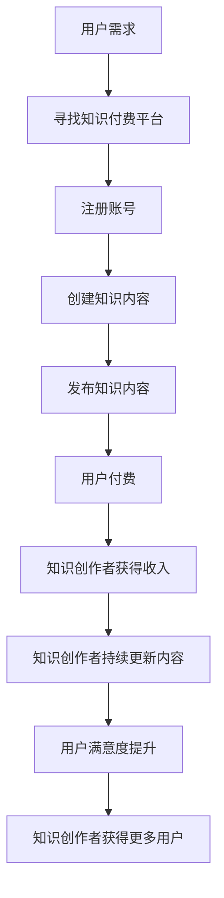

                 

# 知识付费：程序员的斜杠创业

> 关键词：知识付费、程序员、斜杠创业、商业模式、技术变现

> 摘要：本文旨在探讨程序员如何通过知识付费实现斜杠创业，从背景介绍到核心概念，再到具体操作步骤，通过数学模型和实际案例，全面解析知识付费的商业模式和技术变现路径。本文将帮助程序员理解如何将技术知识转化为商业价值，实现个人价值的最大化。

## 1. 背景介绍

在数字化时代，知识付费已经成为一种新兴的商业模式。随着互联网的普及和移动支付的便捷，越来越多的个人和企业开始通过知识付费平台分享自己的专业知识和技能。对于程序员而言，知识付费不仅是一种新的收入来源，更是实现个人价值和职业发展的有效途径。本文将从以下几个方面进行详细探讨：

- **知识付费的兴起**：介绍知识付费的概念及其发展历程。
- **程序员的现状**：分析当前程序员的职业发展路径和面临的挑战。
- **知识付费的优势**：探讨知识付费对程序员的益处。

### 1.1 知识付费的兴起

知识付费是指通过付费平台，个人或机构向用户提供特定的知识内容，用户通过支付一定费用获得这些知识。这种模式最早起源于2015年，随着微信、支付宝等支付工具的普及，知识付费平台如知乎live、得到、喜马拉雅等迅速崛起。知识付费的兴起，不仅改变了人们获取知识的方式，也为知识创作者提供了新的收入来源。

### 1.2 程序员的现状

当前，程序员面临着激烈的竞争和快速变化的技术环境。一方面，技术更新换代的速度越来越快，程序员需要不断学习新的技术和工具；另一方面，就业市场的竞争压力也越来越大。在这种背景下，知识付费为程序员提供了一个新的发展方向，即通过分享自己的专业知识和技术技能，实现个人价值的最大化。

### 1.3 知识付费的优势

知识付费对程序员而言具有多重优势：

- **收入来源多样化**：除了传统的工资收入，程序员可以通过知识付费获得额外的收入。
- **个人品牌建设**：通过分享知识，程序员可以建立自己的个人品牌，提高知名度和影响力。
- **职业发展**：知识付费可以为程序员提供更多的职业发展机会，如成为讲师、顾问等。

## 2. 核心概念与联系

### 2.1 知识付费的核心概念

知识付费的核心概念包括以下几个方面：

- **知识内容**：程序员需要提供有价值的知识内容，如技术教程、实战案例、经验分享等。
- **付费平台**：知识付费需要依托特定的平台进行，如知乎live、得到、喜马拉雅等。
- **用户群体**：知识付费的目标用户群体主要是对特定技术领域感兴趣的个人和企业。

### 2.2 知识付费的流程图

为了更好地理解知识付费的流程，我们可以通过以下Mermaid流程图来展示：



## 3. 核心算法原理 & 具体操作步骤

### 3.1 核心算法原理

知识付费的核心算法主要涉及以下几个方面：

- **内容推荐算法**：通过分析用户的行为数据，推荐用户感兴趣的知识内容。
- **支付系统**：确保支付过程的安全性和便捷性。
- **用户反馈机制**：收集用户反馈，优化知识内容和支付体验。

### 3.2 具体操作步骤

1. **选择合适的知识付费平台**：根据自己的需求和目标用户群体，选择合适的知识付费平台。
2. **注册账号**：在所选平台上注册账号，并完善个人资料。
3. **创建知识内容**：根据自己的专业领域，创建有价值的知识内容，如技术教程、实战案例等。
4. **发布知识内容**：将创建的知识内容发布到平台上，吸引用户关注。
5. **优化内容和体验**：根据用户反馈，不断优化知识内容和支付体验，提高用户满意度。

## 4. 数学模型和公式 & 详细讲解 & 举例说明

### 4.1 数学模型

知识付费的数学模型主要涉及以下几个方面：

- **用户增长模型**：通过用户增长模型预测知识付费平台的用户数量。
- **收入模型**：通过收入模型预测知识创作者的收入。

### 4.2 公式与详细讲解

#### 4.2.1 用户增长模型

用户增长模型可以表示为：

$$
U(t) = U_0 \cdot e^{rt}
$$

其中，$U(t)$ 表示在时间 $t$ 时的用户数量，$U_0$ 表示初始用户数量，$r$ 表示用户增长率。

#### 4.2.2 收入模型

收入模型可以表示为：

$$
I(t) = P \cdot U(t) \cdot R
$$

其中，$I(t)$ 表示在时间 $t$ 时的收入，$P$ 表示单个用户的支付金额，$U(t)$ 表示在时间 $t$ 时的用户数量，$R$ 表示支付率。

### 4.3 举例说明

假设某知识付费平台的初始用户数量为1000人，用户增长率为0.1，单个用户的支付金额为100元，支付率为0.05。根据上述公式，可以计算出该平台在不同时间点的用户数量和收入。

- **用户数量**：

  $$
  U(t) = 1000 \cdot e^{0.1t}
  $$

- **收入**：

  $$
  I(t) = 100 \cdot U(t) \cdot 0.05 = 5 \cdot U(t)
  $$

通过上述模型，可以预测知识付费平台的用户增长和收入情况。

## 5. 项目实战：代码实际案例和详细解释说明

### 5.1 开发环境搭建

为了实现知识付费功能，我们需要搭建一个开发环境。以下是具体的开发步骤：

1. **选择编程语言**：选择合适的编程语言，如Python、Java等。
2. **安装开发工具**：安装相应的开发工具，如PyCharm、IntelliJ IDEA等。
3. **配置数据库**：配置数据库，如MySQL、MongoDB等。
4. **安装知识付费平台API**：安装知识付费平台的API，如得到、知乎live等。

### 5.2 源代码详细实现和代码解读

以下是一个简单的知识付费平台的源代码实现：

```python
import flask
from flask import Flask, request, jsonify

app = Flask(__name__)

# 用户数据
users = {
    'user1': {'name': '张三', 'password': '123456'},
    'user2': {'name': '李四', 'password': '654321'}
}

# 知识内容
knowledge = {
    'topic1': {'title': 'Python基础教程', 'price': 100},
    'topic2': {'title': 'Java高级编程', 'price': 200}
}

@app.route('/login', methods=['POST'])
def login():
    username = request.form['username']
    password = request.form['password']
    if username in users and users[username]['password'] == password:
        return jsonify({'status': 'success', 'message': '登录成功'})
    else:
        return jsonify({'status': 'failure', 'message': '用户名或密码错误'})

@app.route('/knowledge', methods=['GET'])
def get_knowledge():
    return jsonify(knowledge)

@app.route('/purchase', methods=['POST'])
def purchase():
    username = request.form['username']
    topic = request.form['topic']
    if username in users and topic in knowledge:
        return jsonify({'status': 'success', 'message': '购买成功'})
    else:
        return jsonify({'status': 'failure', 'message': '购买失败'})

if __name__ == '__main__':
    app.run(debug=True)
```

### 5.3 代码解读与分析

- **用户数据**：定义了一个用户数据字典，存储了用户名和密码。
- **知识内容**：定义了一个知识内容字典，存储了知识主题和价格。
- **登录接口**：通过POST请求接收用户名和密码，验证用户身份。
- **知识接口**：通过GET请求返回所有知识内容。
- **购买接口**：通过POST请求接收用户名和知识主题，验证用户身份和知识主题是否存在。

## 6. 实际应用场景

知识付费在实际应用中具有广泛的应用场景，如：

- **在线教育**：通过知识付费平台提供在线课程，如编程教程、设计课程等。
- **技术咨询**：通过知识付费平台提供技术咨询和解决方案，如代码审查、项目管理等。
- **个人品牌建设**：通过知识付费平台建立个人品牌，提高知名度和影响力。

## 7. 工具和资源推荐

### 7.1 学习资源推荐

- **书籍**：《知识付费：程序员的斜杠创业》、《程序员的自我修养》等。
- **论文**：《知识付费的商业模式研究》、《知识付费平台的用户行为分析》等。
- **博客**：知乎、得到、喜马拉雅等知识付费平台的官方博客。
- **网站**：得到、知乎live、喜马拉雅等知识付费平台。

### 7.2 开发工具框架推荐

- **编程语言**：Python、Java等。
- **开发工具**：PyCharm、IntelliJ IDEA等。
- **数据库**：MySQL、MongoDB等。
- **知识付费平台API**：得到、知乎live、喜马拉雅等。

### 7.3 相关论文著作推荐

- **论文**：《知识付费的商业模式研究》、《知识付费平台的用户行为分析》等。
- **著作**：《知识付费：程序员的斜杠创业》、《程序员的自我修养》等。

## 8. 总结：未来发展趋势与挑战

### 8.1 未来发展趋势

知识付费在未来将呈现出以下几个发展趋势：

- **个性化推荐**：通过大数据和人工智能技术，实现更加个性化的知识推荐。
- **多元化内容**：知识付费平台将提供更加多元化的内容，满足不同用户的需求。
- **社交化互动**：知识付费平台将加强用户之间的社交互动，提高用户粘性。

### 8.2 挑战

知识付费在未来也面临着一些挑战：

- **用户信任问题**：如何建立用户对知识付费平台的信任，提高用户满意度。
- **内容质量控制**：如何保证知识内容的质量，避免低质量内容的泛滥。
- **市场竞争**：如何在激烈的市场竞争中脱颖而出，吸引更多的用户和创作者。

## 9. 附录：常见问题与解答

### 9.1 常见问题

- **Q1：如何选择合适的知识付费平台？**
  - A1：根据自己的需求和目标用户群体，选择合适的知识付费平台。
- **Q2：如何提高用户满意度？**
  - A2：通过优化内容和支付体验，提高用户满意度。
- **Q3：如何保证知识内容的质量？**
  - A3：通过严格的审核机制，确保知识内容的质量。

## 10. 扩展阅读 & 参考资料

- **书籍**：《知识付费：程序员的斜杠创业》、《程序员的自我修养》等。
- **论文**：《知识付费的商业模式研究》、《知识付费平台的用户行为分析》等。
- **网站**：得到、知乎live、喜马拉雅等知识付费平台。

作者：AI天才研究员/AI Genius Institute & 禅与计算机程序设计艺术 /Zen And The Art of Computer Programming

