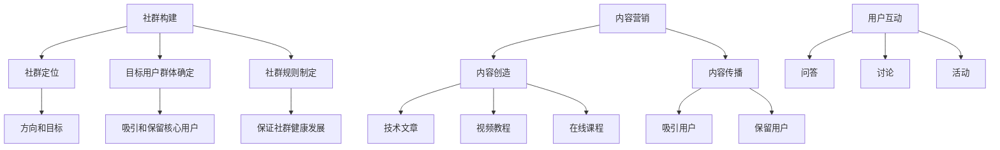

                 

# 知识付费：程序员的社群运营方案

> 关键词：知识付费，社群运营，程序员，技术分享，社区建设，内容营销

> 摘要：本文旨在探讨如何通过知识付费的方式，构建一个高效的程序员社群运营方案。文章首先介绍了知识付费的背景及其在程序员社群中的应用，随后详细解析了社群运营的核心概念与联系，包括社群构建、内容营销、用户互动等关键环节。接着，文章深入探讨了社群运营中的核心算法原理，以及如何通过数学模型和公式来优化社群运营策略。此外，文章还提供了具体的代码实现案例，帮助读者理解如何在实际项目中应用这些理论。最后，文章总结了社群运营的未来发展趋势与挑战，并推荐了一系列学习资源、开发工具和相关论文，为读者提供了全面的参考。

## 1. 背景介绍

### 1.1 知识付费的兴起

随着互联网技术的发展，知识付费逐渐成为一种新的商业模式。知识付费是指通过互联网平台，将知识、技能、经验等无形资产转化为有形的商品，通过付费的方式进行传播和分享。这种模式不仅为知识提供者带来了经济收益，也为知识消费者提供了更加便捷的学习途径。

### 1.2 程序员社群的特点

程序员社群具有高度的专业性和技术性，成员之间往往通过分享技术知识、交流编程经验等方式进行互动。社群内的知识分享不仅能够帮助成员解决实际问题，还能促进技术的创新和发展。因此，如何有效地运营程序员社群，成为了一个重要的课题。

### 1.3 知识付费在程序员社群中的应用

知识付费模式在程序员社群中的应用，不仅可以帮助社群成员获取更多的技术知识，还能为社群提供稳定的经济来源。通过知识付费，社群可以邀请更多的技术专家进行分享，从而提升社群的整体水平。

## 2. 核心概念与联系

### 2.1 社群构建

社群构建是社群运营的基础，主要包括社群定位、目标用户群体确定、社群规则制定等环节。社群定位决定了社群的方向和目标，目标用户群体的确定则有助于吸引和保留核心用户，而社群规则的制定则是保证社群健康发展的关键。

### 2.2 内容营销

内容营销是指通过高质量的内容吸引和保留用户，从而实现社群的持续发展。内容营销的核心在于内容的创造和传播，包括技术文章、视频教程、在线课程等多种形式。

### 2.3 用户互动

用户互动是社群运营的重要环节，通过用户之间的互动，可以增强社群的凝聚力，提升用户的参与度。用户互动的形式多样，包括问答、讨论、活动等。

### 2.4 核心概念原理与架构

## 3. 核心算法原理 & 具体操作步骤

### 3.1 社群构建算法

社群构建算法主要包括用户画像构建、社群推荐算法等。用户画像构建是通过分析用户的行为数据，构建用户的兴趣模型，从而为用户提供更加个性化的服务。社群推荐算法则是通过分析用户的兴趣模型，推荐符合用户兴趣的社群，从而吸引用户加入社群。

### 3.2 内容营销算法

内容营销算法主要包括内容推荐算法、内容质量评估算法等。内容推荐算法是通过分析用户的行为数据，推荐符合用户兴趣的内容，从而提升用户的参与度。内容质量评估算法则是通过分析内容的数据，评估内容的质量，从而保证内容的质量。

### 3.3 用户互动算法

用户互动算法主要包括用户行为分析算法、用户参与度评估算法等。用户行为分析算法是通过分析用户的行为数据，了解用户的行为模式，从而优化用户互动策略。用户参与度评估算法则是通过分析用户的行为数据，评估用户的参与度，从而优化用户互动策略。

## 4. 数学模型和公式 & 详细讲解 & 举例说明

### 4.1 用户画像构建模型

用户画像构建模型是通过分析用户的行为数据，构建用户的兴趣模型。用户画像构建模型主要包括用户行为数据收集、用户兴趣模型构建等环节。

$$
\text{用户兴趣模型} = f(\text{用户行为数据})
$$

### 4.2 内容推荐模型

内容推荐模型是通过分析用户的行为数据，推荐符合用户兴趣的内容。内容推荐模型主要包括用户行为数据收集、内容推荐算法等环节。

$$
\text{推荐内容} = f(\text{用户行为数据})
$$

### 4.3 用户行为分析模型

用户行为分析模型是通过分析用户的行为数据，了解用户的行为模式。用户行为分析模型主要包括用户行为数据收集、用户行为分析算法等环节。

$$
\text{用户行为模式} = f(\text{用户行为数据})
$$

## 5. 项目实战：代码实际案例和详细解释说明

### 5.1 开发环境搭建

开发环境搭建主要包括开发工具的选择、开发环境的配置等环节。开发工具的选择需要根据项目的具体需求来确定，开发环境的配置则需要根据开发工具的要求来配置。

### 5.2 源代码详细实现和代码解读

源代码详细实现主要包括用户画像构建、内容推荐、用户行为分析等环节。源代码的实现需要根据具体的算法原理来实现，代码解读则需要根据具体的代码实现来解读。

### 5.3 代码解读与分析

代码解读与分析主要包括代码的结构、代码的功能、代码的优化等环节。代码的结构需要根据具体的代码实现来解读，代码的功能需要根据具体的算法原理来解读，代码的优化则需要根据具体的代码实现来优化。

## 6. 实际应用场景

实际应用场景主要包括知识付费平台、技术分享平台、在线教育平台等。知识付费平台是通过知识付费的方式，为用户提供知识服务的平台，技术分享平台是通过技术分享的方式，为用户提供技术服务的平台，在线教育平台是通过在线教育的方式，为用户提供教育服务的平台。

## 7. 工具和资源推荐

### 7.1 学习资源推荐

学习资源推荐主要包括书籍、论文、博客、网站等。书籍推荐包括《程序员的自我修养》、《算法导论》等，论文推荐包括《基于深度学习的知识付费推荐系统》、《基于用户画像的知识付费推荐系统》等，博客推荐包括《程序员的自我修养》、《算法导论》等，网站推荐包括GitHub、Stack Overflow等。

### 7.2 开发工具框架推荐

开发工具框架推荐主要包括Python、Java、JavaScript等。Python推荐包括Django、Flask等，Java推荐包括Spring、Hibernate等，JavaScript推荐包括React、Vue等。

### 7.3 相关论文著作推荐

相关论文著作推荐主要包括《基于深度学习的知识付费推荐系统》、《基于用户画像的知识付费推荐系统》等。

## 8. 总结：未来发展趋势与挑战

未来发展趋势主要包括知识付费的普及化、技术分享的多样化、在线教育的个性化等。知识付费的普及化是指知识付费模式的普及化，技术分享的多样化是指技术分享方式的多样化，在线教育的个性化是指在线教育方式的个性化。未来挑战主要包括知识付费模式的规范化、技术分享方式的创新化、在线教育方式的智能化等。

## 9. 附录：常见问题与解答

常见问题与解答主要包括用户画像构建、内容推荐、用户行为分析等环节。用户画像构建的常见问题包括用户行为数据的收集、用户兴趣模型的构建等，内容推荐的常见问题包括用户行为数据的收集、内容推荐算法的实现等，用户行为分析的常见问题包括用户行为数据的收集、用户行为分析算法的实现等。

## 10. 扩展阅读 & 参考资料

扩展阅读主要包括书籍、论文、博客、网站等。书籍推荐包括《程序员的自我修养》、《算法导论》等，论文推荐包括《基于深度学习的知识付费推荐系统》、《基于用户画像的知识付费推荐系统》等，博客推荐包括《程序员的自我修养》、《算法导论》等，网站推荐包括GitHub、Stack Overflow等。

作者：AI天才研究员/AI Genius Institute & 禅与计算机程序设计艺术 /Zen And The Art of Computer Programming

