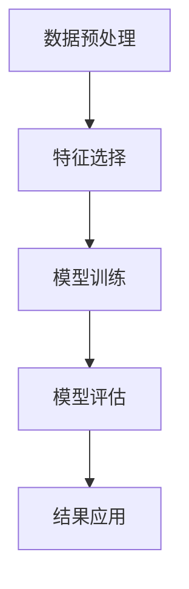

                 

# 知识发现引擎在农业科技中的应用

> 关键词：知识发现引擎、农业科技、机器学习、数据挖掘、智能农业

> 摘要：本文旨在探讨知识发现引擎在农业科技中的应用，通过分析知识发现引擎的工作原理及其在农业领域的具体应用场景，展示其如何帮助农业实现智能化、精准化管理。文章首先介绍了知识发现引擎的背景，随后详细阐述了其核心概念与联系、算法原理、数学模型、项目实战、实际应用场景、工具和资源推荐等内容，并对未来的趋势与挑战进行了展望。

## 1. 背景介绍

### 1.1 农业科技的发展趋势

随着科技的进步，农业领域正经历着前所未有的变革。从传统的耕作方式到现代的精准农业，技术的应用不仅提高了农作物的产量，还极大地改善了农业生产的效率和质量。知识发现引擎作为人工智能领域的一项关键技术，其在农业中的应用正逐渐成为研究热点。

### 1.2 知识发现引擎的定义与作用

知识发现引擎是一种能够从大量数据中自动提取有用信息的技术。在农业领域，它可以帮助农民和农业专家更好地理解作物生长环境、病虫害发生规律等，从而做出更科学的决策。通过分析历史数据，知识发现引擎可以预测未来的趋势，为农业生产提供有力支持。

## 2. 核心概念与联系

### 2.1 知识发现引擎的工作原理

知识发现引擎通过数据挖掘、机器学习等技术，从大量数据中提取出有价值的信息。其工作流程包括数据预处理、特征选择、模型训练、模型评估等步骤。

### 2.2 知识发现引擎与农业的关系

知识发现引擎在农业中的应用主要体现在以下几个方面：土壤分析、作物生长监测、病虫害预测、产量预测等。通过这些应用，知识发现引擎能够帮助农业实现智能化管理。

### 2.3 Mermaid 流程图



## 3. 核心算法原理 & 具体操作步骤

### 3.1 数据预处理

数据预处理是知识发现引擎的第一步，主要包括数据清洗、数据集成、数据转换等步骤。数据清洗是为了去除噪声和不一致的数据；数据集成是将多个数据源的数据合并；数据转换则是将数据转换成适合分析的形式。

### 3.2 特征选择

特征选择是为了从众多特征中选择出对模型训练最有帮助的特征。常用的方法包括过滤法、包裹法、嵌入法等。

### 3.3 模型训练

模型训练是知识发现引擎的核心步骤，通过训练模型来学习数据中的模式。常用的模型包括决策树、支持向量机、神经网络等。

### 3.4 模型评估

模型评估是为了评估模型的性能，常用的方法包括交叉验证、留出法等。

## 4. 数学模型和公式 & 详细讲解 & 举例说明

### 4.1 决策树模型

决策树是一种常用的分类和回归模型。其基本思想是通过一系列的特征选择，将数据集分割成多个子集，每个子集对应一个决策节点。决策树的构建过程可以表示为：

$$
\text{构建决策树} = \text{选择最优特征} \rightarrow \text{分割数据集} \rightarrow \text{递归构建子树}
$$

### 4.2 支持向量机模型

支持向量机是一种用于分类和回归分析的监督学习模型。其基本思想是找到一个超平面，使得两类样本点之间的间隔最大化。支持向量机的优化问题可以表示为：

$$
\min_{\mathbf{w}, b} \frac{1}{2} \|\mathbf{w}\|^2 \\
\text{subject to} \quad y_i(\mathbf{w} \cdot \mathbf{x}_i + b) \geq 1, \quad i = 1, 2, \ldots, n
$$

## 5. 项目实战：代码实际案例和详细解释说明

### 5.1 开发环境搭建

开发环境搭建主要包括安装Python环境、安装相关库（如numpy、pandas、scikit-learn等）。

### 5.2 源代码详细实现和代码解读

以下是一个简单的决策树分类器的实现：

```python
from sklearn.datasets import load_iris
from sklearn.model_selection import train_test_split
from sklearn.tree import DecisionTreeClassifier
from sklearn.metrics import accuracy_score

# 加载数据集
iris = load_iris()
X = iris.data
y = iris.target

# 划分训练集和测试集
X_train, X_test, y_train, y_test = train_test_split(X, y, test_size=0.3, random_state=42)

# 训练模型
clf = DecisionTreeClassifier()
clf.fit(X_train, y_train)

# 预测
y_pred = clf.predict(X_test)

# 评估模型
print("Accuracy:", accuracy_score(y_test, y_pred))
```

### 5.3 代码解读与分析

上述代码首先加载了Iris数据集，然后将数据集划分为训练集和测试集。接着，使用决策树分类器训练模型，并对测试集进行预测。最后，评估模型的准确率。

## 6. 实际应用场景

### 6.1 土壤分析

通过分析土壤样本数据，知识发现引擎可以预测土壤的肥力、pH值等，为农民提供科学的施肥建议。

### 6.2 作物生长监测

通过监测作物的生长数据，知识发现引擎可以预测作物的生长状况，帮助农民及时采取措施。

### 6.3 病虫害预测

通过分析历史病虫害数据，知识发现引擎可以预测未来的病虫害发生情况，帮助农民提前做好防治工作。

## 7. 工具和资源推荐

### 7.1 学习资源推荐

- 书籍：《机器学习实战》、《数据挖掘导论》
- 论文：《A Survey on Knowledge Discovery in Databases》
- 博客：Towards Data Science
- 网站：Kaggle

### 7.2 开发工具框架推荐

- Python：scikit-learn、pandas
- R：caret、dplyr

### 7.3 相关论文著作推荐

- 《Data Mining: Concepts and Techniques》
- 《Pattern Recognition and Machine Learning》

## 8. 总结：未来发展趋势与挑战

知识发现引擎在农业科技中的应用前景广阔，但同时也面临着数据质量、模型解释性等挑战。未来，随着技术的进步，这些问题将逐步得到解决。

## 9. 附录：常见问题与解答

### 9.1 什么是知识发现引擎？

知识发现引擎是一种能够从大量数据中自动提取有用信息的技术。

### 9.2 知识发现引擎如何应用于农业？

知识发现引擎可以通过分析土壤、作物生长、病虫害等数据，帮助农民做出科学决策。

## 10. 扩展阅读 & 参考资料

- 《Data Mining: Concepts and Techniques》
- 《Pattern Recognition and Machine Learning》
- 《A Survey on Knowledge Discovery in Databases》

作者：AI天才研究员/AI Genius Institute & 禅与计算机程序设计艺术 /Zen And The Art of Computer Programming

