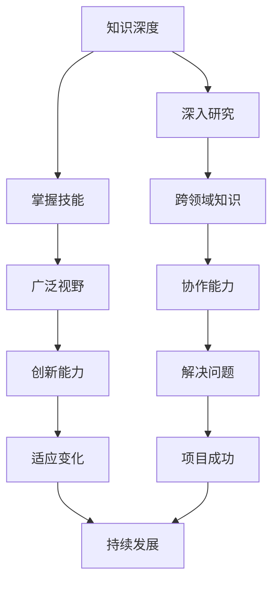

                 

# 知识的深度vs广度：T型人才的培养

> 关键词：T型人才, 知识深度, 知识广度, 专业技能, 跨领域知识, 项目实战, 代码实现, 应用场景, 工具推荐, 未来趋势

> 摘要：本文旨在探讨T型人才在IT领域的培养之道。通过分析知识深度与广度的关系，结合具体案例，阐述如何在专业技能和跨领域知识之间找到平衡，培养出具备深厚专业知识和广泛视野的复合型人才。文章将从背景介绍、核心概念与联系、核心算法原理、项目实战、实际应用场景、工具和资源推荐、总结与未来趋势等几个方面进行详细阐述。

## 1. 背景介绍

在当今快速发展的信息技术领域，人才的需求呈现出多元化的特点。一方面，企业需要具备深厚专业知识的专家型人才，以解决复杂的技术问题；另一方面，也需要能够跨领域协作、具备广泛视野的复合型人才，以应对多变的市场需求。T型人才的概念应运而生，他们不仅在某一领域拥有深厚的专业知识，还具备跨领域的广泛视野和技能。本文将探讨如何培养T型人才，以适应未来IT领域的发展需求。

## 2. 核心概念与联系

### 2.1 T型人才定义

T型人才是指在某一专业领域具有深厚知识和技能的人才，同时具备跨领域的广泛视野和技能。T型人才的“T”形结构，横轴代表跨领域知识，竖轴代表专业知识。

### 2.2 知识深度与广度的关系

知识深度与广度是相辅相成的。知识深度是指在某一领域内深入研究和掌握的知识，而知识广度则是指具备跨领域的知识和技能。两者之间的关系可以用以下流程图表示：



### 2.3 T型人才的培养路径

T型人才的培养路径可以分为以下几个阶段：

1. **专业知识积累**：深入研究某一专业领域，掌握扎实的专业知识和技能。
2. **跨领域学习**：通过学习其他领域的知识，拓宽视野，增强跨领域协作能力。
3. **实践应用**：将所学知识应用于实际项目中，通过实践提升综合能力。
4. **持续学习**：保持对新技术和新知识的学习，不断提升自我。

## 3. 核心算法原理 & 具体操作步骤

### 3.1 知识深度的实现

#### 3.1.1 深入研究某一专业领域

1. **选择研究方向**：确定研究领域，如人工智能、大数据、云计算等。
2. **系统学习**：通过阅读专业书籍、参加在线课程、参与学术研究等方式，系统学习专业知识。
3. **实践应用**：通过实际项目或实验，将所学知识应用于实践，加深理解。

#### 3.1.2 掌握专业技能

1. **技能训练**：通过编程、算法设计、数据分析等技能训练，提升专业技能。
2. **项目经验**：参与实际项目，积累项目经验，提升解决问题的能力。
3. **持续优化**：不断优化技能，保持技术的先进性。

### 3.2 知识广度的实现

#### 3.2.1 跨领域学习

1. **了解其他领域**：通过阅读相关书籍、参加跨领域研讨会等方式，了解其他领域的知识。
2. **学习工具和方法**：学习其他领域的工具和方法，如数据分析、项目管理等。
3. **实践应用**：将所学知识应用于实际项目中，提升跨领域协作能力。

#### 3.2.2 增强协作能力

1. **团队合作**：参与团队项目，提升团队协作能力。
2. **沟通技巧**：学习沟通技巧，提升与不同领域人员的沟通能力。
3. **项目管理**：学习项目管理方法，提升项目管理能力。

## 4. 数学模型和公式 & 详细讲解 & 举例说明

### 4.1 数学模型

#### 4.1.1 专业知识模型

假设某人在某一专业领域内拥有知识深度，可以用以下数学模型表示：

$$
K = \sum_{i=1}^{n} k_i
$$

其中，$K$ 表示知识深度，$k_i$ 表示第 $i$ 个知识点。

#### 4.1.2 跨领域知识模型

假设某人在跨领域知识方面拥有知识广度，可以用以下数学模型表示：

$$
G = \sum_{j=1}^{m} g_j
$$

其中，$G$ 表示知识广度，$g_j$ 表示第 $j$ 个跨领域知识点。

### 4.2 举例说明

假设某人在人工智能领域拥有深厚的专业知识，同时具备跨领域的广泛视野。我们可以用以下例子来说明：

1. **专业知识**：某人在机器学习领域拥有深厚的专业知识，能够熟练应用各种算法和模型。
2. **跨领域知识**：某人还具备数据分析、项目管理等跨领域的知识，能够与不同领域的人员进行有效沟通和协作。

## 5. 项目实战：代码实际案例和详细解释说明

### 5.1 开发环境搭建

#### 5.1.1 环境配置

1. **操作系统**：选择合适的操作系统，如Linux或Windows。
2. **开发工具**：安装IDE（如PyCharm、VSCode），配置开发环境。
3. **依赖库**：安装必要的依赖库，如NumPy、Pandas等。

#### 5.1.2 项目初始化

1. **创建项目目录**：创建项目目录，组织项目文件。
2. **版本控制**：使用Git进行版本控制，初始化仓库。
3. **项目结构**：设计项目结构，确保代码清晰易读。

### 5.2 源代码详细实现和代码解读

#### 5.2.1 代码实现

```python
import numpy as np
import pandas as pd

# 读取数据
data = pd.read_csv('data.csv')

# 数据预处理
X = data.iloc[:, :-1].values
y = data.iloc[:, -1].values

# 划分训练集和测试集
from sklearn.model_selection import train_test_split
X_train, X_test, y_train, y_test = train_test_split(X, y, test_size=0.2, random_state=0)

# 训练模型
from sklearn.linear_model import LinearRegression
regressor = LinearRegression()
regressor.fit(X_train, y_train)

# 预测结果
y_pred = regressor.predict(X_test)

# 评估模型
from sklearn.metrics import mean_squared_error
mse = mean_squared_error(y_test, y_pred)
print('Mean Squared Error:', mse)
```

#### 5.2.2 代码解读

1. **导入库**：导入必要的库，如NumPy、Pandas、sklearn等。
2. **读取数据**：使用Pandas读取数据文件。
3. **数据预处理**：对数据进行预处理，包括特征选择和标签选择。
4. **划分数据集**：使用train_test_split函数划分训练集和测试集。
5. **训练模型**：使用线性回归模型进行训练。
6. **预测结果**：使用训练好的模型进行预测。
7. **评估模型**：计算均方误差，评估模型性能。

### 5.3 代码解读与分析

通过上述代码实现，我们可以看到T型人才在项目实战中的具体应用。他们不仅具备深厚的专业知识，还具备跨领域的广泛视野和技能。通过实际项目，他们能够将所学知识应用于实践，提升综合能力。

## 6. 实际应用场景

### 6.1 企业应用

在企业中，T型人才可以担任项目经理、技术专家等角色，负责项目的整体规划和实施。他们能够结合专业知识和跨领域知识，解决复杂的技术问题，推动项目成功。

### 6.2 学术研究

在学术研究领域，T型人才可以担任研究员、导师等角色，进行跨学科的研究。他们能够结合专业知识和跨领域知识，推动学术研究的发展。

### 6.3 创业创新

在创业创新领域，T型人才可以担任创业者、产品经理等角色，推动创新项目的实施。他们能够结合专业知识和跨领域知识，解决实际问题，推动项目成功。

## 7. 工具和资源推荐

### 7.1 学习资源推荐

1. **书籍**：《深入浅出机器学习》、《Python数据分析》、《项目管理》等。
2. **在线课程**：Coursera、edX、Udacity等平台上的相关课程。
3. **学术论文**：Google Scholar、IEEE Xplore等学术资源平台。

### 7.2 开发工具框架推荐

1. **IDE**：PyCharm、VSCode等。
2. **版本控制**：Git、GitHub等。
3. **数据分析工具**：Pandas、NumPy等。

### 7.3 相关论文著作推荐

1. **书籍**：《深入浅出机器学习》、《Python数据分析》、《项目管理》等。
2. **论文**：《机器学习在实际应用中的挑战与机遇》、《跨领域知识在项目管理中的应用》等。

## 8. 总结：未来发展趋势与挑战

### 8.1 未来发展趋势

1. **技术融合**：未来IT领域将更加注重技术的融合，T型人才将成为主流。
2. **跨领域协作**：跨领域协作将成为常态，T型人才的需求将持续增长。
3. **持续学习**：持续学习将成为T型人才的重要特征，他们需要不断更新知识和技能。

### 8.2 挑战

1. **知识更新**：技术更新速度快，T型人才需要不断学习新知识。
2. **跨领域协作**：跨领域协作需要较强的沟通和协作能力，T型人才需要不断提升这些能力。
3. **项目管理**：项目管理能力是T型人才的重要能力之一，需要不断学习和实践。

## 9. 附录：常见问题与解答

### 9.1 问题1：如何平衡专业知识和跨领域知识？

**解答**：可以通过系统学习和实践应用来平衡专业知识和跨领域知识。在学习专业知识的同时，积极参与跨领域的学习和实践，不断提升综合能力。

### 9.2 问题2：如何提升项目管理能力？

**解答**：可以通过参加项目管理课程、阅读相关书籍、参与实际项目等方式提升项目管理能力。同时，不断总结经验，提升项目管理技巧。

### 9.3 问题3：如何保持技术的先进性？

**解答**：可以通过持续学习新技术和新知识，参加技术交流活动，参与开源项目等方式保持技术的先进性。同时，不断实践和应用新技术，提升技术水平。

## 10. 扩展阅读 & 参考资料

### 10.1 扩展阅读

1. **书籍**：《深入浅出机器学习》、《Python数据分析》、《项目管理》等。
2. **论文**：《机器学习在实际应用中的挑战与机遇》、《跨领域知识在项目管理中的应用》等。

### 10.2 参考资料

1. **Coursera**：https://www.coursera.org/
2. **edX**：https://www.edx.org/
3. **Udacity**：https://www.udacity.com/
4. **Google Scholar**：https://scholar.google.com/
5. **IEEE Xplore**：https://ieeexplore.ieee.org/

---

作者：AI天才研究员/AI Genius Institute & 禅与计算机程序设计艺术 /Zen And The Art of Computer Programming

