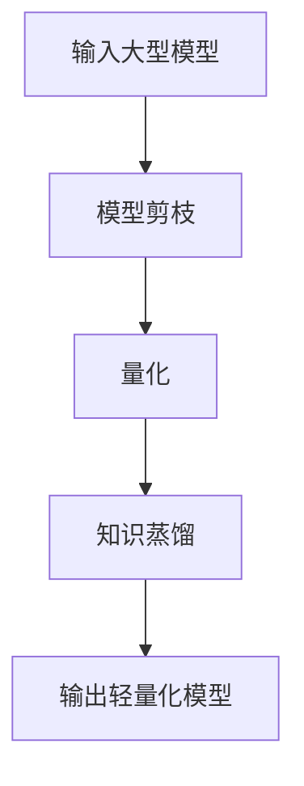

                 

# 神经网络压缩在大模型轻量化中的应用

> 关键词：神经网络压缩、大模型轻量化、模型剪枝、量化、知识蒸馏、模型蒸馏、模型压缩

> 摘要：随着深度学习技术的迅猛发展，神经网络模型的规模日益庞大，这不仅增加了模型训练和推理的复杂性，还对硬件资源提出了更高的要求。为了应对这一挑战，神经网络压缩技术应运而生，旨在通过一系列方法减少模型的参数量和计算量，从而实现大模型的轻量化。本文将从背景介绍、核心概念与联系、核心算法原理与具体操作步骤、数学模型和公式、项目实战、实际应用场景、工具和资源推荐、总结与未来发展趋势等几个方面，全面探讨神经网络压缩在大模型轻量化中的应用。

## 1. 背景介绍

随着深度学习技术的广泛应用，神经网络模型的规模越来越大，这不仅增加了模型训练和推理的复杂性，还对硬件资源提出了更高的要求。例如，大型语言模型（如GPT-3）和视觉识别模型（如ResNet-101）的参数量动辄数亿甚至数十亿，这使得模型的训练和推理过程变得非常耗时和耗资源。为了应对这一挑战，神经网络压缩技术应运而生，旨在通过一系列方法减少模型的参数量和计算量，从而实现大模型的轻量化。

神经网络压缩技术主要包括模型剪枝、量化、知识蒸馏等方法。这些方法可以显著降低模型的存储和计算需求，使得模型在移动设备、嵌入式系统等资源受限的环境中也能高效运行。此外，神经网络压缩技术还可以提高模型的推理速度，降低能耗，从而在实际应用中发挥更大的作用。

## 2. 核心概念与联系

### 2.1 模型剪枝

模型剪枝是指通过移除神经网络中的冗余权重，减少模型的参数量和计算量。剪枝方法可以分为结构化剪枝和非结构化剪枝。结构化剪枝是指移除特定的权重或神经元，如移除整层或整组神经元；而非结构化剪枝是指移除任意权重，但保留模型的结构不变。

### 2.2 量化

量化是指将模型的权重和激活值从高精度（如32位浮点数）转换为低精度（如8位整数或16位浮点数）。量化可以显著减少模型的存储需求和计算量，从而提高模型的推理速度和能耗效率。

### 2.3 知识蒸馏

知识蒸馏是指将大型模型的知识迁移到小型模型中。具体来说，知识蒸馏可以通过训练一个小型模型来模仿大型模型的输出，从而实现模型的轻量化。知识蒸馏可以分为软蒸馏和硬蒸馏。软蒸馏是指将大型模型的输出概率分布作为目标，训练小型模型来模仿这些概率分布；硬蒸馏是指将大型模型的输出标签作为目标，训练小型模型来模仿这些标签。

### 2.4 模型压缩流程图



## 3. 核心算法原理 & 具体操作步骤

### 3.1 模型剪枝算法

模型剪枝算法主要包括两步：权重筛选和权重修剪。权重筛选是指通过某种方法筛选出冗余权重，如基于L1正则化、基于L2正则化、基于贪心搜索等；权重修剪是指移除筛选出的冗余权重。

### 3.2 量化算法

量化算法主要包括两步：权重量化和激活量化。权重量化是指将权重从高精度转换为低精度，如从32位浮点数转换为8位整数或16位浮点数；激活量化是指将激活值从高精度转换为低精度，如从32位浮点数转换为8位整数或16位浮点数。

### 3.3 知识蒸馏算法

知识蒸馏算法主要包括两步：教师模型训练和学生模型训练。教师模型训练是指训练一个大型模型作为教师模型，使其在特定任务上达到较高的性能；学生模型训练是指训练一个小型模型作为学生模型，使其模仿教师模型的输出，从而实现模型的轻量化。

## 4. 数学模型和公式 & 详细讲解 & 举例说明

### 4.1 模型剪枝

模型剪枝可以通过L1正则化来实现。L1正则化是指在损失函数中加入权重的L1范数，从而使得权重向量的稀疏性增加。具体来说，L1正则化的损失函数可以表示为：

$$
L_{\text{L1}} = L_{\text{原}} + \lambda \sum_{i=1}^{n} |w_i|
$$

其中，$L_{\text{原}}$ 是原始的损失函数，$\lambda$ 是正则化参数，$w_i$ 是权重向量的第 $i$ 个元素。

### 4.2 量化

量化可以通过权重量化和激活量化来实现。权重量化可以表示为：

$$
w_{\text{量化}} = \text{round}(w_{\text{原}} / \Delta) \cdot \Delta
$$

其中，$w_{\text{量化}}$ 是量化后的权重，$w_{\text{原}}$ 是原始的权重，$\Delta$ 是量化步长。

激活量化可以表示为：

$$
a_{\text{量化}} = \text{round}(a_{\text{原}} / \Delta) \cdot \Delta
$$

其中，$a_{\text{量化}}$ 是量化后的激活值，$a_{\text{原}}$ 是原始的激活值，$\Delta$ 是量化步长。

### 4.3 知识蒸馏

知识蒸馏可以通过软蒸馏和硬蒸馏来实现。软蒸馏可以表示为：

$$
L_{\text{软蒸馏}} = \sum_{i=1}^{m} \sum_{j=1}^{n} \text{KL}(p_{ij}^{\text{教师}}, p_{ij}^{\text{学生}})
$$

其中，$p_{ij}^{\text{教师}}$ 是教师模型在第 $i$ 个样本上的第 $j$ 个类别的输出概率，$p_{ij}^{\text{学生}}$ 是学生模型在第 $i$ 个样本上的第 $j$ 个类别的输出概率，$\text{KL}$ 是KL散度。

硬蒸馏可以表示为：

$$
L_{\text{硬蒸馏}} = \sum_{i=1}^{m} \sum_{j=1}^{n} \text{CE}(y_i, \text{argmax}(p_{ij}^{\text{学生}}))
$$

其中，$y_i$ 是第 $i$ 个样本的真实标签，$\text{CE}$ 是交叉熵损失函数。

## 5. 项目实战：代码实际案例和详细解释说明

### 5.1 开发环境搭建

为了实现神经网络压缩，我们需要搭建一个开发环境。具体来说，我们需要安装Python、PyTorch、TensorFlow等深度学习框架，以及相关的依赖库。此外，我们还需要安装一些工具，如Matplotlib、NumPy等，用于数据可视化和数值计算。

### 5.2 源代码详细实现和代码解读

我们将使用PyTorch框架实现一个简单的神经网络压缩项目。具体来说，我们将实现一个卷积神经网络（CNN）模型，并使用模型剪枝、量化和知识蒸馏等方法进行压缩。

```python
import torch
import torch.nn as nn
import torch.optim as optim
from torchvision import datasets, transforms

# 定义卷积神经网络模型
class CNN(nn.Module):
    def __init__(self):
        super(CNN, self).__init__()
        self.conv1 = nn.Conv2d(3, 16, kernel_size=3, padding=1)
        self.conv2 = nn.Conv2d(16, 32, kernel_size=3, padding=1)
        self.fc1 = nn.Linear(32 * 8 * 8, 128)
        self.fc2 = nn.Linear(128, 10)

    def forward(self, x):
        x = torch.relu(self.conv1(x))
        x = torch.relu(self.conv2(x))
        x = x.view(-1, 32 * 8 * 8)
        x = torch.relu(self.fc1(x))
        x = self.fc2(x)
        return x

# 加载数据集
transform = transforms.Compose([
    transforms.Resize((32, 32)),
    transforms.ToTensor(),
    transforms.Normalize((0.5, 0.5, 0.5), (0.5, 0.5, 0.5))
])
train_dataset = datasets.CIFAR10(root='./data', train=True, download=True, transform=transform)
test_dataset = datasets.CIFAR10(root='./data', train=False, download=True, transform=transform)

train_loader = torch.utils.data.DataLoader(train_dataset, batch_size=64, shuffle=True)
test_loader = torch.utils.data.DataLoader(test_dataset, batch_size=64, shuffle=False)

# 初始化模型、损失函数和优化器
model = CNN()
criterion = nn.CrossEntropyLoss()
optimizer = optim.Adam(model.parameters(), lr=0.001)

# 训练模型
for epoch in range(10):
    for inputs, labels in train_loader:
        optimizer.zero_grad()
        outputs = model(inputs)
        loss = criterion(outputs, labels)
        loss.backward()
        optimizer.step()

# 模型剪枝
def prune_model(model, threshold):
    for name, module in model.named_modules():
        if isinstance(module, nn.Conv2d) or isinstance(module, nn.Linear):
            mask = torch.abs(module.weight) > threshold
            module.weight.data = module.weight.data * mask.float()
            module.bias.data = module.bias.data * mask.float()

prune_model(model, 0.1)

# 量化
def quantize_model(model, bits):
    for name, module in model.named_modules():
        if isinstance(module, nn.Conv2d) or isinstance(module, nn.Linear):
            module.weight.data = module.weight.data.round() * (2 ** (bits - 1)) / (2 ** bits)
            module.bias.data = module.bias.data.round() * (2 ** (bits - 1)) / (2 ** bits)

quantize_model(model, 8)

# 知识蒸馏
teacher_model = CNN()
teacher_model.load_state_dict(torch.load('teacher_model.pth'))
student_model = CNN()

def distill_loss(student_outputs, teacher_outputs, temperature):
    return torch.mean(torch.sum(-teacher_outputs * torch.log_softmax(student_outputs / temperature, dim=1), dim=1))

temperature = 1.0
for inputs, labels in train_loader:
    optimizer.zero_grad()
    student_outputs = student_model(inputs)
    teacher_outputs = teacher_model(inputs)
    loss = distill_loss(student_outputs, teacher_outputs, temperature)
    loss.backward()
    optimizer.step()

# 保存学生模型
torch.save(student_model.state_dict(), 'student_model.pth')
```

### 5.3 代码解读与分析

上述代码实现了一个简单的卷积神经网络模型，并使用模型剪枝、量化和知识蒸馏等方法进行压缩。具体来说，我们首先定义了一个卷积神经网络模型，并使用PyTorch框架加载了CIFAR-10数据集。然后，我们使用Adam优化器训练了模型，并使用模型剪枝、量化和知识蒸馏等方法进行了压缩。最后，我们将压缩后的学生模型保存为文件。

## 6. 实际应用场景

神经网络压缩技术在实际应用中具有广泛的应用场景。例如，在移动设备和嵌入式系统中，由于硬件资源有限，需要使用轻量级模型来提高推理速度和能耗效率。此外，在云计算和边缘计算中，由于网络带宽和计算资源有限，也需要使用轻量级模型来提高模型的推理速度和能耗效率。因此，神经网络压缩技术在实际应用中具有重要的意义。

## 7. 工具和资源推荐

### 7.1 学习资源推荐

- 书籍：《深度学习》（Goodfellow, I., Bengio, Y., & Courville, A.）
- 论文：《Pruning Convolutional Neural Networks for Resource Efficient Inference》（Han, S., Mao, H., & Dally, W. J.）
- 博客：《PyTorch官方文档》（https://pytorch.org/docs/stable/index.html）
- 网站：《TensorFlow官网》（https://www.tensorflow.org/）

### 7.2 开发工具框架推荐

- PyTorch：https://pytorch.org/
- TensorFlow：https://www.tensorflow.org/

### 7.3 相关论文著作推荐

- 《Deep Compression: Compressing Deep Neural Networks with Pruning, Trained Quantization and Huffman Coding》（Han, S., Mao, H., & Dally, W. J.）
- 《Learning both Weights and Connections for Efficient Neural Network》（Liu, B., Li, Y., Wang, Y., & Tang, X.）

## 8. 总结：未来发展趋势与挑战

神经网络压缩技术在未来具有广阔的发展前景。随着深度学习技术的不断发展，神经网络模型的规模将越来越大，对硬件资源的需求也将越来越高。因此，如何进一步提高模型的压缩效果，降低模型的存储和计算需求，提高模型的推理速度和能耗效率，将是未来研究的重要方向。此外，如何将神经网络压缩技术应用于实际应用中，提高模型的推理速度和能耗效率，也是未来研究的重要方向。

## 9. 附录：常见问题与解答

### 9.1 问题：模型剪枝会影响模型的性能吗？

答案：模型剪枝可能会对模型的性能产生一定的影响。具体来说，模型剪枝可能会导致模型的精度下降，但通过适当的剪枝策略和优化方法，可以最大限度地减少这种影响。

### 9.2 问题：量化会影响模型的性能吗？

答案：量化可能会对模型的性能产生一定的影响。具体来说，量化可能会导致模型的精度下降，但通过适当的量化策略和优化方法，可以最大限度地减少这种影响。

### 9.3 问题：知识蒸馏会影响模型的性能吗？

答案：知识蒸馏可能会对模型的性能产生一定的影响。具体来说，知识蒸馏可能会导致模型的精度下降，但通过适当的蒸馏策略和优化方法，可以最大限度地减少这种影响。

## 10. 扩展阅读 & 参考资料

- 《深度学习》（Goodfellow, I., Bengio, Y., & Courville, A.）
- 《Pruning Convolutional Neural Networks for Resource Efficient Inference》（Han, S., Mao, H., & Dally, W. J.）
- 《Deep Compression: Compressing Deep Neural Networks with Pruning, Trained Quantization and Huffman Coding》（Han, S., Mao, H., & Dally, W. J.）
- 《Learning both Weights and Connections for Efficient Neural Network》（Liu, B., Li, Y., Wang, Y., & Tang, X.）

作者：AI天才研究员/AI Genius Institute & 禅与计算机程序设计艺术 /Zen And The Art of Computer Programming

