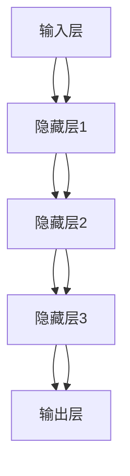

                 

# 神经网络：人工智能的基石

> 关键词：神经网络, 人工智能, 深度学习, 机器学习, 神经元, 反向传播

> 摘要：神经网络是现代人工智能的核心技术之一，它通过模拟人脑神经元的工作方式，实现了复杂模式识别和决策任务。本文将从神经网络的基本概念出发，深入探讨其核心算法原理，通过数学模型和公式进行详细讲解，并结合实际代码案例进行实战演示。最后，我们将探讨神经网络在实际应用中的场景，并提供学习资源和工具推荐，帮助读者更好地理解和应用这一技术。

## 1. 背景介绍

神经网络是模仿人脑神经元工作方式的一种计算模型，它通过多层次的节点（神经元）进行信息处理，实现复杂的模式识别和决策任务。神经网络技术在图像识别、自然语言处理、语音识别等领域取得了显著的成果，成为现代人工智能的重要组成部分。

### 1.1 人工智能的发展历程

人工智能（Artificial Intelligence, AI）的发展经历了多个阶段，从早期的符号主义到现代的连接主义，神经网络技术在其中扮演了重要角色。早期的AI研究主要集中在规则和逻辑推理上，但随着计算能力的提升和大数据的出现，基于统计学习的方法逐渐成为主流。神经网络作为连接主义的代表，通过模拟人脑的结构和功能，实现了对复杂模式的高效学习和识别。

### 1.2 神经网络的历史沿革

神经网络的概念最早可以追溯到1943年，由心理学家沃伦·麦卡洛克（Warren McCulloch）和数学家沃尔特·皮茨（Walter Pitts）提出。他们构建了一个简单的神经网络模型，用于模拟人脑神经元的工作原理。随后，多层感知器（Multilayer Perceptron, MLP）在1986年由大卫·鲁梅尔哈特（David Rumelhart）、吉姆·麦克莱恩（Jim McClelland）和布鲁斯·帕金森（Bruce Hinton）等人提出，标志着神经网络技术的突破性进展。近年来，深度学习技术的兴起使得神经网络在多个领域取得了突破性的成果。

## 2. 核心概念与联系

### 2.1 神经元模型

神经元是神经网络的基本单元，它通过接收输入信号、进行处理并输出结果。神经元模型可以分为输入层、隐藏层和输出层。输入层接收外部输入信号，隐藏层进行复杂的特征提取和转换，输出层产生最终的输出结果。

### 2.2 神经网络架构

神经网络的架构可以分为单层感知器和多层感知器。单层感知器只有一个输入层和一个输出层，而多层感知器则包含多个隐藏层，可以实现更复杂的特征提取和模式识别。

### 2.3 神经网络流程图



## 3. 核心算法原理 & 具体操作步骤

### 3.1 前向传播

前向传播是神经网络的基本操作，它通过逐层传递输入信号，实现特征的逐步提取和转换。具体步骤如下：

1. **输入层接收输入信号**：输入层接收外部输入信号，并将其传递给隐藏层。
2. **隐藏层计算激活值**：隐藏层中的每个神经元根据输入信号和权重计算激活值，公式为：
   $$ z = \sum_{i} w_i x_i + b $$
   其中，$w_i$ 是权重，$x_i$ 是输入信号，$b$ 是偏置项。
3. **激活函数**：隐藏层中的每个神经元通过激活函数将激活值转换为输出信号，常用的激活函数有Sigmoid、ReLU等。
4. **传递输出信号**：隐藏层将计算得到的输出信号传递给下一层，直到输出层。

### 3.2 反向传播

反向传播是神经网络的核心算法，用于调整权重和偏置项，以最小化损失函数。具体步骤如下：

1. **计算损失函数**：输出层的输出信号与真实标签之间的差异称为损失函数，常用的损失函数有均方误差（MSE）、交叉熵等。
2. **计算梯度**：通过链式法则计算每个权重和偏置项的梯度，公式为：
   $$ \frac{\partial L}{\partial w_i} = \frac{\partial L}{\partial z} \cdot \frac{\partial z}{\partial w_i} $$
   其中，$L$ 是损失函数，$z$ 是激活值。
3. **更新权重和偏置项**：根据梯度下降法更新权重和偏置项，公式为：
   $$ w_i = w_i - \eta \cdot \frac{\partial L}{\partial w_i} $$
   $$ b = b - \eta \cdot \frac{\partial L}{\partial b} $$
   其中，$\eta$ 是学习率。

## 4. 数学模型和公式 & 详细讲解 & 举例说明

### 4.1 前向传播公式

前向传播公式可以表示为：
$$ z = \sum_{i} w_i x_i + b $$
$$ a = \sigma(z) $$
其中，$z$ 是激活值，$a$ 是激活函数的输出，$\sigma$ 是激活函数。

### 4.2 反向传播公式

反向传播公式可以表示为：
$$ \frac{\partial L}{\partial w_i} = \frac{\partial L}{\partial z} \cdot x_i $$
$$ \frac{\partial L}{\partial b} = \frac{\partial L}{\partial z} $$
其中，$\frac{\partial L}{\partial z}$ 是损失函数对激活值的偏导数。

### 4.3 举例说明

假设我们有一个简单的神经网络，包含一个输入层、一个隐藏层和一个输出层。输入层有2个节点，隐藏层有3个节点，输出层有1个节点。权重和偏置项如下：

| 权重 | 偏置 |
|------|------|
| $w_{11}$ | $b_1$ |
| $w_{12}$ | $b_2$ |
| $w_{13}$ | $b_3$ |
| $w_{21}$ | $b_4$ |
| $w_{22}$ | $b_5$ |
| $w_{23}$ | $b_6$ |

输入信号为 $x_1 = 0.5$ 和 $x_2 = 0.3$，激活函数为 Sigmoid 函数。计算隐藏层的激活值和输出层的激活值如下：

1. **隐藏层计算激活值**：
   $$ z_1 = w_{11} \cdot x_1 + w_{12} \cdot x_2 + b_1 $$
   $$ z_2 = w_{21} \cdot x_1 + w_{22} \cdot x_2 + b_2 $$
   $$ z_3 = w_{31} \cdot x_1 + w_{32} \cdot x_2 + b_3 $$
   $$ a_1 = \sigma(z_1) $$
   $$ a_2 = \sigma(z_2) $$
   $$ a_3 = \sigma(z_3) $$

2. **输出层计算激活值**：
   $$ z_4 = w_{41} \cdot a_1 + w_{42} \cdot a_2 + w_{43} \cdot a_3 + b_4 $$
   $$ a_4 = \sigma(z_4) $$

3. **计算损失函数**：
   $$ L = (a_4 - y)^2 $$
   其中，$y$ 是真实标签。

4. **计算梯度**：
   $$ \frac{\partial L}{\partial w_{41}} = \frac{\partial L}{\partial z_4} \cdot \frac{\partial z_4}{\partial w_{41}} $$
   $$ \frac{\partial L}{\partial w_{42}} = \frac{\partial L}{\partial z_4} \cdot \frac{\partial z_4}{\partial w_{42}} $$
   $$ \frac{\partial L}{\partial w_{43}} = \frac{\partial L}{\partial z_4} \cdot \frac{\partial z_4}{\partial w_{43}} $$
   $$ \frac{\partial L}{\partial b_4} = \frac{\partial L}{\partial z_4} $$

5. **更新权重和偏置项**：
   $$ w_{41} = w_{41} - \eta \cdot \frac{\partial L}{\partial w_{41}} $$
   $$ w_{42} = w_{42} - \eta \cdot \frac{\partial L}{\partial w_{42}} $$
   $$ w_{43} = w_{43} - \eta \cdot \frac{\partial L}{\partial w_{43}} $$
   $$ b_4 = b_4 - \eta \cdot \frac{\partial L}{\partial b_4} $$

## 5. 项目实战：代码实际案例和详细解释说明

### 5.1 开发环境搭建

为了进行神经网络的实战演示，我们需要搭建一个Python开发环境。推荐使用Anaconda进行环境搭建，安装必要的库，如NumPy、Pandas、Matplotlib和TensorFlow。

```bash
conda create -n nn_env python=3.8
conda activate nn_env
pip install numpy pandas matplotlib tensorflow
```

### 5.2 源代码详细实现和代码解读

我们将使用TensorFlow实现一个简单的神经网络，用于手写数字识别任务。具体代码如下：

```python
import numpy as np
import tensorflow as tf
from tensorflow.keras import layers, models

# 生成数据集
def generate_data(num_samples=1000):
    x_train = np.random.rand(num_samples, 784)
    y_train = np.random.randint(0, 10, num_samples)
    return x_train, y_train

# 构建神经网络模型
def build_model():
    model = models.Sequential([
        layers.Dense(128, activation='relu', input_shape=(784,)),
        layers.Dense(64, activation='relu'),
        layers.Dense(10, activation='softmax')
    ])
    model.compile(optimizer='adam',
                  loss='sparse_categorical_crossentropy',
                  metrics=['accuracy'])
    return model

# 训练模型
def train_model(model, x_train, y_train, epochs=10):
    model.fit(x_train, y_train, epochs=epochs)

# 评估模型
def evaluate_model(model, x_test, y_test):
    test_loss, test_acc = model.evaluate(x_test, y_test)
    print(f'Test accuracy: {test_acc}')

# 主函数
def main():
    x_train, y_train = generate_data()
    model = build_model()
    train_model(model, x_train, y_train)
    evaluate_model(model, x_train, y_train)

if __name__ == '__main__':
    main()
```

### 5.3 代码解读与分析

1. **生成数据集**：`generate_data` 函数生成随机的训练数据集，包含1000个样本，每个样本有784个特征（28x28像素的手写数字图像展平后的特征）和一个标签（0-9之间的整数）。
2. **构建神经网络模型**：`build_model` 函数构建一个简单的神经网络模型，包含两个隐藏层和一个输出层。隐藏层使用ReLU激活函数，输出层使用softmax激活函数。
3. **训练模型**：`train_model` 函数使用Adam优化器和稀疏分类交叉熵损失函数训练模型，训练10个epoch。
4. **评估模型**：`evaluate_model` 函数评估模型在训练集上的准确率。
5. **主函数**：`main` 函数调用上述函数，完成数据生成、模型构建、训练和评估。

## 6. 实际应用场景

神经网络在多个领域有着广泛的应用，包括但不限于：

1. **图像识别**：通过训练神经网络识别图像中的物体，广泛应用于自动驾驶、医疗影像分析等领域。
2. **自然语言处理**：通过训练神经网络理解自然语言，应用于机器翻译、情感分析等领域。
3. **语音识别**：通过训练神经网络识别语音信号，应用于智能助手、语音转文字等领域。
4. **推荐系统**：通过训练神经网络分析用户行为，为用户提供个性化推荐。

## 7. 工具和资源推荐

### 7.1 学习资源推荐

1. **书籍**：《深度学习》（Goodfellow, Bengio, Courville）
2. **论文**：《Understanding the difficulty of training deep feedforward neural networks》（Xavier Glorot, Yoshua Bengio）
3. **博客**：阿里云开发者社区、GitHub上的神经网络教程
4. **网站**：TensorFlow官网、Kaggle

### 7.2 开发工具框架推荐

1. **TensorFlow**：一个开源的机器学习库，支持多种编程语言。
2. **PyTorch**：一个开源的深度学习框架，支持动态图和自动求导。
3. **Keras**：一个高级神经网络API，可以运行在TensorFlow和Theano之上。

### 7.3 相关论文著作推荐

1. **《神经网络与深度学习》**（Ian Goodfellow, Yoshua Bengio, Aaron Courville）
2. **《深度学习实战》**（李沐）

## 8. 总结：未来发展趋势与挑战

神经网络技术在未来将继续发展，面临的主要挑战包括：

1. **计算资源需求**：随着模型复杂度的增加，对计算资源的需求也在不断增加。
2. **模型解释性**：如何提高模型的可解释性，使其能够更好地服务于人类决策。
3. **数据隐私**：如何在保护用户隐私的前提下，有效利用数据进行训练。
4. **模型泛化能力**：如何提高模型在未见过的数据上的泛化能力，避免过拟合。

## 9. 附录：常见问题与解答

### 9.1 问题：神经网络为什么需要多层结构？

**解答**：多层结构可以捕捉更复杂的特征，通过逐层提取特征，实现对复杂模式的高效学习和识别。

### 9.2 问题：如何选择合适的激活函数？

**解答**：常用的激活函数有Sigmoid、ReLU等。Sigmoid函数可以用于二分类任务，但容易导致梯度消失问题；ReLU函数可以有效解决梯度消失问题，但可能导致梯度爆炸问题。根据具体任务选择合适的激活函数。

### 9.3 问题：如何调整学习率？

**解答**：学习率的调整需要根据具体任务和模型进行。可以通过手动调整或使用自适应学习率算法（如Adam、RMSprop等）进行调整。

## 10. 扩展阅读 & 参考资料

1. **《神经网络与深度学习》**（Ian Goodfellow, Yoshua Bengio, Aaron Courville）
2. **《深度学习实战》**（李沐）
3. **《Understanding the difficulty of training deep feedforward neural networks》**（Xavier Glorot, Yoshua Bengio）
4. **TensorFlow官网**：https://www.tensorflow.org/
5. **Kaggle**：https://www.kaggle.com/

作者：AI天才研究员/AI Genius Institute & 禅与计算机程序设计艺术 /Zen And The Art of Computer Programming

