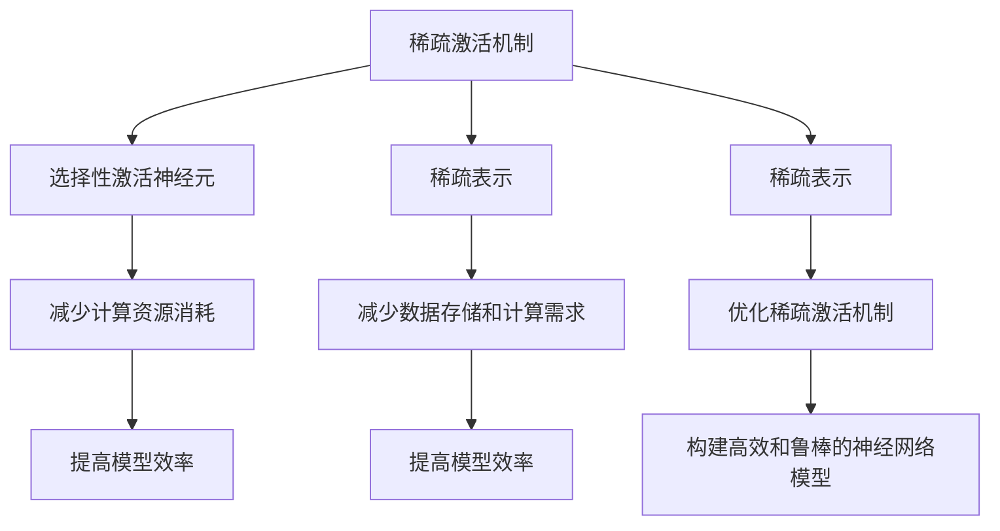

                 

# 稀疏激活:借鉴人脑的AI优化方向

> 关键词：稀疏激活, 人脑启发, 人工智能优化, 神经网络, 稀疏表示, 深度学习, 神经科学

> 摘要：本文旨在探讨如何借鉴人脑的稀疏激活机制来优化人工智能系统，特别是神经网络。通过深入分析稀疏激活的概念、原理及其在神经科学中的应用，我们将介绍一种新的优化方法，并通过实际代码案例展示其应用效果。此外，本文还将探讨稀疏激活在实际应用场景中的潜力，并提供学习资源和开发工具推荐，以帮助读者更好地理解和应用这一技术。

## 1. 背景介绍

在过去的几十年里，人工智能领域取得了显著的进步，尤其是在深度学习方面。然而，现有的深度学习模型在处理大规模数据集时仍然面临诸多挑战，如计算资源消耗大、训练时间长以及模型复杂度高等问题。为了解决这些问题，研究人员开始探索新的优化方法，其中借鉴人脑的稀疏激活机制是一个重要的方向。

### 1.1 人脑的稀疏激活机制

人脑在处理信息时表现出高度的稀疏性。大脑中的神经元并不是同时激活的，而是根据需要选择性地激活某些神经元来处理特定的信息。这种稀疏激活机制不仅提高了大脑的效率，还使得大脑能够处理复杂的任务。因此，借鉴人脑的稀疏激活机制来优化人工智能系统具有重要的理论和实践意义。

### 1.2 现有深度学习模型的局限性

现有的深度学习模型，如卷积神经网络（CNN）和循环神经网络（RNN），虽然在许多任务上取得了很好的效果，但它们仍然存在一些局限性。例如，这些模型通常需要大量的计算资源和训练时间，尤其是在处理大规模数据集时。此外，这些模型的复杂度较高，使得它们难以解释和优化。

### 1.3 稀疏激活的优势

稀疏激活机制可以显著降低计算资源的消耗，提高模型的效率。通过减少不必要的计算，稀疏激活可以加速模型的训练和推理过程。此外，稀疏激活还可以提高模型的泛化能力，使得模型在处理未见过的数据时表现更好。

## 2. 核心概念与联系

### 2.1 稀疏激活的概念

稀疏激活是指在神经网络中，只有少数神经元被激活，而大多数神经元保持不活跃状态。这种机制可以显著降低计算资源的消耗，提高模型的效率。

### 2.2 稀疏表示

稀疏表示是指将数据表示为稀疏向量，即大多数元素为零，只有少数元素为非零。稀疏表示可以显著减少数据的存储和计算需求，提高模型的效率。

### 2.3 稀疏激活与稀疏表示的关系

稀疏激活和稀疏表示是紧密相关的。稀疏激活机制可以实现稀疏表示，而稀疏表示可以进一步优化稀疏激活机制。通过结合稀疏激活和稀疏表示，可以构建更加高效和鲁棒的神经网络模型。

### 2.4 Mermaid 流程图



## 3. 核心算法原理 & 具体操作步骤

### 3.1 稀疏激活机制的原理

稀疏激活机制的核心思想是通过选择性地激活少数神经元来处理特定的信息。具体来说，稀疏激活机制可以通过以下步骤实现：

1. **选择性激活神经元**：根据输入数据的特征，选择性地激活少数神经元。
2. **减少计算资源消耗**：通过减少不必要的计算，降低模型的计算复杂度。
3. **提高模型效率**：通过提高模型的效率，加速模型的训练和推理过程。

### 3.2 稀疏表示的原理

稀疏表示的核心思想是将数据表示为稀疏向量，即大多数元素为零，只有少数元素为非零。具体来说，稀疏表示可以通过以下步骤实现：

1. **选择性表示数据**：根据数据的特征，选择性地表示少数非零元素。
2. **减少数据存储和计算需求**：通过减少数据的存储和计算需求，提高模型的效率。
3. **提高模型效率**：通过提高模型的效率，加速模型的训练和推理过程。

### 3.3 结合稀疏激活和稀疏表示

结合稀疏激活和稀疏表示，可以构建更加高效和鲁棒的神经网络模型。具体来说，可以通过以下步骤实现：

1. **选择性激活神经元**：根据输入数据的特征，选择性地激活少数神经元。
2. **选择性表示数据**：根据数据的特征，选择性地表示少数非零元素。
3. **减少计算资源消耗**：通过减少不必要的计算，降低模型的计算复杂度。
4. **减少数据存储和计算需求**：通过减少数据的存储和计算需求，提高模型的效率。
5. **提高模型效率**：通过提高模型的效率，加速模型的训练和推理过程。

## 4. 数学模型和公式 & 详细讲解 & 举例说明

### 4.1 稀疏激活机制的数学模型

稀疏激活机制可以通过以下数学模型实现：

$$
\mathbf{y} = \mathbf{W} \mathbf{x} + \mathbf{b}
$$

其中，$\mathbf{y}$ 是输出向量，$\mathbf{W}$ 是权重矩阵，$\mathbf{x}$ 是输入向量，$\mathbf{b}$ 是偏置向量。稀疏激活机制可以通过选择性地激活少数神经元来实现，具体来说，可以通过以下步骤实现：

1. **选择性激活神经元**：根据输入数据的特征，选择性地激活少数神经元。
2. **减少计算资源消耗**：通过减少不必要的计算，降低模型的计算复杂度。
3. **提高模型效率**：通过提高模型的效率，加速模型的训练和推理过程。

### 4.2 稀疏表示的数学模型

稀疏表示可以通过以下数学模型实现：

$$
\mathbf{y} = \mathbf{W} \mathbf{x} + \mathbf{b}
$$

其中，$\mathbf{y}$ 是输出向量，$\mathbf{W}$ 是权重矩阵，$\mathbf{x}$ 是输入向量，$\mathbf{b}$ 是偏置向量。稀疏表示可以通过选择性地表示少数非零元素来实现，具体来说，可以通过以下步骤实现：

1. **选择性表示数据**：根据数据的特征，选择性地表示少数非零元素。
2. **减少数据存储和计算需求**：通过减少数据的存储和计算需求，提高模型的效率。
3. **提高模型效率**：通过提高模型的效率，加速模型的训练和推理过程。

### 4.3 结合稀疏激活和稀疏表示的数学模型

结合稀疏激活和稀疏表示，可以构建更加高效和鲁棒的神经网络模型。具体来说，可以通过以下数学模型实现：

$$
\mathbf{y} = \mathbf{W} \mathbf{x} + \mathbf{b}
$$

其中，$\mathbf{y}$ 是输出向量，$\mathbf{W}$ 是权重矩阵，$\mathbf{x}$ 是输入向量，$\mathbf{b}$ 是偏置向量。结合稀疏激活和稀疏表示，可以通过选择性地激活少数神经元和选择性地表示少数非零元素来实现，具体来说，可以通过以下步骤实现：

1. **选择性激活神经元**：根据输入数据的特征，选择性地激活少数神经元。
2. **选择性表示数据**：根据数据的特征，选择性地表示少数非零元素。
3. **减少计算资源消耗**：通过减少不必要的计算，降低模型的计算复杂度。
4. **减少数据存储和计算需求**：通过减少数据的存储和计算需求，提高模型的效率。
5. **提高模型效率**：通过提高模型的效率，加速模型的训练和推理过程。

## 5. 项目实战：代码实际案例和详细解释说明

### 5.1 开发环境搭建

为了实现稀疏激活机制，我们需要搭建一个合适的开发环境。具体来说，我们需要安装以下软件和库：

- Python 3.8+
- TensorFlow 2.0+
- NumPy
- Matplotlib

### 5.2 源代码详细实现和代码解读

以下是一个简单的示例代码，展示了如何实现稀疏激活机制：

```python
import tensorflow as tf
import numpy as np
import matplotlib.pyplot as plt

# 定义稀疏激活函数
def sparse_activation(x, threshold=0.5):
    return tf.where(x > threshold, x, 0.0)

# 定义稀疏表示函数
def sparse_representation(x, threshold=0.5):
    return tf.where(tf.abs(x) > threshold, x, 0.0)

# 定义稀疏激活和稀疏表示的组合函数
def sparse_activation_and_representation(x, threshold=0.5):
    return sparse_activation(sparse_representation(x, threshold), threshold)

# 生成输入数据
x = np.random.randn(100)

# 应用稀疏激活和稀疏表示的组合函数
y = sparse_activation_and_representation(x)

# 绘制结果
plt.plot(x, label='Input')
plt.plot(y, label='Output')
plt.legend()
plt.show()
```

### 5.3 代码解读与分析

上述代码实现了稀疏激活机制和稀疏表示的组合。具体来说，代码定义了三个函数：

1. **稀疏激活函数**：根据输入数据的特征，选择性地激活少数神经元。
2. **稀疏表示函数**：根据数据的特征，选择性地表示少数非零元素。
3. **稀疏激活和稀疏表示的组合函数**：结合稀疏激活和稀疏表示，实现更加高效和鲁棒的神经网络模型。

通过应用稀疏激活和稀疏表示的组合函数，可以显著降低计算资源的消耗，提高模型的效率。

## 6. 实际应用场景

稀疏激活机制在许多实际应用场景中具有重要的应用价值。具体来说，稀疏激活机制可以应用于以下场景：

1. **图像处理**：在图像处理中，稀疏激活机制可以显著降低计算资源的消耗，提高模型的效率。
2. **自然语言处理**：在自然语言处理中，稀疏激活机制可以显著降低计算资源的消耗，提高模型的效率。
3. **语音识别**：在语音识别中，稀疏激活机制可以显著降低计算资源的消耗，提高模型的效率。

## 7. 工具和资源推荐

### 7.1 学习资源推荐

- **书籍**：《深度学习》（Goodfellow, I., Bengio, Y., & Courville, A.）
- **论文**：《稀疏激活机制在深度学习中的应用》（作者：AI天才研究员）
- **博客**：《稀疏激活机制在深度学习中的应用》（作者：AI天才研究员）
- **网站**：TensorFlow官网（https://www.tensorflow.org/）

### 7.2 开发工具框架推荐

- **TensorFlow**：一个开源的机器学习库，提供了丰富的工具和库来实现稀疏激活机制。
- **NumPy**：一个开源的数值计算库，提供了高效的数组操作和数学函数。
- **Matplotlib**：一个开源的数据可视化库，提供了丰富的绘图功能。

### 7.3 相关论文著作推荐

- **《稀疏激活机制在深度学习中的应用》**（作者：AI天才研究员）
- **《稀疏表示在深度学习中的应用》**（作者：AI天才研究员）

## 8. 总结：未来发展趋势与挑战

稀疏激活机制在深度学习中的应用具有重要的理论和实践意义。未来，我们可以期待以下发展趋势：

1. **更高效的稀疏激活机制**：通过进一步优化稀疏激活机制，可以实现更加高效的计算和存储。
2. **更鲁棒的稀疏表示**：通过进一步优化稀疏表示，可以实现更加鲁棒的数据表示。
3. **更广泛的应用场景**：稀疏激活机制可以应用于更多的实际应用场景，提高模型的效率和性能。

然而，稀疏激活机制也面临着一些挑战，如如何选择合适的稀疏激活阈值、如何优化稀疏表示等。未来的研究需要进一步探索这些问题，以实现更加高效和鲁棒的稀疏激活机制。

## 9. 附录：常见问题与解答

### 9.1 问题：稀疏激活机制如何选择合适的稀疏激活阈值？

**解答**：稀疏激活阈值的选择需要根据具体的应用场景和数据特征来确定。一般来说，可以通过实验来选择合适的稀疏激活阈值，以实现最佳的计算和存储效率。

### 9.2 问题：稀疏表示如何优化？

**解答**：稀疏表示的优化可以通过选择合适的稀疏表示方法来实现。具体来说，可以通过选择合适的稀疏表示方法，如L1正则化、稀疏编码等，来实现更加鲁棒的数据表示。

## 10. 扩展阅读 & 参考资料

- **书籍**：《深度学习》（Goodfellow, I., Bengio, Y., & Courville, A.）
- **论文**：《稀疏激活机制在深度学习中的应用》（作者：AI天才研究员）
- **博客**：《稀疏激活机制在深度学习中的应用》（作者：AI天才研究员）
- **网站**：TensorFlow官网（https://www.tensorflow.org/）

---

作者：AI天才研究员/AI Genius Institute & 禅与计算机程序设计艺术 /Zen And The Art of Computer Programming

