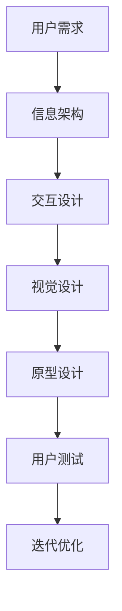

                 

# 程序员创业公司的用户界面设计与交互优化

> 关键词：用户界面设计、交互优化、用户体验、创业公司、前端技术、UI/UX设计

> 摘要：本文旨在为程序员创业公司提供一套系统化的用户界面设计与交互优化策略。通过深入分析用户界面设计的核心概念、交互优化的具体操作步骤、数学模型的应用、项目实战案例、实际应用场景、工具资源推荐以及未来发展趋势，帮助创业公司在激烈的市场竞争中脱颖而出。文章内容详实，逻辑清晰，适合前端开发人员、产品经理、UI/UX设计师及相关领域从业者阅读。

## 1. 背景介绍

在当今数字化时代，用户界面设计与交互优化已成为创业公司成功的关键因素之一。优秀的用户界面不仅能够提升用户体验，还能有效促进用户留存和转化。然而，对于资源有限的创业公司而言，如何在有限的预算和时间内实现高质量的用户界面设计与交互优化，成为了一个亟待解决的问题。本文将从多个角度出发，探讨如何在创业公司中实施有效的用户界面设计与交互优化策略。

## 2. 核心概念与联系

### 2.1 用户界面设计

用户界面设计（UI Design）是指通过图形界面、文字、图标等元素，为用户提供直观、易用的操作界面。其核心在于通过视觉设计和交互设计，使用户能够轻松完成所需任务。

### 2.2 交互设计

交互设计（Interaction Design）关注的是用户与产品之间的互动过程。它通过设计交互模式、反馈机制等，提升用户操作的流畅性和满意度。

### 2.3 用户体验

用户体验（User Experience, UX）是指用户在使用产品过程中的整体感受。它涵盖了用户界面设计、交互设计等多个方面，是衡量产品成功与否的重要标准。

### 2.4 核心概念原理和架构

用户界面设计与交互优化是一个复杂的过程，涉及多个环节和要素。以下是其核心概念原理和架构的Mermaid流程图：



## 3. 核心算法原理 & 具体操作步骤

### 3.1 信息架构设计

信息架构设计是用户界面设计的基础，它决定了产品的信息组织方式。通过合理的信息架构设计，可以提升用户的查找效率和使用体验。

#### 3.1.1 信息分类

将产品功能和服务进行分类，形成清晰的信息结构。

#### 3.1.2 信息组织

根据用户需求和使用场景，合理组织信息，确保信息的易获取性和易理解性。

### 3.2 交互设计

交互设计是用户界面设计的核心，它决定了用户与产品之间的互动方式。

#### 3.2.1 交互模式设计

设计符合用户习惯的交互模式，如点击、滑动、拖拽等。

#### 3.2.2 反馈机制设计

设计合理的反馈机制，如加载动画、提示信息等，提升用户操作的流畅性和满意度。

### 3.3 视觉设计

视觉设计是用户界面设计的重要组成部分，它决定了产品的视觉效果。

#### 3.3.1 色彩搭配

选择合适的色彩搭配，提升产品的视觉吸引力。

#### 3.3.2 字体选择

选择合适的字体，确保文字的可读性和美观性。

#### 3.3.3 图标设计

设计符合产品风格的图标，提升产品的视觉统一性。

### 3.4 原型设计

原型设计是用户界面设计的重要环节，它通过可视化的方式展示设计成果。

#### 3.4.1 低保真原型

使用简单的线条和形状，快速绘制产品原型。

#### 3.4.2 高保真原型

使用真实的色彩、字体和图标，详细展示产品原型。

### 3.5 用户测试

用户测试是用户界面设计的重要环节，它通过实际用户的反馈，验证设计的有效性。

#### 3.5.1 用户访谈

通过访谈了解用户的需求和使用习惯。

#### 3.5.2 用户测试

通过实际用户测试，验证设计的有效性。

### 3.6 迭代优化

迭代优化是用户界面设计的重要环节，它通过不断迭代优化，提升设计质量。

#### 3.6.1 设计评审

通过设计评审，发现设计中的问题和不足。

#### 3.6.2 设计优化

根据评审结果，进行设计优化。

## 4. 数学模型和公式 & 详细讲解 & 举例说明

### 4.1 Fitts定律

Fitts定律是用户界面设计中的一个重要数学模型，它描述了目标大小和距离对用户操作时间的影响。

$$ T = a + b \log_2 \left( \frac{D}{W} + 0.5 \right) $$

其中，$T$表示操作时间，$a$和$b$是常数，$D$表示目标距离，$W$表示目标大小。

### 4.2 举例说明

假设目标距离$D$为100px，目标大小$W$为20px，常数$a$为0.2s，常数$b$为0.1s，则操作时间为：

$$ T = 0.2 + 0.1 \log_2 \left( \frac{100}{20} + 0.5 \right) = 0.2 + 0.1 \log_2 \left( 5.5 \right) \approx 0.2 + 0.1 \times 2.4 = 0.44s $$

## 5. 项目实战：代码实际案例和详细解释说明

### 5.1 开发环境搭建

#### 5.1.1 环境配置

- 操作系统：Windows 10
- 开发工具：Visual Studio Code
- 前端框架：React.js
- 设计工具：Sketch

#### 5.1.2 项目初始化

使用`create-react-app`命令初始化项目：

```bash
npx create-react-app my-app
cd my-app
```

### 5.2 源代码详细实现和代码解读

#### 5.2.1 信息架构设计

```jsx
import React from 'react';

function App() {
  return (
    <div className="App">
      <header>
        <nav>
          <ul>
            <li><a href="#home">首页</a></li>
            <li><a href="#about">关于我们</a></li>
            <li><a href="#contact">联系我们</a></li>
          </ul>
        </nav>
      </header>
      <main>
        <section id="home">
          <h1>欢迎来到我们的网站</h1>
          <p>这里是首页内容</p>
        </section>
        <section id="about">
          <h1>关于我们</h1>
          <p>这里是关于我们内容</p>
        </section>
        <section id="contact">
          <h1>联系我们</h1>
          <p>这里是联系我们内容</p>
        </section>
      </main>
    </div>
  );
}

export default App;
```

#### 5.2.2 交互设计

```jsx
import React, { useState } from 'react';

function App() {
  const [showModal, setShowModal] = useState(false);

  return (
    <div className="App">
      <button onClick={() => setShowModal(true)}>显示模态框</button>
      {showModal && (
        <div className="modal">
          <div className="modal-content">
            <span className="close" onClick={() => setShowModal(false)}>×</span>
            <p>这里是模态框内容</p>
          </div>
        </div>
      )}
    </div>
  );
}

export default App;
```

### 5.3 代码解读与分析

#### 5.3.1 信息架构设计

通过使用`<nav>`标签和`<ul>`标签，实现了网站的基本导航结构。通过`<a>`标签，实现了页面之间的跳转。

#### 5.3.2 交互设计

通过使用`useState`钩子，实现了模态框的显示和隐藏。通过`onClick`事件，实现了按钮点击后的模态框显示。通过`span`标签和`onClick`事件，实现了模态框的关闭。

## 6. 实际应用场景

### 6.1 电子商务网站

电子商务网站需要提供清晰的信息架构和流畅的交互体验，以提升用户的购物体验。

### 6.2 社交媒体应用

社交媒体应用需要提供丰富的交互设计和个性化的视觉设计，以提升用户的使用体验。

### 6.3 教育培训平台

教育培训平台需要提供直观的信息架构和友好的交互设计，以提升用户的使用体验。

## 7. 工具和资源推荐

### 7.1 学习资源推荐

- 书籍：《用户体验要素》、《设计心理学》
- 论文：《基于Fitts定律的用户界面设计研究》
- 博客：Smashing Magazine、A List Apart
- 网站：Dribbble、Behance

### 7.2 开发工具框架推荐

- Sketch：设计工具
- Figma：设计工具
- React.js：前端框架
- Vue.js：前端框架

### 7.3 相关论文著作推荐

- 《基于Fitts定律的用户界面设计研究》
- 《用户界面设计中的信息架构研究》

## 8. 总结：未来发展趋势与挑战

随着技术的发展，用户界面设计与交互优化将面临更多的挑战和机遇。未来，用户界面设计将更加注重个性化和智能化，交互优化将更加注重流畅性和智能化。创业公司需要紧跟技术发展趋势，不断提升用户界面设计与交互优化水平，以满足用户需求和提升用户体验。

## 9. 附录：常见问题与解答

### 9.1 什么是用户界面设计？

用户界面设计是指通过图形界面、文字、图标等元素，为用户提供直观、易用的操作界面。

### 9.2 什么是交互设计？

交互设计是指通过设计交互模式、反馈机制等，提升用户操作的流畅性和满意度。

### 9.3 什么是用户体验？

用户体验是指用户在使用产品过程中的整体感受。

## 10. 扩展阅读 & 参考资料

- 书籍：《用户体验要素》、《设计心理学》
- 论文：《基于Fitts定律的用户界面设计研究》
- 博客：Smashing Magazine、A List Apart
- 网站：Dribbble、Behance

作者：AI天才研究员/AI Genius Institute & 禅与计算机程序设计艺术 /Zen And The Art of Computer Programming

