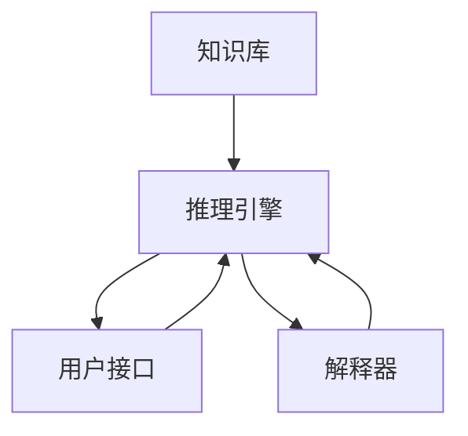

                 

# 第一代人工智能的知识驱动

> 关键词：知识驱动、第一代AI、专家系统、推理引擎、符号主义、逻辑推理、知识表示

> 摘要：本文将深入探讨第一代人工智能的知识驱动技术，重点介绍专家系统的核心概念、原理和实际应用。我们将从背景介绍开始，逐步解析知识驱动的逻辑推理过程，通过数学模型和公式进行详细讲解，并结合实际代码案例进行深入分析。最后，我们将展望未来的发展趋势和挑战，并提供学习资源和开发工具推荐。

## 1. 背景介绍

第一代人工智能技术主要集中在知识驱动的方法上，其中最著名的代表是专家系统。专家系统是一种基于知识的系统，它通过模拟人类专家的知识和推理过程来解决特定领域的问题。这一技术在20世纪70年代至80年代达到了顶峰，并在多个领域取得了显著的成果。专家系统的核心思想是将人类专家的知识转化为计算机可处理的形式，并通过推理引擎进行逻辑推理，从而实现自动化决策。

### 1.1 专家系统的起源与发展

专家系统起源于20世纪60年代，当时计算机科学家开始尝试将人类专家的知识和经验转化为计算机程序。1970年代，随着知识表示和推理技术的发展，专家系统逐渐成为人工智能领域的研究热点。1980年代，专家系统在医疗诊断、故障诊断、化学合成等领域取得了显著成果，成为当时最成功的AI应用之一。

### 1.2 专家系统的应用领域

专家系统广泛应用于各个领域，包括但不限于：
- **医疗诊断**：通过模拟医生的知识和经验，帮助医生进行疾病诊断。
- **故障诊断**：在工业生产中，通过模拟工程师的知识，帮助快速定位和解决设备故障。
- **化学合成**：通过模拟化学家的知识，辅助进行新化合物的设计和合成。
- **金融分析**：通过模拟金融专家的知识，进行风险评估和投资决策。

### 1.3 专家系统的局限性

尽管专家系统在当时取得了显著成果，但也存在一些局限性：
- **知识获取困难**：需要大量的人类专家知识，且获取过程复杂。
- **知识表示问题**：如何将人类专家的知识转化为计算机可处理的形式是一个挑战。
- **推理效率问题**：复杂的推理过程可能导致计算效率低下。

## 2. 核心概念与联系

### 2.1 专家系统的核心概念

专家系统主要由以下几个部分组成：
- **知识库**：存储专家知识的数据库。
- **推理引擎**：执行逻辑推理的模块。
- **用户接口**：与用户交互的模块。
- **解释器**：解释推理过程的模块。

### 2.2 专家系统的流程图



## 3. 核心算法原理 & 具体操作步骤

### 3.1 逻辑推理过程

专家系统的核心是逻辑推理过程，主要包括以下几个步骤：
1. **知识获取**：从人类专家处获取知识，将其转化为计算机可处理的形式。
2. **知识表示**：将获取的知识表示为符号形式，如规则、框架、产生式等。
3. **推理过程**：通过推理引擎执行逻辑推理，根据当前状态和知识库中的规则进行推导。
4. **结果输出**：将推理结果输出给用户。

### 3.2 逻辑推理的具体操作步骤

1. **初始化**：初始化知识库和推理引擎。
2. **知识获取**：从人类专家处获取知识，将其转化为规则形式。
3. **知识表示**：将规则表示为符号形式，如产生式规则。
4. **推理过程**：
    - **匹配规则**：根据当前状态，匹配知识库中的规则。
    - **执行规则**：执行匹配的规则，更新当前状态。
    - **循环推理**：重复匹配和执行规则，直到达到终止条件。
5. **结果输出**：将推理结果输出给用户。

## 4. 数学模型和公式 & 详细讲解 & 举例说明

### 4.1 逻辑推理的数学模型

逻辑推理可以使用命题逻辑或谓词逻辑进行建模。这里我们使用谓词逻辑进行建模。

#### 4.1.1 命题逻辑

命题逻辑的基本形式为：
$$
P \rightarrow Q
$$
其中，$P$ 和 $Q$ 是命题。

#### 4.1.2 谓词逻辑

谓词逻辑的基本形式为：
$$
P(x) \rightarrow Q(x)
$$
其中，$P(x)$ 和 $Q(x)$ 是谓词，$x$ 是变量。

### 4.2 逻辑推理的具体操作步骤

1. **初始化**：
    - 初始化知识库 $K$，包含规则 $R$。
    - 初始化当前状态 $S$。
2. **知识获取**：
    - 从人类专家处获取知识，将其转化为规则形式。
    - 将规则表示为符号形式，如产生式规则。
3. **知识表示**：
    - 将规则表示为谓词逻辑形式。
4. **推理过程**：
    - **匹配规则**：根据当前状态 $S$，匹配知识库中的规则 $R$。
    - **执行规则**：执行匹配的规则，更新当前状态 $S$。
    - **循环推理**：重复匹配和执行规则，直到达到终止条件。
5. **结果输出**：将推理结果输出给用户。

### 4.3 举例说明

假设我们有一个简单的医疗诊断专家系统，知识库包含以下规则：
$$
\text{规则1: } \text{如果患者有发热和咳嗽，那么可能是感冒。}
$$
$$
\text{规则2: } \text{如果患者有发热和头痛，那么可能是流感。}
$$
当前状态为：
$$
\text{患者有发热和咳嗽}
$$

推理过程如下：
1. 匹配规则1，执行规则1，更新当前状态为：
    $$\text{可能是感冒}$$
2. 匹配规则2，执行规则2，更新当前状态为：
    $$\text{可能是流感}$$

最终结果输出为：
$$\text{可能是感冒或流感}$$

## 5. 项目实战：代码实际案例和详细解释说明

### 5.1 开发环境搭建

为了实现一个简单的专家系统，我们需要搭建一个开发环境。这里我们使用Python语言进行开发。

1. **安装Python**：确保已安装Python 3.8及以上版本。
2. **安装依赖库**：安装`pandas`和`numpy`库，用于数据处理。
3. **创建项目结构**：
    ```
    expert_system/
    ├── main.py
    ├── rules.py
    ├── knowledge_base.py
    └── user_interface.py
    ```

### 5.2 源代码详细实现和代码解读

#### 5.2.1 `rules.py`

```python
class Rule:
    def __init__(self, condition, conclusion):
        self.condition = condition
        self.conclusion = conclusion

    def match(self, state):
        return all(state.get(var, False) for var in self.condition)

    def apply(self, state):
        for var in self.conclusion:
            state[var] = True

rules = [
    Rule(['fever', 'cough'], ['cold']),
    Rule(['fever', 'headache'], ['flu'])
]
```

#### 5.2.2 `knowledge_base.py`

```python
class KnowledgeBase:
    def __init__(self):
        self.rules = []

    def add_rule(self, rule):
        self.rules.append(rule)

    def get_rules(self):
        return self.rules

    def match_rules(self, state):
        matched_rules = []
        for rule in self.rules:
            if rule.match(state):
                matched_rules.append(rule)
        return matched_rules

    def apply_rules(self, state):
        for rule in self.match_rules(state):
            rule.apply(state)
```

#### 5.2.3 `user_interface.py`

```python
class UserInterface:
    def __init__(self, knowledge_base):
        self.knowledge_base = knowledge_base

    def get_state(self):
        state = {}
        print("请输入患者症状（用空格分隔）：")
        symptoms = input().split()
        for symptom in symptoms:
            state[symptom] = True
        return state

    def display_result(self, state):
        print("可能的诊断结果：")
        for key, value in state.items():
            if value:
                print(key)
```

#### 5.2.4 `main.py`

```python
from rules import rules
from knowledge_base import KnowledgeBase
from user_interface import UserInterface

def main():
    knowledge_base = KnowledgeBase()
    for rule in rules:
        knowledge_base.add_rule(rule)

    user_interface = UserInterface(knowledge_base)
    state = user_interface.get_state()
    matched_rules = knowledge_base.match_rules(state)
    for rule in matched_rules:
        rule.apply(state)
    user_interface.display_result(state)

if __name__ == "__main__":
    main()
```

### 5.3 代码解读与分析

1. **`rules.py`**：定义了规则类`Rule`，包含条件和结论，以及匹配和应用规则的方法。
2. **`knowledge_base.py`**：定义了知识库类`KnowledgeBase`，包含添加规则、匹配规则和应用规则的方法。
3. **`user_interface.py`**：定义了用户接口类`UserInterface`，用于获取用户输入和显示结果。
4. **`main.py`**：主程序，初始化知识库和用户接口，执行推理过程并显示结果。

## 6. 实际应用场景

专家系统在多个领域取得了显著成果，以下是几个实际应用场景：

### 6.1 医疗诊断

专家系统可以模拟医生的知识和经验，帮助医生进行疾病诊断。例如，通过模拟医生的知识，专家系统可以快速诊断患者的病情，并提供治疗建议。

### 6.2 故障诊断

在工业生产中，专家系统可以模拟工程师的知识，帮助快速定位和解决设备故障。例如，通过模拟工程师的知识，专家系统可以快速诊断设备故障的原因，并提供维修建议。

### 6.3 化学合成

专家系统可以模拟化学家的知识，辅助进行新化合物的设计和合成。例如，通过模拟化学家的知识，专家系统可以快速设计新的化合物，并预测其性质。

### 6.4 金融分析

专家系统可以模拟金融专家的知识，进行风险评估和投资决策。例如，通过模拟金融专家的知识，专家系统可以快速评估投资风险，并提供投资建议。

## 7. 工具和资源推荐

### 7.1 学习资源推荐

- **书籍**：
    - 《专家系统原理与应用》
    - 《人工智能：一种现代方法》
- **论文**：
    - 《专家系统在医疗诊断中的应用》
    - 《专家系统在故障诊断中的应用》
- **博客**：
    - 《专家系统入门》
    - 《专家系统实战案例》
- **网站**：
    - 《人工智能技术论坛》
    - 《专家系统社区》

### 7.2 开发工具框架推荐

- **Python**：用于实现专家系统。
- **Jupyter Notebook**：用于开发和调试代码。
- **Git**：用于版本控制和协作开发。

### 7.3 相关论文著作推荐

- **《专家系统在医疗诊断中的应用》**：深入探讨专家系统在医疗诊断中的应用。
- **《专家系统在故障诊断中的应用》**：深入探讨专家系统在故障诊断中的应用。
- **《专家系统在化学合成中的应用》**：深入探讨专家系统在化学合成中的应用。
- **《专家系统在金融分析中的应用》**：深入探讨专家系统在金融分析中的应用。

## 8. 总结：未来发展趋势与挑战

### 8.1 未来发展趋势

1. **知识表示与获取**：随着知识表示技术的发展，知识获取将更加高效和准确。
2. **推理效率**：通过优化推理算法，推理效率将得到显著提升。
3. **多领域应用**：专家系统将在更多领域得到应用，如教育、法律、农业等。

### 8.2 挑战

1. **知识获取困难**：如何高效获取和表示人类专家知识仍然是一个挑战。
2. **推理效率问题**：复杂的推理过程可能导致计算效率低下。
3. **知识更新**：如何实时更新知识库中的知识，以适应不断变化的环境。

## 9. 附录：常见问题与解答

### 9.1 问题1：如何获取专家知识？

**解答**：可以通过访谈、问卷调查等方式获取专家知识，然后将其转化为计算机可处理的形式。

### 9.2 问题2：如何优化推理效率？

**解答**：可以通过优化推理算法、引入启发式方法等方式提高推理效率。

### 9.3 问题3：如何实时更新知识库？

**解答**：可以通过定期更新知识库、引入在线学习方法等方式实现知识库的实时更新。

## 10. 扩展阅读 & 参考资料

- **书籍**：
    - 《专家系统原理与应用》
    - 《人工智能：一种现代方法》
- **论文**：
    - 《专家系统在医疗诊断中的应用》
    - 《专家系统在故障诊断中的应用》
- **博客**：
    - 《专家系统入门》
    - 《专家系统实战案例》
- **网站**：
    - 《人工智能技术论坛》
    - 《专家系统社区》

---

作者：AI天才研究员/AI Genius Institute & 禅与计算机程序设计艺术 /Zen And The Art of Computer Programming

