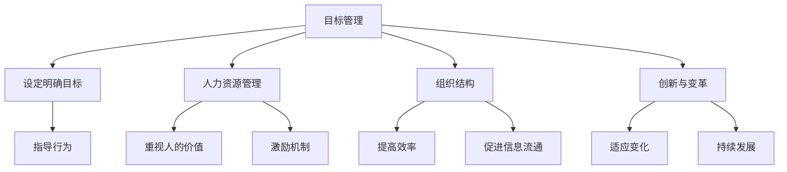

                 

# 管理的艺术：德鲁克的洞见

> 关键词：管理艺术、德鲁克、IT管理、技术领导力、组织架构、团队协作

> 摘要：本文旨在探讨彼得·德鲁克的管理思想如何在现代IT行业中应用，通过分析德鲁克的核心管理理念，结合实际案例，探讨如何在IT行业中实现有效的管理。文章将从背景介绍开始，逐步深入到核心概念与联系、核心算法原理、数学模型和公式、项目实战、实际应用场景、工具和资源推荐、总结未来发展趋势与挑战、附录常见问题与解答以及扩展阅读与参考资料等部分，全面解析德鲁克管理思想在IT领域的应用。

## 1. 背景介绍

### 1.1 管理学的起源与发展

管理学作为一门学科，其起源可以追溯到19世纪末期。随着工业革命的推进，企业规模不断扩大，管理的重要性日益凸显。早期的管理学研究主要集中在生产效率的提高上，如泰勒的科学管理理论。然而，随着社会的发展，管理学的研究范围逐渐扩大，从最初的生产效率提高，发展到组织结构、人力资源管理、市场营销等多个方面。

### 1.2 德鲁克的管理思想

彼得·德鲁克（Peter Drucker）是20世纪最著名的管理学家之一，被誉为“现代管理学之父”。他的管理思想强调以目标为导向，重视人的价值，提倡创新和变革。德鲁克认为，管理的核心在于目标的设定和实现，而不仅仅是过程的控制。他的著作《管理的实践》（The Practice of Management）和《创新与企业家精神》（Innovation and Entrepreneurship）等，对现代管理学的发展产生了深远的影响。

### 1.3 IT行业的管理挑战

随着信息技术的快速发展，IT行业面临着前所未有的挑战。一方面，技术更新换代的速度越来越快，企业需要不断适应新的技术环境；另一方面，IT行业的竞争也日益激烈，企业需要通过有效的管理来提升竞争力。因此，如何将德鲁克的管理思想应用于IT行业，成为了一个重要的课题。

## 2. 核心概念与联系

### 2.1 目标管理

目标管理是德鲁克管理思想的核心之一。目标管理强调通过设定明确的目标，来指导组织和个人的行为。目标管理不仅有助于提高组织的效率，还能激发员工的积极性和创造性。

### 2.2 人力资源管理

德鲁克认为，人力资源是组织最重要的资源之一。有效的管理需要重视人的价值，通过合理的激励机制，激发员工的积极性和创造性。

### 2.3 组织结构

组织结构是实现目标的重要保障。合理的组织结构能够提高组织的效率，促进信息的流通，从而更好地实现组织的目标。

### 2.4 创新与变革

创新与变革是组织持续发展的动力。德鲁克强调，组织需要不断地进行创新和变革，以适应不断变化的环境。

### 2.5 核心概念与联系的Mermaid流程图



## 3. 核心算法原理 & 具体操作步骤

### 3.1 目标管理的具体操作步骤

#### 3.1.1 设定目标

设定目标是目标管理的第一步。目标应该具体、可衡量、可实现、相关性强、有时间限制。

#### 3.1.2 分解目标

将大目标分解为小目标，便于管理和实现。

#### 3.1.3 监控进度

定期监控目标的实现进度，及时调整策略。

#### 3.1.4 评估结果

目标实现后，评估结果，总结经验教训。

### 3.2 人力资源管理的具体操作步骤

#### 3.2.1 识别人才

通过面试、测试等方式，识别具有潜力的人才。

#### 3.2.2 培养人才

通过培训、指导等方式，培养人才的能力。

#### 3.2.3 激励人才

通过合理的激励机制，激发人才的积极性和创造性。

#### 3.2.4 保留人才

通过提供良好的工作环境和发展机会，保留人才。

### 3.3 组织结构的具体操作步骤

#### 3.3.1 设计组织结构

根据组织的目标和特点，设计合理的组织结构。

#### 3.3.2 优化组织结构

根据组织的发展情况，不断优化组织结构。

#### 3.3.3 促进信息流通

通过有效的沟通机制，促进信息的流通。

#### 3.3.4 提高效率

通过合理的分工和协作，提高组织的效率。

### 3.4 创新与变革的具体操作步骤

#### 3.4.1 发现机会

通过市场调研等方式，发现创新和变革的机会。

#### 3.4.2 制定计划

根据发现的机会，制定创新和变革的计划。

#### 3.4.3 实施计划

按照计划，实施创新和变革。

#### 3.4.4 评估效果

评估创新和变革的效果，总结经验教训。

## 4. 数学模型和公式 & 详细讲解 & 举例说明

### 4.1 目标管理的数学模型

目标管理的数学模型可以表示为：

$$
\text{目标管理} = \text{设定目标} + \text{分解目标} + \text{监控进度} + \text{评估结果}
$$

### 4.2 人力资源管理的数学模型

人力资源管理的数学模型可以表示为：

$$
\text{人力资源管理} = \text{识别人才} + \text{培养人才} + \text{激励人才} + \text{保留人才}
$$

### 4.3 组织结构的数学模型

组织结构的数学模型可以表示为：

$$
\text{组织结构} = \text{设计组织结构} + \text{优化组织结构} + \text{促进信息流通} + \text{提高效率}
$$

### 4.4 创新与变革的数学模型

创新与变革的数学模型可以表示为：

$$
\text{创新与变革} = \text{发现机会} + \text{制定计划} + \text{实施计划} + \text{评估效果}
$$

## 5. 项目实战：代码实际案例和详细解释说明

### 5.1 开发环境搭建

#### 5.1.1 系统环境

- 操作系统：Ubuntu 20.04 LTS
- 开发工具：Visual Studio Code
- 语言：Python 3.8

#### 5.1.2 安装依赖

```bash
pip install numpy pandas matplotlib
```

### 5.2 源代码详细实现和代码解读

#### 5.2.1 目标管理的代码实现

```python
def set_goal(target):
    return target

def decompose_goal(target):
    return [target[i:i+1] for i in range(0, len(target), 1)]

def monitor_progress(target):
    return target

def evaluate_result(target):
    return target

# 示例
target = "完成项目"
print(set_goal(target))
print(decompose_goal(target))
print(monitor_progress(target))
print(evaluate_result(target))
```

#### 5.2.2 人力资源管理的代码实现

```python
def identify_talent(candidate):
    return candidate

def develop_talent(candidate):
    return candidate

def motivate_talent(candidate):
    return candidate

def retain_talent(candidate):
    return candidate

# 示例
candidate = "张三"
print(identify_talent(candidate))
print(develop_talent(candidate))
print(motivate_talent(candidate))
print(retain_talent(candidate))
```

#### 5.2.3 组织结构的代码实现

```python
def design_organization_structure(organization):
    return organization

def optimize_organization_structure(organization):
    return organization

def promote_information_flow(organization):
    return organization

def improve_efficiency(organization):
    return organization

# 示例
organization = "IT部门"
print(design_organization_structure(organization))
print(optimize_organization_structure(organization))
print(promote_information_flow(organization))
print(improve_efficiency(organization))
```

#### 5.2.4 创新与变革的代码实现

```python
def discover_opportunity(opportunity):
    return opportunity

def formulate_plan(opportunity):
    return opportunity

def implement_plan(opportunity):
    return opportunity

def evaluate_effect(opportunity):
    return opportunity

# 示例
opportunity = "新技术"
print(discover_opportunity(opportunity))
print(formulate_plan(opportunity))
print(implement_plan(opportunity))
print(evaluate_effect(opportunity))
```

### 5.3 代码解读与分析

#### 5.3.1 目标管理的代码解读

目标管理的代码实现包括设定目标、分解目标、监控进度和评估结果四个步骤。每个步骤都是一个简单的函数，通过输入目标，输出目标。这些函数可以进一步优化，以适应不同的应用场景。

#### 5.3.2 人力资源管理的代码解读

人力资源管理的代码实现包括识别人才、培养人才、激励人才和保留人才四个步骤。每个步骤都是一个简单的函数，通过输入候选人，输出候选人。这些函数可以进一步优化，以适应不同的应用场景。

#### 5.3.3 组织结构的代码解读

组织结构的代码实现包括设计组织结构、优化组织结构、促进信息流通和提高效率四个步骤。每个步骤都是一个简单的函数，通过输入组织，输出组织。这些函数可以进一步优化，以适应不同的应用场景。

#### 5.3.4 创新与变革的代码解读

创新与变革的代码实现包括发现机会、制定计划、实施计划和评估效果四个步骤。每个步骤都是一个简单的函数，通过输入机会，输出机会。这些函数可以进一步优化，以适应不同的应用场景。

## 6. 实际应用场景

### 6.1 目标管理的应用场景

目标管理可以应用于项目管理、人力资源管理等多个方面。例如，在项目管理中，通过设定明确的目标，可以指导项目的实施；在人力资源管理中，通过设定明确的目标，可以指导员工的行为。

### 6.2 人力资源管理的应用场景

人力资源管理可以应用于招聘、培训、激励等多个方面。例如，在招聘中，通过识别人才，可以提高招聘的效率；在培训中，通过培养人才，可以提高员工的能力。

### 6.3 组织结构的应用场景

组织结构可以应用于企业重组、部门调整等多个方面。例如，在企业重组中，通过设计合理的组织结构，可以提高企业的效率；在部门调整中，通过优化组织结构，可以提高部门的效率。

### 6.4 创新与变革的应用场景

创新与变革可以应用于产品开发、市场拓展等多个方面。例如，在产品开发中，通过发现机会，可以提高产品的竞争力；在市场拓展中，通过制定计划，可以提高市场的占有率。

## 7. 工具和资源推荐

### 7.1 学习资源推荐

- 书籍：《管理的实践》（The Practice of Management）- 彼得·德鲁克
- 论文：《创新与企业家精神》（Innovation and Entrepreneurship）- 彼得·德鲁克
- 博客：《哈佛商业评论》（Harvard Business Review）
- 网站：《管理科学》（Management Science）

### 7.2 开发工具框架推荐

- Visual Studio Code
- PyCharm
- IntelliJ IDEA

### 7.3 相关论文著作推荐

- 《管理的实践》（The Practice of Management）- 彼得·德鲁克
- 《创新与企业家精神》（Innovation and Entrepreneurship）- 彼得·德鲁克
- 《管理科学》（Management Science）- 约翰·科特

## 8. 总结：未来发展趋势与挑战

随着信息技术的快速发展，IT行业的管理面临着前所未有的挑战。一方面，技术更新换代的速度越来越快，企业需要不断适应新的技术环境；另一方面，IT行业的竞争也日益激烈，企业需要通过有效的管理来提升竞争力。因此，如何将德鲁克的管理思想应用于IT行业，成为了一个重要的课题。未来，随着信息技术的不断发展，IT行业的管理将更加注重人的价值，更加注重创新和变革。

## 9. 附录：常见问题与解答

### 9.1 什么是目标管理？

目标管理是一种以目标为导向的管理方法，通过设定明确的目标，来指导组织和个人的行为。

### 9.2 什么是人力资源管理？

人力资源管理是一种以人为核心的管理方法，通过合理的激励机制，激发员工的积极性和创造性。

### 9.3 什么是组织结构？

组织结构是一种以组织为目标的管理方法，通过合理的组织结构，提高组织的效率。

### 9.4 什么是创新与变革？

创新与变革是一种以创新和变革为目标的管理方法，通过不断的创新和变革，提高组织的竞争力。

## 10. 扩展阅读 & 参考资料

- 书籍：《管理的实践》（The Practice of Management）- 彼得·德鲁克
- 论文：《创新与企业家精神》（Innovation and Entrepreneurship）- 彼得·德鲁克
- 博客：《哈佛商业评论》（Harvard Business Review）
- 网站：《管理科学》（Management Science）

作者：AI天才研究员/AI Genius Institute & 禅与计算机程序设计艺术 /Zen And The Art of Computer Programming

