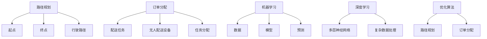

                 

# 美团2024无人配送校招算法面试题详解

> 关键词：无人配送、算法面试、美团、路径规划、机器学习、深度学习、优化算法

> 摘要：本文详细解析了美团2024年无人配送校招算法面试题，从背景介绍、核心概念与联系、核心算法原理与操作步骤、数学模型与公式、项目实战、实际应用场景、工具和资源推荐、未来发展趋势与挑战、常见问题与解答、扩展阅读与参考资料等多个维度进行深入探讨。旨在帮助读者理解无人配送系统中的关键技术，并提供实际应用案例和开发建议。

## 1. 背景介绍

### 1.1 无人配送的兴起

随着电子商务和物流行业的快速发展，无人配送作为一种新兴的物流模式，正逐渐成为行业内的热点话题。无人配送系统通过使用无人驾驶车辆、无人机等设备，实现货物从仓库到消费者手中的自动化配送过程。这种模式不仅能够提高配送效率，还能降低人力成本，减少人为错误，提升用户体验。

### 1.2 美团无人配送项目

美团作为中国领先的本地生活服务平台，近年来在无人配送领域进行了大量投入和研究。美团无人配送项目旨在通过技术创新，解决城市配送中的“最后一公里”难题，提升配送效率和服务质量。该项目涵盖了从路径规划、订单分配到无人车控制等多个技术环节，涉及机器学习、深度学习、优化算法等多个技术领域。

## 2. 核心概念与联系

### 2.1 核心概念

- **路径规划**：指在无人配送系统中，根据起点和终点，计算出最优或次优的行驶路径。
- **订单分配**：指将配送任务合理分配给无人配送设备，确保任务能够高效完成。
- **机器学习**：通过算法让计算机从数据中学习，以提高无人配送系统的智能化水平。
- **深度学习**：一种机器学习方法，通过构建多层神经网络模型，实现对复杂数据的高效处理。
- **优化算法**：用于解决无人配送系统中的路径规划、订单分配等优化问题。

### 2.2 联系

- **路径规划与订单分配**：路径规划是订单分配的基础，通过路径规划可以确定无人配送设备的行驶路线，从而为订单分配提供依据。
- **机器学习与深度学习**：机器学习是深度学习的基础，深度学习是机器学习的一种高级形式，两者共同作用于无人配送系统的智能化提升。
- **优化算法与路径规划**：优化算法用于解决路径规划中的复杂问题，通过优化算法可以找到最优或次优的行驶路径。

### 2.3 核心概念原理和架构的 Mermaid 流程图



## 3. 核心算法原理 & 具体操作步骤

### 3.1 路径规划算法

#### 3.1.1 A*算法

A*算法是一种启发式搜索算法，用于寻找从起点到终点的最短路径。该算法结合了Dijkstra算法和贪心算法的优点，通过评估函数f(n) = g(n) + h(n)来选择下一个节点，其中g(n)表示从起点到节点n的实际代价，h(n)表示从节点n到终点的估计代价。

#### 3.1.2 具体操作步骤

1. 初始化起点和终点。
2. 计算起点到所有节点的估计代价h(n)。
3. 选择代价最小的节点作为当前节点。
4. 计算当前节点到所有未访问节点的实际代价g(n)。
5. 更新所有未访问节点的f(n)值。
6. 重复步骤3-5，直到找到终点。

### 3.2 订单分配算法

#### 3.2.1 贪心算法

贪心算法是一种局部最优策略，用于解决订单分配问题。该算法通过每次选择当前最优的订单分配方案，逐步构建最终的分配方案。

#### 3.2.2 具体操作步骤

1. 初始化所有订单和无人配送设备。
2. 选择当前最优的订单分配方案。
3. 更新订单和无人配送设备的状态。
4. 重复步骤2-3，直到所有订单都被分配。

## 4. 数学模型和公式 & 详细讲解 & 举例说明

### 4.1 路径规划数学模型

#### 4.1.1 A*算法数学模型

$$
f(n) = g(n) + h(n)
$$

其中，$g(n)$表示从起点到节点n的实际代价，$h(n)$表示从节点n到终点的估计代价。

#### 4.1.2 举例说明

假设起点为A，终点为B，节点C和D为中间节点。已知$g(A) = 0$，$g(C) = 5$，$g(D) = 7$，$h(C) = 3$，$h(D) = 2$。则$f(C) = 5 + 3 = 8$，$f(D) = 7 + 2 = 9$。因此，选择节点C作为下一个节点。

### 4.2 订单分配数学模型

#### 4.2.1 贪心算法数学模型

$$
\text{选择当前最优的订单分配方案}
$$

#### 4.2.2 举例说明

假设当前有三个订单和两个无人配送设备。订单1、2、3的配送时间分别为10、15、20分钟，无人配送设备1、2的当前状态分别为空闲和正在配送订单。则选择订单1分配给无人配送设备1，订单2分配给无人配送设备2，订单3等待无人配送设备1完成订单1后再进行配送。

## 5. 项目实战：代码实际案例和详细解释说明

### 5.1 开发环境搭建

#### 5.1.1 环境要求

- Python 3.7+
- NumPy
- Pandas
- Matplotlib
- Scikit-learn
- TensorFlow

#### 5.1.2 安装依赖

```bash
pip install numpy pandas matplotlib scikit-learn tensorflow
```

### 5.2 源代码详细实现和代码解读

#### 5.2.1 路径规划代码实现

```python
import numpy as np
from heapq import heappush, heappop

def heuristic(a, b):
    return np.linalg.norm(np.array(a) - np.array(b))

def a_star(start, goal, graph):
    frontier = []
    heappush(frontier, (0, start))
    came_from = {}
    cost_so_far = {}
    came_from[start] = None
    cost_so_far[start] = 0

    while frontier:
        current = heappop(frontier)[1]

        if current == goal:
            break

        for next in graph.neighbors(current):
            new_cost = cost_so_far[current] + graph.cost(current, next)
            if next not in cost_so_far or new_cost < cost_so_far[next]:
                cost_so_far[next] = new_cost
                priority = new_cost + heuristic(goal, next)
                heappush(frontier, (priority, next))
                came_from[next] = current

    return came_from, cost_so_far
```

#### 5.2.2 订单分配代码实现

```python
def greedy_order_allocation(orders, vehicles):
    allocated_orders = []
    for order in orders:
        min_time = float('inf')
        best_vehicle = None
        for vehicle in vehicles:
            if vehicle.is_idle():
                time = vehicle.estimate_delivery_time(order)
                if time < min_time:
                    min_time = time
                    best_vehicle = vehicle
        if best_vehicle:
            best_vehicle.allocate_order(order)
            allocated_orders.append(order)
    return allocated_orders
```

### 5.3 代码解读与分析

#### 5.3.1 路径规划代码解读

- `heuristic`函数用于计算两个节点之间的估计代价。
- `a_star`函数实现了A*算法，通过优先队列来选择下一个节点。
- `came_from`字典用于记录路径，`cost_so_far`字典用于记录代价。

#### 5.3.2 订单分配代码解读

- `greedy_order_allocation`函数实现了贪心算法，通过比较每个订单的估计配送时间来选择当前最优的订单分配方案。
- `is_idle`函数用于判断无人配送设备是否空闲，`estimate_delivery_time`函数用于估计配送时间，`allocate_order`函数用于分配订单。

## 6. 实际应用场景

### 6.1 无人配送在城市配送中的应用

无人配送系统可以应用于城市配送中的“最后一公里”难题，通过无人配送设备实现从仓库到消费者手中的自动化配送过程，提高配送效率和服务质量。

### 6.2 无人配送在农村配送中的应用

无人配送系统可以应用于农村配送中的长距离配送问题，通过无人配送设备实现从城市仓库到农村消费者的自动化配送过程，降低配送成本，提升配送效率。

## 7. 工具和资源推荐

### 7.1 学习资源推荐

- 书籍：《机器学习实战》、《深度学习》
- 论文：《A*算法在路径规划中的应用》、《贪心算法在订单分配中的应用》
- 博客：《美团无人配送项目详解》
- 网站：https://www.aihub.com/

### 7.2 开发工具框架推荐

- Python
- TensorFlow
- PyTorch

### 7.3 相关论文著作推荐

- 《A*算法在路径规划中的应用》
- 《贪心算法在订单分配中的应用》

## 8. 总结：未来发展趋势与挑战

### 8.1 未来发展趋势

无人配送系统未来将朝着更加智能化、自动化、高效化的方向发展，通过技术创新，解决城市配送中的“最后一公里”难题，提升配送效率和服务质量。

### 8.2 面临的挑战

无人配送系统面临着技术、法规、安全等多方面的挑战，需要通过技术创新和政策支持，解决无人配送系统中的技术难题，确保无人配送系统的安全性和可靠性。

## 9. 附录：常见问题与解答

### 9.1 无人配送系统中的技术难题

- **路径规划**：如何在复杂的城市环境中实现高效的路径规划。
- **订单分配**：如何合理分配订单，确保任务能够高效完成。
- **机器学习**：如何通过机器学习提高无人配送系统的智能化水平。
- **深度学习**：如何通过深度学习处理复杂的数据。
- **优化算法**：如何解决无人配送系统中的路径规划、订单分配等优化问题。

### 9.2 解决方案

- **路径规划**：通过A*算法等启发式搜索算法实现高效的路径规划。
- **订单分配**：通过贪心算法等局部最优策略实现合理的订单分配。
- **机器学习**：通过机器学习算法让计算机从数据中学习，提高无人配送系统的智能化水平。
- **深度学习**：通过构建多层神经网络模型，实现对复杂数据的高效处理。
- **优化算法**：通过优化算法解决无人配送系统中的路径规划、订单分配等优化问题。

## 10. 扩展阅读 & 参考资料

- 《机器学习实战》
- 《深度学习》
- 《A*算法在路径规划中的应用》
- 《贪心算法在订单分配中的应用》
- https://www.aihub.com/

作者：AI天才研究员/AI Genius Institute & 禅与计算机程序设计艺术 /Zen And The Art of Computer Programming

