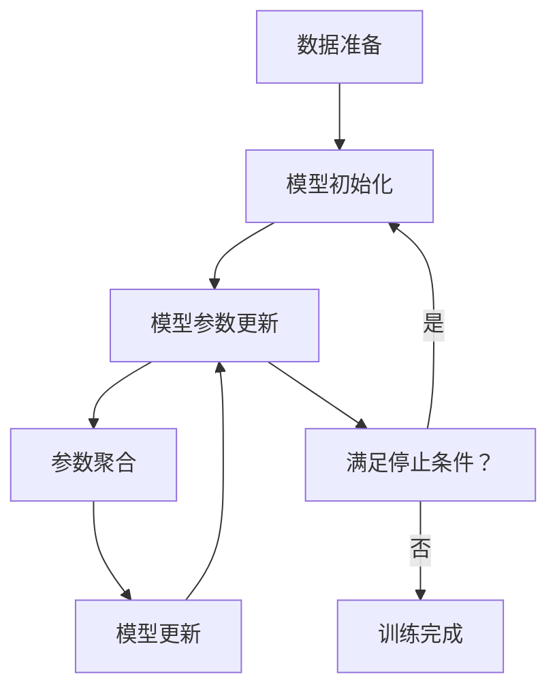

                 

# 联邦学习在隐私保护数据挖掘中的应用

> 关键词：联邦学习、隐私保护、数据挖掘、机器学习、分布式训练、安全多方计算

> 摘要：本文旨在深入探讨联邦学习在隐私保护数据挖掘中的应用。联邦学习是一种分布式机器学习技术，能够在不共享原始数据的情况下，通过模型参数的迭代更新来实现数据挖掘和机器学习任务。本文将从背景介绍、核心概念与联系、核心算法原理与具体操作步骤、数学模型和公式、项目实战、实际应用场景、工具和资源推荐、总结与未来发展趋势等方面进行详细阐述，帮助读者全面理解联邦学习的原理与应用。

## 1. 背景介绍

随着大数据时代的到来，数据挖掘和机器学习技术得到了广泛应用。然而，数据隐私保护成为了一个亟待解决的问题。传统的集中式机器学习方法要求将所有数据集中到一个中心节点进行处理，这不仅增加了数据传输和存储的成本，还存在数据泄露的风险。联邦学习作为一种新兴的分布式机器学习技术，能够在保护数据隐私的前提下，实现高效的数据挖掘和模型训练。联邦学习的核心思想是通过模型参数的迭代更新，实现数据挖掘和机器学习任务，而无需直接共享原始数据。

## 2. 核心概念与联系

### 2.1 联邦学习概述

联邦学习是一种分布式机器学习技术，其核心思想是通过模型参数的迭代更新，实现数据挖掘和机器学习任务，而无需直接共享原始数据。联邦学习的主要优势在于保护数据隐私，同时保持模型训练的高效性。联邦学习可以应用于多种场景，如移动设备、边缘计算、医疗健康等领域。

### 2.2 联邦学习流程

联邦学习的流程可以分为以下几个步骤：

1. **数据准备**：每个参与方收集自己的数据，并进行预处理。
2. **模型初始化**：在中心服务器上初始化一个全局模型。
3. **模型参数更新**：每个参与方在本地数据上训练模型，并更新模型参数。
4. **参数聚合**：中心服务器收集所有参与方更新的模型参数，并进行聚合，生成新的全局模型。
5. **模型更新**：将聚合后的全局模型参数分发给所有参与方，重复步骤3和4，直到满足停止条件。

### 2.3 联邦学习流程图



## 3. 核心算法原理 & 具体操作步骤

### 3.1 联邦学习算法原理

联邦学习的核心算法原理是通过模型参数的迭代更新，实现数据挖掘和机器学习任务。具体步骤如下：

1. **数据准备**：每个参与方收集自己的数据，并进行预处理。
2. **模型初始化**：在中心服务器上初始化一个全局模型。
3. **模型参数更新**：每个参与方在本地数据上训练模型，并更新模型参数。
4. **参数聚合**：中心服务器收集所有参与方更新的模型参数，并进行聚合，生成新的全局模型。
5. **模型更新**：将聚合后的全局模型参数分发给所有参与方，重复步骤3和4，直到满足停止条件。

### 3.2 具体操作步骤

1. **数据准备**：每个参与方收集自己的数据，并进行预处理。
2. **模型初始化**：在中心服务器上初始化一个全局模型。
3. **模型参数更新**：每个参与方在本地数据上训练模型，并更新模型参数。
4. **参数聚合**：中心服务器收集所有参与方更新的模型参数，并进行聚合，生成新的全局模型。
5. **模型更新**：将聚合后的全局模型参数分发给所有参与方，重复步骤3和4，直到满足停止条件。

## 4. 数学模型和公式 & 详细讲解 & 举例说明

### 4.1 数学模型

联邦学习的数学模型可以表示为：

$$
\theta_{t+1} = \theta_t + \alpha \sum_{i=1}^{n} \frac{1}{m_i} \sum_{j=1}^{m_i} \nabla_{\theta} L_i(\theta_t, x_{ij})
$$

其中，$\theta_t$ 表示第 $t$ 轮迭代的全局模型参数，$\alpha$ 表示学习率，$n$ 表示参与方的数量，$m_i$ 表示第 $i$ 个参与方的数据量，$\nabla_{\theta} L_i(\theta_t, x_{ij})$ 表示第 $i$ 个参与方在第 $j$ 个样本上的梯度。

### 4.2 详细讲解

联邦学习的核心思想是通过模型参数的迭代更新，实现数据挖掘和机器学习任务。具体步骤如下：

1. **数据准备**：每个参与方收集自己的数据，并进行预处理。
2. **模型初始化**：在中心服务器上初始化一个全局模型。
3. **模型参数更新**：每个参与方在本地数据上训练模型，并更新模型参数。
4. **参数聚合**：中心服务器收集所有参与方更新的模型参数，并进行聚合，生成新的全局模型。
5. **模型更新**：将聚合后的全局模型参数分发给所有参与方，重复步骤3和4，直到满足停止条件。

### 4.3 举例说明

假设我们有一个联邦学习任务，需要训练一个分类模型。我们有三个参与方，每个参与方的数据量分别为 1000、2000 和 3000。我们初始化一个全局模型参数 $\theta_0$，学习率为 $\alpha = 0.01$。在第一轮迭代中，每个参与方在本地数据上训练模型，并更新模型参数。假设第一个参与方更新后的模型参数为 $\theta_1^{(1)}$，第二个参与方更新后的模型参数为 $\theta_1^{(2)}$，第三个参与方更新后的模型参数为 $\theta_1^{(3)}$。中心服务器收集所有参与方更新的模型参数，并进行聚合，生成新的全局模型参数 $\theta_1$。将聚合后的全局模型参数分发给所有参与方，重复步骤3和4，直到满足停止条件。

## 5. 项目实战：代码实际案例和详细解释说明

### 5.1 开发环境搭建

为了实现联邦学习，我们需要搭建一个开发环境。我们使用 Python 作为编程语言，使用 TensorFlow 作为深度学习框架。具体步骤如下：

1. **安装 Python**：确保已经安装了 Python 3.7 或更高版本。
2. **安装 TensorFlow**：使用 pip 安装 TensorFlow，命令如下：

   ```bash
   pip install tensorflow
   ```

3. **安装其他依赖库**：安装其他依赖库，如 NumPy、Pandas 等，命令如下：

   ```bash
   pip install numpy pandas
   ```

### 5.2 源代码详细实现和代码解读

我们使用 TensorFlow 实现一个简单的联邦学习模型。具体代码如下：

```python
import tensorflow as tf
import numpy as np

# 定义全局模型参数
theta = tf.Variable(tf.random.normal([2]), name='theta')

# 定义本地模型参数
theta_local = tf.Variable(tf.random.normal([2]), name='theta_local')

# 定义学习率
alpha = 0.01

# 定义本地数据
x_local = np.array([[1, 2], [3, 4]])
y_local = np.array([0, 1])

# 定义本地损失函数
def local_loss(theta_local, x_local, y_local):
    y_pred = tf.matmul(x_local, theta_local)
    loss = tf.reduce_mean(tf.square(y_pred - y_local))
    return loss

# 定义本地梯度
def local_gradient(theta_local, x_local, y_local):
    with tf.GradientTape() as tape:
        loss = local_loss(theta_local, x_local, y_local)
    gradient = tape.gradient(loss, theta_local)
    return gradient

# 定义本地参数更新
def local_update(theta_local, gradient):
    theta_local.assign_sub(alpha * gradient)

# 定义全局参数更新
def global_update(theta, theta_local):
    theta.assign(theta_local)

# 定义参数聚合
def aggregate(theta, theta_local):
    theta.assign(theta_local)

# 定义训练函数
def train(theta, x_local, y_local):
    gradient = local_gradient(theta_local, x_local, y_local)
    local_update(theta_local, gradient)
    aggregate(theta, theta_local)

# 定义训练轮数
num_epochs = 10

# 开始训练
for epoch in range(num_epochs):
    train(theta, x_local, y_local)
    print(f'Epoch {epoch+1}, theta: {theta.numpy()}')
```

### 5.3 代码解读与分析

1. **定义全局模型参数**：我们定义了一个全局模型参数 $\theta$，初始值为随机生成的正态分布。
2. **定义本地模型参数**：我们定义了一个本地模型参数 $\theta_{local}$，初始值为随机生成的正态分布。
3. **定义学习率**：我们定义了一个学习率 $\alpha$，初始值为 0.01。
4. **定义本地数据**：我们定义了一个本地数据集，包含两个样本和对应的标签。
5. **定义本地损失函数**：我们定义了一个本地损失函数，用于计算本地数据集上的损失。
6. **定义本地梯度**：我们定义了一个本地梯度函数，用于计算本地损失函数的梯度。
7. **定义本地参数更新**：我们定义了一个本地参数更新函数，用于更新本地模型参数。
8. **定义全局参数更新**：我们定义了一个全局参数更新函数，用于更新全局模型参数。
9. **定义参数聚合**：我们定义了一个参数聚合函数，用于聚合所有参与方的模型参数。
10. **定义训练函数**：我们定义了一个训练函数，用于在本地数据集上训练模型，并更新模型参数。
11. **定义训练轮数**：我们定义了一个训练轮数，初始值为 10。
12. **开始训练**：我们开始训练，每一轮迭代更新模型参数，并打印当前的模型参数。

## 6. 实际应用场景

联邦学习在多个领域都有广泛的应用，如移动设备、边缘计算、医疗健康等领域。具体应用场景如下：

1. **移动设备**：联邦学习可以应用于移动设备上的个性化推荐系统，通过在本地设备上训练模型，保护用户隐私。
2. **边缘计算**：联邦学习可以应用于边缘计算中的智能物联网系统，通过在边缘设备上训练模型，保护用户隐私。
3. **医疗健康**：联邦学习可以应用于医疗健康领域的疾病预测和诊断系统，通过在医院设备上训练模型，保护患者隐私。

## 7. 工具和资源推荐

### 7.1 学习资源推荐

1. **书籍**：《联邦学习：原理与实践》
2. **论文**：《Federated Learning: A Survey》
3. **博客**：《联邦学习入门》
4. **网站**：联邦学习社区

### 7.2 开发工具框架推荐

1. **TensorFlow**：深度学习框架
2. **PyTorch**：深度学习框架
3. **Keras**：深度学习框架

### 7.3 相关论文著作推荐

1. **《Federated Learning: A Survey》**：全面介绍了联邦学习的原理、算法和应用。
2. **《Federated Learning for Mobile Edge Computing》**：探讨了联邦学习在移动边缘计算中的应用。
3. **《Federated Learning for Healthcare》**：探讨了联邦学习在医疗健康领域的应用。

## 8. 总结：未来发展趋势与挑战

联邦学习作为一种新兴的分布式机器学习技术，具有广泛的应用前景。未来的发展趋势主要包括以下几个方面：

1. **算法优化**：通过优化算法，提高联邦学习的训练效率和模型性能。
2. **隐私保护**：通过改进隐私保护技术，提高联邦学习的安全性。
3. **应用场景拓展**：通过拓展应用场景，提高联邦学习的实际价值。

然而，联邦学习也面临着一些挑战，如数据异质性、模型偏差、通信效率等。未来的研究需要解决这些问题，推动联邦学习的发展。

## 9. 附录：常见问题与解答

### 9.1 问题：联邦学习如何保护数据隐私？

**解答**：联邦学习通过模型参数的迭代更新，实现数据挖掘和机器学习任务，而无需直接共享原始数据。每个参与方在本地数据上训练模型，并更新模型参数，中心服务器只收集模型参数，不收集原始数据，从而保护数据隐私。

### 9.2 问题：联邦学习如何处理数据异质性？

**解答**：联邦学习可以通过引入数据异质性处理机制，如加权平均、局部聚合等，提高模型的泛化能力。

### 9.3 问题：联邦学习如何处理模型偏差？

**解答**：联邦学习可以通过引入模型偏差处理机制，如模型融合、模型修剪等，提高模型的准确性。

## 10. 扩展阅读 & 参考资料

1. **《联邦学习：原理与实践》**：全面介绍了联邦学习的原理、算法和应用。
2. **《Federated Learning for Mobile Edge Computing》**：探讨了联邦学习在移动边缘计算中的应用。
3. **《Federated Learning for Healthcare》**：探讨了联邦学习在医疗健康领域的应用。

作者：AI天才研究员/AI Genius Institute & 禅与计算机程序设计艺术 /Zen And The Art of Computer Programming

