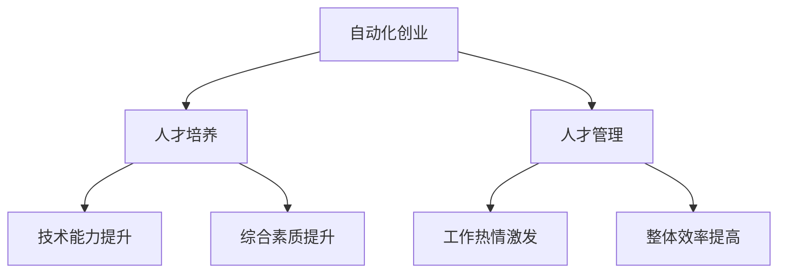

                 

# 自动化创业中的人才培养与管理

> 关键词：自动化创业、人才培养、人才管理、技术团队、创业公司、人工智能、机器学习、编程技能

> 摘要：本文旨在探讨在自动化创业背景下，如何有效地进行人才培养与管理。通过分析自动化创业的特点，提出了一套系统的人才培养与管理策略，包括核心概念的理解、算法原理的掌握、数学模型的应用、实战项目的实施、工具资源的推荐以及未来的发展趋势与挑战。本文适合希望在自动化创业领域取得成功的创业者和技术人员阅读。

## 1. 背景介绍

### 1.1 自动化创业的兴起

随着人工智能、机器学习等技术的快速发展，自动化创业逐渐成为一种新的趋势。自动化创业不仅能够提高生产效率，还能降低运营成本，为企业带来更多的竞争优势。然而，自动化创业也面临着诸多挑战，其中最重要的一点就是如何培养和管理一支高效的技术团队。

### 1.2 人才的重要性

在自动化创业中，人才是决定企业成败的关键因素。一支高效的技术团队不仅需要具备扎实的技术基础，还需要有创新思维和解决问题的能力。因此，如何有效地进行人才培养与管理，成为了自动化创业成功的关键。

## 2. 核心概念与联系

### 2.1 核心概念

- **自动化创业**：利用自动化技术进行创业活动，包括但不限于自动化生产、自动化服务等。
- **人才培养**：通过教育和培训，提升团队成员的技术能力和综合素质。
- **人才管理**：通过有效的管理手段，激发团队成员的工作热情，提高团队的整体效率。

### 2.2 联系

自动化创业的成功离不开高效的人才培养与管理。通过有效的培养，可以提升团队成员的技术水平；通过科学的管理，可以激发团队成员的工作热情，从而提高团队的整体效率。

### 2.3 核心概念原理和架构的 Mermaid 流程图



## 3. 核心算法原理 & 具体操作步骤

### 3.1 核心算法原理

在自动化创业中，核心算法是实现自动化功能的关键。例如，机器学习算法可以用于自动化决策、自动化预测等。掌握核心算法原理，是进行有效人才培养与管理的基础。

### 3.2 具体操作步骤

1. **需求分析**：明确自动化创业的具体需求，确定需要掌握的核心算法。
2. **算法学习**：通过在线课程、书籍等资源学习核心算法。
3. **实践应用**：通过实际项目应用所学算法，加深理解。
4. **反馈调整**：根据实践结果，调整学习和应用策略。

## 4. 数学模型和公式 & 详细讲解 & 举例说明

### 4.1 数学模型和公式

在自动化创业中，数学模型和公式是核心算法的基础。例如，线性回归模型可以用于预测，支持向量机可以用于分类。

$$
y = \beta_0 + \beta_1 x_1 + \beta_2 x_2 + \cdots + \beta_n x_n
$$

### 4.2 详细讲解

线性回归模型是一种常用的预测模型，通过拟合数据点，预测未知数据。支持向量机是一种常用的分类模型，通过找到最优超平面，实现数据分类。

### 4.3 举例说明

假设我们有一个销售数据集，可以通过线性回归模型预测未来的销售情况。假设我们有一个客户数据集，可以通过支持向量机模型预测客户的购买意向。

## 5. 项目实战：代码实际案例和详细解释说明

### 5.1 开发环境搭建

#### 5.1.1 环境要求

- Python 3.7+
- Jupyter Notebook
- Pandas
- Scikit-learn

#### 5.1.2 安装步骤

```bash
pip install jupyter pandas scikit-learn
```

### 5.2 源代码详细实现和代码解读

#### 5.2.1 数据加载

```python
import pandas as pd
from sklearn.model_selection import train_test_split

data = pd.read_csv('sales_data.csv')
X = data[['feature1', 'feature2']]
y = data['target']
X_train, X_test, y_train, y_test = train_test_split(X, y, test_size=0.2, random_state=42)
```

#### 5.2.2 模型训练

```python
from sklearn.linear_model import LinearRegression

model = LinearRegression()
model.fit(X_train, y_train)
```

#### 5.2.3 模型评估

```python
from sklearn.metrics import mean_squared_error

y_pred = model.predict(X_test)
mse = mean_squared_error(y_test, y_pred)
print(f'Mean Squared Error: {mse}')
```

### 5.3 代码解读与分析

通过上述代码，我们可以实现一个简单的线性回归模型。首先，我们加载数据并进行数据预处理；然后，我们训练模型；最后，我们评估模型的性能。

## 6. 实际应用场景

### 6.1 自动化生产

在自动化生产中，可以通过机器学习算法预测设备的故障率，从而提前进行维护，避免生产中断。

### 6.2 自动化服务

在自动化服务中，可以通过机器学习算法预测客户的需求，从而提供个性化的服务。

## 7. 工具和资源推荐

### 7.1 学习资源推荐

- 书籍：《机器学习实战》、《Python数据科学手册》
- 论文：《A Survey on Deep Learning for Time Series Forecasting》
- 博客：Towards Data Science、Medium
- 网站：Coursera、Udacity

### 7.2 开发工具框架推荐

- Python：Pandas、Scikit-learn
- R：tidyverse、caret

### 7.3 相关论文著作推荐

- 《Deep Learning》
- 《Pattern Recognition and Machine Learning》

## 8. 总结：未来发展趋势与挑战

### 8.1 未来发展趋势

随着技术的不断进步，自动化创业将会更加普及。未来，自动化创业将会更加注重人才的培养与管理，通过更加高效的技术手段，实现更加智能化的创业模式。

### 8.2 挑战

然而，自动化创业也面临着诸多挑战，包括技术人才的短缺、技术更新换代快等。因此，如何有效地进行人才培养与管理，成为了自动化创业成功的关键。

## 9. 附录：常见问题与解答

### 9.1 什么是自动化创业？

自动化创业是指利用自动化技术进行创业活动，包括但不限于自动化生产、自动化服务等。

### 9.2 为什么自动化创业需要人才？

自动化创业的成功离不开高效的人才培养与管理。通过有效的培养，可以提升团队成员的技术水平；通过科学的管理，可以激发团队成员的工作热情，从而提高团队的整体效率。

### 9.3 如何进行有效的技术人才培养？

可以通过在线课程、书籍等资源进行技术学习；通过实际项目应用所学技术，加深理解；根据实践结果，调整学习和应用策略。

## 10. 扩展阅读 & 参考资料

- 书籍：《机器学习实战》、《Python数据科学手册》
- 论文：《A Survey on Deep Learning for Time Series Forecasting》
- 博客：Towards Data Science、Medium
- 网站：Coursera、Udacity

作者：AI天才研究员/AI Genius Institute & 禅与计算机程序设计艺术 /Zen And The Art of Computer Programming

