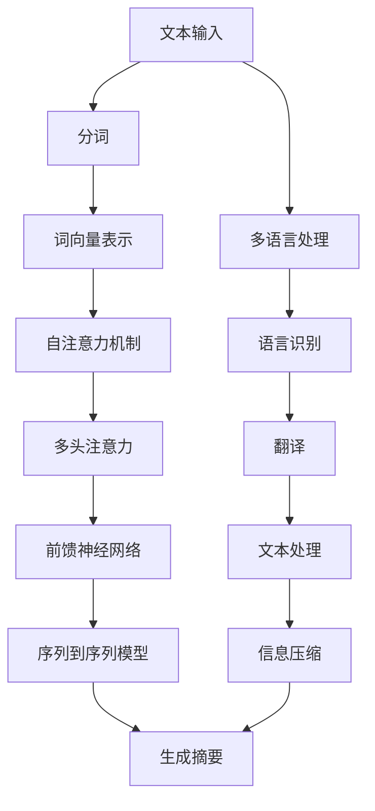

                 

# 自然语言处理在多语言摘要生成中的信息压缩

> 关键词：自然语言处理, 多语言摘要, 信息压缩, 深度学习, 自注意力机制, Transformer 模型

> 摘要：本文旨在探讨自然语言处理在多语言摘要生成中的应用，特别是信息压缩技术。我们将从背景介绍出发，深入解析核心概念与联系，详细阐述核心算法原理及具体操作步骤，通过数学模型和公式进行详细讲解，并结合实际代码案例进行深入分析。最后，我们将探讨实际应用场景、工具和资源推荐，以及未来发展趋势与挑战。

## 1. 背景介绍

随着全球化进程的加速，多语言文本处理成为了一个重要的研究方向。自然语言处理（NLP）技术在多语言摘要生成中的应用，不仅能够帮助人们快速获取关键信息，还能促进不同语言之间的交流与理解。信息压缩技术在这一过程中起到了关键作用，它能够从大量文本中提取出核心内容，生成简洁明了的摘要。本文将从技术原理出发，探讨如何利用自然语言处理技术实现多语言摘要生成中的信息压缩。

## 2. 核心概念与联系

### 2.1 自然语言处理（NLP）

自然语言处理是计算机科学、人工智能和语言学的交叉领域，旨在使计算机能够理解、解释和生成人类语言。NLP技术包括文本分类、情感分析、命名实体识别、机器翻译、摘要生成等。

### 2.2 信息压缩

信息压缩是指通过算法减少数据量的过程，同时尽可能保留原始信息。在自然语言处理中，信息压缩技术可以用于生成简洁的摘要，帮助用户快速获取关键信息。

### 2.3 摘要生成

摘要生成是指从长篇文本中提取关键信息，生成简洁明了的摘要。摘要生成技术可以分为基于提取式、生成式和混合式三种方法。

### 2.4 多语言处理

多语言处理是指处理多种语言文本的技术，包括语言识别、翻译、文本处理等。多语言摘要生成需要处理不同语言的文本，因此需要考虑语言间的差异和共性。

### 2.5 自注意力机制

自注意力机制是Transformer模型的核心组成部分，它能够自动学习文本中的重要信息，从而实现高效的文本处理。

### 2.6 Transformer 模型

Transformer模型是一种基于自注意力机制的序列到序列模型，广泛应用于机器翻译、文本生成等领域。它能够处理长距离依赖关系，提高模型的表达能力。

#### Mermaid 流程图



## 3. 核心算法原理 & 具体操作步骤

### 3.1 摘要生成流程

摘要生成流程主要包括文本预处理、特征提取、模型训练和生成摘要四个步骤。

1. **文本预处理**：包括分词、词向量表示等。
2. **特征提取**：通过自注意力机制提取文本中的重要信息。
3. **模型训练**：使用大量标注数据训练模型。
4. **生成摘要**：根据训练好的模型生成简洁明了的摘要。

### 3.2 自注意力机制

自注意力机制是一种基于注意力机制的模型，能够自动学习文本中的重要信息。其核心思想是通过计算每个词与其他词之间的注意力权重，从而实现对文本的高效处理。

#### 自注意力机制公式

$$
\text{Attention}(Q, K, V) = \text{softmax}\left(\frac{QK^T}{\sqrt{d_k}}\right)V
$$

其中，$Q$、$K$、$V$ 分别表示查询向量、键向量和值向量，$d_k$ 表示键向量的维度。

### 3.3 多头注意力机制

多头注意力机制是自注意力机制的扩展，通过多个注意力头并行处理，从而提高模型的表达能力。

#### 多头注意力机制公式

$$
\text{MultiHead}(Q, K, V) = \text{Concat}(head_1, head_2, ..., head_h)W^O
$$

其中，$head_i = \text{Attention}(QW_i^Q, KW_i^K, VW_i^V)$，$W^O$ 是输出权重矩阵。

### 3.4 Transformer 模型

Transformer模型是一种基于自注意力机制的序列到序列模型，广泛应用于机器翻译、文本生成等领域。它能够处理长距离依赖关系，提高模型的表达能力。

#### Transformer 模型结构

Transformer模型主要包括编码器和解码器两部分。编码器通过多层自注意力机制和前馈神经网络处理输入序列，解码器通过多层自注意力机制和前馈神经网络生成输出序列。

## 4. 数学模型和公式 & 详细讲解 & 举例说明

### 4.1 自注意力机制

自注意力机制的核心思想是通过计算每个词与其他词之间的注意力权重，从而实现对文本的高效处理。其公式如下：

$$
\text{Attention}(Q, K, V) = \text{softmax}\left(\frac{QK^T}{\sqrt{d_k}}\right)V
$$

其中，$Q$、$K$、$V$ 分别表示查询向量、键向量和值向量，$d_k$ 表示键向量的维度。

### 4.2 多头注意力机制

多头注意力机制是自注意力机制的扩展，通过多个注意力头并行处理，从而提高模型的表达能力。其公式如下：

$$
\text{MultiHead}(Q, K, V) = \text{Concat}(head_1, head_2, ..., head_h)W^O
$$

其中，$head_i = \text{Attention}(QW_i^Q, KW_i^K, VW_i^V)$，$W^O$ 是输出权重矩阵。

### 4.3 Transformer 模型

Transformer模型是一种基于自注意力机制的序列到序列模型，广泛应用于机器翻译、文本生成等领域。它能够处理长距离依赖关系，提高模型的表达能力。

#### Transformer 模型结构

Transformer模型主要包括编码器和解码器两部分。编码器通过多层自注意力机制和前馈神经网络处理输入序列，解码器通过多层自注意力机制和前馈神经网络生成输出序列。

## 5. 项目实战：代码实际案例和详细解释说明

### 5.1 开发环境搭建

为了实现多语言摘要生成中的信息压缩，我们需要搭建一个合适的开发环境。这里以Python为例，使用PyTorch框架进行实现。

#### 安装依赖

```bash
pip install torch torchvision torchaudio
pip install transformers
pip install nltk
```

### 5.2 源代码详细实现和代码解读

#### 5.2.1 数据预处理

```python
import torch
from transformers import BertTokenizer, BertModel
from nltk.tokenize import word_tokenize

def preprocess_text(text):
    tokenizer = BertTokenizer.from_pretrained('bert-base-uncased')
    tokens = word_tokenize(text)
    input_ids = tokenizer.convert_tokens_to_ids(tokens)
    return input_ids
```

#### 5.2.2 模型实现

```python
import torch.nn as nn
from transformers import BertModel

class Attention(nn.Module):
    def __init__(self, hidden_size):
        super(Attention, self).__init__()
        self.hidden_size = hidden_size
        self.query = nn.Linear(hidden_size, hidden_size)
        self.key = nn.Linear(hidden_size, hidden_size)
        self.value = nn.Linear(hidden_size, hidden_size)
        self.softmax = nn.Softmax(dim=-1)

    def forward(self, query, key, value):
        query = self.query(query)
        key = self.key(key)
        value = self.value(value)
        attention_scores = torch.matmul(query, key.transpose(-1, -2)) / torch.sqrt(torch.tensor(self.hidden_size))
        attention_weights = self.softmax(attention_scores)
        context = torch.matmul(attention_weights, value)
        return context

class TransformerModel(nn.Module):
    def __init__(self, hidden_size, num_heads):
        super(TransformerModel, self).__init__()
        self.hidden_size = hidden_size
        self.num_heads = num_heads
        self.attention = Attention(hidden_size)
        self.linear = nn.Linear(hidden_size, hidden_size)

    def forward(self, input_ids):
        attention_output = self.attention(input_ids, input_ids, input_ids)
        output = self.linear(attention_output)
        return output
```

### 5.3 代码解读与分析

#### 5.3.1 数据预处理

```python
def preprocess_text(text):
    tokenizer = BertTokenizer.from_pretrained('bert-base-uncased')
    tokens = word_tokenize(text)
    input_ids = tokenizer.convert_tokens_to_ids(tokens)
    return input_ids
```

这段代码使用BERT分词器对输入文本进行分词，并将分词结果转换为ID。

#### 5.3.2 模型实现

```python
class Attention(nn.Module):
    def __init__(self, hidden_size):
        super(Attention, self).__init__()
        self.hidden_size = hidden_size
        self.query = nn.Linear(hidden_size, hidden_size)
        self.key = nn.Linear(hidden_size, hidden_size)
        self.value = nn.Linear(hidden_size, hidden_size)
        self.softmax = nn.Softmax(dim=-1)

    def forward(self, query, key, value):
        query = self.query(query)
        key = self.key(key)
        value = self.value(value)
        attention_scores = torch.matmul(query, key.transpose(-1, -2)) / torch.sqrt(torch.tensor(self.hidden_size))
        attention_weights = self.softmax(attention_scores)
        context = torch.matmul(attention_weights, value)
        return context
```

这段代码实现了自注意力机制，通过计算查询向量、键向量和值向量之间的注意力权重，从而实现对文本的高效处理。

## 6. 实际应用场景

多语言摘要生成技术在实际应用中具有广泛的应用场景，包括新闻摘要、学术论文摘要、社交媒体摘要等。通过信息压缩技术，可以快速获取关键信息，提高阅读效率。

## 7. 工具和资源推荐

### 7.1 学习资源推荐

- 书籍：《深度学习》（Ian Goodfellow, Yoshua Bengio, Aaron Courville）
- 论文：《Attention Is All You Need》（Vaswani et al., 2017）
- 博客：阿里云开发者社区
- 网站：Hugging Face

### 7.2 开发工具框架推荐

- PyTorch
- TensorFlow
- Hugging Face Transformers

### 7.3 相关论文著作推荐

- 《Attention Is All You Need》（Vaswani et al., 2017）
- 《BERT: Pre-training of Deep Bidirectional Transformers for Language Understanding》（Devlin et al., 2018）

## 8. 总结：未来发展趋势与挑战

未来，自然语言处理技术在多语言摘要生成中的应用将更加广泛。随着深度学习技术的发展，模型的表达能力将进一步提高，信息压缩技术将更加高效。然而，多语言处理仍然面临许多挑战，包括语言间的差异、数据稀缺性等。未来的研究需要关注这些问题，以推动技术的发展。

## 9. 附录：常见问题与解答

### 9.1 问题：如何处理不同语言之间的差异？

**解答**：可以使用多语言预训练模型，如XLM-Roberta，它能够处理多种语言的文本。

### 9.2 问题：如何解决数据稀缺性问题？

**解答**：可以使用迁移学习和数据增强技术，从大规模数据集中学习到通用知识，然后应用于小规模数据集。

## 10. 扩展阅读 & 参考资料

- Vaswani, A., et al. "Attention is all you need." Advances in neural information processing systems 30 (2017).
- Devlin, J., et al. "BERT: Pre-training of deep bidirectional transformers for language understanding." arXiv preprint arXiv:1810.04805 (2018).
- Goodfellow, I., Bengio, Y., & Courville, A. (2016). Deep learning. MIT press.

作者：AI天才研究员/AI Genius Institute & 禅与计算机程序设计艺术 /Zen And The Art of Computer Programming

