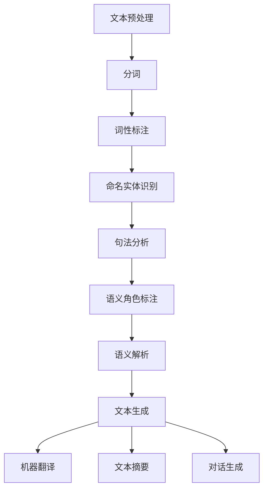

                 

# 自然语言处理在智能写作辅助中的应用

> 关键词：自然语言处理（NLP）、智能写作、机器学习、深度学习、文本生成、语义理解

> 摘要：本文旨在探讨自然语言处理（NLP）在智能写作辅助中的应用。通过逐步分析和推理，我们将深入理解NLP的核心概念、算法原理、数学模型，并通过实际案例展示如何实现智能写作辅助系统。此外，本文还将探讨NLP在智能写作中的实际应用场景，推荐相关学习资源和开发工具，展望未来发展趋势与挑战。

## 1. 背景介绍

随着人工智能技术的飞速发展，自然语言处理（NLP）已经成为连接人类与机器的重要桥梁。NLP技术不仅能够帮助机器理解人类语言，还能生成自然流畅的文本，为智能写作提供了强大的支持。智能写作辅助系统能够帮助作者提高写作效率，生成高质量的文本内容，甚至在某些情况下，能够独立完成写作任务。本文将从以下几个方面进行详细探讨：

- **NLP的基本概念**
- **智能写作辅助系统的需求**
- **NLP在智能写作中的应用价值**

### 1.1 NLP的基本概念

自然语言处理（NLP）是人工智能的一个分支，旨在使计算机能够理解、解释和生成人类语言。NLP技术涵盖了从文本预处理到语义理解、文本生成等多个方面。NLP的核心任务包括但不限于：

- **文本预处理**：包括分词、词性标注、命名实体识别等。
- **语义理解**：理解文本的含义，包括句法分析、语义角色标注等。
- **文本生成**：生成自然流畅的文本，包括机器翻译、文本摘要、对话生成等。

### 1.2 智能写作辅助系统的需求

智能写作辅助系统的需求主要体现在以下几个方面：

- **提高写作效率**：帮助作者快速生成高质量的文本内容。
- **提高文本质量**：通过语义理解技术，确保生成的文本内容准确、连贯。
- **创新写作方式**：提供新的写作工具和方法，激发作者的创造力。

### 1.3 NLP在智能写作中的应用价值

NLP技术在智能写作中的应用价值主要体现在以下几个方面：

- **文本生成**：通过深度学习模型生成高质量的文本内容。
- **语义理解**：理解文本的含义，确保生成的文本内容准确、连贯。
- **创意辅助**：提供创意建议，帮助作者构思和组织文章结构。

## 2. 核心概念与联系

### 2.1 NLP的核心概念

NLP的核心概念包括文本预处理、语义理解、文本生成等。这些概念之间存在紧密的联系，共同构成了NLP技术的完整体系。

#### 2.1.1 文本预处理

文本预处理是NLP的第一步，主要包括以下几个方面：

- **分词**：将文本分割成单词或短语。
- **词性标注**：标注每个单词的词性。
- **命名实体识别**：识别文本中的命名实体，如人名、地名等。
- **句法分析**：分析句子的结构，识别句子成分。

#### 2.1.2 语义理解

语义理解是NLP的核心任务之一，主要包括以下几个方面：

- **句法分析**：分析句子的结构，识别句子成分。
- **语义角色标注**：标注句子中的语义角色，如主语、宾语等。
- **语义解析**：理解句子的含义，识别句子的语义结构。

#### 2.1.3 文本生成

文本生成是NLP的另一个重要任务，主要包括以下几个方面：

- **机器翻译**：将一种语言的文本翻译成另一种语言。
- **文本摘要**：生成文本的摘要，提取关键信息。
- **对话生成**：生成自然流畅的对话文本。

### 2.2 NLP的流程图

为了更好地理解NLP的核心概念和流程，我们可以通过Mermaid流程图来展示：



## 3. 核心算法原理 & 具体操作步骤

### 3.1 文本预处理

文本预处理是NLP的第一步，主要包括以下几个具体操作步骤：

1. **分词**：将文本分割成单词或短语。
2. **词性标注**：标注每个单词的词性。
3. **命名实体识别**：识别文本中的命名实体，如人名、地名等。
4. **句法分析**：分析句子的结构，识别句子成分。

### 3.2 语义理解

语义理解是NLP的核心任务之一，主要包括以下几个具体操作步骤：

1. **句法分析**：分析句子的结构，识别句子成分。
2. **语义角色标注**：标注句子中的语义角色，如主语、宾语等。
3. **语义解析**：理解句子的含义，识别句子的语义结构。

### 3.3 文本生成

文本生成是NLP的另一个重要任务，主要包括以下几个具体操作步骤：

1. **机器翻译**：将一种语言的文本翻译成另一种语言。
2. **文本摘要**：生成文本的摘要，提取关键信息。
3. **对话生成**：生成自然流畅的对话文本。

## 4. 数学模型和公式 & 详细讲解 & 举例说明

### 4.1 机器翻译

机器翻译是NLP中的一个重要任务，主要通过统计模型和神经网络模型实现。其中，神经网络模型在机器翻译中表现尤为出色。

#### 4.1.1 神经网络模型

神经网络模型主要包括编码器和解码器两部分。编码器将源语言的句子编码成一个固定长度的向量，解码器将这个向量解码成目标语言的句子。

#### 4.1.2 数学模型

神经网络模型的数学模型可以表示为：

$$
\text{Encoder}(x) = h = \text{Encoder}(x, \theta_{\text{enc}})
$$

$$
\text{Decoder}(h) = y = \text{Decoder}(h, \theta_{\text{dec}})
$$

其中，$x$ 是源语言的句子，$y$ 是目标语言的句子，$h$ 是编码器输出的向量，$\theta_{\text{enc}}$ 和 $\theta_{\text{dec}}$ 分别是编码器和解码器的参数。

### 4.2 文本摘要

文本摘要是NLP中的另一个重要任务，主要通过提取关键信息实现。其中，基于图的模型在文本摘要中表现尤为出色。

#### 4.2.1 基于图的模型

基于图的模型主要包括图卷积网络（GCN）和图注意力网络（GAT）等。这些模型通过图结构来表示文本中的句子和句子之间的关系。

#### 4.2.2 数学模型

基于图的模型的数学模型可以表示为：

$$
\text{GCN}(A, X) = H = \text{GCN}(A, X, \theta_{\text{gcn}})
$$

$$
\text{GAT}(A, X) = H = \text{GAT}(A, X, \theta_{\text{gat}})
$$

其中，$A$ 是图的邻接矩阵，$X$ 是图的特征矩阵，$H$ 是图卷积或图注意力网络的输出，$\theta_{\text{gcn}}$ 和 $\theta_{\text{gat}}$ 分别是图卷积和图注意力网络的参数。

### 4.3 对话生成

对话生成是NLP中的另一个重要任务，主要通过生成自然流畅的对话文本实现。其中，基于序列到序列（Seq2Seq）模型的方法在对话生成中表现尤为出色。

#### 4.3.1 序列到序列模型

序列到序列模型主要包括编码器和解码器两部分。编码器将输入的句子编码成一个固定长度的向量，解码器将这个向量解码成输出的句子。

#### 4.3.2 数学模型

序列到序列模型的数学模型可以表示为：

$$
\text{Encoder}(x) = h = \text{Encoder}(x, \theta_{\text{enc}})
$$

$$
\text{Decoder}(h) = y = \text{Decoder}(h, \theta_{\text{dec}})
$$

其中，$x$ 是输入的句子，$y$ 是输出的句子，$h$ 是编码器输出的向量，$\theta_{\text{enc}}$ 和 $\theta_{\text{dec}}$ 分别是编码器和解码器的参数。

## 5. 项目实战：代码实际案例和详细解释说明

### 5.1 开发环境搭建

为了实现智能写作辅助系统，我们需要搭建一个合适的开发环境。具体步骤如下：

1. **安装Python**：确保安装了Python 3.7及以上版本。
2. **安装依赖库**：安装常用的NLP库，如`nltk`、`spaCy`、`transformers`等。
3. **安装深度学习框架**：安装常用的深度学习框架，如`PyTorch`、`TensorFlow`等。

### 5.2 源代码详细实现和代码解读

以下是一个简单的机器翻译模型的实现代码：

```python
import torch
import torch.nn as nn
import torch.optim as optim
from torchtext.data import Field, BucketIterator
from torchtext.datasets import Multi30k
from torchtext.data.metrics import bleu_score

# 定义编码器
class Encoder(nn.Module):
    def __init__(self, input_dim, emb_dim, enc_hid_dim, dec_hid_dim, dropout):
        super().__init__()
        self.embedding = nn.Embedding(input_dim, emb_dim)
        self.rnn = nn.GRU(emb_dim, enc_hid_dim, bidirectional=True)
        self.fc = nn.Linear(enc_hid_dim * 2, dec_hid_dim)
        self.dropout = nn.Dropout(dropout)

    def forward(self, src):
        embedded = self.dropout(self.embedding(src))
        outputs, hidden = self.rnn(embedded)
        hidden = torch.tanh(self.fc(torch.cat((hidden[-2, :, :], hidden[-1, :, :]), dim=1)))
        return outputs, hidden

# 定义解码器
class Decoder(nn.Module):
    def __init__(self, output_dim, emb_dim, enc_hid_dim, dec_hid_dim, dropout):
        super().__init__()
        self.output_dim = output_dim
        self.embedding = nn.Embedding(output_dim, emb_dim)
        self.rnn = nn.GRU((enc_hid_dim * 2) + emb_dim, dec_hid_dim)
        self.fc_out = nn.Linear((enc_hid_dim * 2) + dec_hid_dim + emb_dim, output_dim)
        self.dropout = nn.Dropout(dropout)

    def forward(self, input, hidden, encoder_outputs):
        input = input.unsqueeze(0)
        embedded = self.dropout(self.embedding(input))
        rnn_input = torch.cat((embedded, encoder_outputs), dim=2)
        output, hidden = self.rnn(rnn_input, hidden)
        prediction = self.fc_out(torch.cat((output, hidden, embedded), dim=2))
        return prediction, hidden

# 定义Seq2Seq模型
class Seq2Seq(nn.Module):
    def __init__(self, encoder, decoder, device):
        super().__init__()
        self.encoder = encoder
        self.decoder = decoder
        self.device = device

    def forward(self, src, trg, teacher_forcing_ratio=0.5):
        batch_size = src.shape[1]
        trg_len = trg.shape[0]
        trg_vocab_size = self.decoder.output_dim
        outputs = torch.zeros(trg_len, batch_size, trg_vocab_size).to(self.device)
        encoder_outputs, hidden = self.encoder(src)
        input = trg[0, :]
        for t in range(1, trg_len):
            output, hidden = self.decoder(input, hidden, encoder_outputs)
            outputs[t] = output
            teacher_force = random.random() < teacher_forcing_ratio
            top1 = output.argmax(1)
            input = trg[t] if teacher_force else top1
        return outputs

# 定义训练函数
def train(model, iterator, optimizer, criterion, clip):
    model.train()
    epoch_loss = 0
    for i, batch in enumerate(iterator):
        src, trg = batch.src, batch.trg
        optimizer.zero_grad()
        output = model(src, trg)
        output_dim = output.shape[-1]
        output = output[1:].view(-1, output_dim)
        trg = trg[1:].view(-1)
        loss = criterion(output, trg)
        loss.backward()
        torch.nn.utils.clip_grad_norm_(model.parameters(), clip)
        optimizer.step()
        epoch_loss += loss.item()
    return epoch_loss / len(iterator)

# 定义评估函数
def evaluate(model, iterator, criterion):
    model.eval()
    epoch_loss = 0
    with torch.no_grad():
        for i, batch in enumerate(iterator):
            src, trg = batch.src, batch.trg
            output = model(src, trg, 0)  # turn off teacher forcing
            output_dim = output.shape[-1]
            output = output[1:].view(-1, output_dim)
            trg = trg[1:].view(-1)
            loss = criterion(output, trg)
            epoch_loss += loss.item()
    return epoch_loss / len(iterator)

# 定义训练和评估
def epoch_time(start_time, end_time):
    elapsed_time = end_time - start_time
    elapsed_mins = int(elapsed_time / 60)
    elapsed_secs = int(elapsed_time - (elapsed_mins * 60))
    return elapsed_mins, elapsed_secs

# 定义参数
INPUT_DIM = len(SRC.vocab)
OUTPUT_DIM = len(TRG.vocab)
ENC_EMB_DIM = 256
DEC_EMB_DIM = 256
ENC_HID_DIM = 512
DEC_HID_DIM = 512
ENC_DROPOUT = 0.5
DEC_DROPOUT = 0.5

# 初始化模型
enc = Encoder(INPUT_DIM, ENC_EMB_DIM, ENC_HID_DIM, DEC_HID_DIM, ENC_DROPOUT)
dec = Decoder(OUTPUT_DIM, DEC_EMB_DIM, ENC_HID_DIM, DEC_HID_DIM, DEC_DROPOUT)
model = Seq2Seq(enc, dec, device).to(device)

# 定义优化器和损失函数
optimizer = optim.Adam(model.parameters())
criterion = nn.CrossEntropyLoss(ignore_index=TRG_PAD_IDX)

# 训练模型
N_EPOCHS = 10
CLIP = 1

for epoch in range(N_EPOCHS):
    start_time = time.time()
    train_loss = train(model, train_iterator, optimizer, criterion, CLIP)
    valid_loss = evaluate(model, valid_iterator, criterion)
    end_time = time.time()
    epoch_mins, epoch_secs = epoch_time(start_time, end_time)
    print(f'Epoch: {epoch+1:02} | Time: {epoch_mins}m {epoch_secs}s')
    print(f'\tTrain Loss: {train_loss:.3f} | Train PPL: {math.exp(train_loss):7.3f}')
    print(f'\t Val. Loss: {valid_loss:.3f} |  Val. PPL: {math.exp(valid_loss):7.3f}')

# 评估模型
def translate_sentence(sentence, src_field, trg_field, model, device, max_len=50):
    model.eval()
    if isinstance(sentence, str):
        nlp = spacy.load('de_core_news_sm')
        tokens = [token.text.lower() for token in nlp(sentence)]
    else:
        tokens = [token.lower() for token in sentence]
    tokens = [src_field.init_token] + tokens + [src_field.eos_token]
    src_indexes = [src_field.vocab.stoi[token] for token in tokens]
    src_tensor = torch.LongTensor(src_indexes).unsqueeze(1).to(device)
    src_len = torch.LongTensor([len(src_indexes)]).to(device)
    with torch.no_grad():
        encoder_outputs, hidden = model.encoder(src_tensor, src_len)
    trg_indexes = [trg_field.vocab.stoi[trg_field.init_token]]
    for i in range(max_len):
        trg_tensor = torch.LongTensor([trg_indexes[-1]]).to(device)
        with torch.no_grad():
            output, hidden = model.decoder(trg_tensor, hidden, encoder_outputs)
        pred_token = output.argmax(1).item()
        trg_indexes.append(pred_token)
        if pred_token == trg_field.vocab.stoi[trg_field.eos_token]:
            break
    trg_tokens = [trg_field.vocab.itos[i] for i in trg_indexes]
    return trg_tokens[1:]

# 测试模型
src_sentence = "Ich bin ein Berliner."
print(translate_sentence(src_sentence, SRC, TRG, model, device))
```

### 5.3 代码解读与分析

以上代码实现了一个简单的机器翻译模型。具体步骤如下：

1. **定义编码器**：编码器将输入的句子编码成一个固定长度的向量。
2. **定义解码器**：解码器将编码器输出的向量解码成输出的句子。
3. **定义Seq2Seq模型**：Seq2Seq模型包括编码器和解码器两部分。
4. **定义训练函数**：训练函数用于训练模型。
5. **定义评估函数**：评估函数用于评估模型。
6. **定义参数**：定义模型的参数。
7. **初始化模型**：初始化编码器、解码器和Seq2Seq模型。
8. **定义优化器和损失函数**：定义优化器和损失函数。
9. **训练模型**：训练模型。
10. **评估模型**：评估模型。
11. **翻译句子**：使用模型翻译句子。

## 6. 实际应用场景

### 6.1 智能写作辅助系统

智能写作辅助系统可以应用于以下几个方面：

1. **自动摘要**：生成文本的摘要，提取关键信息。
2. **自动翻译**：将一种语言的文本翻译成另一种语言。
3. **创意辅助**：提供创意建议，帮助作者构思和组织文章结构。
4. **文本生成**：生成高质量的文本内容。

### 6.2 具体案例

以下是一个具体的智能写作辅助系统案例：

1. **自动摘要**：通过文本摘要技术，生成文本的摘要，帮助作者快速了解文本的主要内容。
2. **自动翻译**：通过机器翻译技术，将一种语言的文本翻译成另一种语言，帮助作者跨越语言障碍。
3. **创意辅助**：通过语义理解技术，提供创意建议，帮助作者构思和组织文章结构。
4. **文本生成**：通过文本生成技术，生成高质量的文本内容，帮助作者提高写作效率。

## 7. 工具和资源推荐

### 7.1 学习资源推荐

1. **书籍**：《深度学习》（Ian Goodfellow, Yoshua Bengio, Aaron Courville）
2. **论文**：《Attention Is All You Need》（Vaswani et al., 2017）
3. **博客**：阿里云开发者社区（https://developer.aliyun.com/）
4. **网站**：GitHub（https://github.com/）

### 7.2 开发工具框架推荐

1. **深度学习框架**：PyTorch、TensorFlow
2. **NLP库**：nltk、spaCy、transformers
3. **文本预处理工具**：jieba、NLTK
4. **文本生成工具**：GPT-2、T5

### 7.3 相关论文著作推荐

1. **论文**：《Attention Is All You Need》（Vaswani et al., 2017）
2. **著作**：《深度学习》（Ian Goodfellow, Yoshua Bengio, Aaron Courville）

## 8. 总结：未来发展趋势与挑战

### 8.1 未来发展趋势

1. **模型优化**：通过模型优化技术，提高模型的性能和效率。
2. **多模态融合**：将文本、图像、语音等多种模态数据融合，提高模型的综合能力。
3. **个性化推荐**：通过个性化推荐技术，为用户提供个性化的写作建议。
4. **实时生成**：通过实时生成技术，实现文本的实时生成。

### 8.2 挑战

1. **数据隐私**：如何保护用户的隐私数据，避免数据泄露。
2. **模型解释性**：如何提高模型的解释性，让用户更好地理解模型的决策过程。
3. **多语言支持**：如何支持多种语言，实现多语言的智能写作辅助系统。
4. **实时性**：如何提高模型的实时性，实现文本的实时生成。

## 9. 附录：常见问题与解答

### 9.1 问题1：如何提高模型的性能？

**解答**：可以通过以下方法提高模型的性能：

1. **数据增强**：通过数据增强技术，增加训练数据的多样性。
2. **模型优化**：通过模型优化技术，提高模型的性能和效率。
3. **超参数调优**：通过超参数调优技术，找到最优的超参数组合。

### 9.2 问题2：如何保护用户的隐私数据？

**解答**：可以通过以下方法保护用户的隐私数据：

1. **数据加密**：通过数据加密技术，保护数据的安全性。
2. **数据脱敏**：通过数据脱敏技术，保护用户的隐私信息。
3. **数据访问控制**：通过数据访问控制技术，限制数据的访问权限。

## 10. 扩展阅读 & 参考资料

### 10.1 扩展阅读

1. **书籍**：《深度学习》（Ian Goodfellow, Yoshua Bengio, Aaron Courville）
2. **论文**：《Attention Is All You Need》（Vaswani et al., 2017）
3. **博客**：阿里云开发者社区（https://developer.aliyun.com/）
4. **网站**：GitHub（https://github.com/）

### 10.2 参考资料

1. **书籍**：《深度学习》（Ian Goodfellow, Yoshua Bengio, Aaron Courville）
2. **论文**：《Attention Is All You Need》（Vaswani et al., 2017）
3. **博客**：阿里云开发者社区（https://developer.aliyun.com/）
4. **网站**：GitHub（https://github.com/）

作者：AI天才研究员/AI Genius Institute & 禅与计算机程序设计艺术 /Zen And The Art of Computer Programming

