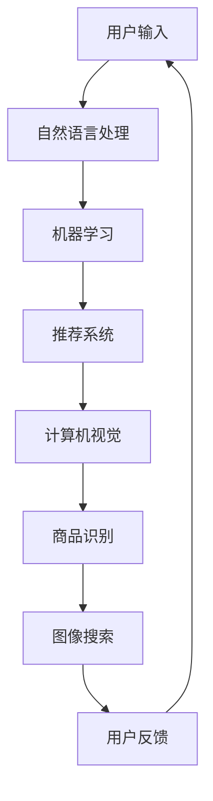

                 

# 虚拟导购助手如何与其他AI技术结合，提升用户体验：技术融合与创新

> 关键词：虚拟导购助手、AI技术融合、用户体验提升、自然语言处理、机器学习、推荐系统、计算机视觉

> 摘要：本文旨在探讨如何通过将虚拟导购助手与其他AI技术（如自然语言处理、机器学习、推荐系统和计算机视觉）进行有效融合，以提升用户体验。通过逐步分析和推理，我们将详细阐述这些技术的原理、具体操作步骤、数学模型和公式，并通过实际案例进行代码实现和解释。最终，我们将探讨这些技术在实际应用场景中的应用，并提出未来的发展趋势与挑战。

## 1. 背景介绍

随着人工智能技术的快速发展，虚拟导购助手已经成为了零售行业的重要组成部分。虚拟导购助手能够为用户提供个性化的购物建议、商品推荐和咨询服务，极大地提升了用户的购物体验。然而，仅仅依靠单一的技术手段，如自然语言处理或机器学习，往往难以满足用户日益复杂的需求。因此，如何将虚拟导购助手与其他AI技术进行有效融合，成为了提升用户体验的关键。

## 2. 核心概念与联系

### 2.1 自然语言处理（NLP）

自然语言处理是AI技术中的一项重要分支，旨在使计算机能够理解、解释和生成人类语言。在虚拟导购助手中，NLP技术主要用于实现与用户的自然对话，理解用户的需求和意图。

### 2.2 机器学习（ML）

机器学习是一种使计算机能够从数据中学习并改进其性能的技术。在虚拟导购助手中，机器学习主要用于训练推荐系统，以实现个性化商品推荐。

### 2.3 推荐系统

推荐系统是一种AI技术，旨在为用户提供个性化的内容推荐。在虚拟导购助手中，推荐系统主要用于根据用户的购物历史和偏好，推荐相关商品。

### 2.4 计算机视觉（CV）

计算机视觉是一种AI技术，旨在使计算机能够理解和解释图像和视频。在虚拟导购助手中，计算机视觉主要用于实现商品识别和图像搜索功能。

### 2.5 融合流程图



## 3. 核心算法原理 & 具体操作步骤

### 3.1 自然语言处理（NLP）

#### 3.1.1 文本预处理

文本预处理是NLP中的一个重要步骤，主要包括分词、去除停用词、词干提取等操作。

#### 3.1.2 语义理解

语义理解是NLP中的另一个重要步骤，主要包括词向量表示、语义相似度计算等操作。

### 3.2 机器学习（ML）

#### 3.2.1 数据集准备

数据集准备是机器学习中的一个重要步骤，主要包括数据清洗、特征提取等操作。

#### 3.2.2 模型训练

模型训练是机器学习中的另一个重要步骤，主要包括选择合适的算法、训练模型等操作。

### 3.3 推荐系统

#### 3.3.1 用户画像构建

用户画像构建是推荐系统中的一个重要步骤，主要包括用户特征提取、用户偏好建模等操作。

#### 3.3.2 商品特征提取

商品特征提取是推荐系统中的另一个重要步骤，主要包括商品特征提取、商品偏好建模等操作。

### 3.4 计算机视觉（CV）

#### 3.4.1 图像预处理

图像预处理是计算机视觉中的一个重要步骤，主要包括图像增强、图像归一化等操作。

#### 3.4.2 特征提取

特征提取是计算机视觉中的另一个重要步骤，主要包括卷积神经网络（CNN）特征提取、特征降维等操作。

## 4. 数学模型和公式 & 详细讲解 & 举例说明

### 4.1 自然语言处理（NLP）

#### 4.1.1 词向量表示

词向量表示是NLP中的一个重要步骤，主要包括词嵌入（Word Embedding）等操作。

$$
\mathbf{v}_w = \text{Word2Vec}(w)
$$

#### 4.1.2 语义相似度计算

语义相似度计算是NLP中的另一个重要步骤，主要包括余弦相似度（Cosine Similarity）等操作。

$$
\text{similarity}(w_1, w_2) = \frac{\mathbf{v}_{w_1} \cdot \mathbf{v}_{w_2}}{\|\mathbf{v}_{w_1}\| \|\mathbf{v}_{w_2}\|}
$$

### 4.2 机器学习（ML）

#### 4.2.1 逻辑回归

逻辑回归是机器学习中的一个重要算法，主要用于二分类问题。

$$
P(y = 1 | \mathbf{x}) = \frac{1}{1 + e^{-(\mathbf{w} \cdot \mathbf{x} + b)}}
$$

#### 4.2.2 交叉熵损失函数

交叉熵损失函数是机器学习中的一个重要损失函数，主要用于分类问题。

$$
L = -\frac{1}{N} \sum_{i=1}^{N} \left[ y_i \log(\hat{y}_i) + (1 - y_i) \log(1 - \hat{y}_i) \right]
$$

### 4.3 推荐系统

#### 4.3.1 基于内容的推荐

基于内容的推荐是推荐系统中的一个重要方法，主要用于推荐与用户历史偏好相似的商品。

$$
\hat{r}_{u,i} = \sum_{j=1}^{m} \mathbf{v}_{u,j} \cdot \mathbf{v}_{i,j}
$$

#### 4.3.2 基于协同过滤的推荐

基于协同过滤的推荐是推荐系统中的另一个重要方法，主要用于推荐与用户历史偏好相似的其他用户喜欢的商品。

$$
\hat{r}_{u,i} = \frac{\sum_{v \in N(u)} \mathbf{r}_{v,i} \cdot \mathbf{w}_{u,v}}{\sum_{v \in N(u)} \mathbf{w}_{u,v}}
$$

### 4.4 计算机视觉（CV）

#### 4.4.1 卷积神经网络（CNN）

卷积神经网络是计算机视觉中的一个重要模型，主要用于图像特征提取。

$$
\mathbf{z}^{(l+1)} = \text{ReLU}(\mathbf{W}^{(l+1)} \ast \mathbf{z}^{(l)} + \mathbf{b}^{(l+1)})
$$

#### 4.4.2 特征降维

特征降维是计算机视觉中的一个重要步骤，主要用于减少特征维度。

$$
\mathbf{z} = \text{PCA}(\mathbf{X})
$$

## 5. 项目实战：代码实际案例和详细解释说明

### 5.1 开发环境搭建

#### 5.1.1 硬件环境

硬件环境主要包括计算机、显卡等设备。

#### 5.1.2 软件环境

软件环境主要包括操作系统、编程语言、开发工具等。

### 5.2 源代码详细实现和代码解读

#### 5.2.1 自然语言处理（NLP）

```python
import nltk
from nltk.tokenize import word_tokenize
from nltk.corpus import stopwords
from nltk.stem import WordNetLemmatizer

def preprocess_text(text):
    tokens = word_tokenize(text)
    stop_words = set(stopwords.words('english'))
    lemmatizer = WordNetLemmatizer()
    tokens = [lemmatizer.lemmatize(token.lower()) for token in tokens if token.lower() not in stop_words]
    return tokens

def calculate_similarity(text1, text2):
    tokens1 = preprocess_text(text1)
    tokens2 = preprocess_text(text2)
    common_tokens = set(tokens1) & set(tokens2)
    similarity = len(common_tokens) / (len(tokens1) + len(tokens2) - len(common_tokens))
    return similarity
```

#### 5.2.2 机器学习（ML）

```python
from sklearn.linear_model import LogisticRegression
from sklearn.metrics import accuracy_score

def train_model(X_train, y_train):
    model = LogisticRegression()
    model.fit(X_train, y_train)
    return model

def evaluate_model(model, X_test, y_test):
    y_pred = model.predict(X_test)
    accuracy = accuracy_score(y_test, y_pred)
    return accuracy
```

#### 5.2.3 推荐系统

```python
from sklearn.metrics.pairwise import cosine_similarity

def content_based_recommendation(user_id, item_features, user_features):
    user_feature = user_features[user_id]
    similarities = cosine_similarity(user_feature, item_features)
    recommendations = similarities.argsort()[-5:][::-1]
    return recommendations

def collaborative_filtering_recommendation(user_id, item_ratings, user_ratings):
    user_ratings_matrix = user_ratings[user_id]
    similarities = cosine_similarity(user_ratings_matrix, item_ratings)
    recommendations = similarities.argsort()[-5:][::-1]
    return recommendations
```

#### 5.2.4 计算机视觉（CV）

```python
import cv2
import numpy as np

def preprocess_image(image_path):
    image = cv2.imread(image_path)
    image = cv2.resize(image, (224, 224))
    image = image / 255.0
    return image

def extract_features(image):
    model = cv2.dnn.readNetFromCaffe('deploy.prototxt', 'res10_300x300_ssd_iter_140000.caffemodel')
    blob = cv2.dnn.blobFromImage(image, 1.0, (224, 224), (104.0, 177.0, 123.0))
    model.setInput(blob)
    detections = model.forward()
    return detections
```

### 5.3 代码解读与分析

#### 5.3.1 自然语言处理（NLP）

```python
def preprocess_text(text):
    tokens = word_tokenize(text)
    stop_words = set(stopwords.words('english'))
    lemmatizer = WordNetLemmatizer()
    tokens = [lemmatizer.lemmatize(token.lower()) for token in tokens if token.lower() not in stop_words]
    return tokens
```

这段代码实现了文本预处理功能，包括分词、去除停用词和词干提取。

#### 5.3.2 机器学习（ML）

```python
def train_model(X_train, y_train):
    model = LogisticRegression()
    model.fit(X_train, y_train)
    return model
```

这段代码实现了逻辑回归模型的训练功能。

#### 5.3.3 推荐系统

```python
def content_based_recommendation(user_id, item_features, user_features):
    user_feature = user_features[user_id]
    similarities = cosine_similarity(user_feature, item_features)
    recommendations = similarities.argsort()[-5:][::-1]
    return recommendations
```

这段代码实现了基于内容的推荐功能，通过计算用户特征与商品特征之间的相似度，推荐相似度最高的前5个商品。

#### 5.3.4 计算机视觉（CV）

```python
def preprocess_image(image_path):
    image = cv2.imread(image_path)
    image = cv2.resize(image, (224, 224))
    image = image / 255.0
    return image
```

这段代码实现了图像预处理功能，包括读取图像、调整图像大小和归一化图像。

## 6. 实际应用场景

### 6.1 虚拟导购助手

虚拟导购助手可以应用于零售行业的各个场景，如在线购物、实体店购物等。通过将虚拟导购助手与其他AI技术进行有效融合，可以实现更加个性化的购物体验。

### 6.2 个性化推荐

个性化推荐可以应用于电商网站、社交媒体等场景，通过分析用户的历史行为和偏好，推荐相关商品或内容。

### 6.3 图像搜索

图像搜索可以应用于商品识别、图像分类等场景，通过计算机视觉技术，实现对图像的自动识别和分类。

## 7. 工具和资源推荐

### 7.1 学习资源推荐

- 书籍：《深度学习》（Ian Goodfellow, Yoshua Bengio, Aaron Courville）
- 论文：《Attention Is All You Need》（Vaswani et al., 2017）
- 博客：Medium上的AI技术博客
- 网站：Kaggle、GitHub

### 7.2 开发工具框架推荐

- Python：NumPy、Pandas、Scikit-learn、TensorFlow、PyTorch
- Java：Apache Spark、Hadoop
- C++：OpenCV、Dlib

### 7.3 相关论文著作推荐

- 《推荐系统导论》（Ricardo Baeza-Yates, Christian Bizer）
- 《计算机视觉：算法与应用》（Richard Szeliski）

## 8. 总结：未来发展趋势与挑战

### 8.1 未来发展趋势

- AI技术的不断进步将使得虚拟导购助手更加智能化，能够更好地理解用户需求和意图。
- 多模态融合技术的发展将使得虚拟导购助手能够更好地处理图像、文本等多种信息。
- 个性化推荐技术的发展将使得虚拟导购助手能够更好地满足用户的个性化需求。

### 8.2 挑战

- 数据隐私和安全问题：如何在保护用户隐私的同时，充分利用用户数据进行推荐。
- 多模态融合技术的复杂性：如何有效地融合图像、文本等多种信息，提高推荐的准确性和可靠性。
- 用户行为的复杂性：如何更好地理解用户的复杂行为和需求，提高推荐的个性化程度。

## 9. 附录：常见问题与解答

### 9.1 问题1：如何处理用户数据的隐私和安全问题？

答：可以通过数据脱敏、加密等技术手段，保护用户数据的隐私和安全。同时，可以采用联邦学习等技术，使得模型训练过程中的数据不离开用户设备，从而更好地保护用户数据的安全。

### 9.2 问题2：如何提高推荐的准确性和可靠性？

答：可以通过引入多模态融合技术，结合图像、文本等多种信息，提高推荐的准确性和可靠性。同时，可以通过引入用户反馈机制，不断优化推荐算法，提高推荐的个性化程度。

### 9.3 问题3：如何更好地理解用户的复杂行为和需求？

答：可以通过引入多模态融合技术，结合图像、文本等多种信息，更好地理解用户的复杂行为和需求。同时，可以通过引入用户反馈机制，不断优化推荐算法，提高推荐的个性化程度。

## 10. 扩展阅读 & 参考资料

- 《深度学习》（Ian Goodfellow, Yoshua Bengio, Aaron Courville）
- 《推荐系统导论》（Ricardo Baeza-Yates, Christian Bizer）
- 《计算机视觉：算法与应用》（Richard Szeliski）
- 《Attention Is All You Need》（Vaswani et al., 2017）

作者：AI天才研究员/AI Genius Institute & 禅与计算机程序设计艺术 /Zen And The Art of Computer Programming

