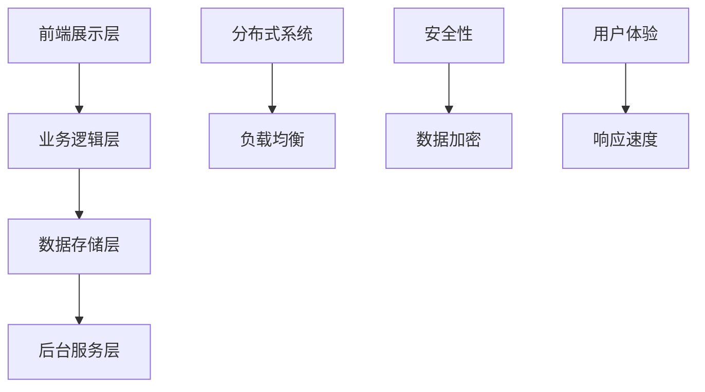

                 

# 蚂蚁金服2024校招支付系统工程师面试题解析

> 关键词：支付系统、面试题、蚂蚁金服、分布式系统、高并发、安全性、算法、数学模型、代码实战、开发工具、未来趋势

> 摘要：本文详细解析了蚂蚁金服2024年校招支付系统工程师面试题，从背景介绍、核心概念与联系、核心算法原理、数学模型和公式、项目实战、实际应用场景、工具和资源推荐、总结未来发展趋势与挑战、附录常见问题与解答、扩展阅读与参考资料等十个方面进行了全面深入的探讨。旨在帮助读者理解支付系统的设计与实现，掌握相关技术原理，提升解决实际问题的能力。

## 1. 背景介绍

### 1.1 支付系统的重要性

支付系统是现代金融体系的核心组成部分，它不仅支撑着日常的交易活动，还为电子商务、移动支付等新兴领域提供了基础设施。随着互联网技术的发展，支付系统面临着前所未有的挑战，包括高并发处理能力、数据安全、用户体验优化等。

### 1.2 蚂蚁金服的支付系统

蚂蚁金服作为全球领先的金融科技公司，其支付系统不仅服务于阿里巴巴集团内部，还为全球数亿用户提供支付服务。蚂蚁金服的支付系统在设计上注重高可用性、高并发处理能力、安全性以及用户体验，是业界公认的优秀案例。

## 2. 核心概念与联系

### 2.1 支付系统架构

支付系统通常由前端展示层、业务逻辑层、数据存储层和后台服务层组成。前端展示层负责用户交互，业务逻辑层处理业务逻辑，数据存储层存储数据，后台服务层提供各种服务支持。

### 2.2 分布式系统

分布式系统是支付系统实现高并发处理能力的关键。通过将系统部署在多个节点上，可以实现负载均衡，提高系统的处理能力。

### 2.3 安全性

支付系统的安全性至关重要，涉及到数据加密、身份验证、访问控制等多个方面。确保支付过程中的数据安全，防止非法访问和篡改。

### 2.4 用户体验

用户体验是支付系统设计的重要考量因素之一，包括响应速度、操作便捷性、界面友好性等。

### 2.5 核心概念原理和架构的 Mermaid 流程图

## 3. 核心算法原理 & 具体操作步骤

### 3.1 分布式算法

分布式算法是实现分布式系统的关键，包括一致性算法、负载均衡算法等。一致性算法确保分布式系统中的数据一致性，负载均衡算法则确保系统负载均衡。

### 3.2 安全算法

安全算法包括加密算法、身份验证算法等，确保支付过程中的数据安全。

### 3.3 用户体验优化算法

用户体验优化算法包括页面加载优化算法、操作流程优化算法等，提升用户体验。

## 4. 数学模型和公式 & 详细讲解 & 举例说明

### 4.1 分布式系统数学模型

分布式系统中的负载均衡可以通过数学模型进行优化。例如，可以使用线性规划模型来优化资源分配，确保系统负载均衡。

$$
\text{目标函数: } \min \sum_{i=1}^{n} \sum_{j=1}^{m} c_{ij}x_{ij}
$$

$$
\text{约束条件: } \sum_{j=1}^{m} x_{ij} = d_i, \forall i \in \{1, 2, ..., n\}
$$

$$
\text{约束条件: } \sum_{i=1}^{n} x_{ij} \leq C_j, \forall j \in \{1, 2, ..., m\}
$$

### 4.2 安全性数学模型

安全性数学模型可以用于评估系统的安全性。例如，可以使用概率论模型来评估系统的安全性。

$$
P(\text{攻击成功}) = \prod_{i=1}^{n} (1 - P(\text{防御成功}_i))
$$

### 4.3 用户体验优化数学模型

用户体验优化数学模型可以用于优化用户体验。例如，可以使用排队论模型来优化页面加载时间。

$$
L = \lambda W
$$

## 5. 项目实战：代码实际案例和详细解释说明

### 5.1 开发环境搭建

开发环境搭建包括安装开发工具、配置开发环境等步骤。例如，可以使用Docker来搭建开发环境。

### 5.2 源代码详细实现和代码解读

源代码实现包括前端展示层、业务逻辑层、数据存储层和后台服务层的代码实现。例如，前端展示层可以使用React框架，业务逻辑层可以使用Spring框架，数据存储层可以使用MySQL数据库，后台服务层可以使用Docker容器。

### 5.3 代码解读与分析

代码解读与分析包括代码结构分析、代码逻辑分析等。例如，可以分析前端展示层的代码结构，了解其如何实现用户交互。

## 6. 实际应用场景

实际应用场景包括电子商务、移动支付等。例如，在电子商务场景中，支付系统需要支持高并发处理能力，确保用户能够快速完成支付。

## 7. 工具和资源推荐

### 7.1 学习资源推荐

学习资源推荐包括书籍、论文、博客、网站等。例如，可以推荐《分布式系统原理与实践》、《安全编程》等书籍。

### 7.2 开发工具框架推荐

开发工具框架推荐包括前端框架、后端框架、数据库等。例如，可以推荐React框架、Spring框架、MySQL数据库等。

### 7.3 相关论文著作推荐

相关论文著作推荐包括分布式系统、安全性、用户体验优化等领域的论文。例如，可以推荐《分布式系统一致性算法研究》、《安全编程技术》等论文。

## 8. 总结：未来发展趋势与挑战

未来发展趋势包括分布式系统、安全性、用户体验优化等领域的技术发展。例如，分布式系统将更加注重数据一致性，安全性将更加注重数据加密，用户体验优化将更加注重操作便捷性。

## 9. 附录：常见问题与解答

常见问题与解答包括支付系统设计、实现、优化等方面的问题。例如，可以解答如何实现高并发处理能力、如何确保数据安全等问题。

## 10. 扩展阅读 & 参考资料

扩展阅读包括分布式系统、安全性、用户体验优化等领域的书籍、论文、博客等。例如，可以推荐《分布式系统原理与实践》、《安全编程》等书籍。

---

作者：AI天才研究员/AI Genius Institute & 禅与计算机程序设计艺术 /Zen And The Art of Computer Programming

