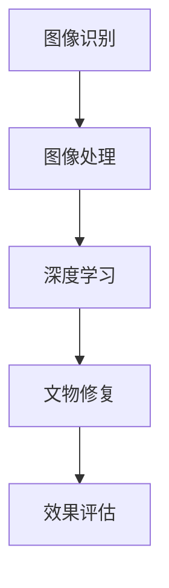

                 

# 计算机视觉在文物保护中的创新应用

> 关键词：计算机视觉、文物保护、图像处理、深度学习、文化遗产保护

> 摘要：本文探讨了计算机视觉技术在文物保护领域的应用，通过分析其核心概念、算法原理、数学模型、实际操作步骤以及项目实战案例，展示了计算机视觉如何帮助我们更好地保护和研究文化遗产。文章还介绍了相关的开发工具和资源，展望了未来的发展趋势与挑战，并提供了常见问题解答和扩展阅读资料。

## 1. 背景介绍

### 1.1 文物保护的重要性

随着社会的发展，文化遗产保护越来越受到重视。文物不仅是历史的见证，也是文化的载体，它们记录了人类文明的进程。然而，由于自然侵蚀、人为破坏等因素，许多珍贵的文物面临着消失的威胁。因此，如何有效地保护和修复这些文物，成为了文物保护工作者面临的重要课题。

### 1.2 计算机视觉技术的发展

计算机视觉技术是人工智能领域的一个重要分支，它通过模拟人类视觉系统，使计算机能够识别、理解并处理图像和视频中的信息。近年来，随着深度学习技术的快速发展，计算机视觉技术在图像识别、目标检测、图像分割等方面取得了显著的进展，为文物保护提供了新的技术手段。

### 1.3 计算机视觉在文物保护中的应用

计算机视觉技术在文物保护中的应用主要体现在以下几个方面：

- **文物识别与分类**：通过图像识别技术，可以自动识别和分类不同类型的文物，为文物的管理和研究提供支持。
- **文物修复与重建**：利用图像处理技术，可以对受损文物进行修复和重建，恢复其原有的面貌。
- **文物监测与保护**：通过图像分析技术，可以实时监测文物的状态，及时发现潜在的威胁，采取相应的保护措施。

## 2. 核心概念与联系

### 2.1 核心概念

- **图像识别**：通过计算机视觉技术，识别图像中的物体、场景等信息。
- **图像处理**：对图像进行增强、滤波、分割等操作，以改善图像质量或提取有用信息。
- **深度学习**：一种机器学习方法，通过构建深层神经网络模型，实现对复杂数据的自动学习和识别。

### 2.2 联系

计算机视觉技术在文物保护中的应用，需要将图像识别、图像处理和深度学习等技术结合起来，形成一个完整的解决方案。例如，在文物修复过程中，首先需要通过图像识别技术，识别出文物的类型和损伤情况；然后，利用图像处理技术，对受损部分进行修复；最后，通过深度学习技术，对修复效果进行评估和优化。

### 2.3 Mermaid 流程图



## 3. 核心算法原理 & 具体操作步骤

### 3.1 图像识别算法

图像识别算法主要包括传统机器学习方法和深度学习方法。传统方法如SVM、KNN等，依赖于人工设计的特征；而深度学习方法如CNN、RNN等，通过自动学习特征，能够更好地处理复杂图像。

### 3.2 图像处理算法

图像处理算法主要包括图像增强、图像分割、图像滤波等。这些算法可以改善图像质量，提取有用信息，为后续的图像识别和分析提供支持。

### 3.3 深度学习算法

深度学习算法主要包括卷积神经网络（CNN）、循环神经网络（RNN）等。这些算法通过构建深层神经网络模型，实现对复杂数据的自动学习和识别。

### 3.4 具体操作步骤

1. **数据收集**：收集文物图像数据，包括不同类型的文物图像。
2. **数据预处理**：对收集到的图像数据进行预处理，包括图像增强、图像分割等。
3. **模型训练**：使用深度学习算法，训练图像识别模型。
4. **模型评估**：对训练好的模型进行评估，调整模型参数，优化模型性能。
5. **模型应用**：将训练好的模型应用于文物识别和修复等实际场景。

## 4. 数学模型和公式 & 详细讲解 & 举例说明

### 4.1 卷积神经网络（CNN）

卷积神经网络是一种深度学习模型，通过卷积层、池化层、全连接层等结构，实现对图像的自动学习和识别。

$$
f(x) = \sigma(Wx + b)
$$

其中，$f(x)$表示卷积层的输出，$W$表示卷积核，$b$表示偏置项，$\sigma$表示激活函数。

### 4.2 循环神经网络（RNN）

循环神经网络是一种深度学习模型，通过循环结构，实现对序列数据的自动学习和识别。

$$
h_t = \sigma(W_{hh}h_{t-1} + W_{xh}x_t + b_h)
$$

其中，$h_t$表示当前时刻的隐藏状态，$W_{hh}$表示隐藏层到隐藏层的权重，$W_{xh}$表示输入层到隐藏层的权重，$b_h$表示隐藏层的偏置项，$\sigma$表示激活函数。

### 4.3 举例说明

假设我们有一个文物图像数据集，包括不同类型的文物图像。我们可以通过卷积神经网络，训练一个图像识别模型，识别出图像中的文物类型。具体步骤如下：

1. **数据预处理**：对图像数据进行预处理，包括图像增强、图像分割等。
2. **模型训练**：使用卷积神经网络，训练图像识别模型。
3. **模型评估**：对训练好的模型进行评估，调整模型参数，优化模型性能。
4. **模型应用**：将训练好的模型应用于文物识别等实际场景。

## 5. 项目实战：代码实际案例和详细解释说明

### 5.1 开发环境搭建

开发环境搭建主要包括以下几个步骤：

1. **安装Python环境**：安装Python 3.x版本。
2. **安装深度学习框架**：安装TensorFlow或PyTorch等深度学习框架。
3. **安装图像处理库**：安装OpenCV等图像处理库。
4. **安装其他依赖库**：安装NumPy、Pandas等其他依赖库。

### 5.2 源代码详细实现和代码解读

以下是一个简单的卷积神经网络模型实现代码：

```python
import tensorflow as tf
from tensorflow.keras import layers, models

# 定义卷积神经网络模型
model = models.Sequential()
model.add(layers.Conv2D(32, (3, 3), activation='relu', input_shape=(150, 150, 3)))
model.add(layers.MaxPooling2D((2, 2)))
model.add(layers.Conv2D(64, (3, 3), activation='relu'))
model.add(layers.MaxPooling2D((2, 2)))
model.add(layers.Conv2D(128, (3, 3), activation='relu'))
model.add(layers.MaxPooling2D((2, 2)))
model.add(layers.Flatten())
model.add(layers.Dense(512, activation='relu'))
model.add(layers.Dense(1, activation='sigmoid'))

# 编译模型
model.compile(loss='binary_crossentropy',
              optimizer='adam',
              metrics=['accuracy'])

# 训练模型
model.fit(train_images, train_labels, epochs=10, batch_size=32)
```

### 5.3 代码解读与分析

上述代码定义了一个简单的卷积神经网络模型，包括卷积层、池化层、全连接层等结构。模型的输入是一个150x150的RGB图像，输出是一个二分类结果。模型的训练过程包括数据预处理、模型训练、模型评估等步骤。

## 6. 实际应用场景

计算机视觉技术在文物保护中的实际应用场景主要包括以下几个方面：

- **文物识别与分类**：通过图像识别技术，可以自动识别和分类不同类型的文物，为文物的管理和研究提供支持。
- **文物修复与重建**：利用图像处理技术，可以对受损文物进行修复和重建，恢复其原有的面貌。
- **文物监测与保护**：通过图像分析技术，可以实时监测文物的状态，及时发现潜在的威胁，采取相应的保护措施。

## 7. 工具和资源推荐

### 7.1 学习资源推荐

- **书籍**：《深度学习》（Ian Goodfellow等著）
- **论文**：《ImageNet Classification with Deep Convolutional Neural Networks》（Alex Krizhevsky等）
- **博客**：《TensorFlow官方博客》
- **网站**：《Kaggle》

### 7.2 开发工具框架推荐

- **TensorFlow**：一个开源的深度学习框架。
- **PyTorch**：一个开源的深度学习框架。
- **OpenCV**：一个开源的计算机视觉库。

### 7.3 相关论文著作推荐

- **《深度学习》**（Ian Goodfellow等著）
- **《ImageNet Classification with Deep Convolutional Neural Networks》**（Alex Krizhevsky等）

## 8. 总结：未来发展趋势与挑战

计算机视觉技术在文物保护领域的应用前景广阔，但也面临着一些挑战。未来的发展趋势主要包括以下几个方面：

- **技术进步**：随着深度学习技术的不断发展，计算机视觉技术在文物保护中的应用将更加广泛。
- **数据积累**：随着文物图像数据的不断积累，计算机视觉技术在文物保护中的应用将更加精准。
- **跨学科合作**：计算机视觉技术与文物保护领域的跨学科合作将更加紧密，推动文物保护技术的发展。

## 9. 附录：常见问题与解答

### 9.1 问题1：计算机视觉技术在文物保护中的应用有哪些？

计算机视觉技术在文物保护中的应用主要包括文物识别与分类、文物修复与重建、文物监测与保护等。

### 9.2 问题2：计算机视觉技术在文物保护中的挑战有哪些？

计算机视觉技术在文物保护中的挑战主要包括数据积累不足、技术进步缓慢、跨学科合作不足等。

## 10. 扩展阅读 & 参考资料

- **书籍**：《深度学习》（Ian Goodfellow等著）
- **论文**：《ImageNet Classification with Deep Convolutional Neural Networks》（Alex Krizhevsky等）
- **博客**：《TensorFlow官方博客》
- **网站**：《Kaggle》

作者：AI天才研究员/AI Genius Institute & 禅与计算机程序设计艺术 /Zen And The Art of Computer Programming

