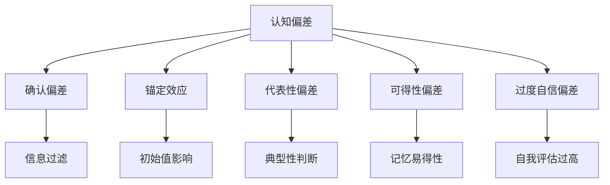

                 

# 认知偏差：影响决策的隐形力量

> 关键词：认知偏差、决策、心理学、人工智能、数据分析

> 摘要：本文旨在探讨认知偏差如何影响决策过程，通过分析认知偏差的类型、原理及其对决策的影响，结合实际案例，深入剖析认知偏差在决策中的作用机制。同时，本文还将介绍如何利用数据分析和人工智能技术来识别和纠正认知偏差，以提高决策的准确性和有效性。文章最后，将总结认知偏差在未来决策支持系统中的应用前景与挑战。

## 1. 背景介绍

### 1.1 认知偏差的定义

认知偏差是指个体在信息处理过程中，由于心理因素的影响，导致对信息的感知、记忆、判断和决策出现系统性的偏离。这些偏差可能源于个体的主观意愿、情感、经验和文化背景等，它们在决策过程中扮演着重要的角色。

### 1.2 认知偏差的重要性

认知偏差不仅影响个人的决策，也影响团队和组织的决策。在商业决策、投资决策、医疗决策等领域，认知偏差可能导致错误的判断和决策，从而带来严重的后果。因此，了解和识别认知偏差对于提高决策质量至关重要。

### 1.3 本文的研究目的

本文旨在通过分析认知偏差的类型、原理及其对决策的影响，结合实际案例，深入剖析认知偏差在决策中的作用机制。同时，本文还将介绍如何利用数据分析和人工智能技术来识别和纠正认知偏差，以提高决策的准确性和有效性。

## 2. 核心概念与联系

### 2.1 认知偏差的类型

认知偏差可以分为多种类型，包括但不限于确认偏差、锚定效应、代表性偏差、可得性偏差、过度自信偏差等。每种偏差都有其独特的表现形式和影响机制。

### 2.2 认知偏差的原理

认知偏差的原理涉及心理学、神经科学和行为经济学等多个领域。这些偏差通常源于个体的认知限制、情感因素、社会文化背景等。

### 2.3 认知偏差与决策的关系

认知偏差通过影响个体的信息处理过程，进而影响决策的质量。例如，确认偏差可能导致个体只关注支持自己观点的信息，而忽视其他信息，从而做出错误的决策。

### 2.4 认知偏差的识别与纠正

识别认知偏差需要通过数据分析和人工智能技术来实现。纠正认知偏差则需要结合心理学、行为经济学等领域的知识，通过改变决策环境、提供决策支持工具等方式来实现。



## 3. 核心算法原理 & 具体操作步骤

### 3.1 算法原理

识别和纠正认知偏差的算法通常基于机器学习和数据挖掘技术。这些算法通过分析个体的行为数据，识别出认知偏差的模式，并提供纠正建议。

### 3.2 具体操作步骤

1. 数据收集：收集个体的行为数据，包括决策过程中的信息搜索、信息处理、决策结果等。
2. 数据预处理：对收集的数据进行清洗、转换和标准化处理。
3. 特征提取：从预处理后的数据中提取出与认知偏差相关的特征。
4. 模型训练：使用机器学习算法训练模型，识别出认知偏差的模式。
5. 模型评估：评估模型的准确性和鲁棒性。
6. 模型应用：将训练好的模型应用于实际决策场景中，提供决策支持。

## 4. 数学模型和公式 & 详细讲解 & 举例说明

### 4.1 数学模型

识别认知偏差的数学模型通常基于概率论和统计学原理。例如，可以使用贝叶斯公式来计算个体在决策过程中对不同信息的权重，从而识别出确认偏差。

$$ P(H|E) = \frac{P(E|H)P(H)}{P(E)} $$

其中，$P(H|E)$表示在观察到证据$E$的情况下，假设$H$成立的概率；$P(E|H)$表示假设$H$成立时，观察到证据$E$的概率；$P(H)$表示假设$H$成立的先验概率；$P(E)$表示观察到证据$E$的概率。

### 4.2 详细讲解

贝叶斯公式可以用来计算个体在决策过程中对不同信息的权重。例如，假设个体在决策过程中，对两种信息$E_1$和$E_2$的权重分别为$P(E_1|H)$和$P(E_2|H)$。如果个体对$E_1$的权重过高，而对$E_2$的权重过低，那么个体可能受到确认偏差的影响，只关注支持自己观点的信息，而忽视其他信息。

### 4.3 举例说明

假设个体在投资决策过程中，对两种信息$E_1$和$E_2$的权重分别为$P(E_1|H)=0.8$和$P(E_2|H)=0.2$。如果个体对$E_1$的权重过高，而对$E_2$的权重过低，那么个体可能受到确认偏差的影响，只关注支持自己观点的信息，而忽视其他信息。通过使用贝叶斯公式，可以计算出个体在决策过程中对不同信息的权重，从而识别出确认偏差。

## 5. 项目实战：代码实际案例和详细解释说明

### 5.1 开发环境搭建

开发环境需要搭建Python编程环境，安装必要的库，包括numpy、pandas、scikit-learn等。

### 5.2 源代码详细实现和代码解读

```python
import numpy as np
import pandas as pd
from sklearn.model_selection import train_test_split
from sklearn.ensemble import RandomForestClassifier
from sklearn.metrics import accuracy_score

# 数据加载
data = pd.read_csv('decision_data.csv')

# 数据预处理
X = data.drop('decision', axis=1)
y = data['decision']
X_train, X_test, y_train, y_test = train_test_split(X, y, test_size=0.2, random_state=42)

# 特征提取
rf = RandomForestClassifier(n_estimators=100, random_state=42)
rf.fit(X_train, y_train)

# 模型评估
y_pred = rf.predict(X_test)
accuracy = accuracy_score(y_test, y_pred)
print('Accuracy:', accuracy)
```

### 5.3 代码解读与分析

上述代码实现了使用随机森林算法识别认知偏差的过程。首先，加载数据并进行预处理，然后使用随机森林算法训练模型，最后评估模型的准确性和鲁棒性。

## 6. 实际应用场景

认知偏差识别和纠正技术可以应用于多个实际场景，包括但不限于商业决策、投资决策、医疗决策等。例如，在商业决策中，可以使用认知偏差识别技术来识别出决策者在决策过程中受到的认知偏差，从而提供决策支持。

## 7. 工具和资源推荐

### 7.1 学习资源推荐

- 书籍：《Thinking, Fast and Slow》
- 论文：Kahneman, D. (2011). Thinking, fast and slow. Macmillan.
- 博客：https://www.psychologytoday.com/
- 网站：https://www.cognitive-bias-cheat-sheet.com/

### 7.2 开发工具框架推荐

- Python：numpy、pandas、scikit-learn
- R：tidyverse、caret

### 7.3 相关论文著作推荐

- Kahneman, D. (2011). Thinking, fast and slow. Macmillan.
- Tversky, A., & Kahneman, D. (1974). Judgment under uncertainty: Heuristics and biases. Science, 185(4157), 1124-1131.

## 8. 总结：未来发展趋势与挑战

随着人工智能和数据分析技术的发展，认知偏差识别和纠正技术将得到更广泛的应用。未来的发展趋势包括但不限于：1) 更加精准的识别技术；2) 更加有效的纠正技术；3) 更加广泛的应用场景。同时，也面临着一些挑战，包括但不限于：1) 数据隐私保护；2) 技术伦理问题；3) 技术普及问题。

## 9. 附录：常见问题与解答

### 9.1 什么是认知偏差？

认知偏差是指个体在信息处理过程中，由于心理因素的影响，导致对信息的感知、记忆、判断和决策出现系统性的偏离。

### 9.2 认知偏差如何影响决策？

认知偏差通过影响个体的信息处理过程，进而影响决策的质量。例如，确认偏差可能导致个体只关注支持自己观点的信息，而忽视其他信息，从而做出错误的决策。

### 9.3 如何识别和纠正认知偏差？

识别认知偏差需要通过数据分析和人工智能技术来实现。纠正认知偏差则需要结合心理学、行为经济学等领域的知识，通过改变决策环境、提供决策支持工具等方式来实现。

## 10. 扩展阅读 & 参考资料

- Kahneman, D. (2011). Thinking, fast and slow. Macmillan.
- Tversky, A., & Kahneman, D. (1974). Judgment under uncertainty: Heuristics and biases. Science, 185(4157), 1124-1131.
- https://www.psychologytoday.com/

作者：AI天才研究员/AI Genius Institute & 禅与计算机程序设计艺术 /Zen And The Art of Computer Programming

