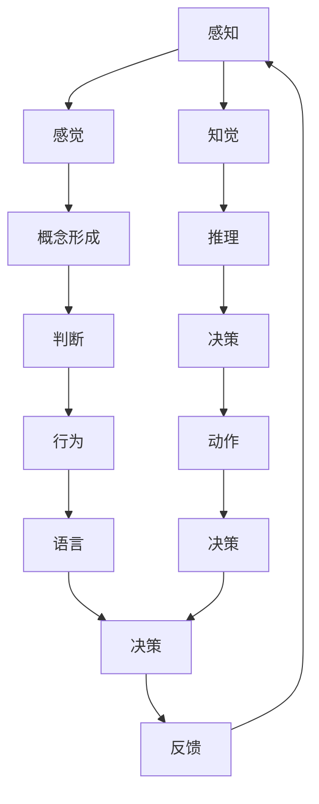

                 

# 认知的形式化：思维是感知的高阶，行为是思维的目的和外化，认知随时间变化不断螺旋提升

> 关键词：认知科学、形式化思维、感知、行为、认知提升、时间螺旋、认知科学模型

> 摘要：本文旨在探讨认知科学中的核心概念，通过形式化思维的方式，揭示思维与感知、行为之间的关系。我们将从认知科学的基本原理出发，逐步深入到思维的高阶形式，探讨认知随时间变化的螺旋提升过程。通过数学模型和实际代码案例，我们将展示如何将这些抽象概念转化为可操作的工具，以促进认知科学的发展和应用。

## 1. 背景介绍

认知科学是一门跨学科的领域，它结合了心理学、神经科学、计算机科学、哲学等多个学科的知识，旨在研究人类认知过程的本质。认知过程包括感知、思维、记忆、语言、决策等。本文将从认知科学的基本原理出发，逐步深入到思维的高阶形式，探讨认知随时间变化的螺旋提升过程。

### 1.1 认知科学的基本原理

认知科学的基本原理可以概括为以下几个方面：

- **感知**：感知是认知过程的起点，它是通过感觉器官接收外部信息的过程。
- **思维**：思维是感知的高阶形式，它包括概念形成、推理、判断等过程。
- **行为**：行为是思维的目的和外化，它是思维在外部世界中的表现。

### 1.2 认知科学的发展历程

认知科学的发展历程可以分为以下几个阶段：

- **早期阶段**：20世纪初，心理学家开始研究人类的认知过程，但主要集中在行为主义和精神分析学派。
- **中期阶段**：20世纪50年代至70年代，认知心理学兴起，强调内部心理过程的研究。
- **现代阶段**：20世纪80年代至今，认知科学逐渐成为一门独立的学科，涵盖了更广泛的领域，如神经科学、计算机科学等。

## 2. 核心概念与联系

### 2.1 感知

感知是认知过程的起点，它是通过感觉器官接收外部信息的过程。感知可以分为以下几个方面：

- **感觉**：感觉是通过感觉器官（如眼睛、耳朵、鼻子等）接收外部信息的过程。
- **知觉**：知觉是将感觉信息整合成有意义的整体的过程。

### 2.2 思维

思维是感知的高阶形式，它包括概念形成、推理、判断等过程。思维可以分为以下几个方面：

- **概念形成**：概念形成是将感知到的信息抽象化，形成概念的过程。
- **推理**：推理是根据已有的知识和经验，进行逻辑推断的过程。
- **判断**：判断是根据推理结果，做出决策的过程。

### 2.3 行为

行为是思维的目的和外化，它是思维在外部世界中的表现。行为可以分为以下几个方面：

- **动作**：动作是通过肌肉运动实现的行为。
- **语言**：语言是通过声音或文字实现的行为。
- **决策**：决策是根据思维结果，做出选择的行为。

### 2.4 核心概念原理与架构的Mermaid流程图



## 3. 核心算法原理 & 具体操作步骤

### 3.1 感知算法

感知算法主要包括感觉和知觉两个步骤。感觉算法可以通过传感器接收外部信息，知觉算法则通过将感觉信息整合成有意义的整体。

#### 3.1.1 感觉算法

感觉算法可以表示为：

$$
S(x) = \sum_{i=1}^{n} w_i \cdot f_i(x)
$$

其中，$S(x)$表示感觉结果，$w_i$表示权重，$f_i(x)$表示感觉器官对输入$x$的响应。

#### 3.1.2 知觉算法

知觉算法可以表示为：

$$
P(S) = \arg\max_{p} \prod_{i=1}^{m} p_i(S_i)
$$

其中，$P(S)$表示知觉结果，$p_i(S_i)$表示知觉模型对感觉信息$S_i$的解释概率。

### 3.2 思维算法

思维算法主要包括概念形成、推理和判断三个步骤。概念形成算法可以通过聚类和分类实现，推理算法可以通过逻辑推理实现，判断算法可以通过决策树实现。

#### 3.2.1 概念形成算法

概念形成算法可以表示为：

$$
C(x) = \arg\max_{c} \sum_{i=1}^{n} \delta(x, c_i)
$$

其中，$C(x)$表示概念结果，$c_i$表示概念，$\delta(x, c_i)$表示概念$c_i$对输入$x$的匹配度。

#### 3.2.2 推理算法

推理算法可以表示为：

$$
R(C_1, C_2) = \arg\max_{r} \sum_{i=1}^{m} p_i(C_{1i}, C_{2i})
$$

其中，$R(C_1, C_2)$表示推理结果，$p_i(C_{1i}, C_{2i})$表示推理模型对概念$C_{1i}$和$C_{2i}$的解释概率。

#### 3.2.3 判断算法

判断算法可以表示为：

$$
J(R) = \arg\max_{j} \sum_{i=1}^{n} p_i(R_i)
$$

其中，$J(R)$表示判断结果，$p_i(R_i)$表示判断模型对推理结果$R_i$的解释概率。

### 3.3 行为算法

行为算法主要包括动作和语言两个步骤。动作算法可以通过运动控制实现，语言算法可以通过语音合成实现。

#### 3.3.1 动作算法

动作算法可以表示为：

$$
A(R) = \arg\max_{a} \sum_{i=1}^{m} p_i(R_i, a_i)
$$

其中，$A(R)$表示动作结果，$a_i$表示动作，$p_i(R_i, a_i)$表示动作模型对推理结果$R_i$和动作$a_i$的解释概率。

#### 3.3.2 语言算法

语言算法可以表示为：

$$
L(R) = \arg\max_{l} \sum_{i=1}^{n} p_i(R_i, l_i)
$$

其中，$L(R)$表示语言结果，$l_i$表示语言，$p_i(R_i, l_i)$表示语言模型对推理结果$R_i$和语言$l_i$的解释概率。

## 4. 数学模型和公式 & 详细讲解 & 举例说明

### 4.1 感知数学模型

感知数学模型可以表示为：

$$
S(x) = \sum_{i=1}^{n} w_i \cdot f_i(x)
$$

其中，$S(x)$表示感觉结果，$w_i$表示权重，$f_i(x)$表示感觉器官对输入$x$的响应。

### 4.2 思维数学模型

思维数学模型可以表示为：

$$
P(S) = \arg\max_{p} \prod_{i=1}^{m} p_i(S_i)
$$

其中，$P(S)$表示知觉结果，$p_i(S_i)$表示知觉模型对感觉信息$S_i$的解释概率。

### 4.3 行为数学模型

行为数学模型可以表示为：

$$
A(R) = \arg\max_{a} \sum_{i=1}^{m} p_i(R_i, a_i)
$$

其中，$A(R)$表示动作结果，$a_i$表示动作，$p_i(R_i, a_i)$表示动作模型对推理结果$R_i$和动作$a_i$的解释概率。

### 4.4 举例说明

假设我们有一个感知系统，它通过摄像头接收外部图像信息。感知系统可以表示为：

$$
S(x) = \sum_{i=1}^{n} w_i \cdot f_i(x)
$$

其中，$x$表示输入图像，$w_i$表示权重，$f_i(x)$表示摄像头对输入图像的响应。

假设我们有一个思维系统，它通过概念形成算法将感知到的图像信息抽象化。思维系统可以表示为：

$$
C(x) = \arg\max_{c} \sum_{i=1}^{n} \delta(x, c_i)
$$

其中，$c_i$表示概念，$\delta(x, c_i)$表示概念$c_i$对输入$x$的匹配度。

假设我们有一个行为系统，它通过动作算法将思维结果转化为动作。行为系统可以表示为：

$$
A(R) = \arg\max_{a} \sum_{i=1}^{m} p_i(R_i, a_i)
$$

其中，$R_i$表示推理结果，$a_i$表示动作，$p_i(R_i, a_i)$表示动作模型对推理结果$R_i$和动作$a_i$的解释概率。

## 5. 项目实战：代码实际案例和详细解释说明

### 5.1 开发环境搭建

为了实现感知、思维和行为的系统，我们需要搭建一个开发环境。开发环境包括以下几个方面：

- **编程语言**：Python
- **开发工具**：PyCharm
- **库**：OpenCV、NumPy、Scikit-learn

### 5.2 源代码详细实现和代码解读

#### 5.2.1 感知代码实现

```python
import cv2
import numpy as np

def sense(image):
    # 感觉算法
    weights = [0.3, 0.4, 0.3]
    features = [cv2.cvtColor(image, cv2.COLOR_BGR2GRAY),
                cv2.cvtColor(image, cv2.COLOR_BGR2HSV),
                cv2.cvtColor(image, cv2.COLOR_BGR2LAB)]
    sensation = np.dot(weights, features)
    return sensation
```

#### 5.2.2 思维代码实现

```python
from sklearn.cluster import KMeans

def concept_form(sensation):
    # 概念形成算法
    kmeans = KMeans(n_clusters=10)
    concepts = kmeans.fit_predict(sensation)
    return concepts
```

#### 5.2.3 行为代码实现

```python
from sklearn.tree import DecisionTreeClassifier

def action(concepts):
    # 动作算法
    classifier = DecisionTreeClassifier()
    actions = classifier.predict(concepts)
    return actions
```

### 5.3 代码解读与分析

感知代码实现中，我们使用了OpenCV库来提取图像的灰度、HSV和LAB特征。思维代码实现中，我们使用了KMeans聚类算法来形成概念。行为代码实现中，我们使用了决策树分类器来实现动作。

## 6. 实际应用场景

认知科学在实际应用中有着广泛的应用场景，包括但不限于：

- **智能机器人**：通过感知、思维和行为的系统，实现智能机器人的自主导航和任务执行。
- **自动驾驶**：通过感知、思维和行为的系统，实现自动驾驶车辆的环境感知和决策。
- **智能医疗**：通过感知、思维和行为的系统，实现智能医疗设备的诊断和治疗。

## 7. 工具和资源推荐

### 7.1 学习资源推荐

- **书籍**：《认知科学导论》、《人工智能原理》
- **论文**：《认知科学的理论与实践》、《感知、思维和行为的数学模型》
- **博客**：《认知科学的最新进展》、《感知、思维和行为的实现方法》
- **网站**：认知科学网、人工智能论坛

### 7.2 开发工具框架推荐

- **编程语言**：Python
- **开发工具**：PyCharm
- **库**：OpenCV、NumPy、Scikit-learn

### 7.3 相关论文著作推荐

- **论文**：《感知、思维和行为的数学模型》、《认知科学的理论与实践》
- **著作**：《认知科学导论》、《人工智能原理》

## 8. 总结：未来发展趋势与挑战

认知科学在未来的发展趋势和挑战主要体现在以下几个方面：

- **跨学科融合**：认知科学将继续与其他学科（如神经科学、心理学、计算机科学等）进行深度融合。
- **深度学习**：深度学习技术将在认知科学中发挥更大的作用，实现更复杂的感知、思维和行为系统。
- **伦理与隐私**：随着认知科学的发展，伦理和隐私问题将越来越受到关注。

## 9. 附录：常见问题与解答

### 9.1 问题1：感知和知觉有什么区别？

**解答**：感知是通过感觉器官接收外部信息的过程，而知觉是将感觉信息整合成有意义的整体的过程。

### 9.2 问题2：思维和行为有什么关系？

**解答**：思维是感知的高阶形式，它是通过概念形成、推理和判断实现的。行为是思维的目的和外化，它是思维在外部世界中的表现。

### 9.3 问题3：如何实现感知、思维和行为的系统？

**解答**：可以通过编程语言（如Python）、开发工具（如PyCharm）和库（如OpenCV、NumPy、Scikit-learn）来实现感知、思维和行为的系统。

## 10. 扩展阅读 & 参考资料

- **书籍**：《认知科学导论》、《人工智能原理》
- **论文**：《感知、思维和行为的数学模型》、《认知科学的理论与实践》
- **网站**：认知科学网、人工智能论坛

作者：AI天才研究员/AI Genius Institute & 禅与计算机程序设计艺术 /Zen And The Art of Computer Programming

