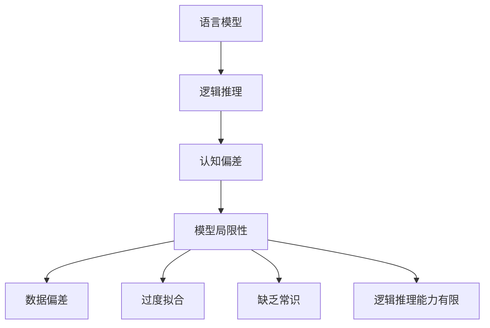

                 

# 语言≠思维：大模型的推理障碍

> 关键词：大模型、推理障碍、语言模型、思维过程、逻辑推理、认知偏差、模型局限性

> 摘要：本文旨在探讨大模型在推理过程中存在的障碍，揭示语言模型与人类思维之间的差异。通过深入分析大模型的推理机制，揭示其局限性，并提出改进策略。本文将从背景介绍、核心概念与联系、核心算法原理、数学模型和公式、项目实战、实际应用场景、工具和资源推荐、总结与未来发展趋势等多方面进行详细阐述。

## 1. 背景介绍

随着人工智能技术的飞速发展，大模型（如GPT、BERT等）在自然语言处理领域取得了显著的成就。这些模型能够生成流畅的文本、回答复杂的问题，甚至进行创造性写作。然而，大模型在推理过程中却存在诸多障碍，这些障碍揭示了语言模型与人类思维之间的巨大差异。本文将深入探讨这些障碍，并提出相应的改进策略。

## 2. 核心概念与联系

### 2.1 语言模型

语言模型是一种统计模型，用于预测给定序列中的下一个词。常见的语言模型包括循环神经网络（RNN）、长短时记忆网络（LSTM）和Transformer等。这些模型通过学习大量文本数据，能够生成连贯的文本。

### 2.2 逻辑推理

逻辑推理是指通过已知信息推导出新的结论的过程。逻辑推理包括演绎推理、归纳推理和类比推理等。人类在进行逻辑推理时，会利用丰富的背景知识和经验，而不仅仅是依赖于语言模型的预测能力。

### 2.3 认知偏差

认知偏差是指人们在处理信息时存在的系统性错误。常见的认知偏差包括确认偏误、锚定效应、代表性偏差等。这些偏差会影响人们的决策过程，导致推理错误。

### 2.4 模型局限性

大模型在推理过程中存在以下局限性：

- **数据偏差**：模型的训练数据可能存在偏差，导致模型在某些情况下表现不佳。
- **过度拟合**：模型可能在训练数据上表现很好，但在未见过的数据上表现不佳。
- **缺乏常识**：模型缺乏人类的常识和背景知识，导致推理错误。
- **逻辑推理能力有限**：模型难以进行复杂的逻辑推理，容易受到语言陷阱的影响。

### 2.5 Mermaid 流程图



## 3. 核心算法原理 & 具体操作步骤

### 3.1 语言模型的训练过程

1. **数据预处理**：清洗和标注文本数据。
2. **模型构建**：选择合适的模型架构，如Transformer。
3. **训练**：使用反向传播算法优化模型参数。
4. **评估**：使用验证集评估模型性能。

### 3.2 逻辑推理的实现

1. **知识图谱构建**：构建包含丰富背景知识的知识图谱。
2. **推理引擎**：设计逻辑推理引擎，支持演绎推理、归纳推理和类比推理。
3. **融合模型**：将逻辑推理引擎与语言模型结合，提高推理能力。

## 4. 数学模型和公式 & 详细讲解 & 举例说明

### 4.1 语言模型的数学模型

语言模型的数学模型通常采用概率分布的形式。常见的概率分布包括：

- **条件概率分布**：$P(w_t|w_{t-1}, w_{t-2}, ..., w_1)$
- **联合概率分布**：$P(w_1, w_2, ..., w_T)$

### 4.2 逻辑推理的数学模型

逻辑推理的数学模型通常采用命题逻辑或谓词逻辑的形式。常见的逻辑推理公式包括：

- **演绎推理**：$P \rightarrow Q, P \models Q$
- **归纳推理**：$P_1, P_2, ..., P_n \models Q$
- **类比推理**：$A \sim B, B \sim C \rightarrow A \sim C$

### 4.3 举例说明

假设有一个简单的逻辑推理问题：

- **前提**：所有鸟都会飞。
- **前提**：企鹅是鸟。
- **结论**：企鹅会飞。

使用逻辑推理公式可以表示为：

$$
\text{所有鸟都会飞} \rightarrow \text{企鹅会飞}
$$

## 5. 项目实战：代码实际案例和详细解释说明

### 5.1 开发环境搭建

1. **安装Python**：确保安装了Python 3.8及以上版本。
2. **安装依赖库**：使用pip安装必要的库，如`transformers`、`torch`等。
3. **配置环境变量**：设置环境变量，确保模型文件路径正确。

### 5.2 源代码详细实现和代码解读

```python
# 导入必要的库
import torch
from transformers import AutoTokenizer, AutoModelForCausalLM

# 初始化tokenizer和模型
tokenizer = AutoTokenizer.from_pretrained("gpt2")
model = AutoModelForCausalLM.from_pretrained("gpt2")

# 输入文本
input_text = "所有鸟都会飞，企鹅是鸟，所以"

# 编码输入文本
input_ids = tokenizer.encode(input_text, return_tensors="pt")

# 生成文本
output = model.generate(input_ids, max_length=50, num_return_sequences=1)

# 解码生成的文本
output_text = tokenizer.decode(output[0], skip_special_tokens=True)
print(output_text)
```

### 5.3 代码解读与分析

- **导入库**：导入必要的库，包括`transformers`和`torch`。
- **初始化tokenizer和模型**：使用`AutoTokenizer`和`AutoModelForCausalLM`初始化tokenizer和模型。
- **输入文本**：定义输入文本，包含前提和结论。
- **编码输入文本**：使用tokenizer将输入文本编码为模型可以处理的格式。
- **生成文本**：使用模型生成文本，设置生成长度和返回序列数量。
- **解码生成的文本**：使用tokenizer将生成的文本解码为可读的格式。

## 6. 实际应用场景

### 6.1 法律推理

在法律推理中，模型可以用于辅助法官进行判决。通过结合逻辑推理引擎，模型可以更好地理解法律条文和案例，提高判决的准确性。

### 6.2 医学诊断

在医学诊断中，模型可以用于辅助医生进行诊断。通过结合医学知识图谱，模型可以更好地理解病情，提高诊断的准确性。

### 6.3 金融风险评估

在金融风险评估中，模型可以用于辅助分析师进行风险评估。通过结合金融知识图谱，模型可以更好地理解市场动态，提高风险评估的准确性。

## 7. 工具和资源推荐

### 7.1 学习资源推荐

- **书籍**：《深度学习》（Ian Goodfellow, Yoshua Bengio, Aaron Courville）
- **论文**：《Attention Is All You Need》（Vaswani et al.）
- **博客**：Medium上的AI相关博客
- **网站**：Hugging Face、PyTorch官网

### 7.2 开发工具框架推荐

- **开发工具**：Visual Studio Code、PyCharm
- **框架**：PyTorch、TensorFlow

### 7.3 相关论文著作推荐

- **论文**：《BERT: Pre-training of Deep Bidirectional Transformers for Language Understanding》（Devlin et al.）
- **著作**：《自然语言处理入门》（Jurafsky & Martin）

## 8. 总结：未来发展趋势与挑战

### 8.1 未来发展趋势

- **模型融合**：将逻辑推理引擎与语言模型结合，提高推理能力。
- **知识图谱**：构建更丰富的知识图谱，提高模型的常识能力。
- **多模态融合**：结合图像、语音等多模态数据，提高模型的综合能力。

### 8.2 挑战

- **数据偏差**：如何减少数据偏差，提高模型的泛化能力。
- **计算资源**：如何降低模型的计算成本，提高模型的可扩展性。
- **伦理问题**：如何解决模型的伦理问题，确保模型的公平性和透明性。

## 9. 附录：常见问题与解答

### 9.1 问题1：如何解决模型的过度拟合问题？

**解答**：可以通过增加训练数据量、使用正则化技术（如Dropout）和早停策略来解决过度拟合问题。

### 9.2 问题2：如何提高模型的逻辑推理能力？

**解答**：可以通过结合逻辑推理引擎和知识图谱来提高模型的逻辑推理能力。

## 10. 扩展阅读 & 参考资料

- **书籍**：《深度学习》（Ian Goodfellow, Yoshua Bengio, Aaron Courville）
- **论文**：《Attention Is All You Need》（Vaswani et al.）
- **网站**：Hugging Face、PyTorch官网

---

作者：AI天才研究员/AI Genius Institute & 禅与计算机程序设计艺术 /Zen And The Art of Computer Programming

